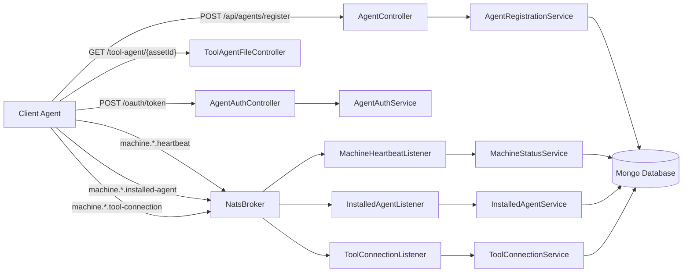
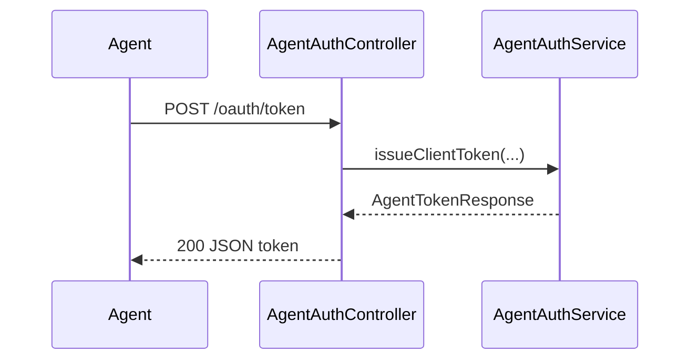
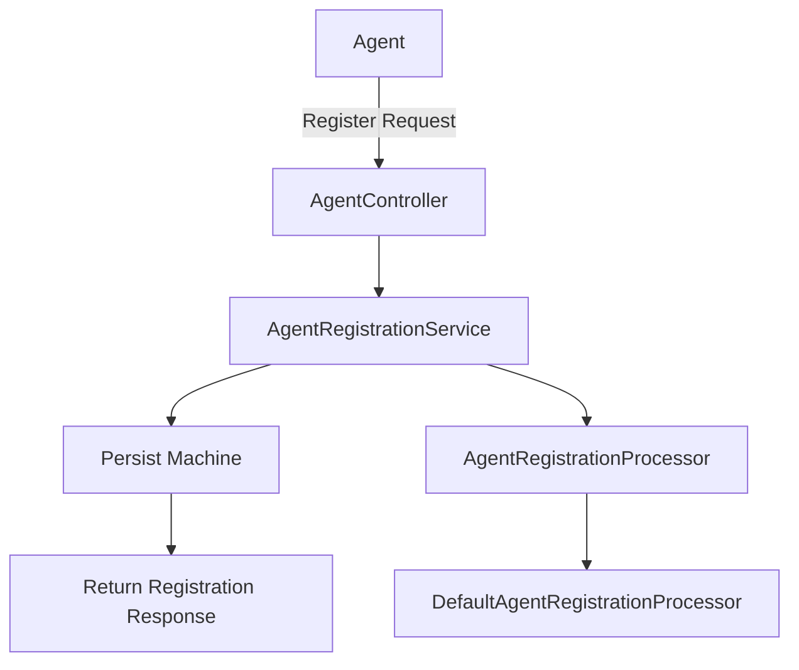
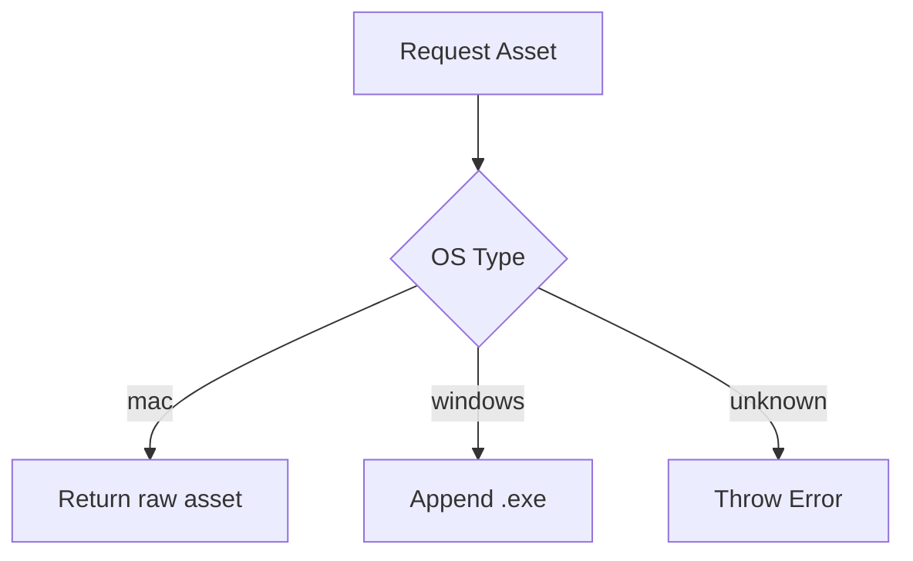
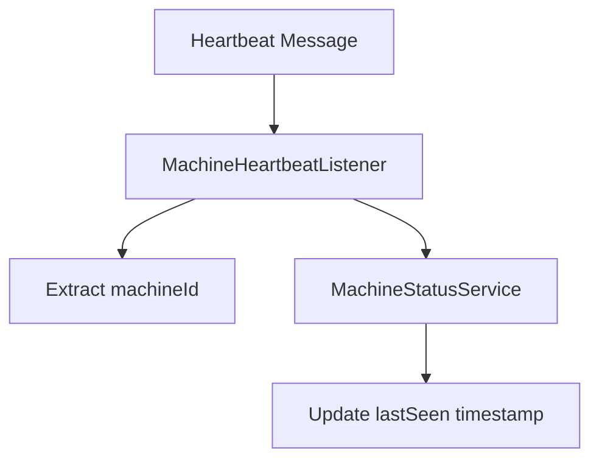
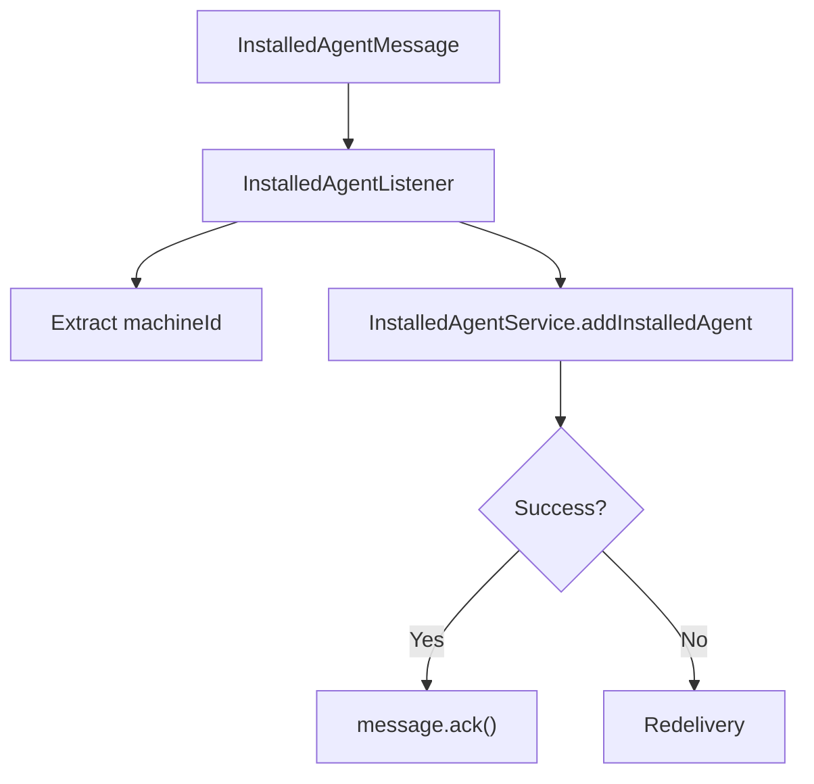
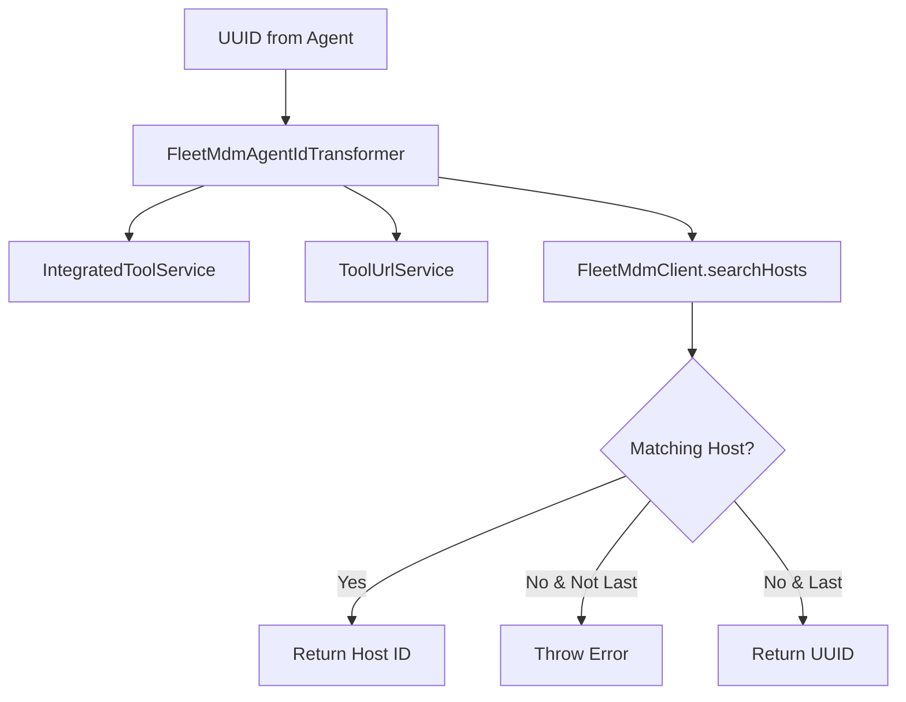
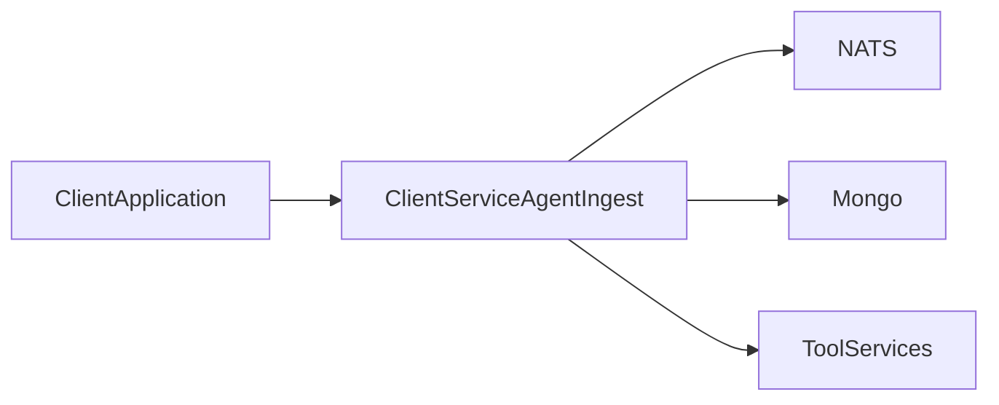

# Client Service Agent Ingest

## Overview

The **Client Service Agent Ingest** module is the entry point for all machine-level interactions between deployed agents and the OpenFrame backend. It is responsible for:

- Agent authentication and token issuance
- Agent registration and machine onboarding
- Tool agent asset distribution
- Real-time machine state ingestion via NATS (heartbeats, connections, installed agents)
- Transformation of external tool identifiers into platform-consumable IDs

This module acts as the bridge between:

- ✅ Installed agents running on client machines  
- ✅ Integrated tools such as Fleet MDM and MeshCentral  
- ✅ The messaging backbone (NATS / JetStream)  
- ✅ Core data services (Mongo, tool services, machine services)

It is deployed via the `ClientApplication` entrypoint in the service applications layer and integrates tightly with data, messaging, and security modules.

---

## High-Level Architecture



The module exposes REST endpoints for synchronous operations and subscribes to NATS subjects for asynchronous ingestion.

---

# Core Responsibilities

## 1. Agent Authentication

### AgentAuthController

**Endpoint:**

```text
POST /oauth/token
```

This controller delegates to `AgentAuthService` to issue tokens for client agents. It supports:

- `grant_type`
- `refresh_token`
- `client_id`
- `client_secret`

### Flow



Error handling:

- `IllegalArgumentException` → 401 Unauthorized
- Unexpected error → 400 with `server_error`

### PasswordEncoderConfig

Provides a `BCryptPasswordEncoder` bean used for secure credential validation.

```text
@Bean
public PasswordEncoder passwordEncoder()
```

---

## 2. Agent Registration

### AgentController

**Endpoint:**

```text
POST /api/agents/register
Header: X-Initial-Key
Body: AgentRegistrationRequest
```

This is the primary onboarding endpoint for machines.

### AgentRegistrationRequest

Captures complete machine metadata:

- Core identification (hostname, organizationId)
- Network information (ip, macAddress, osUuid)
- Agent metadata (agentVersion, status)
- Hardware details (serialNumber, manufacturer, model)
- OS details (type, version, build, timezone)

### Registration Flow



### DefaultAgentRegistrationProcessor

- Activated when no custom `AgentRegistrationProcessor` is defined
- Provides a no-op post-processing hook
- Allows integrators to override behavior without modifying core logic

This extension point enables:

- Custom enrichment
- External system synchronization
- Validation or transformation hooks

---

## 3. Tool Agent Asset Distribution

### ToolAgentFileController

**Endpoint:**

```text
GET /tool-agent/{assetId}?os={mac|windows}
```

Purpose:

- Serves downloadable tool agent binaries
- OS-aware filename resolution
- Temporary hardcoded implementation (intended to be replaced by artifact storage)

Flow logic:



---

## 4. Real-Time Machine State Ingestion (NATS)

The module subscribes to NATS subjects to process asynchronous events.

### Subjects

```text
machine.*.heartbeat
machine.*.installed-agent
machine.*.tool-connection
```

---

## 4.1 MachineHeartbeatListener

- Subscribes to `machine.*.heartbeat`
- Uses `NatsTopicMachineIdExtractor`
- Generates service-side timestamp
- Delegates to `MachineStatusService.processHeartbeat`

### Flow



---

## 4.2 InstalledAgentListener (JetStream)

- Stream: `INSTALLED_AGENTS`
- Subject: `machine.*.installed-agent`
- Durable consumer with:
  - Explicit ack
  - Max deliver: 50
  - Ack wait: 30s

### Processing Logic



Supports retry semantics via JetStream metadata and `deliveredCount`.

---

## 4.3 ToolConnectionListener (JetStream)

- Stream: `TOOL_CONNECTIONS`
- Subject: `machine.*.tool-connection`
- Durable consumer with delivery group

Processes `ToolConnectionMessage` and delegates to:

```text
ToolConnectionService.addToolConnection(machineId, toolType, agentToolId, lastAttempt)
```

Ensures idempotent retry handling using `deliveredCount`.

---

# Tool Agent ID Transformation Layer

The module supports transformation of external tool identifiers into platform-standard IDs.

## FleetMdmAgentIdTransformer

Tool Type: `FLEET_MDM`

Responsibilities:

- Resolve integrated tool configuration
- Fetch API URL and credentials
- Call Fleet MDM API via `FleetMdmClient`
- Search host by UUID
- Convert UUID → Fleet host ID

### Flow



This enables delayed consistency if the external system is not immediately synchronized.

---

## MeshCentralAgentIdTransformer

Tool Type: `MESHCENTRAL`

Behavior:

```text
transformedId = "node//" + agentToolId
```

Provides simple prefix normalization for MeshCentral identifiers.

---

# Metrics Ingestion Model

### MetricsMessage

Represents telemetry:

- `machineId`
- `cpu`
- `memory`
- `timestamp`

Intended for streaming ingestion and analytics pipelines.

---

# Integration with the Platform

The Client Service Agent Ingest module interacts with:

- Data layer (Mongo documents and repositories)
- Integrated tool services
- NATS messaging infrastructure
- Security and OAuth services

## Deployment Context



It runs as part of the client service application tier and acts as the operational backbone for machine lifecycle management.

---

# Extension Points

The module is intentionally extensible:

- `AgentRegistrationProcessor` (custom post-registration logic)
- ToolAgentIdTransformer implementations
- Service-level overrides via Spring beans
- JetStream consumer configuration adjustments

---

# Summary

The **Client Service Agent Ingest** module is the real-time ingestion and onboarding layer of OpenFrame. It:

- Authenticates agents
- Registers machines
- Processes live heartbeat and connection events
- Normalizes tool identifiers
- Ensures durable message processing
- Provides extension hooks for platform customization

It is critical for maintaining accurate, real-time machine state across distributed client environments.