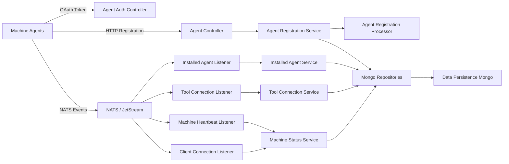
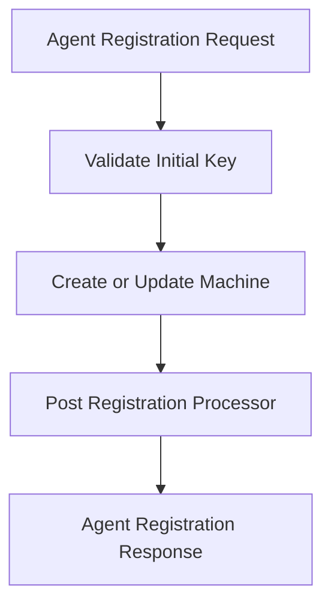
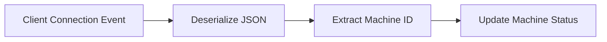
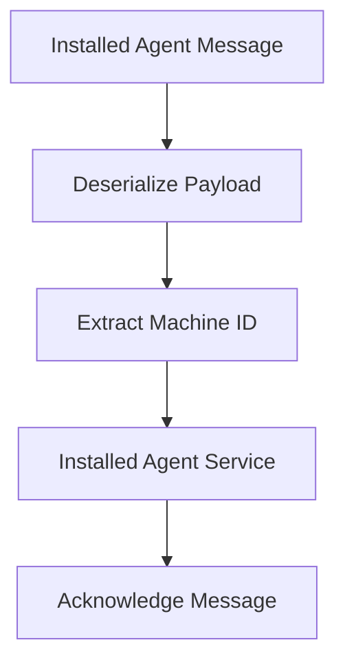
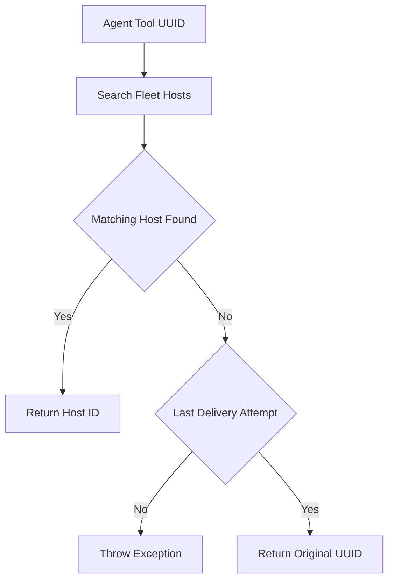
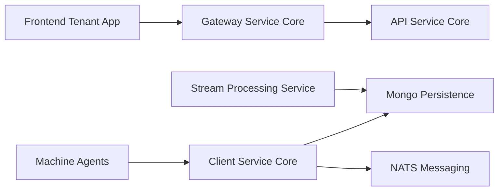

# Client Service Core

The **Client Service Core** module is responsible for managing machine agents, handling agent authentication, processing tool connections, and maintaining real-time machine state within the OpenFrame platform.

It acts as the bridge between:

- Installed agents running on managed machines
- Integrated tools (Fleet MDM, MeshCentral, Tactical RMM, etc.)
- The messaging layer (NATS / JetStream)
- The data platform and persistence layer

This module is deployed via the `ClientApplication` entrypoint and operates as a backend service within the tenant architecture.

---

## 1. Architectural Overview

The Client Service Core sits between external agents/tools and the broader OpenFrame platform.



### Key Responsibilities

1. Agent authentication via OAuth-compatible token endpoint.
2. Secure agent registration and machine provisioning.
3. Real-time machine lifecycle management (online, offline, heartbeat).
4. Tool-to-machine association management.
5. Agent identifier normalization and transformation.
6. File distribution for tool agents (temporary implementation).

---

## 2. REST API Layer

### 2.1 Agent Authentication Controller

**Component:**
- `AgentAuthController`

**Endpoint:**

```text
POST /oauth/token
```

This endpoint issues access tokens for machine agents using:

- `grant_type`
- `refresh_token` (optional)
- `client_id`
- `client_secret`

It delegates token generation to `AgentAuthService` and returns an `AgentTokenResponse`.

Authentication integrates with the broader security stack defined in:

- [Security OAuth and JWT Core](../security_oauth_and_jwt_core/security_oauth_and_jwt_core.md)
- [Authorization Server Core](../authorization_server_core/authorization_server_core.md)

---

### 2.2 Agent Registration Controller

**Component:**
- `AgentController`

**Endpoint:**

```text
POST /api/agents/register
```

**Headers:**

```text
X-Initial-Key: <registration secret>
```

**Payload:** `AgentRegistrationRequest`

Core fields include:

- Machine identity (hostname, organizationId)
- Network info (IP, MAC, OS UUID)
- OS metadata (type, version, build)
- Hardware metadata (serial number, manufacturer, model)
- Agent version and device status

Registration flow:



The `DefaultAgentRegistrationProcessor` provides a no-op extension point, allowing custom processors to override behavior without modifying the core module.

---

### 2.3 Tool Agent File Controller

**Component:**
- `ToolAgentFileController`

**Endpoint:**

```text
GET /tool-agent/{assetId}?os=<mac|windows>
```

This controller currently:

- Returns hardcoded embedded resources.
- Supports OS-specific binary resolution.
- Throws validation errors for unsupported cases.

> ⚠️ This implementation is marked temporary and intended to be replaced by artifact-based distribution.

---

## 3. Messaging and Event Processing

The Client Service Core consumes real-time machine events from NATS / JetStream.

### 3.1 Machine Heartbeat Listener

**Component:**
- `MachineHeartbeatListener`

**Subject Pattern:**

```text
machine.*.heartbeat
```

Responsibilities:

- Extract machine ID from subject.
- Generate service-side timestamp.
- Update machine status via `MachineStatusService`.

This ensures near real-time liveness tracking.

---

### 3.2 Client Connection Listener

**Component:**
- `ClientConnectionListener`

Handles:

- `ClientConnectionEvent`
- Online and offline transitions

Flow:



---

### 3.3 Installed Agent Listener (JetStream Durable Consumer)

**Component:**
- `InstalledAgentListener`

**Stream:** `INSTALLED_AGENTS`  
**Subject:** `machine.*.installed-agent`

Features:

- Durable consumer configuration.
- Explicit acknowledgment (`AckPolicy.Explicit`).
- Redelivery up to `MAX_DELIVER`.
- Last-attempt detection logic.

Processing pipeline:



If processing fails, the message is not acknowledged and is eligible for redelivery.

---

### 3.4 Tool Connection Listener

**Component:**
- `ToolConnectionListener`

**Stream:** `TOOL_CONNECTIONS`  
**Subject:** `machine.*.tool-connection`

Responsibilities:

- Durable JetStream consumer.
- Tool connection persistence.
- Last delivery attempt detection.
- Delegation to `ToolConnectionService`.

This enables dynamic association between machines and integrated tools.

---

## 4. Agent Identifier Transformation

Integrated tools often use their own identifier formats. The Client Service Core normalizes them via `ToolAgentIdTransformer` implementations.

### 4.1 Fleet MDM Agent ID Transformer

**Component:**
- `FleetMdmAgentIdTransformer`

Behavior:

1. Retrieves integrated tool configuration.
2. Resolves API URL and API key.
3. Calls Fleet MDM API using `FleetMdmClient`.
4. Searches hosts by UUID.
5. Converts UUID → Fleet host numeric ID.

Decision logic:



This ensures consistency between OpenFrame machine records and external Fleet host identifiers.

---

### 4.2 MeshCentral Agent ID Transformer

**Component:**
- `MeshCentralAgentIdTransformer`

Behavior:

- Prefixes agent ID with `node//`.
- Provides deterministic transformation.

Example:

```text
abc123 → node//abc123
```

---

## 5. Configuration

### 5.1 Password Encoder Configuration

**Component:**
- `PasswordEncoderConfig`

Defines a `BCryptPasswordEncoder` bean.

Used for:

- Secure credential storage.
- Agent-related secret hashing.

---

## 6. Data and Platform Integration

The Client Service Core integrates with:

- [Data Persistence Mongo](../data_persistence_mongo/data_persistence_mongo.md)
- [Data Platform Core](../data_platform_core/data_platform_core.md)
- [Data Messaging Kafka](../data_messaging_kafka/data_messaging_kafka.md)
- [Stream Processing Service Core](../stream_processing_service_core/stream_processing_service_core.md)

While it consumes NATS messages directly, broader data enrichment and aggregation occur in the Stream Processing layer.

---

## 7. Deployment and Entrypoint

The module is bootstrapped via:

- `ClientApplication`

See:

- [Service Entrypoints](../service_entrypoints/service_entrypoints.md)

---

## 8. Role Within the Overall System

The Client Service Core is the **machine-facing service** of OpenFrame.



It complements:

- API Service Core (user and organization APIs)
- Gateway Service Core (edge routing and security)
- Authorization Server Core (identity and OAuth)
- Management Service Core (administration and initialization)

Together, these services form the distributed backend powering the OpenFrame tenant platform.

---

# Summary

The **Client Service Core** module provides:

- Agent authentication and token issuance.
- Secure machine registration.
- Real-time machine status tracking.
- Tool connection management.
- Agent ID normalization.
- Event-driven processing via NATS JetStream.

It is a critical boundary service that maintains consistency between machines, tools, and the OpenFrame data platform while ensuring reliability through durable messaging and structured processing pipelines.
