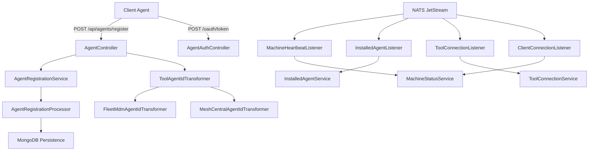
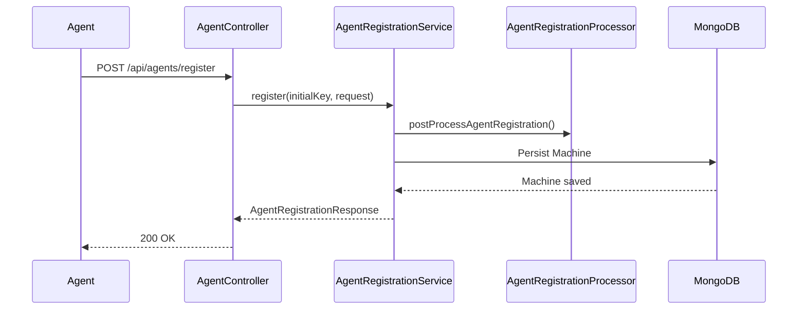
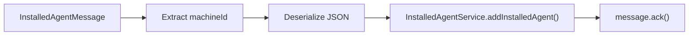

# Client Service Core

The **Client Service Core** module is responsible for managing machine (client) lifecycle events, agent registration, tool connectivity, and real-time status synchronization within the OpenFrame platform.

It acts as the central ingestion and orchestration layer for:

- Agent authentication and registration
- Machine heartbeat and connection tracking
- Tool installation and connection events
- Agent file distribution (temporary implementation)
- Client OAuth token issuance for agents

This module integrates tightly with:

- Data persistence layers (MongoDB)
- Messaging infrastructure (NATS JetStream)
- Tool integrations (Fleet MDM, MeshCentral)
- Platform-wide security configuration

---

## High-Level Responsibilities

1. **Agent Authentication** – Issues OAuth-compatible tokens for client agents.
2. **Agent Registration** – Registers machines into the OpenFrame ecosystem.
3. **Machine Status Tracking** – Tracks online/offline state and heartbeats.
4. **Tool Connection Management** – Processes tool connectivity and installation events.
5. **Agent ID Transformation** – Normalizes tool-specific identifiers.
6. **Event-Driven Processing** – Subscribes to NATS streams for machine lifecycle events.

---

## Architecture Overview



---

# REST Controllers

## AgentAuthController

**Path:** `/oauth/token`

Handles OAuth-style token issuance for client agents.

### Responsibilities

- Supports `grant_type`, `refresh_token`, `client_id`, and `client_secret`.
- Delegates token generation to `AgentAuthService`.
- Returns:
  - `200 OK` with `AgentTokenResponse`
  - `401 Unauthorized` for invalid credentials
  - `400 Bad Request` for server-side failures

This enables secure machine-to-platform authentication.

---

## AgentController

**Path:** `/api/agents/register`

Handles agent registration requests.

### Request Flow



### Input DTO

`AgentRegistrationRequest` includes:

- Hostname and organization
- Network information (IP, MAC, OS UUID)
- Agent version and status
- Hardware metadata
- Operating system details

This data is later stored in Mongo documents defined in the data layer.

---

## ToolAgentFileController

**Path:** `/tool-agent/{assetId}`

Temporary controller serving static agent artifacts from classpath resources.

- Selects binary based on OS (`mac`, `windows`)
- Returns raw byte array
- Throws `IllegalArgumentException` for unsupported OS or missing asset

> Note: Marked as TODO and intended to be replaced by GitHub artifact distribution.

---

# Messaging & Event Processing (NATS)

The Client Service Core listens to multiple NATS subjects to process real-time machine events.

## MachineHeartbeatListener

**Subject:** `machine.*.heartbeat`

- Extracts `machineId` from subject
- Generates server-side timestamp
- Calls `MachineStatusService.processHeartbeat()`

Purpose: Maintain near real-time online status.

---

## ClientConnectionListener

Processes:

- Machine connected events
- Machine disconnected events

Updates machine status:

- `updateToOnline()`
- `updateToOffline()`

Handles JSON payload mapping into `ClientConnectionEvent`.

---

## InstalledAgentListener

**Stream:** `INSTALLED_AGENTS`  
**Subject:** `machine.*.installed-agent`

### Characteristics

- Durable consumer
- Explicit ACK policy
- Max delivery attempts: 50
- Last-attempt detection logic

### Processing Flow



If processing fails, the message is intentionally left unacked for redelivery.

---

## ToolConnectionListener

**Stream:** `TOOL_CONNECTIONS`  
**Subject:** `machine.*.tool-connection`

Similar design to `InstalledAgentListener` with:

- Durable consumer
- Delivery group for horizontal scaling
- Explicit acknowledgment

Delegates to:

- `ToolConnectionService.addToolConnection()`

---

# Agent Registration Processing

## DefaultAgentRegistrationProcessor

Provides a default no-op implementation of `AgentRegistrationProcessor`.

- Activated via `@ConditionalOnMissingBean`
- Allows custom overrides
- Extensible hook for post-processing machine registration

This supports modular customization without altering core logic.

---

# Tool Agent ID Transformation

Client agents often report tool-specific identifiers that must be normalized.

## FleetMdmAgentIdTransformer

**ToolType:** `FLEET_MDM`

### Responsibilities

1. Fetch integrated tool configuration.
2. Retrieve API URL and credentials.
3. Instantiate `FleetMdmClient`.
4. Search hosts by UUID.
5. Transform UUID → Fleet Host ID.
6. Apply last-attempt fallback logic.

If no valid host is found:

- Retry until max delivery attempts
- On final attempt, fallback to original UUID

---

## MeshCentralAgentIdTransformer

**ToolType:** `MESHCENTRAL`

Simple transformation:

```text
agentToolId → "node//" + agentToolId
```

Used to normalize MeshCentral identifiers.

---

# Security Configuration

## PasswordEncoderConfig

Defines a `BCryptPasswordEncoder` bean:

```java
@Bean
public PasswordEncoder passwordEncoder() {
    return new BCryptPasswordEncoder();
}
```

Used for secure credential handling within client authentication flows.

---

# Data Layer Dependencies

The Client Service Core relies on:

- **MongoDB persistence layer**  
  See: [Data Persistence Mongo](../data_persistence_mongo/data_persistence_mongo.md)

- **Platform data services (Cassandra, Pinot, NATS models)**  
  See: [Data Platform and Pinot Cassandra](../data_platform_and_pinot_cassandra/data_platform_and_pinot_cassandra.md)

These modules provide:

- Machine documents
- Tool configuration storage
- Installed agent persistence
- Event and telemetry storage

---

# Design Patterns Used

- **Event-driven architecture** (NATS JetStream)
- **Strategy pattern** (ToolAgentIdTransformer implementations)
- **Template extension via conditional bean** (DefaultAgentRegistrationProcessor)
- **Durable messaging with explicit ACK control**
- **Separation of concerns** (Controllers vs Services vs Transformers)

---

# How It Fits in the Overall System

Within the OpenFrame architecture, the Client Service Core acts as:

- The ingestion point for machine lifecycle events
- The normalization layer for tool identifiers
- The real-time machine status engine
- The authentication boundary for client agents

It connects:

- Agents → via REST
- Messaging infrastructure → via NATS
- Persistence → via Mongo
- Tool ecosystems → via SDK integrations

This makes it a foundational component for machine management and tool orchestration across the platform.

---

# Summary

The **Client Service Core** module provides the backbone for:

- Secure machine onboarding
- Real-time machine lifecycle tracking
- Tool integration normalization
- Reliable message-driven processing

Its extensible and event-driven design ensures it can scale horizontally, integrate new tool types, and support evolving platform requirements without breaking core workflows.
