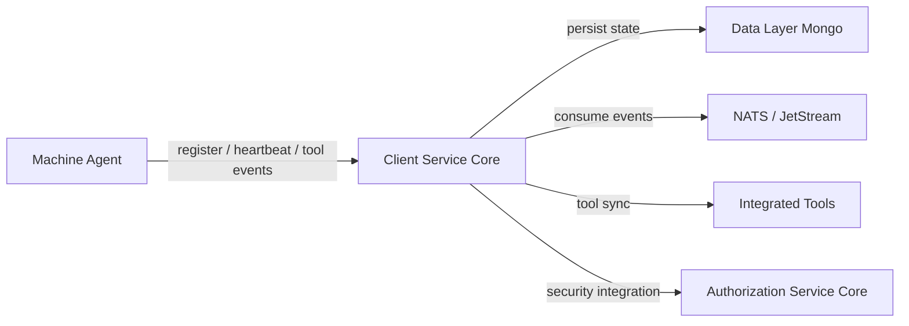
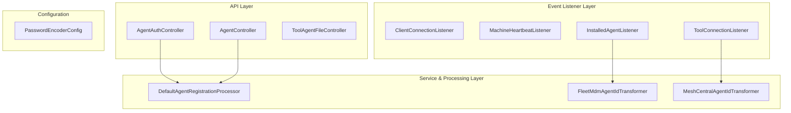
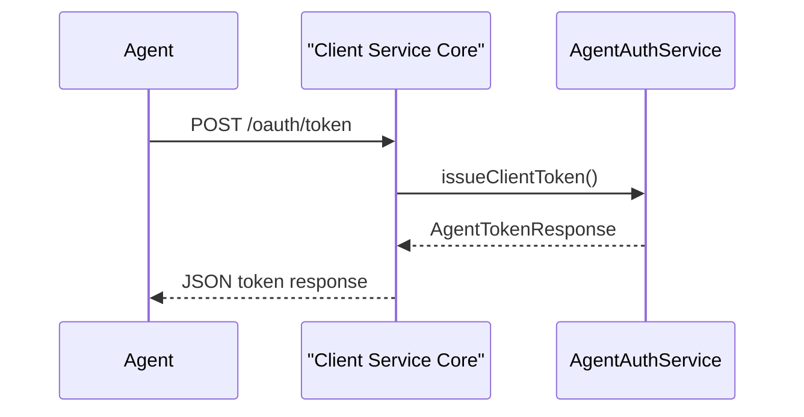
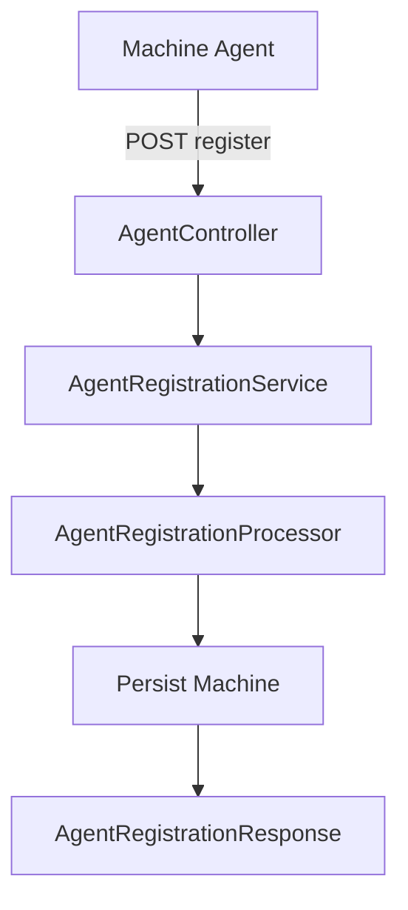
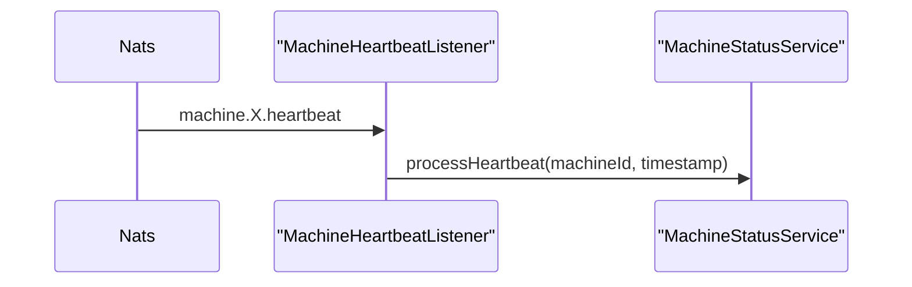
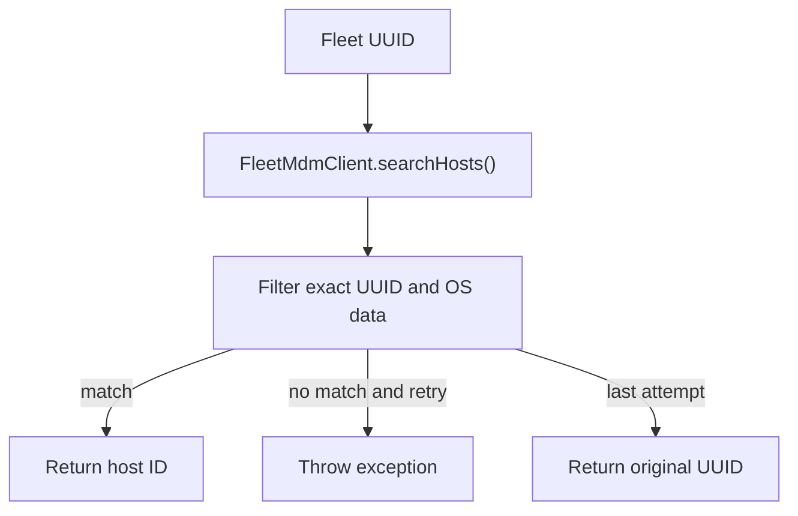
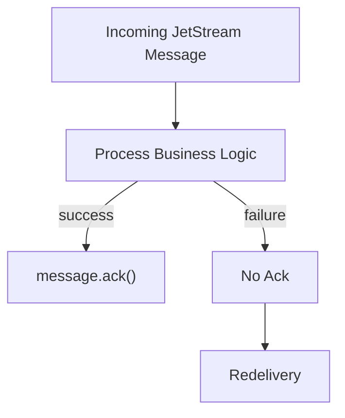

# Client Service Core

## Overview

The **Client Service Core** module is responsible for managing machine agents, tool integrations, and client authentication within the OpenFrame platform. It acts as the bridge between:

- Installed agents running on managed machines
- Integrated external tools (e.g., Fleet MDM, MeshCentral)
- The messaging backbone (NATS / JetStream)
- The broader OpenFrame microservices ecosystem

This module provides:

- Agent registration APIs
- OAuth-style token issuance for agents
- Tool agent file distribution (temporary implementation)
- Real-time machine lifecycle processing (connect, disconnect, heartbeat)
- Installed agent and tool connection synchronization
- Tool-specific agent ID transformation logic

It is deployed via the `ClientApplication` entrypoint in the service entrypoints layer.

---

## Architectural Context

Within the OpenFrame architecture, the Client Service Core sits between agents and backend services.



### Key Responsibilities

1. **Agent Lifecycle Management**
   - Registration
   - Online/offline state tracking
   - Heartbeat processing

2. **Tool Integration Synchronization**
   - Installed agent ingestion
   - Tool connection processing
   - Tool-specific agent ID transformation

3. **Authentication & Token Issuance**
   - Client credential flow for agents

4. **Event-Driven Processing**
   - NATS JetStream durable consumers
   - At-least-once message processing

---

## High-Level Component Structure



---

## API Layer

### AgentAuthController

**Base Path:** `/oauth`

Provides OAuth-style token issuance for machine agents.

#### Endpoint

```text
POST /oauth/token
```

Supported parameters:

- `grant_type`
- `refresh_token` (optional)
- `client_id` (optional)
- `client_secret` (optional)

Flow:



Error handling:

- `401` for invalid credentials
- `400` for server-side processing errors

---

### AgentController

**Base Path:** `/api/agents`

Handles machine agent registration.

#### Endpoint

```text
POST /api/agents/register
Header: X-Initial-Key
Body: AgentRegistrationRequest
```

#### AgentRegistrationRequest Structure

```text
Core Identification:
- hostname
- organizationId

Network:
- ip
- macAddress
- osUuid
- agentVersion
- status

Hardware:
- displayName
- serialNumber
- manufacturer
- model

Operating System:
- type
- osType
- osVersion
- osBuild
- timezone
```

Registration Flow:



---

### ToolAgentFileController

**Base Path:** `/tool-agent/{assetId}`

Temporary endpoint used to distribute tool agent binaries directly from classpath resources.

Behavior:

- Selects binary based on `os` parameter
- Returns `.exe` for Windows
- Returns raw binary for macOS or special cases
- Throws error for unknown OS or missing asset

> This implementation is marked for removal once GitHub artifact-based distribution is implemented.

---

## Event Listener Layer

The Client Service Core consumes real-time events from NATS.

### 1. ClientConnectionListener

Subjects handled:

```text
machine connected events
machine disconnected events
```

Responsibilities:

- Deserialize `ClientConnectionEvent`
- Extract machine ID
- Update machine status to online/offline
- Throw `NatsException` on processing failure

---

### 2. MachineHeartbeatListener

Subject pattern:

```text
machine.*.heartbeat
```

Processing behavior:

- Extract machine ID from subject
- Generate server-side timestamp
- Call `MachineStatusService.processHeartbeat`



---

### 3. InstalledAgentListener

JetStream configuration:

- Stream: `INSTALLED_AGENTS`
- Durable consumer
- Explicit ack policy
- Max redelivery: 50

Subject pattern:

```text
machine.*.installed-agent
```

Processing steps:

1. Extract machine ID from subject
2. Deserialize `InstalledAgentMessage`
3. Call `InstalledAgentService.addInstalledAgent`
4. Acknowledge on success
5. Leave unacked on failure for redelivery

Redelivery strategy ensures at-least-once semantics.

---

### 4. ToolConnectionListener

JetStream configuration:

- Stream: `TOOL_CONNECTIONS`
- Durable consumer with delivery group
- Explicit acknowledgment
- Max redelivery: 50

Subject pattern:

```text
machine.*.tool-connection
```

Processing:

- Deserialize `ToolConnectionMessage`
- Transform tool agent ID if required
- Call `ToolConnectionService.addToolConnection`
- Ack on success

---

## Agent Registration Processing

### DefaultAgentRegistrationProcessor

Provides a default no-op implementation of `AgentRegistrationProcessor`.

Characteristics:

- Annotated with `@ConditionalOnMissingBean`
- Automatically overridden if a custom processor is provided
- Enables extension without modifying core module

This design allows tenant-specific customizations.

---

## Tool Agent ID Transformation

The Client Service Core supports tool-specific transformation logic via `ToolAgentIdTransformer` implementations.

### FleetMdmAgentIdTransformer

Purpose:

- Converts Fleet MDM UUIDs into Fleet internal host IDs

Flow:



Key behaviors:

- Fetch integrated tool configuration
- Resolve API URL and token
- Query Fleet API
- Retry-aware fallback behavior

---

### MeshCentralAgentIdTransformer

Purpose:

- Normalize MeshCentral agent ID format

Logic:

```text
Input: abc123
Output: node//abc123
```

This ensures consistent ID structure for downstream processing.

---

## Configuration

### PasswordEncoderConfig

Provides a Spring `PasswordEncoder` bean.

```java
@Bean
public PasswordEncoder passwordEncoder() {
    return new BCryptPasswordEncoder();
}
```

Used for secure handling of client credentials and secrets.

---

## Event Processing Reliability Model

The Client Service Core follows an **at-least-once delivery model** using:

- Durable JetStream consumers
- Explicit acknowledgments
- Redelivery on failure
- Max delivery threshold



This design ensures resilience against:

- Temporary downstream failures
- External API timeouts
- Transient database issues

---

## Extension Points

The module is designed for extensibility:

1. **Custom AgentRegistrationProcessor**
   - Override default behavior

2. **Custom ToolAgentIdTransformer**
   - Add support for new integrated tools

3. **Event Consumers**
   - Extend NATS listeners

4. **Authentication Strategy**
   - Integrate with Authorization Service Core

---

## Summary

The **Client Service Core** is the operational backbone for:

- Machine lifecycle tracking
- Tool synchronization
- Agent authentication
- Real-time event ingestion

It combines REST APIs, event-driven messaging, and tool integration logic into a modular and extensible service that connects machine agents with the OpenFrame platform ecosystem.

It is optimized for:

- Reliability
- Extensibility
- Multi-tool integration
- Event-driven scalability
