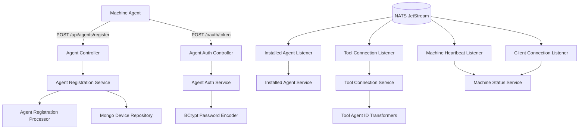
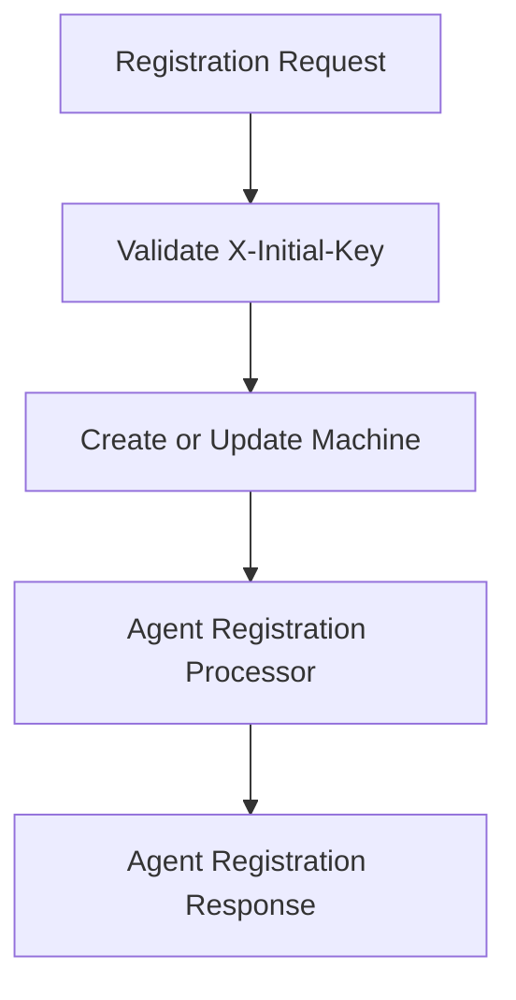
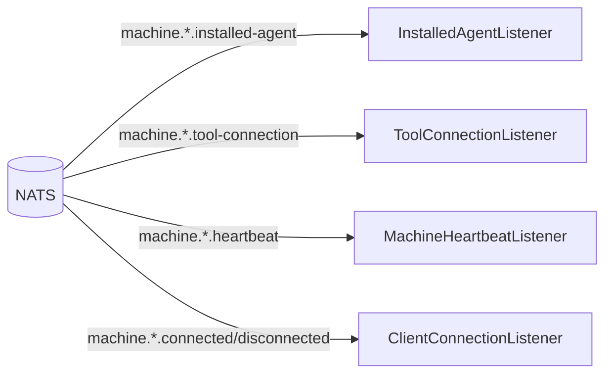
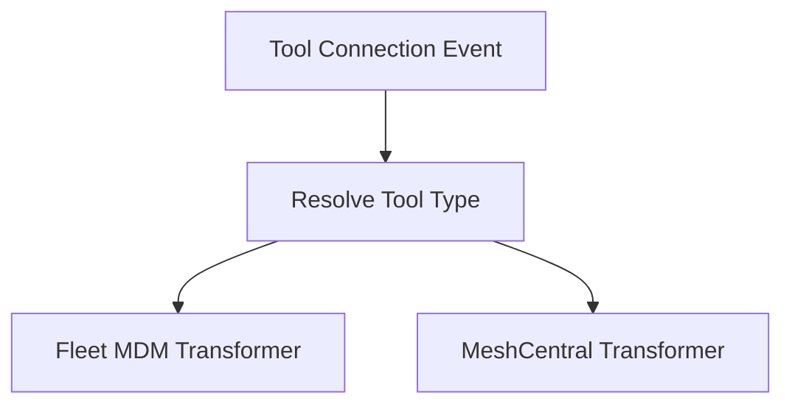

# Client Service Core

The **Client Service Core** module is responsible for managing machine agents, handling agent authentication and registration, processing real-time connection events, and integrating external tool agents into the OpenFrame platform.

It acts as the backend service for:

- Agent registration and lifecycle management  
- Machine heartbeat and connection tracking  
- Tool agent connection synchronization  
- Agent OAuth token issuance  
- Tool agent binary delivery (temporary implementation)

This module is deployed via the `ClientApplication` entrypoint and integrates deeply with:

- Mongo-based persistence (devices, tools, users)  
- NATS JetStream for event-driven communication  
- Integrated tool services (Fleet MDM, MeshCentral, etc.)  
- Security infrastructure for OAuth-style client authentication  

---

## High-Level Architecture



---

## Core Responsibilities

### 1. Agent Authentication

The **Agent Auth Controller** exposes an OAuth-like token endpoint:

- `POST /oauth/token`
- Supports grant types (e.g., client credentials, refresh token)
- Delegates to `AgentAuthService`
- Returns `AgentTokenResponse`

Security-related behavior:

- Passwords are encoded using **BCrypt** via `PasswordEncoderConfig`
- Invalid credentials result in HTTP `401`
- Internal errors return `400` with standardized error payload

This aligns with the broader security architecture used across the platform.

---

### 2. Agent Registration

The **Agent Controller** exposes:

```text
POST /api/agents/register
Header: X-Initial-Key
Body: AgentRegistrationRequest
```

#### AgentRegistrationRequest Includes:

- Host identity (hostname, organizationId)
- Network info (IP, MAC, OS UUID)
- Hardware metadata (serial, manufacturer, model)
- OS metadata (type, version, build, timezone)
- Agent version and device status

Registration Flow:



A pluggable extension point exists via:

- `AgentRegistrationProcessor`
- Default implementation: `DefaultAgentRegistrationProcessor`

This allows:

- Custom provisioning logic
- Metadata enrichment
- Side-effect integration (e.g., tool binding, tagging)

---

### 3. Tool Agent File Delivery

The **Tool Agent File Controller** provides:

```text
GET /tool-agent/{assetId}?os=windows|mac
```

⚠ Current behavior:

- Returns hardcoded resource files from the classpath
- Intended as a temporary solution
- Will be replaced by artifact repository integration

Platform logic:

- Windows → `.exe`
- macOS → raw asset
- Throws error for unsupported OS

---

## Event-Driven Architecture (NATS Integration)

The Client Service Core is highly event-driven. It subscribes to multiple NATS subjects.

### NATS Subjects Overview



---

### 1. Installed Agent Listener

**Stream:** `INSTALLED_AGENTS`  
**Subject:** `machine.*.installed-agent`

Behavior:

- Uses JetStream durable consumer
- Explicit ACK policy
- Retries up to 50 deliveries
- 30-second ACK wait

Processing:

- Extract machineId from subject
- Deserialize `InstalledAgentMessage`
- Call `InstalledAgentService.addInstalledAgent()`
- Acknowledge on success

If processing fails:

- Message remains unacked
- Redelivery handled by JetStream

---

### 2. Tool Connection Listener

**Stream:** `TOOL_CONNECTIONS`  
**Subject:** `machine.*.tool-connection`

Behavior:

- Durable consumer (`tool-connection-processor-v2`)
- Explicit ACK
- Delivery group support
- Redelivery handling

Processing:

- Extract machineId
- Deserialize `ToolConnectionMessage`
- Transform agent tool ID if required
- Persist connection state

Transformer resolution is based on tool type.

---

### 3. Machine Heartbeat Listener

**Subject:** `machine.*.heartbeat`

Behavior:

- Lightweight subscription
- Timestamp generated server-side
- Calls `MachineStatusService.processHeartbeat()`

This supports real-time online/offline detection.

---

### 4. Client Connection Listener

Processes:

- Machine connected events
- Machine disconnected events

Updates:

- `MachineStatusService.updateToOnline()`
- `MachineStatusService.updateToOffline()`

This ensures accurate connection state tracking.

---

## Tool Agent ID Transformation

The module supports tool-specific transformations before persisting agent identifiers.



### Fleet MDM Transformer

- ToolType: `FLEET_MDM`
- Queries Fleet API
- Resolves UUID → numeric host ID
- Validates OS metadata
- Falls back to UUID on last retry

Integration services:

- `IntegratedToolService`
- `ToolUrlService`
- `FleetMdmClient`

This ensures platform-wide consistency between:

- External tool identifiers  
- Internal machine records

---

### MeshCentral Transformer

- ToolType: `MESHCENTRAL`
- Prefixes ID with `node//`
- Lightweight transformation

Example:

```text
Input: abc123
Output: node//abc123
```

---

## Metrics Support

`MetricsMessage` provides structured telemetry:

- machineId
- CPU usage
- memory usage
- timestamp

This enables:

- Real-time metrics streaming
- Observability pipelines
- Future analytics integration

---

## Security Configuration

`PasswordEncoderConfig` defines:

```java
@Bean
public PasswordEncoder passwordEncoder() {
    return new BCryptPasswordEncoder();
}
```

All client credentials and secrets use BCrypt hashing.

This aligns with the shared security infrastructure of the platform.

---

## Lifecycle and Cleanup

Listeners implement:

- `@EventListener(ApplicationReadyEvent)` for subscription
- `@PreDestroy` cleanup logic

This guarantees:

- Proper dispatcher draining
- Graceful shutdown
- Safe JetStream consumer behavior

---

## Deployment and Entrypoint

The service is started via:

- `ClientApplication`

It runs as a standalone microservice within the OpenFrame architecture and integrates with:

- Authorization Server Core  
- Data Mongo Repositories  
- Data Kafka Integration  
- Management Service Core  

---

# Summary

The **Client Service Core** module is the machine-facing backbone of the OpenFrame platform.

It provides:

- Secure agent authentication  
- Structured machine registration  
- Real-time lifecycle tracking  
- Tool ecosystem integration  
- Event-driven consistency via NATS  
- Extensible transformation and processing hooks  

Its architecture emphasizes:

- Loose coupling  
- Event-driven reliability  
- Pluggable processors  
- Tool abstraction  
- Cloud-native microservice principles  

This module ensures that every managed machine and tool agent is accurately represented, authenticated, and synchronized within the OpenFrame ecosystem.
