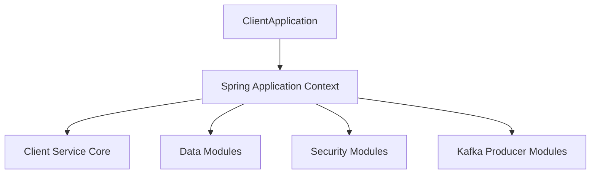
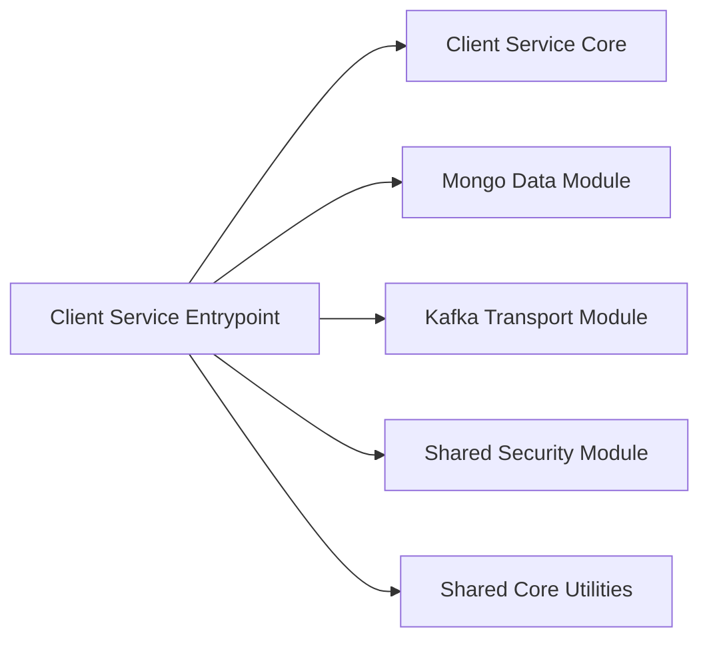
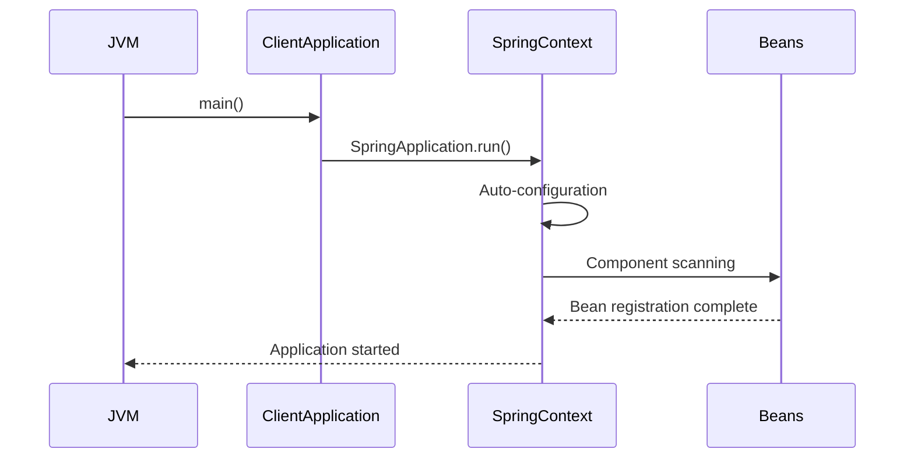
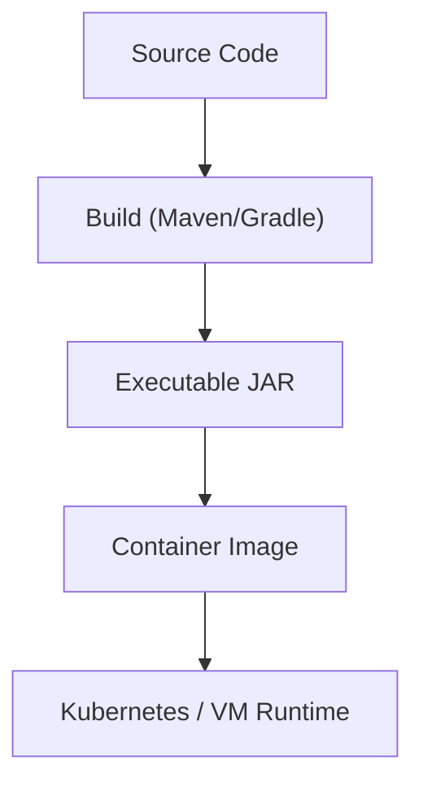

# Client Service Entrypoint

The **Client Service Entrypoint** module is the bootstrap layer for the OpenFrame Client Service. It is responsible for starting the Spring Boot application, configuring component scanning, and wiring together the core client runtime with shared platform modules such as data access, security, Kafka transport, and core utilities.

At runtime, this module initializes the embedded web server, loads auto-configuration, and activates the Client Service Core logic defined in the sibling module.

> Core class: `ClientApplication`

---

## 1. Purpose and Responsibilities

The Client Service Entrypoint serves as the **application boundary** for the Client Service. Its responsibilities include:

- Bootstrapping the Spring Boot runtime
- Defining component scan boundaries
- Integrating shared platform modules
- Excluding infrastructure components not required in this service
- Acting as the deployment unit (JAR / container image entrypoint)

It does **not** contain business logic. All domain behavior is delegated to:

- [Client Service Core](client_service_core/client_service_core.md)

---

## 2. Core Component: ClientApplication

```java
@SpringBootApplication
@ComponentScan(
    basePackages = {
        "com.openframe.data",
        "com.openframe.client",
        "com.openframe.core",
        "com.openframe.security",
        "com.openframe.kafka.producer",
    },
    excludeFilters = {
        @ComponentScan.Filter(
            type = FilterType.ASSIGNABLE_TYPE,
            classes = CassandraHealthIndicator.class
        )
    }
)
public class ClientApplication {
    public static void main(String[] args) {
        SpringApplication.run(ClientApplication.class, args);
    }
}
```

### Key Annotations

#### `@SpringBootApplication`
Enables:
- Auto-configuration
- Component scanning
- Spring Boot lifecycle management

#### `@ComponentScan`
Explicitly defines which packages are loaded into the application context.

### Included Packages

| Package | Responsibility |
|----------|---------------|
| `com.openframe.client` | Client-specific controllers, listeners, services |
| `com.openframe.data` | Mongo, Kafka models, platform data access |
| `com.openframe.core` | Shared utilities and DTO infrastructure |
| `com.openframe.security` | JWT and OAuth security components |
| `com.openframe.kafka.producer` | Kafka producer infrastructure |

### Explicit Exclusion

```java
classes = CassandraHealthIndicator.class
```

The `CassandraHealthIndicator` is excluded to prevent Cassandra health checks from being registered in this service.

This implies:
- Cassandra may be part of the shared data platform
- The Client Service does not require direct Cassandra health monitoring
- Startup should not fail if Cassandra is unavailable

---

## 3. High-Level Architecture

The Client Service Entrypoint sits at the outermost layer of the service.



### Architectural Role

- Initializes Spring container
- Registers beans from scanned packages
- Activates REST controllers and event listeners
- Connects messaging and persistence layers

---

## 4. Module Relationships

The Client Service Entrypoint depends on several platform modules through component scanning.



### Primary Internal Dependency

- ✅ [Client Service Core](client_service_core/client_service_core.md)

The Client Service Core contains:
- Agent controllers
- Registration processors
- Heartbeat listeners
- Tool connection listeners
- Agent file distribution logic

The entrypoint only wires it into the runtime.

---

## 5. Runtime Boot Process

When the service starts, the following sequence occurs:



### Boot Stages

1. JVM loads `ClientApplication`
2. Spring Boot initializes
3. Component scan registers beans
4. Auto-configurations apply
5. Embedded server starts
6. Service becomes ready

---

## 6. Deployment Model

The Client Service Entrypoint defines the deployable unit of the Client Service.

Typical deployment flow:



The entrypoint class is the process start target.

---

## 7. Separation of Concerns

| Layer | Responsibility | Location |
|-------|---------------|----------|
| Entrypoint | Bootstrapping & wiring | Client Service Entrypoint |
| Business Logic | Agent operations, listeners | Client Service Core |
| Persistence | Mongo repositories, documents | Data modules |
| Messaging | Kafka producer infrastructure | Kafka transport module |
| Security | JWT validation, OAuth support | Shared security module |

This strict separation ensures:
- Clear runtime boundaries
- Testable core logic
- Independent scaling
- Reusable shared modules

---

## 8. Design Considerations

### Explicit Package Scanning

Instead of relying on implicit scanning, the module explicitly defines base packages. This ensures:

- Predictable bean loading
- Reduced accidental wiring
- Clear module ownership

### Health Indicator Exclusion

Excluding `CassandraHealthIndicator` indicates a deliberate architectural decision:

- Client Service does not rely on Cassandra directly
- Prevents unnecessary infrastructure coupling
- Improves startup resilience

---

## 9. How This Module Fits Into the System

Within the broader OpenFrame architecture, the Client Service Entrypoint:

- Receives agent connections
- Handles agent registration and authentication
- Publishes events to Kafka
- Persists client-related data via Mongo
- Integrates with shared security

It acts as the **runtime container** for all client-side backend operations.

---

## 10. Summary

The **Client Service Entrypoint** is a lightweight but critical module that:

- Boots the Spring application
- Defines component scan boundaries
- Integrates shared platform infrastructure
- Excludes unnecessary components
- Hosts the Client Service Core runtime

While minimal in code, it establishes the structural foundation of the Client Service and determines how the module integrates into the larger OpenFrame ecosystem.

For detailed business logic and internal controllers, see:

- [Client Service Core](client_service_core/client_service_core.md)
