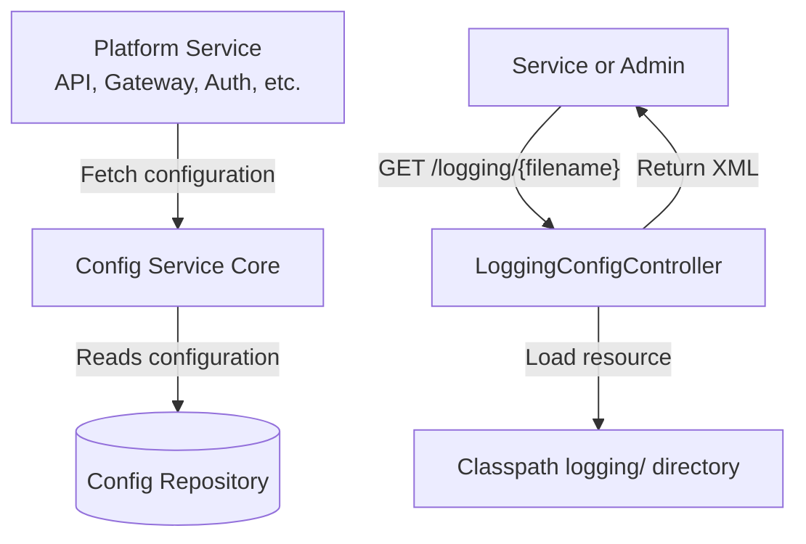
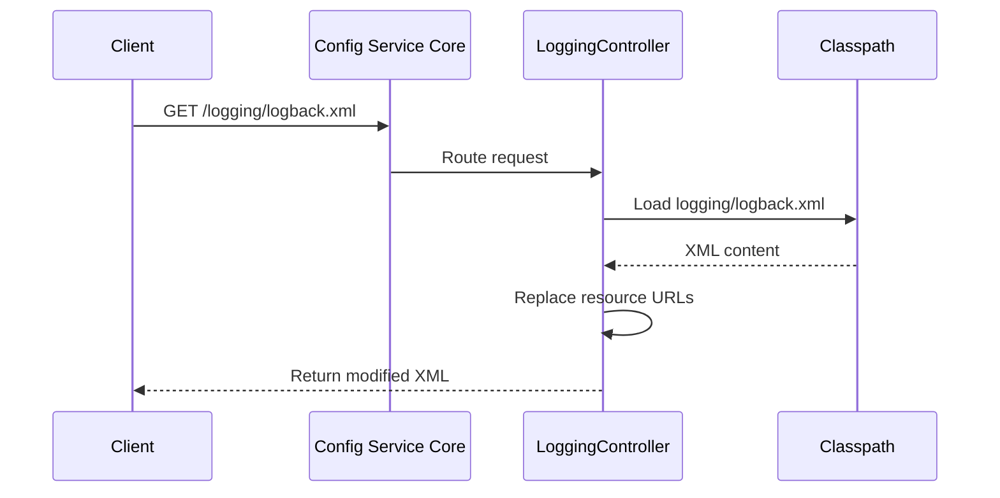
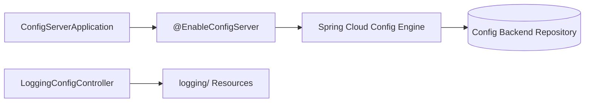
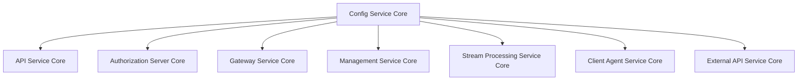

# Config Service Core

## Overview

The **Config Service Core** module provides centralized configuration management for the OpenFrame platform using Spring Cloud Config Server. It acts as the authoritative configuration source for all backend services, ensuring consistent environment configuration, dynamic property management, and runtime logging configuration delivery.

At runtime, the Config Service Core:

- Boots a Spring Cloud Config Server instance
- Exposes configuration properties to other services
- Serves logging configuration files dynamically over HTTP
- Enables environment-specific configuration across the platform

This module is foundational to all other service cores (API, Authorization, Gateway, Management, Stream, Client Agent, and External API), as they rely on it for centralized configuration.

---

## Core Components

The Config Service Core is composed of three primary components:

1. **ConfigServerApplication**  
   Entry point for the Spring Boot application.

2. **ConfigServerConfiguration**  
   Enables Spring Cloud Config Server functionality.

3. **LoggingConfigController**  
   Serves logging configuration files dynamically and adjusts resource URLs.

---

## High-Level Architecture



### Responsibilities

- Provide configuration properties to services at startup and refresh time
- Serve XML logging configuration files
- Replace internal logging resource references with fully qualified URLs

---

## Application Bootstrap

### ConfigServerApplication

```java
@SpringBootApplication
@Slf4j
public class ConfigServerApplication {
    public static void main(String[] args) {
        SpringApplication.run(ConfigServerApplication.class, args);
    }
}
```

**Responsibilities:**

- Bootstraps the Spring Boot runtime
- Initializes the Spring Cloud Config Server context
- Starts embedded web server

This class is intentionally minimal, delegating all behavior to Spring Boot auto-configuration and `ConfigServerConfiguration`.

---

## Config Server Enablement

### ConfigServerConfiguration

```java
@Configuration
@EnableConfigServer
public class ConfigServerConfiguration {
}
```

This class enables Spring Cloud Config Server using the `@EnableConfigServer` annotation.

### What This Enables

- Remote configuration repository integration (e.g., Git, filesystem, etc.)
- Environment-based configuration resolution
- Profile-specific configuration loading
- Secure configuration distribution

Once enabled, the service exposes standard Spring Cloud Config endpoints such as:

```text
/{application}/{profile}
/{application}/{profile}/{label}
```

Other services in the platform fetch configuration during bootstrap using these endpoints.

---

## Dynamic Logging Configuration

### LoggingConfigController

```java
@RestController
@RequestMapping("/logging")
public class LoggingConfigController {

    @GetMapping(value = "/{filename:.+}", produces = MediaType.APPLICATION_XML_VALUE)
    public ResponseEntity<String> getLoggingConfig(
        @PathVariable String filename,
        HttpServletRequest request
    ) throws Exception {
        ...
    }
}
```

### Endpoint

```text
GET /logging/{filename}
```

### Core Behavior

1. Receives a filename request (e.g., `logback.xml`)
2. Loads the file from the `classpath:logging/` directory
3. Computes the current server base URL
4. Rewrites resource references inside the XML
5. Returns the modified XML content

### URL Rewriting Logic

The controller replaces relative resource references such as:

```text
resource="logging/..."
```

With fully qualified URLs:

```text
url="http://host:port/logging/..."
```

This ensures:

- Remote logging appenders resolve correctly
- Distributed services can reference centralized logging configs
- Logging configuration works across environments

### Request Flow



---

## Internal Component Interaction



### Separation of Concerns

- **Bootstrap Layer**: `ConfigServerApplication`
- **Configuration Layer**: `ConfigServerConfiguration`
- **Runtime Utility Layer**: `LoggingConfigController`

This design keeps configuration serving and logging configuration handling cleanly separated.

---

## Role Within the Platform

The Config Service Core sits at the foundation of the OpenFrame service ecosystem.



### Platform-Level Impact

- Standardizes environment configuration
- Enables multi-environment deployments (dev, staging, prod)
- Simplifies configuration updates without code changes
- Centralizes logging behavior across services

Without this module, each service would require local configuration management, increasing operational complexity.

---

## Operational Considerations

### Deployment

- Must be available before dependent services start
- Typically deployed early in infrastructure startup order
- Should be highly available in production

### Security

- Config endpoints should be secured
- Sensitive properties must be encrypted or stored securely
- Logging configuration exposure should be controlled via network policies

### Scalability

- Stateless by design
- Can be horizontally scaled
- Backed by external configuration repository

---

## Summary

The **Config Service Core** module provides centralized configuration and logging configuration distribution for the OpenFrame platform.

It:

- Boots a Spring Cloud Config Server
- Serves environment-specific properties to all services
- Dynamically delivers and rewrites logging configuration files
- Acts as a foundational infrastructure service

Although small in code footprint, it plays a critical architectural role by enabling consistent, scalable, and maintainable configuration management across the entire microservices ecosystem.
