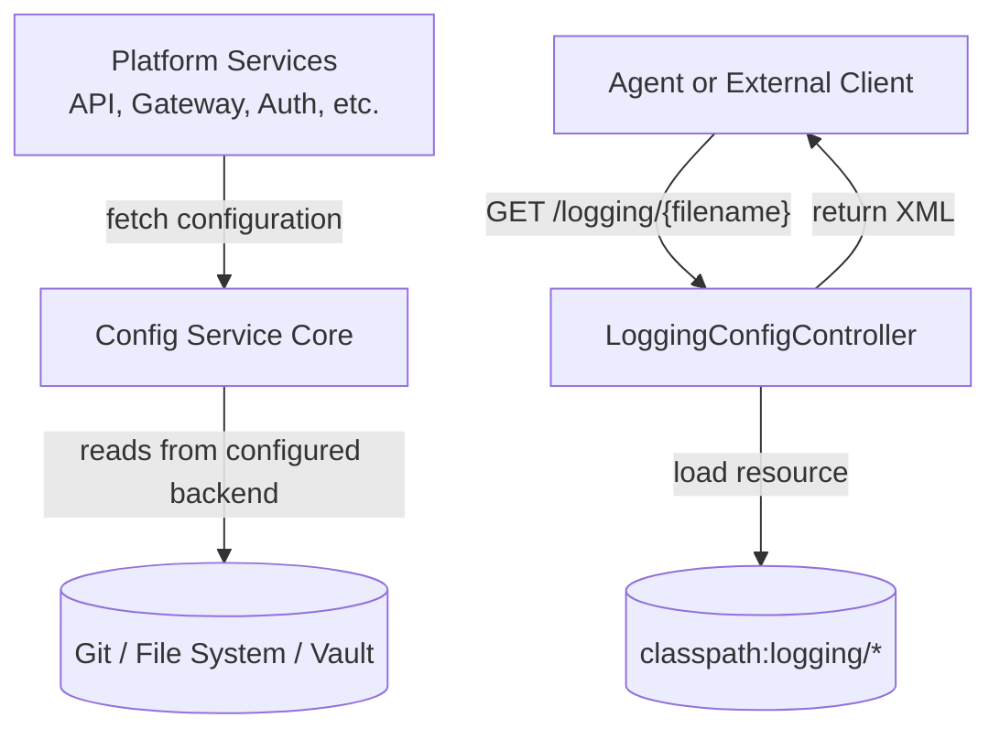
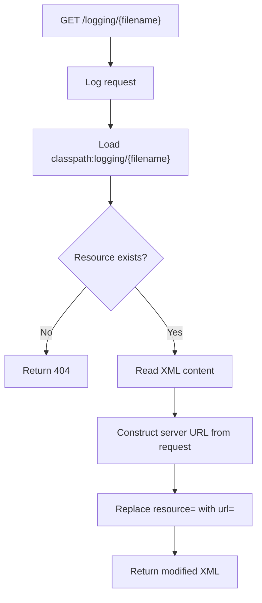
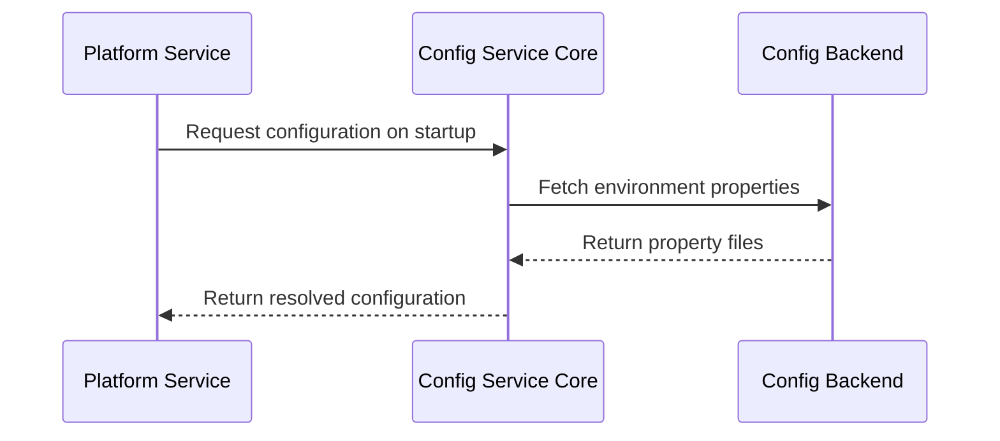
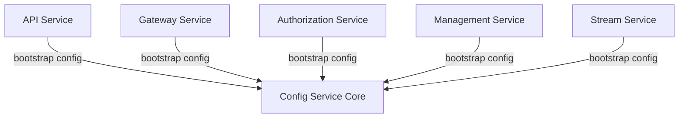

# Config Service Core

## Overview

The **Config Service Core** module provides centralized configuration capabilities for the OpenFrame platform using Spring Cloud Config Server. It enables dynamic configuration management across all microservices and exposes logging configuration files that can be consumed at runtime by platform components.

This module is a foundational infrastructure service that supports:

- Centralized configuration distribution
- Environment-specific property management
- Runtime logging configuration retrieval
- Cross-service configuration consistency

It is bootstrapped by the `ConfigServerApplication` entrypoint (in the Config Service Entrypoint module) and acts as the configuration backbone for API, Gateway, Authorization, Management, Stream, Client, and other services.

---

## Architecture Overview

The Config Service Core is composed of two primary components:

- `ConfigServerConfiguration` – Enables Spring Cloud Config Server
- `LoggingConfigController` – Exposes logging configuration files over HTTP

### High-Level Architecture



The module plays two distinct roles:

1. **Configuration Server Role** – Distributes application configuration.
2. **Logging Configuration Provider Role** – Serves dynamic XML logging files.

---

## Component Breakdown

### 1. ConfigServerConfiguration

**Class:** `ConfigServerConfiguration`  
**Annotation:** `@EnableConfigServer`

This class activates Spring Cloud Config Server within the application context.

#### Responsibilities

- Enables centralized configuration distribution
- Exposes standard Spring Cloud Config endpoints
- Integrates with backend configuration sources (e.g., Git repository)
- Supports environment-based configuration resolution

#### Internal Behavior


When the service starts:

1. Spring Boot initializes the application context.
2. `@EnableConfigServer` registers config server infrastructure beans.
3. Config endpoints become available (e.g., `/application/default`).

All dependent microservices use this server to retrieve configuration during bootstrap.

---

### 2. LoggingConfigController

**Class:** `LoggingConfigController`  
**Base Path:** `/logging`

This REST controller dynamically serves XML logging configuration files from the classpath.

#### Endpoint

```text
GET /logging/{filename}
Produces: application/xml
```

#### Responsibilities

- Retrieve logging configuration files from `classpath:logging/`
- Validate resource existence
- Dynamically rewrite internal resource URLs
- Return XML content with correct `Content-Type`

#### Processing Flow



#### Dynamic URL Rewriting

The controller modifies XML content by replacing:

```text
resource="logging/"
```

with:

```text
url="{serverUrl}/logging/"
```

This ensures that relative logging references are transformed into fully qualified URLs based on:

- Request scheme (`http` or `https`)
- Server name
- Port (if not 80 or 443)

This design allows agents or services to correctly resolve remote logging configurations.

---

## Runtime Interaction with Other Services

Although this module is minimal in code, it plays a critical cross-cutting role across the platform.

### Configuration Bootstrap Flow



This ensures:

- Consistent configuration across environments
- Centralized management of feature flags and secrets
- Profile-based property resolution

---

## Security Considerations

- Logging configuration files are publicly accessible by path but limited to classpath resources.
- Non-existing resources return HTTP 404.
- URL rewriting is derived strictly from the incoming request context.
- No arbitrary file system access is permitted (classpath-bound only).

For transport security, deployment behind the Gateway Service ensures HTTPS termination and access control.

---

## Deployment Model

The Config Service Core is deployed as a standalone microservice via the Config Service Entrypoint.

### Typical Responsibilities in Production

- Hosts centralized configuration repository
- Supplies configuration to all Spring Boot services
- Serves logging XML files for agents and services



---

## Design Principles

The Config Service Core follows these architectural principles:

- **Separation of Concerns** – Configuration management isolated from business logic.
- **Centralization** – Single source of truth for service configuration.
- **Environment Awareness** – Supports profile-based configuration resolution.
- **Runtime Flexibility** – Logging configuration served dynamically with URL rewriting.
- **Minimal Surface Area** – Only essential endpoints are exposed.

---

## Summary

The **Config Service Core** module is a lightweight yet critical infrastructure component of the OpenFrame platform. By enabling Spring Cloud Config Server and providing dynamic logging configuration retrieval, it ensures:

- Consistent configuration management across services
- Simplified environment promotion
- Centralized logging configuration distribution
- Scalable microservice configuration architecture

Despite having only two core classes, its impact spans the entire distributed system, acting as the configuration backbone for all platform services.