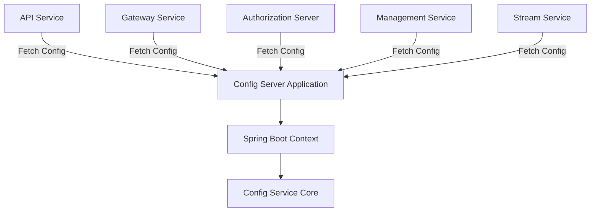
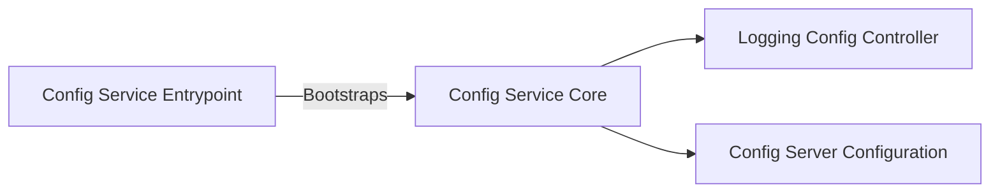
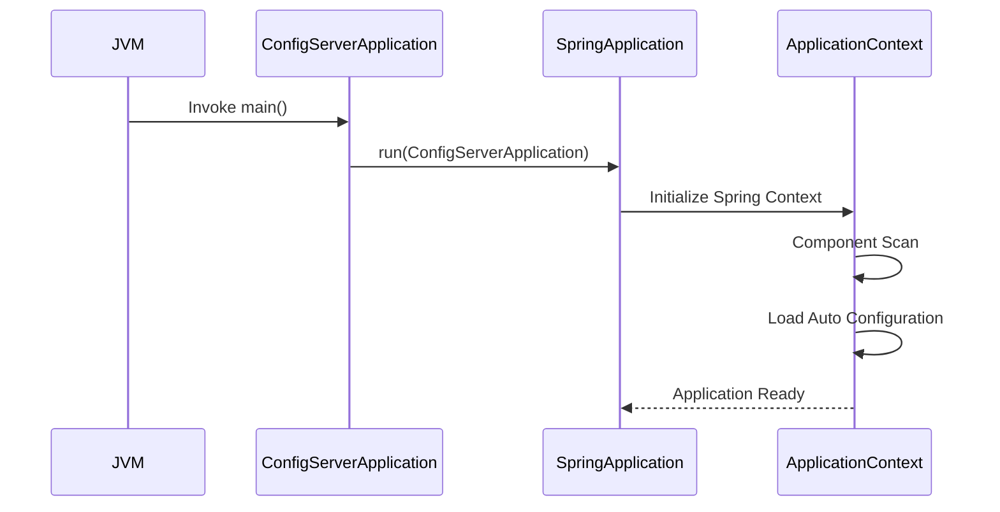
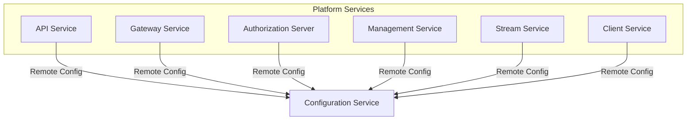

# Config Service Entrypoint

The **Config Service Entrypoint** module is the bootstrap layer for the OpenFrame Configuration Service. It is responsible for starting the Spring Boot application that provides centralized configuration management to all other platform services.

At runtime, this module initializes the Spring context, activates auto-configuration, and wires in the components defined in the underlying configuration core module.

---

## 1. Purpose and Responsibilities

The Config Service Entrypoint has a single, focused responsibility:

- Bootstrapping the Configuration Server application
- Enabling component scanning and auto-configuration
- Serving as the runtime boundary for configuration-related functionality

### Core Component

```java
@SpringBootApplication
@Slf4j
public class ConfigServerApplication {

    public static void main(String[] args) {
        SpringApplication.run(ConfigServerApplication.class, args);
    }
}
```

### Key Annotations

- `@SpringBootApplication` – Enables auto-configuration, component scanning, and configuration support
- `@Slf4j` – Provides logging support via Lombok

This class does not contain business logic. Instead, it delegates all operational responsibilities to the underlying configuration modules.

---

## 2. High-Level Architecture

The Config Service Entrypoint sits at the edge of the Configuration Service and connects platform services to centralized configuration management.



### Explanation

1. The `Config Server Application` starts the Spring Boot runtime.
2. The Spring context loads beans from the configuration core.
3. Other services request configuration values during startup or runtime.

---

## 3. Relationship to Config Service Core

All configuration logic resides in:

- [Config Service Core](config_service_core/config_service_core.md)

The Entrypoint only initializes the environment. The core module defines:

- Configuration server behavior
- Logging configuration endpoints
- Internal configuration policies



This separation ensures:

- Clean runtime boundary
- Reusable configuration logic
- Clear modular architecture

---

## 4. Service Startup Flow

When the Configuration Service starts, the following process occurs:



### Startup Stages

1. JVM invokes the `main()` method.
2. Spring Boot initializes the application context.
3. Auto-configuration and component scanning are applied.
4. Beans from the Config Service Core are registered.
5. The service begins serving configuration requests.

---

## 5. Role Within the Platform

The Config Service Entrypoint supports the broader OpenFrame platform by enabling centralized configuration for:

- [API Service Entrypoint](api_service_entrypoint.md)
- [Gateway Service Entrypoint](gateway_service_entrypoint.md)
- [Authorization Server Entrypoint](authorization_server_entrypoint.md)
- [Management Service Entrypoint](management_service_entrypoint.md)
- [Stream Service Entrypoint](stream_service_entrypoint.md)
- [Client Service Entrypoint](client_service_entrypoint.md)

### Platform Configuration Model



This architecture enables:

- Centralized configuration updates
- Environment-specific overrides
- Operational consistency across microservices

---

## 6. Design Characteristics

### Minimal Surface Area
The Entrypoint contains no domain logic, which:

- Simplifies testing
- Reduces coupling
- Keeps startup predictable

### Modular Separation

- Entrypoint → Application bootstrap
- Core → Configuration behavior and endpoints

### Spring Boot Native Pattern

The structure follows the standard Spring Boot microservice pattern used across the OpenFrame platform:

- Single annotated application class
- Externalized configuration
- Auto-wired dependency graph

---

## 7. Summary

The **Config Service Entrypoint** module:

- Starts the Configuration Server
- Initializes the Spring Boot runtime
- Loads configuration logic from the Config Service Core
- Provides centralized configuration capabilities to the entire OpenFrame platform

Although technically simple, this module is foundational. Without it, no other service could reliably obtain environment-specific configuration at runtime.
