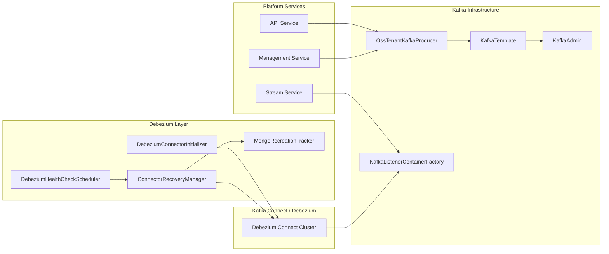
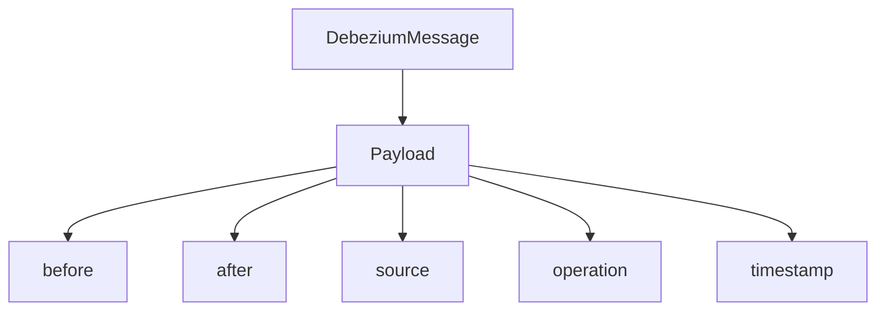
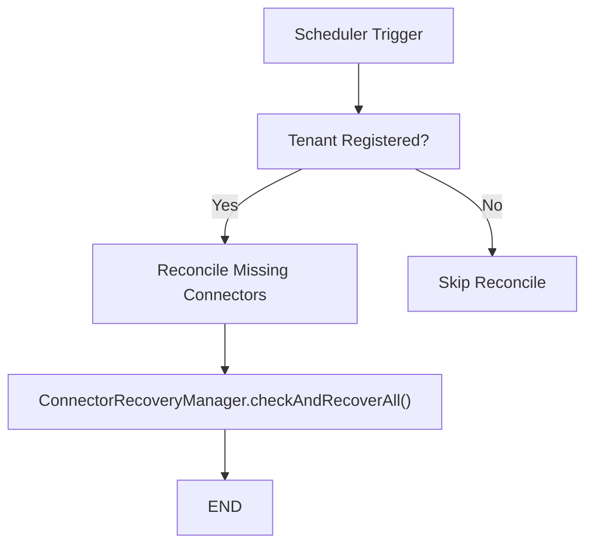

# Data Kafka And Debezium

The **Data Kafka And Debezium** module provides the foundational messaging and change-data-capture (CDC) infrastructure for the OpenFrame platform. It standardizes how services publish and consume events via Kafka and how database changes are streamed through Debezium connectors.

This module acts as the bridge between:

- Domain data stored in MongoDB (see Data Mongo modules)
- Event-driven services such as [Stream Service Core](../stream-service-core/stream-service-core.md)
- Management and integration logic (e.g., Integrated Tools)
- Kafka Connect / Debezium infrastructure

It encapsulates:

- Kafka cluster configuration and tenant-aware setup
- Topic auto-creation and producer/consumer factories
- Debezium message model
- Connector initialization and health monitoring
- Recovery and recreation throttling mechanisms

---

## Architectural Overview

At a high level, Data Kafka And Debezium provides two main capabilities:

1. **Kafka Infrastructure Layer** – Producer, consumer, admin, and topic configuration.
2. **Debezium Connector Lifecycle Layer** – Connector bootstrap, reconciliation, health checks, and controlled recovery.



---

# Kafka Infrastructure

The Kafka portion of the module replaces Spring Boot’s default auto-configuration with a controlled, tenant-aware configuration model.

## 1. Custom Kafka Enablement

### `OssKafkaConfig`

- Enables Kafka support via `@EnableKafka`
- Explicitly excludes Spring’s `KafkaAutoConfiguration`
- Ensures that only OpenFrame’s OSS-specific configuration is used

This prevents accidental conflicts between default and tenant-scoped Kafka setups.

---

## 2. Tenant-Aware Kafka Properties

### `OssTenantKafkaProperties`

Configuration prefix:

```text
spring.oss-tenant
```

Encapsulates:

- `enabled` flag (default: true)
- Full `KafkaProperties` tree (producer, consumer, listener, admin, template)

This allows complete reuse of Spring Kafka’s configuration model while isolating it under a tenant-scoped namespace.

---

## 3. Topic Management

### `KafkaTopicProperties`

Configuration prefix:

```text
openframe.oss-tenant.kafka.topics
```

Supports:

- `autoCreate` flag
- Named inbound topics
- Partition count
- Replication factor

Example logical structure:

```text
openframe:
  oss-tenant:
    kafka:
      topics:
        inbound:
          device-events:
            name: device.events
            partitions: 3
            replicationFactor: 2
```

Topics are registered as `NewTopic` beans when Kafka admin is enabled.

---

## 4. Auto-Configuration: `OssTenantKafkaAutoConfiguration`

Activated when:

- `spring.oss-tenant.kafka.enabled=true`

Creates the following beans:

- `ProducerFactory<String, Object>`
- `KafkaTemplate<String, Object>`
- `ConsumerFactory<Object, Object>`
- `ConcurrentKafkaListenerContainerFactory`
- `KafkaAdmin`
- `OssTenantKafkaProducer`

### Producer Configuration

- Key serializer: `StringSerializer`
- Value serializer: `JsonSerializer`

### Consumer Configuration

- Key deserializer: `StringDeserializer`
- Value deserializer: `JsonDeserializer`
- Default `AckMode`: `RECORD`

This ensures:

- JSON-native event transport
- Safe record-level acknowledgment
- Configurable concurrency and polling behavior

---

## 5. Message Headers

### `KafkaHeader`

Defines standard header keys:

```text
message-type
```

This enables event-type-based routing and polymorphic handling in consumers.

---

## 6. Producer Recovery

### `KafkaRecoveryHandlerImpl`

Implements structured logging for failed Kafka publish attempts.

Responsibilities:

- Logs topic, key, exception class, and message
- Includes stack trace
- Emits structured logs suitable for observability tooling

This does not automatically requeue messages but provides operational visibility for failures.

---

# Debezium Integration

The Debezium layer ensures that MongoDB or external database changes are streamed into Kafka topics reliably and automatically.

---

## 1. Debezium Message Model

### `DebeziumMessage<T>`

Represents a generic Debezium envelope:



Key fields:

- `before` – entity state before change
- `after` – entity state after change
- `operation` – `c`, `u`, `d`, etc.
- `source` – connector metadata
- `ts_ms` – event timestamp

This model allows typed deserialization of CDC events across services such as [Stream Service Core](../stream-service-core/stream-service-core.md).

---

## 2. Connector Initialization

### `DebeziumConnectorInitializer`

Triggered on `ApplicationReadyEvent` when:

```text
openframe.debezium.health-check.enabled=true
```

Responsibilities:

1. Verify a tenant is registered
2. Query existing connectors
3. If none exist:
   - Load `IntegratedTool` definitions
   - Extract connector specs
   - Create connectors via `DebeziumService`

This ensures connectors are provisioned automatically for new tenants.

---

## 3. Connector Naming Strategy

### `IdentityConnectorNameStrategy`

Default behavior:

- Connector name equals base name
- No version suffixing
- No renaming logic

This preserves backward compatibility in tenant clusters.

---

## 4. Health Monitoring and Recovery

### `DebeziumHealthCheckScheduler`

Scheduled task with distributed locking (ShedLock).

Flow:



Features:

- Detects missing connectors
- Reconciles expected vs actual connectors
- Triggers automatic recovery
- Prevents duplicate creation during transient outages

---

## 5. Connector Status Model

### `ConnectorStatus`

Represents Kafka Connect REST status response.

Provides helpers:

- `hasFailures()`
- `getFailedTasks()`
- `getFailureTraces()`
- `getFirstFailureTrace()`

Enables fine-grained health reporting and recovery decisions.

---

## 6. Controlled Recreation (Rate Limiting)

### `MongoRecreationTracker`

Prevents runaway connector recreation.

Key properties:

```text
openframe.debezium.recovery.recreation.enabled=true
openframe.debezium.recovery.max-recreations-per-hour=1
```

Mechanism:

- Records recreation events in MongoDB
- Counts events within a rolling 1-hour window
- Denies recreation if threshold exceeded
- Cleans up stale entries automatically

This protects the platform from infinite recovery loops during systemic failures.

---

## 7. Connector Spec Utilities

### `ConnectorSpecs`

Utility helpers for:

- Casting raw `Object[]` connector specs
- Extracting `name` and `config`
- Building valid Kafka Connect payloads

Ensures:

- Consistent connector creation format
- Centralized null-handling
- Reduced boilerplate

---

## 8. Observability

### `DebeziumLog`

Defines a stable log prefix:

```text
[DEBEZIUM]
```

Used by:

- Grafana / Loki alert rules
- LogQL queries
- Operational dashboards

Changing this constant impacts alerting rules.

---

# How This Module Fits in the Platform

Data Kafka And Debezium is a foundational infrastructure module used by:

- [Stream Service Core](../stream-service-core/stream-service-core.md) for event processing
- [Management Service Core](../management-service-core/management-service-core.md) for connector initialization and tool integration
- [Data Mongo Domain And Repositories](../data-mongo-domain-and-repositories/data-mongo-domain-and-repositories.md) as CDC source

It ensures that:

- All platform services communicate via a consistent Kafka abstraction
- Database changes are streamed reliably
- Connectors are self-healing and tenant-aware
- Recovery is safe and rate-limited

---

# Summary

The **Data Kafka And Debezium** module provides:

- A controlled, tenant-scoped Kafka configuration
- Auto-created topics and listener factories
- Typed Debezium CDC envelope modeling
- Automatic connector provisioning
- Health monitoring with distributed locking
- Safe, Mongo-backed recreation throttling

It is a critical infrastructure layer that enables OpenFrame’s event-driven architecture and multi-tenant CDC pipeline to operate reliably at scale.