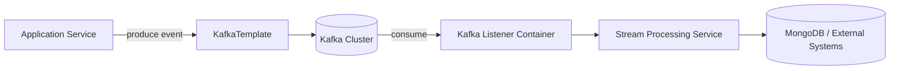
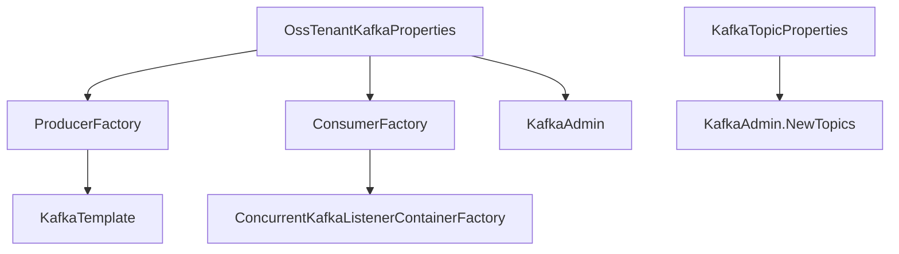
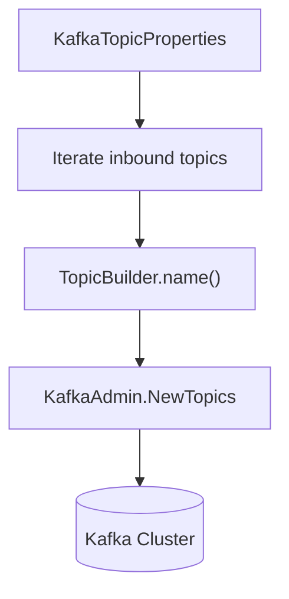
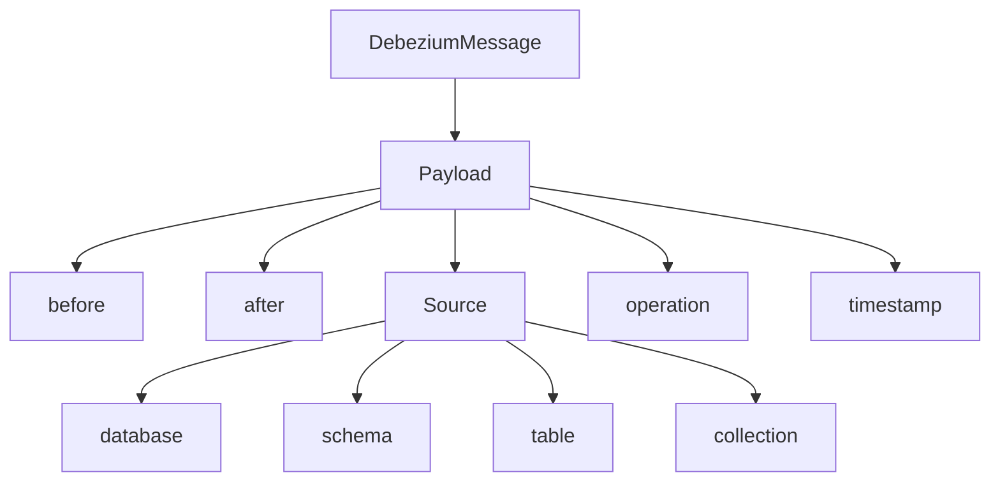
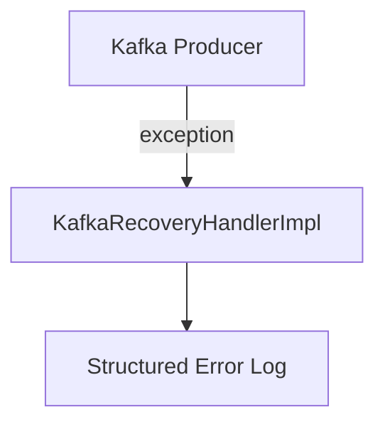
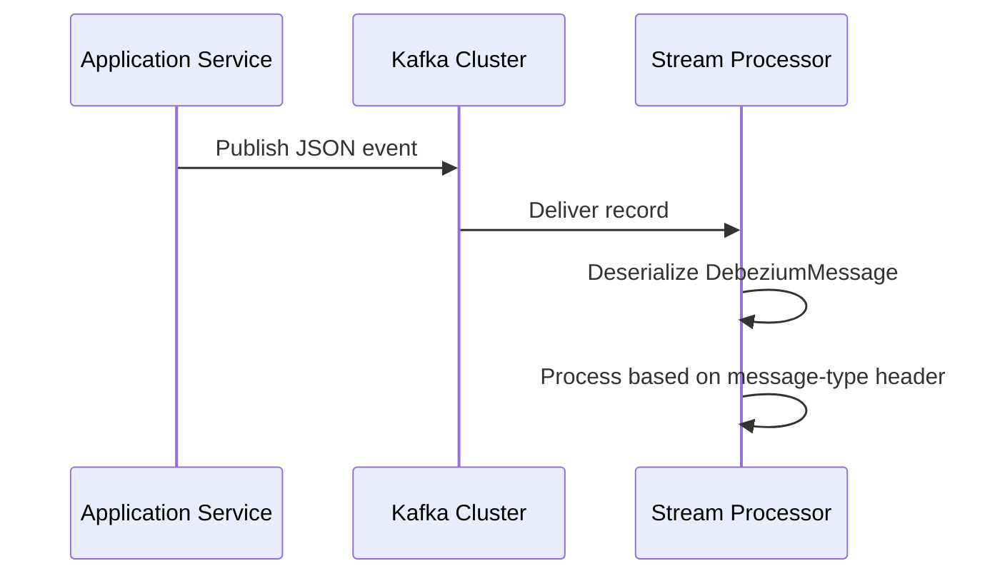

# Data Kafka Core

## Overview

The **Data Kafka Core** module provides the foundational Kafka infrastructure for the OpenFrame OSS tenant platform. It encapsulates:

- Multi-tenant Kafka configuration
- Producer and consumer factories
- Topic auto-creation and management
- Standardized message headers
- Debezium CDC message modeling
- Recovery handling for producer failures

This module acts as the **Kafka infrastructure backbone** used by stream processing, management, and other event-driven services across the platform.

It is intentionally infrastructure-focused and does not contain domain business logic. Instead, it standardizes how services connect to and interact with Kafka clusters.

---

## Architectural Role in the Platform

Within the broader OpenFrame architecture, Data Kafka Core:

- Provides a dedicated OSS tenant Kafka cluster configuration
- Supplies reusable producer and consumer beans
- Standardizes topic provisioning
- Defines common message formats (e.g., Debezium CDC events)
- Enables consistent retry and recovery behavior

### High-Level Event Flow



The Data Kafka Core module provides:

- `KafkaTemplate`
- `ProducerFactory`
- `ConsumerFactory`
- `ConcurrentKafkaListenerContainerFactory`
- `KafkaAdmin` and topic registration

---

## Module Structure

The module is organized into the following functional areas:

1. Configuration
2. Topic Management
3. Messaging Model
4. Headers and Metadata
5. Producer Recovery Handling

---

# 1. Configuration Layer

The configuration layer replaces default Spring Kafka auto-configuration with OSS tenant-specific configuration.

## OssKafkaConfig

Disables the default `KafkaAutoConfiguration` and enables manual Kafka configuration.

Responsibilities:

- Enables `@EnableKafka`
- Excludes default Spring Boot Kafka auto-configuration
- Ensures all Kafka setup flows through OSS-specific configuration

---

## OssTenantKafkaProperties

Binds to the configuration prefix:

```text
spring.oss-tenant
```

Key responsibilities:

- Enables or disables the OSS Kafka cluster
- Wraps Spring's `KafkaProperties`
- Allows full control over producer, consumer, listener, and admin configuration

This design ensures full compatibility with Spring Boot Kafka configuration while isolating it under the OSS tenant namespace.

---

## OssTenantKafkaAutoConfiguration

This is the core infrastructure class of the module.

It conditionally activates when:

```text
spring.oss-tenant.kafka.enabled=true
```

### Beans Provided



### Producer Configuration

- Key serializer: `StringSerializer`
- Value serializer: `JsonSerializer`
- Fully driven by `KafkaProperties`

### Consumer Configuration

- Key deserializer: `StringDeserializer`
- Value deserializer: `JsonDeserializer`
- Configurable concurrency
- Configurable acknowledgment mode
- Configurable poll timeout and idle intervals

Default acknowledgment mode fallback:

```text
ContainerProperties.AckMode.RECORD
```

This ensures safe record-level processing when not explicitly configured.

---

# 2. Topic Management

## KafkaTopicProperties

Configuration prefix:

```text
openframe.oss-tenant.kafka.topics
```

Supports:

- Automatic topic creation
- Inbound topic definitions
- Partition count
- Replication factor

Example conceptual structure:

```text
openframe.oss-tenant.kafka.topics:
  autoCreate: true
  inbound:
    device-events:
      name: device.events
      partitions: 3
      replicationFactor: 2
```

If admin is enabled, topics are automatically registered using `TopicBuilder`.

### Topic Creation Flow



This allows infrastructure-as-configuration for Kafka topic provisioning.

---

# 3. Messaging Model

## DebeziumMessage<T>

The `DebeziumMessage` class models Change Data Capture (CDC) events emitted by Debezium connectors.

Structure:



### Key Fields

- `before`: Entity state before change
- `after`: Entity state after change
- `operation`: CDC operation type (create, update, delete)
- `timestamp`: Event time
- `source`: Metadata about connector and origin

This model enables:

- Strongly typed CDC processing
- Integration with stream processing services
- Cross-database compatibility (MongoDB, relational DB, etc.)

---

# 4. Headers and Metadata

## KafkaHeader

Defines standardized header names used across services.

Current header:

```text
message-type
```

This header enables:

- Event routing
- Conditional handling
- Polymorphic message processing

By centralizing header constants, the module ensures consistency across all Kafka producers and consumers.

---

# 5. Producer Recovery Handling

## KafkaRecoveryHandlerImpl

Implements `KafkaRecoveryHandler`.

Purpose:

- Acts as a fallback mechanism when producer retries fail
- Logs structured error information
- Captures topic, key, payload, and exception details

### Recovery Flow



The handler logs:

- Topic name
- Message key
- Error class
- Error message
- Payload summary
- Full stack trace

This ensures observability and operational traceability for failed Kafka publish attempts.

---

# Design Principles

## 1. Tenant Isolation

All configuration is namespaced under:

```text
spring.oss-tenant
```

This guarantees that Kafka infrastructure can be isolated per tenant cluster.

---

## 2. Explicit Infrastructure Ownership

The module disables default Spring Kafka auto-configuration and provides its own controlled configuration.

This ensures:

- Predictable behavior
- Centralized configuration
- Reduced configuration drift

---

## 3. Configuration-Driven Infrastructure

Topics and cluster behavior are defined via properties rather than hardcoded definitions.

This allows:

- Environment-based tuning
- Declarative topic provisioning
- Reduced operational friction

---

## 4. CDC-First Event Modeling

By modeling Debezium events explicitly, the platform supports:

- Database change propagation
- Event sourcing patterns
- Real-time stream enrichment

---

# End-to-End Interaction Example



This illustrates how Data Kafka Core enables event-driven communication across services.

---

# Summary

The **Data Kafka Core** module is the standardized Kafka infrastructure layer for the OpenFrame OSS platform.

It provides:

- Controlled Kafka auto-configuration
- Multi-tenant Kafka property binding
- Producer and consumer factories
- Topic auto-creation
- CDC message modeling
- Structured producer recovery handling

By isolating Kafka infrastructure concerns into a dedicated module, the platform ensures consistency, scalability, and maintainability across all event-driven services.