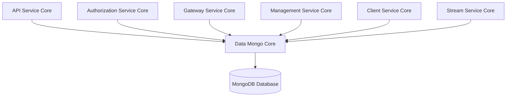
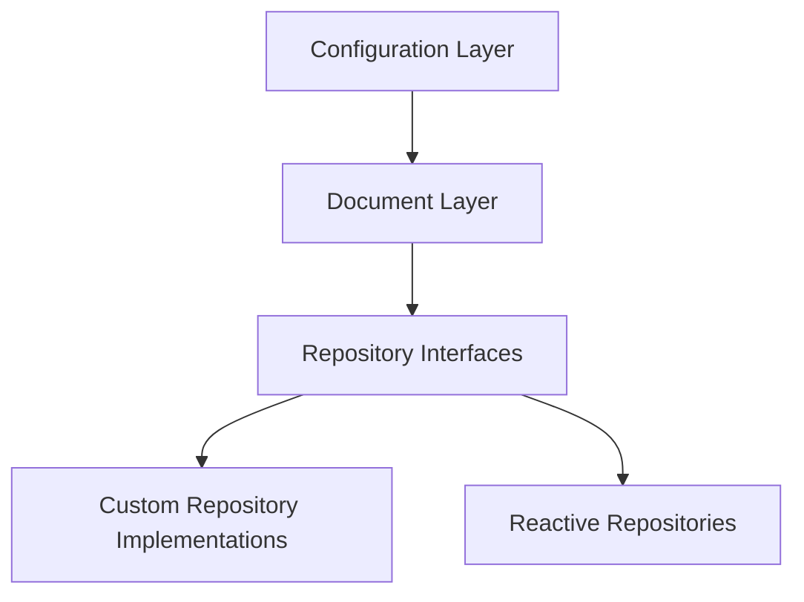
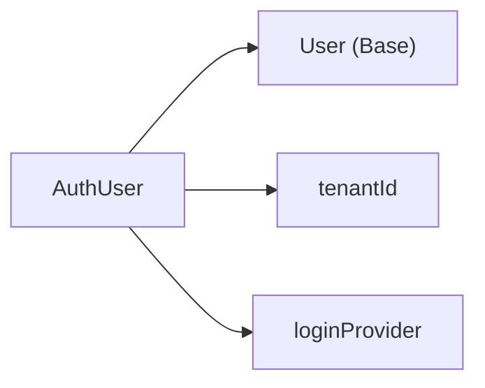
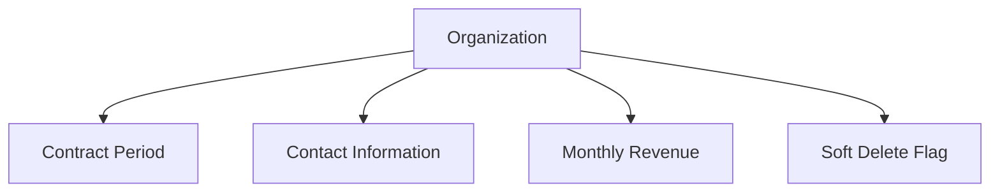
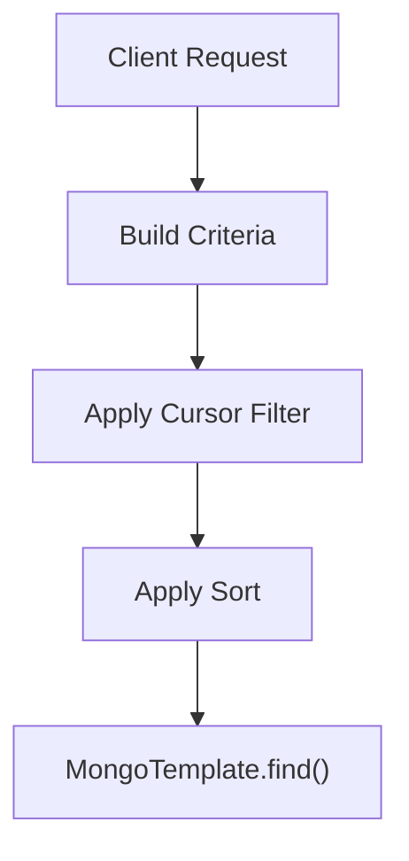
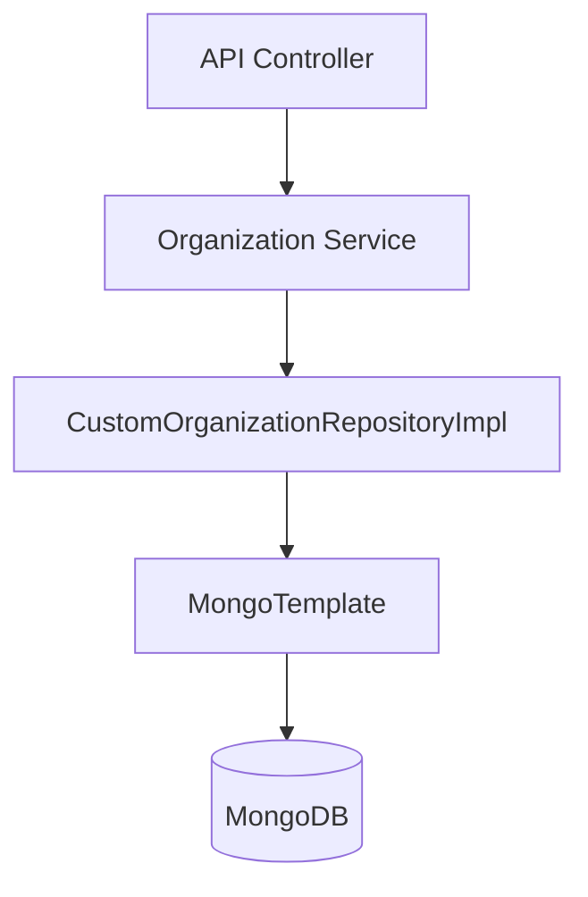

# Data Mongo Core

## Overview

**Data Mongo Core** is the persistence foundation of the OpenFrame platform. It provides:

- MongoDB configuration (blocking and reactive)
- Core document models (users, organizations, devices, events, OAuth, tools, tenants)
- Repository abstractions (blocking and reactive)
- Custom query implementations with filtering, cursor pagination, and sorting
- Index configuration for performance optimization

This module is shared across multiple services, including API, Authorization, Gateway, Management, Client, and Stream services. It acts as the canonical MongoDB data layer for the platform.

---

## Architectural Role in the Platform

Data Mongo Core sits at the bottom of the service stack and provides a consistent data access layer.

### Responsibilities

1. Define MongoDB document schemas
2. Expose repository contracts (blocking + reactive)
3. Implement advanced filtering and cursor-based pagination
4. Configure auditing and indexing
5. Support multi-tenant and OAuth use cases

---

## Module Structure

Data Mongo Core is logically divided into five layers:

---

# 1. Configuration Layer

## MongoConfig

Enables Mongo repositories conditionally:

- `@EnableMongoRepositories` for blocking repositories
- `@EnableReactiveMongoRepositories` for reactive repositories
- `@EnableMongoAuditing` for auditing fields
- Custom `MappingMongoConverter`

### Key Behavior

- Replaces dots in map keys using `__dot__`
- Supports custom conversions
- Activates only when `spring.data.mongodb.enabled=true`
- Enables reactive repositories only in reactive web applications

## MongoIndexConfig

Creates optimized indexes at startup.

### Indexes Created

Collection: `application_events`

- Compound index on `userId ASC, timestamp DESC`
- Compound index on `type ASC, metadata.tags ASC`

This improves performance for:

- User-based event history queries
- Event filtering by type and tags

---

# 2. Document Layer

This layer defines MongoDB collections and domain entities.

## Authentication & Users

### AuthUser

Extends base `User` document.

Key features:

- Multi-tenant unique constraint on `(tenantId, email)`
- Supports multiple login providers (LOCAL, GOOGLE, etc.)
- Stores password hash and external provider ID
- Tracks `lastLogin`

---

## Devices

### Device

Collection: `devices`

Represents managed endpoints in the platform.

Fields include:

- `machineId`
- `serialNumber`
- `model`
- `osVersion`
- `status`
- `type`
- `lastCheckin`
- `configuration`
- `health`

Used heavily by API, Client, and Management services.

---

## Events

### CoreEvent

Collection: `events`

Represents system or business events.

Fields:

- `type`
- `payload`
- `timestamp`
- `userId`
- `status` (CREATED, PROCESSING, COMPLETED, FAILED)

Event documents are processed by stream and analytics services.

---

## OAuth & Security

### MongoRegisteredClient

Collection: `oauth_registered_clients`

Stores OAuth client registrations:

- `clientId` (unique)
- `clientSecret`
- grant types
- redirect URIs
- scopes
- token TTL configuration
- PKCE and consent flags

### OAuthToken

Collection: `oauth_tokens`

Stores issued tokens:

- `accessToken`
- `refreshToken`
- expiry timestamps
- `clientId`
- `userId`

These documents power the Authorization Server.

---

## Organizations

### Organization

Collection: `organizations`

Represents a company or tenant organization.

Key features:

- Unique `organizationId`
- Soft delete (`deleted`, `deletedAt`)
- Contract lifecycle (`contractStartDate`, `contractEndDate`)
- Auditing (`createdAt`, `updatedAt`)
- Active contract check method

---

## Tenant SSO Configuration

### SSOPerTenantConfig

Extends base SSO configuration and links it to a specific tenant.

Features:

- Unique `tenantId`
- Created and updated timestamps
- Supports per-tenant identity provider configuration

---

## Tags

### Tag

Collection: `tags`

Used to categorize tools and resources.

- Unique `name`
- Optional `color`
- Scoped to `organizationId`

---

# 3. Repository Layer

This layer defines both blocking and reactive repository interfaces.

## Generic Base Interfaces

These interfaces abstract storage technology and support both reactive and blocking styles:

- `BaseUserRepository`
- `BaseApiKeyRepository`
- `BaseTenantRepository`
- `BaseIntegratedToolRepository`

They use generic wrappers:

- Blocking → `Optional`, `List`, `boolean`
- Reactive → `Mono`, `Flux`

This design ensures portability and consistency across services.

---

## Reactive Repositories

### ReactiveUserRepository

- Extends `ReactiveMongoRepository`
- Implements `BaseUserRepository`
- Supports `findByEmail` and existence checks
- Enabled only in reactive applications

### ReactiveOAuthClientRepository

- Reactive access to OAuth clients
- Query by `clientId`

---

## Blocking Repositories

Examples:

- `OAuthTokenRepository`
- `ExternalApplicationEventRepository`

Provide standard CRUD plus custom query methods.

---

# 4. Custom Repository Implementations

These classes use `MongoTemplate` to implement complex filtering and cursor pagination.

## Common Features

- Dynamic query construction using `Criteria`
- Search via regex (case-insensitive)
- Cursor-based pagination using `_id`
- Multi-field sorting
- Field whitelisting for safe sorting

---

## CustomMachineRepositoryImpl

- Filters by status, device type, OS type, organization
- Applies text search across hostname, displayName, IP, serialNumber, etc.
- Supports cursor-based pagination

---

## CustomEventRepositoryImpl

- Filters by userIds, event types
- Date range filtering (UTC normalized)
- Search by type and data
- Cursor pagination with direction-aware comparison
- Distinct queries for user IDs and event types

---

## CustomOrganizationRepositoryImpl

- Always excludes soft-deleted organizations
- Filters by:
  - Category
  - Employee range
  - Contract status
- Search by name, organizationId, category
- Cursor-based pagination

---

## CustomIntegratedToolRepositoryImpl

- Filters by enabled, type, category, platformCategory
- Text search on name and description
- Distinct queries for:
  - Types
  - Categories
  - Platform categories

---

# 5. Multi-Tenant & Security Considerations

Data Mongo Core supports:

- Tenant-scoped users (`AuthUser.tenantId`)
- Unique domain-based tenant resolution
- Per-tenant SSO configuration
- OAuth client registration and token persistence
- Soft delete for organizations

These capabilities are critical for:

- Multi-tenant SaaS deployments
- Secure isolation between organizations
- External identity provider integration

---

# 6. Data Flow Example

Example: Fetch filtered organizations with cursor pagination.

Steps:

1. Controller receives filter + search + cursor
2. Repository builds `Query` with `Criteria`
3. Applies cursor-based `_id` comparison
4. Applies sort and limit
5. Executes query using `MongoTemplate`

---

# 7. Design Principles

### 1. Separation of Concerns

- Documents define structure
- Repositories define access contracts
- Custom implementations handle advanced querying

### 2. Reactive + Blocking Support

Supports both WebMVC and WebFlux stacks.

### 3. Performance-First Querying

- Database-level filtering
- Cursor pagination over offset pagination
- Strategic compound indexes

### 4. Multi-Tenant Ready

- Tenant-aware uniqueness
- Scoped SSO configuration
- Organization-level isolation

---

# Conclusion

**Data Mongo Core** is the foundational MongoDB persistence layer for the OpenFrame ecosystem. It provides:

- Strong domain modeling
- High-performance querying
- Multi-tenant support
- OAuth and security persistence
- Reactive and blocking repository support

All higher-level services depend on this module to interact with MongoDB in a consistent, secure, and scalable way.