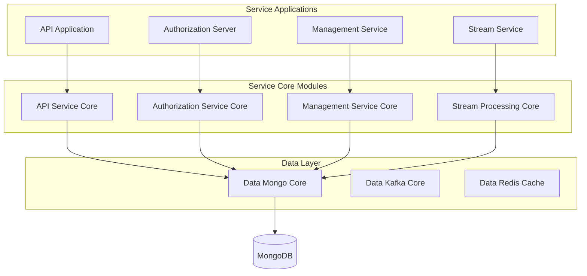
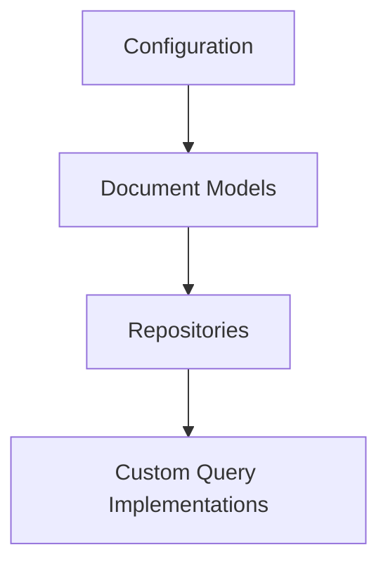
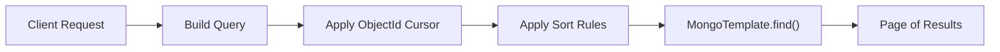
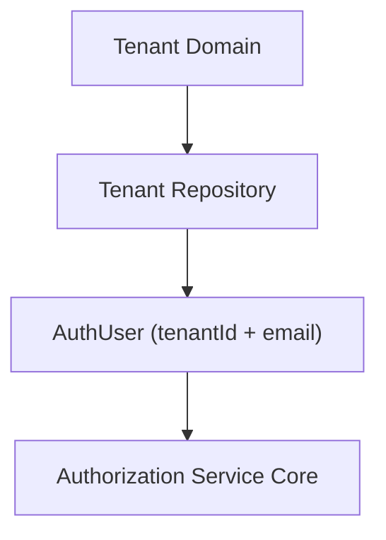

# Data Mongo Core

## Overview

**Data Mongo Core** is the foundational persistence module for the OpenFrame platform. It provides:

- MongoDB configuration (blocking and reactive)
- Document models for core domains (users, organizations, devices, events, OAuth, tools, tenants)
- Custom query repositories with filtering, cursor pagination, and search
- Multi-tenant and security-aware data structures
- Index management and performance optimization

This module is consumed by higher-level modules such as API Service Core, Authorization Service Core, Management Service Core, Gateway Service Core, and Stream Processing Core.

---

## Architectural Role in the Platform

Data Mongo Core sits at the bottom of the service stack and acts as the persistence abstraction layer for MongoDB.



### Responsibilities

- Define MongoDB collections and document mappings
- Provide repository interfaces (blocking + reactive)
- Implement advanced filtering and cursor-based pagination
- Enforce multi-tenant uniqueness and domain constraints
- Configure indexes and Mongo converters

---

## Module Structure

Data Mongo Core is organized into four main layers:



1. **Configuration**
   - `MongoConfig`
   - `MongoIndexConfig`

2. **Document Models**
   - AuthUser, User
   - Organization
   - Device
   - CoreEvent
   - OAuthToken, MongoRegisteredClient
   - Tag, ToolAgentAsset
   - SSOPerTenantConfig

3. **Repositories**
   - Blocking repositories (MongoRepository)
   - Reactive repositories (ReactiveMongoRepository)
   - Base repository contracts

4. **Custom Implementations**
   - Organization filtering
   - Event filtering and cursor pagination
   - Machine/device search and pagination
   - Integrated tool filtering

---

## Configuration Layer

### MongoConfig

Enables both blocking and reactive Mongo repositories depending on application type and properties.

Key behaviors:

- `@EnableMongoRepositories` for blocking repositories
- `@EnableReactiveMongoRepositories` for reactive stacks
- Custom `MappingMongoConverter`
- Replaces dots in map keys with `__dot__`
- Enables Mongo auditing

This allows services to operate in:
- Traditional MVC mode (blocking)
- WebFlux mode (reactive)

### MongoIndexConfig

Programmatically ensures indexes at startup.

Indexes created for `application_events`:

- `(userId ASC, timestamp DESC)`
- `(type ASC, metadata.tags ASC)`

This guarantees efficient querying for time-based and tag-based lookups.

---

## Core Document Models

### User and AuthUser

`User` is the base user document stored in `users` collection.

Key fields:
- email (normalized to lowercase)
- roles
- status
- emailVerified
- auditing timestamps

`AuthUser` extends `User` and adds multi-tenant and authentication-specific fields:

- tenantId (indexed)
- passwordHash
- loginProvider (LOCAL, GOOGLE, etc.)
- externalUserId
- lastLogin

Compound uniqueness constraint:

```text
{ tenantId: 1, email: 1 } (unique, partial if tenantId exists)
```

Used heavily by Authorization Service Core.

---

### Organization

Collection: `organizations`

Represents a business entity within the platform.

Features:

- Unique immutable `organizationId`
- Soft delete via `deleted` flag
- Contract lifecycle support
- Auditing via `@CreatedDate` and `@LastModifiedDate`

Business logic embedded:

- `isContractActive()`
- `isDeleted()`

Used by API Service Core and Management Service Core.

---

### Device

Collection: `devices`

Represents managed endpoints.

Fields include:

- machineId linkage
- serialNumber
- model
- osVersion
- status (ACTIVE, OFFLINE, MAINTENANCE)
- type (DESKTOP, SERVER, etc.)
- lastCheckin
- configuration and health

Queried via custom repository implementations for filtering and search.

---

### CoreEvent

Collection: `events`

Represents system or user activity events.

Fields:

- type
- payload
- timestamp
- userId
- status (CREATED, PROCESSING, COMPLETED, FAILED)

Used by Stream Processing Core and API Service Core.

---

### OAuth Domain

#### MongoRegisteredClient
Collection: `oauth_registered_clients`

Stores OAuth2 client configuration:

- clientId (unique)
- clientSecret
- grantTypes
- redirectUris
- scopes
- PKCE and consent flags
- token TTL configuration

#### OAuthToken
Collection: `oauth_tokens`

Stores:

- accessToken
- refreshToken
- expiry timestamps
- clientId
- scopes

Used by Authorization Service Core.

---

### Tenant and SSO

`SSOPerTenantConfig` extends a base SSO configuration and binds it to a specific tenant.

Features:

- Unique indexed tenantId
- Auditing timestamps
- Supports per-tenant SSO configuration

This enables domain-based multi-tenant authentication.

---

### Tools and Tags

#### Tag
Collection: `tags`

- Unique tag name
- Scoped to organization
- Color and metadata

#### ToolAgentAsset

Embedded-style structure representing:

- Versioned tool artifacts
- Download configuration
- Executable flags
- Source metadata

Used by Management Service Core and Client Service Core.

---

## Repository Layer

Data Mongo Core defines both generic and domain-specific repository contracts.

### Base Repository Contracts

Technology-agnostic interfaces:

- `BaseUserRepository<T, B, ID>`
- `BaseTenantRepository<T, B, ID>`
- `BaseIntegratedToolRepository<T, B, ID>`

These allow:

- Blocking implementations using `Optional`
- Reactive implementations using `Mono`

This abstraction keeps upper layers independent from blocking vs reactive details.

---

### Reactive Repositories

Examples:

- `ReactiveUserRepository`
- `ReactiveOAuthClientRepository`

Used when applications run in WebFlux mode.

Return types:

- `Mono<User>`
- `Mono<Boolean>`

---

### Blocking Repositories

Examples:

- `OAuthTokenRepository`
- `ExternalApplicationEventRepository`

Used in MVC-based services.

---

## Custom Repository Implementations

Advanced filtering and cursor pagination are implemented using `MongoTemplate`.

### Cursor-Based Pagination Pattern



Pattern characteristics:

- Uses `_id` as stable cursor
- Supports ASC and DESC
- Validates sortable fields
- Adds secondary `_id` sort for deterministic ordering

Implemented in:

- `CustomMachineRepositoryImpl`
- `CustomEventRepositoryImpl`
- `CustomOrganizationRepositoryImpl`

---

### Organization Filtering

Supports:

- Category filter
- Employee range
- Active contract detection
- Soft delete exclusion
- Full-text regex search

All filtering is executed at database level for performance.

---

### Event Filtering

Supports:

- User-based filtering
- Event type filtering
- Date range filtering
- Regex search
- Distinct value extraction

Provides helper methods for:

- `findDistinctUserIds()`
- `findDistinctEventTypes()`

---

### Integrated Tool Filtering

Supports:

- Enabled state
- Type
- Category
- Platform category
- Search on name/description
- Distinct category/type extraction

---

## Multi-Tenancy Strategy

Data Mongo Core enables multi-tenancy through:

1. Tenant-bound documents (e.g., AuthUser, SSOPerTenantConfig)
2. Compound unique indexes (tenantId + email)
3. Domain-based lookup in tenant repositories



This ensures strict isolation while keeping Mongo collections shared.

---

## Performance Considerations

- Explicit compound indexes for high-cardinality queries
- Cursor-based pagination instead of offset pagination
- Database-level filtering using `Criteria`
- Controlled sortable field lists to prevent injection
- Soft delete instead of physical delete for organizations

---

## How Other Modules Use Data Mongo Core

- **API Service Core** → Queries devices, events, organizations, tools, users
- **Authorization Service Core** → Manages AuthUser, OAuth clients, tokens
- **Management Service Core** → Manages integrated tools, tags, assets
- **Stream Processing Core** → Writes and reads events
- **Gateway Service Core** → Reads authentication-related data indirectly via services

Data Mongo Core does not contain business logic orchestration — it provides the persistence backbone upon which all service logic is built.

---

## Summary

Data Mongo Core is the MongoDB persistence foundation of the OpenFrame platform.

It provides:

- Configurable blocking and reactive Mongo integration
- Rich domain document models
- Multi-tenant aware schemas
- Custom filtering and cursor pagination
- Performance-optimized indexing

It is intentionally infrastructure-focused and reusable across all OpenFrame services, ensuring consistent, scalable, and secure data access patterns across the entire platform.
