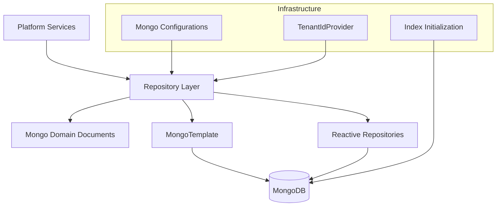
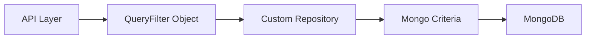
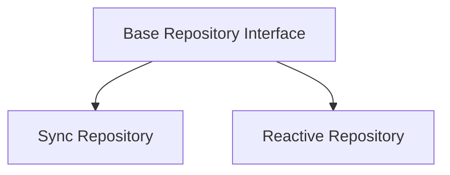
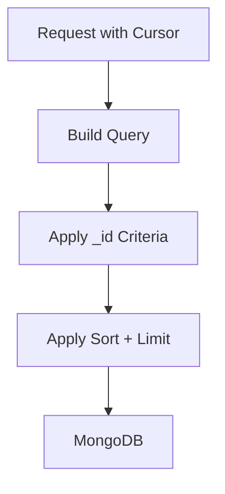
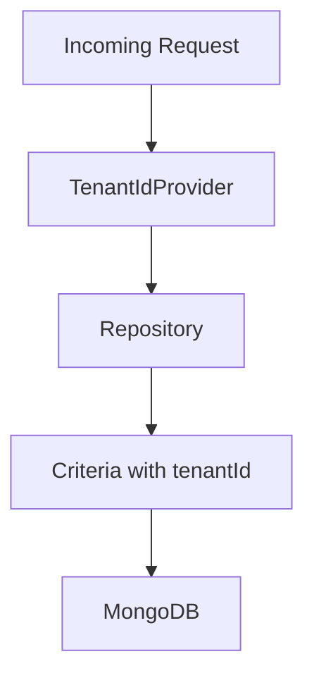
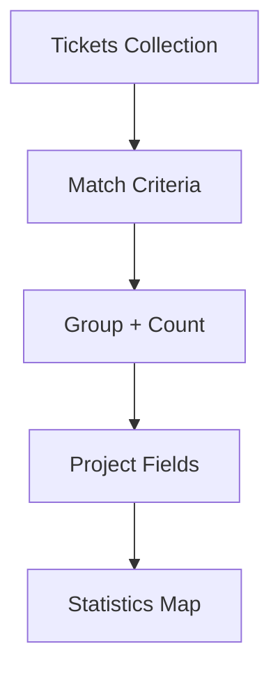

# Data Mongo Domain And Repositories

The **Data Mongo Domain And Repositories** module defines the MongoDB-based domain model, multi-tenant data access layer, and repository infrastructure used across the OpenFrame platform.

It provides:

- Core domain documents (Users, Organizations, Devices, Tickets, Events, Notifications, OAuth, Tags, Tools)
- Query filter objects for dynamic MongoDB queries
- Base repository contracts (technology-agnostic)
- Reactive and synchronous MongoDB repository implementations
- Custom MongoTemplate-based repositories with cursor pagination and advanced filtering
- Multi-tenant infrastructure and tenant-aware configuration
- Index, conversion, and auditing configuration

This module acts as the **persistence backbone** for API services, authorization server, management services, stream processing, and gateway components.

---

## 1. Architectural Overview

The module is organized into three major layers:

1. **Domain Layer (Documents)** – MongoDB @Document entities
2. **Repository Layer** – Spring Data + custom repository implementations
3. **Infrastructure & Configuration Layer** – Mongo configuration, indexing, tenant isolation, converters



The module supports:

- **Tenant-scoped collections** via `TenantScoped`
- **Reactive repositories** for WebFlux-based services
- **Synchronous repositories** for blocking services
- **Custom MongoTemplate repositories** for advanced queries
- **Cursor-based pagination** using `_id` and compound sorting

---

# 2. Domain Model (Mongo Documents)

All domain entities reside in `openframe-data-mongo-common` and are annotated with `@Document`.

Most entities implement `TenantScoped`, enforcing multi-tenant isolation.

## 2.1 User & Authentication Domain

### User

Represents a tenant-scoped user.

Key fields:
- `tenantId`
- `email` (normalized to lowercase)
- `roles`
- `emailVerified`
- `status`
- `createdAt`, `updatedAt`

### AuthUser

Extends `User` for authorization server use cases.

Additional fields:
- `passwordHash`
- `loginProvider` (LOCAL, GOOGLE, etc.)
- `externalUserId`
- `lastLogin`
- `imageUrl` (cached SSO image)

Compound unique index:

```text
{'tenantId': 1, 'email': 1}
```

Ensures per-tenant email uniqueness.

---

## 2.2 Organization Domain

### Organization

Represents a tenant-owned company entity.

Features:
- Immutable `organizationId`
- Soft lifecycle: ACTIVE, ARCHIVED, DELETED
- Contract period tracking
- Indexed fields for name and status
- Auditing timestamps

Business helpers:
- `isContractActive()`
- `isDeleted()`
- `isArchived()`

---

## 2.3 Device Domain

### Device

Represents a managed endpoint.

Core fields:
- `machineId`
- `serialNumber`
- `model`
- `osVersion`
- `status`
- `type`
- `lastCheckin`
- `configuration`
- `health`

Indexed by `tenantId`.

---

## 2.4 Ticketing Domain

### Ticket

Primary PSA entity.

Indexed combinations:
- `tenantId + ticketNumber` (unique)
- `status + order`
- `statusKind`
- `statusId + order`

Supports:
- Legacy `status`
- New lifecycle fields: `statusId`, `statusKind`
- Ownership
- Assignment
- Resolution tracking

### TicketAttachment

Metadata-only representation of externally stored files (S3/MinIO).

### TicketNote

Technician-authored notes.

Compound index:

```text
{'ticketId': 1, 'createdAt': -1}
```

### TicketStatusDefinition

Defines lifecycle states per `TicketStatusKind`.

---

## 2.5 Event Domain

### CoreEvent

Stored in `events` collection.

Fields:
- `type`
- `payload`
- `timestamp`
- `userId`
- `status`

### ExternalApplicationEvent

Used for external system integration.

Includes nested metadata:
- `source`
- `version`
- `tags`

---

## 2.6 Notification Domain

### Notification

Contains:
- `severity`
- `title`
- `description`
- `createdAt`
- `context` (polymorphic)

### NotificationReadState

Tracks per-recipient state.

Compound indexes:

```text
{'recipientId': 1, 'recipientType': 1, 'notificationId': 1}
{'recipientId': 1, 'recipientType': 1, 'status': 1}
{'recipientId': 1, 'recipientType': 1, 'category': 1, 'status': 1}
```

---

## 2.7 OAuth & SSO Domain

### MongoRegisteredClient

Tenant-scoped OAuth client registration.

Unique compound index:

```text
{'tenantId': 1, 'clientId': 1}
```

### OAuthToken

Stores access & refresh tokens.

Indexed by:
- `tenantId`
- `accessToken`
- `refreshToken`

### SSOPerTenantConfig

Extends base SSO configuration with timestamps.

---

## 2.8 Tagging & Tool Domain

### TagAssignment

Ensures uniqueness via compound index:

```text
{'tenantId': 1, 'entityId': 1, 'tagId': 1, 'entityType': 1}
```

### ToolQueryFilter

Filter object used by custom tool repository implementations.

---

# 3. Query Filter Pattern

Filter classes encapsulate query criteria:

- `UserQueryFilter`
- `TicketQueryFilter`
- `OrganizationQueryFilter`
- `EventQueryFilter`
- `ToolQueryFilter`

These filters are translated into Mongo `Criteria` inside custom repositories.



Benefits:

- Clean separation between API and persistence
- Centralized query logic
- Extensible filtering without controller duplication

---

# 4. Repository Architecture

The module provides three repository strategies.

## 4.1 Base Repository Contracts

Technology-agnostic interfaces:

- `BaseUserRepository`
- `BaseTenantRepository`
- `BaseApiKeyRepository`
- `BaseIntegratedToolRepository`

These abstract return types:

- Blocking → `Optional`, `List`, `boolean`
- Reactive → `Mono`, `Flux`



---

## 4.2 Reactive Repositories

Enabled via:

```text
@EnableReactiveMongoRepositories
```

Examples:
- `ReactiveUserRepository`
- `ReactiveTenantRepository`
- `ReactiveOAuthClientRepository`

Used in non-blocking services.

---

## 4.3 Synchronous Repositories

Enabled via:

```text
@EnableMongoRepositories
```

Used in management and blocking services.

---

## 4.4 Custom MongoTemplate Repositories

For advanced use cases:

- Cursor pagination
- Compound sorting
- Aggregations
- Bulk updates
- Dynamic search
- Distinct queries

Examples:
- `CustomTicketRepositoryImpl`
- `CustomOrganizationRepositoryImpl`
- `CustomScriptRepositoryImpl`
- `CustomNotificationRepositoryImpl`
- `CustomMachineRepositoryImpl`
- `CustomKnowledgeBaseItemRepositoryImpl`

### Cursor Pagination Pattern



Cursor logic:

- Parse cursor to `ObjectId`
- Apply `<` or `>` comparison
- Combine with sort field
- Always include `_id` as tiebreaker

---

# 5. Multi-Tenancy Model

Multi-tenancy is enforced via:

- `TenantScoped` interface
- Indexed `tenantId` field
- `DefaultTenantIdProvider`
- Tenant-aware repository configuration



Default tenant source:

```text
TENANT_ID (environment variable)
```

---

# 6. Infrastructure & Configuration

## 6.1 Mongo Infrastructure

### MongoInfraConfig

- Enables Mongo auditing
- Custom `MappingMongoConverter`
- Dot replacement for map keys

### MongoIndexConfig

Programmatically ensures:
- Compound indexes
- Drops stale legacy indexes

---

## 6.2 Notification Context Serialization

Custom Jackson + Mongo conversions:

- `NotificationContextReadConverter`
- `NotificationContextWriteConverter`
- Custom `MongoCustomConversions`
- Selective type mapping

This enables polymorphic `NotificationContext` storage without leaking internal class names.

---

# 7. Aggregation & Analytics Capabilities

Several repositories use Mongo aggregation pipelines.

Examples:

- Count tickets by status
- Count tickets by statusKind
- Average resolution time
- Group assignments by target type



---

# 8. Bulk Operations & Safety

Example: `CustomNotificationReadStateRepositoryImpl`

- Uses unordered bulk inserts
- Swallows duplicate key errors (code 11000)
- Maintains idempotency

Ensures notification fan-out does not fail on race conditions.

---

# 9. Key Design Principles

### 1. Tenant Isolation First
Every core entity includes `tenantId`.

### 2. Cursor-Based Pagination
Efficient, index-backed pagination without skip/offset.

### 3. Query Objects Instead of Controller Logic
Filters encapsulate query rules.

### 4. Dual Reactive & Blocking Support
Same domain model, multiple repository implementations.

### 5. Soft Deletion Strategy
Entities use status fields instead of physical deletion.

### 6. Explicit Index Management
Critical compound indexes defined at entity or startup time.

---

# 10. How This Module Fits the Platform

The **Data Mongo Domain And Repositories** module underpins:

- API services (GraphQL & REST)
- Authorization server (OAuth & SSO)
- Management service (initialization & scheduling)
- Stream processing (event persistence)
- Gateway service (API key & tenant lookups)

It provides a consistent, multi-tenant, MongoDB-backed persistence layer shared across all services.

---

# Conclusion

The **Data Mongo Domain And Repositories** module is the foundational persistence layer of OpenFrame.

It delivers:

- Rich Mongo domain modeling
- Tenant-aware repository abstractions
- Advanced MongoTemplate customizations
- Reactive and synchronous data access
- High-performance pagination and aggregation
- Safe bulk operations and index governance

This design ensures scalability, tenant isolation, and flexibility across the entire OpenFrame ecosystem.
