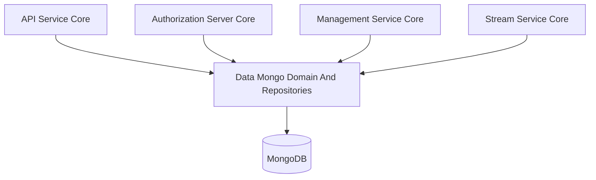
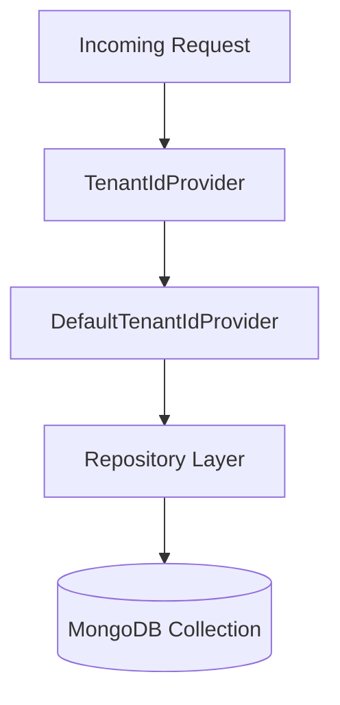
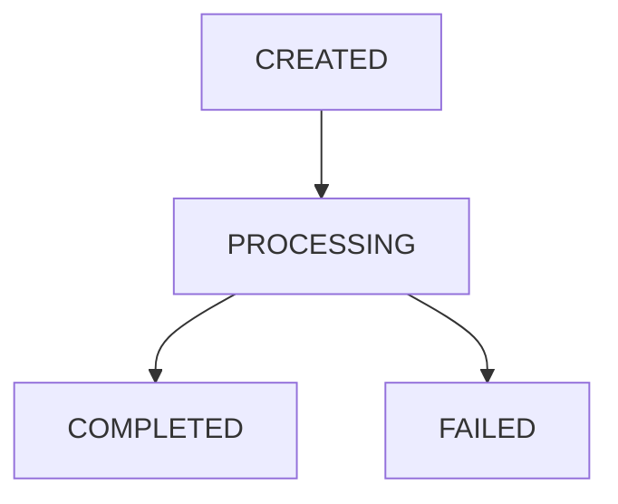
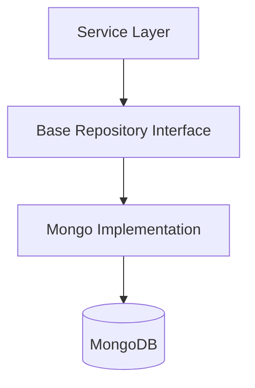
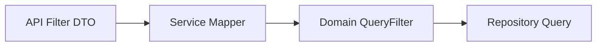

# Data Mongo Domain And Repositories

The **Data Mongo Domain And Repositories** module defines the core MongoDB-backed domain model for the OpenFrame platform. It provides:

- Tenant-scoped domain documents
- Query filter objects for dynamic repository queries
- Technology-agnostic base repository interfaces
- Default tenant resolution support

This module acts as the **persistence foundation** for higher-level modules such as API services, Authorization Server, Management, Stream processing, and Gateway layers.

---

## 1. Architectural Role in the Platform

At a high level, the Data Mongo Domain And Repositories module sits between business services and MongoDB. It defines:

- Domain documents (`@Document` classes)
- Query filter objects
- Base repository contracts
- Tenant ID resolution strategy

### High-Level Architecture

All tenant-facing services depend on this module for consistent data modeling and multi-tenant persistence.

---

## 2. Multi-Tenancy Model

Most domain entities implement the `TenantScoped` contract and contain a `tenantId` field.

### Tenant Resolution Flow

### DefaultTenantIdProvider

- Reads `TENANT_ID` from environment
- Defaults to `oss`
- Used when no custom `TenantIdProvider` bean is defined

This design allows:

- Shared cluster multi-tenancy
- Per-tenant isolation via indexed `tenantId`
- Tenant-aware custom repository implementations

---

## 3. Domain Documents

The module defines MongoDB documents grouped by business capability.

---

### 3.1 User and Authentication Domain

#### User

- Collection: `users`
- Indexed by `tenantId` and `email`
- Stores roles, status, and verification state
- Normalizes email to lowercase

#### AuthUser

- Extends `User`
- Collection-level compound uniqueness: `{ tenantId, email }`
- Adds:
  - `passwordHash`
  - `loginProvider`
  - `externalUserId`
  - `lastLogin`
  - `imageUrl`

Used primarily by the Authorization Server for authentication and SSO.

---

### 3.2 Organization Domain

#### Organization

- Collection: `organizations`
- Indexed by `tenantId`, `name`, `organizationId`
- Supports:
  - Contract lifecycle tracking
  - Revenue and employee metadata
  - Soft deletion via `status`

Includes business logic helpers:

- `isContractActive()`
- `isDeleted()`
- `isArchived()`

#### OrganizationQueryFilter

Encapsulates filter criteria:

- Category
- Employee ranges
- Active contract flag
- Status

---

### 3.3 Device Domain

#### Device

- Collection: `devices`
- Indexed by `tenantId`
- Tracks:
  - Machine metadata
  - Status (`ACTIVE`, `OFFLINE`, etc.)
  - Health
  - Configuration
  - Last check-in timestamp

This entity is consumed heavily by API and Stream modules.

---

### 3.4 Ticketing Domain

The ticketing subsystem is modeled with multiple collections.

#### Ticket

- Collection: `tickets`
- Compound uniqueness: `{ tenantId, ticketNumber }`
- Indexed by:
  - `assignedTo`
  - `organizationId`
  - `deviceId`
- Supports lifecycle via:
  - `status`
  - `statusKind`
  - `statusId`

#### TicketStatusDefinition

- Collection: `ticket_statuses`
- Unique per tenant and `kind`
- Defines:
  - Display name
  - Color
  - Position

#### TicketNote

- Collection: `ticket_notes`
- Indexed by `{ ticketId, createdAt }`
- Stores technician notes

#### TicketAttachment

- Collection: `ticket_attachments`
- Stores metadata only
- External storage (S3 / MinIO)

#### TicketQueryFilter

Encapsulates filtering logic:

- Status IDs and kinds
- Organization IDs
- Assignee IDs
- Creation source
- Date range

---

### 3.5 Event Domain

#### CoreEvent

- Collection: `events`
- Indexed by `tenantId`
- Contains:
  - `type`
  - `payload`
  - `timestamp`
  - `userId`
  - `status`

Event lifecycle:

#### EventQueryFilter

- Filter by user IDs
- Event types
- Date range

---

### 3.6 Notifications Domain

#### Notification

- Collection: `notifications`
- Contains:
  - Severity
  - Title
  - Description
  - Context
  - Created timestamp

#### NotificationReadState

- Collection: `notification_read_states`
- Compound indexes ensure:
  - Unique `(recipientId, recipientType, notificationId)`
  - Efficient unread queries

This enables scalable per-user notification tracking.

---

### 3.7 OAuth and Client Registration

#### MongoRegisteredClient

- Collection: `oauth_registered_clients`
- Unique per `(tenantId, clientId)`
- Stores:
  - Grant types
  - Redirect URIs
  - Scopes
  - Token TTL configuration

#### OAuthToken

- Collection: `oauth_tokens`
- Indexed by `tenantId`
- Stores:
  - Access and refresh tokens
  - Expiry timestamps
  - Client association

These entities support the Authorization Server module.

---

### 3.8 Feature Flags

#### FeFeatureFlags

- Collection: `fe_feature_flags`
- `_id` = `clusterId`
- Stores key-value flag overrides
- Falls back to application configuration defaults

Designed for cluster-wide frontend feature toggling.

---

### 3.9 Tool and Script Filtering

Filter-only objects (no direct collections here):

- `ScriptQueryFilter`
- `ToolQueryFilter`
- `UserQueryFilter`

These allow the repository layer to stay independent from API DTOs.

---

## 4. Repository Abstractions

The module defines technology-agnostic base interfaces to support:

- Blocking (Spring Data)
- Reactive (WebFlux)

### Base Repository Pattern

### BaseApiKeyRepository

Defines:

- `findByIdAndUserId`
- `findByUserId`
- `findExpiredKeys`

### BaseUserRepository

Defines:

- `findByEmail`
- `existsByEmail`
- `existsByEmailAndStatus`

### BaseTenantRepository

Defines:

- `findByDomain`
- `existsByDomain`

### BaseIntegratedToolRepository

Defines:

- `findByType`
- `findByKey`

This abstraction allows multiple persistence strategies without leaking implementation details to higher layers.

---

## 5. Indexing Strategy

The module uses:

- `@Indexed` for common query paths
- `@CompoundIndex` for:
  - Tenant + unique business identifiers
  - Read-state constraints
  - Ticket lifecycle ordering

Key patterns:

- Always index `tenantId`
- Use compound uniqueness for multi-tenant isolation
- Use partial indexes for controlled lifecycle uniqueness

---

## 6. Design Principles

### 1. Strict Tenant Isolation
Every tenant-scoped entity contains `tenantId` and is indexed accordingly.

### 2. Filter Object Pattern
API-level filter DTOs are mapped into domain-level query filters:

### 3. Technology-Agnostic Repositories
Generic type parameters allow:

- `Optional` vs `Mono`
- `List` vs `Flux`

without changing the contract.

### 4. Soft Deletion and Lifecycle Safety
Entities like `Organization` and `Ticket` prefer status transitions over hard deletion.

---

## 7. How Other Modules Use This Module

- API Service Core reads/writes domain documents via repositories.
- Authorization Server Core uses `AuthUser`, `MongoRegisteredClient`, and `OAuthToken`.
- Management Service Core seeds and migrates ticket statuses.
- Stream Service Core enriches and persists events.
- Gateway Service Core depends indirectly via downstream services.

This module contains **no business orchestration logic** — it strictly defines persistence contracts and data shape.

---

## 8. Summary

The **Data Mongo Domain And Repositories** module provides:

- A complete MongoDB domain model
- Tenant-aware entity definitions
- Flexible query filter objects
- Generic repository contracts
- Indexing and lifecycle constraints

It forms the **persistence backbone** of the OpenFrame multi-tenant platform and enables clean separation between:

- Domain modeling
- Business logic
- API representation
- Infrastructure configuration

By centralizing Mongo document definitions and repository contracts, the platform achieves strong consistency, multi-tenant safety, and extensibility across all services.