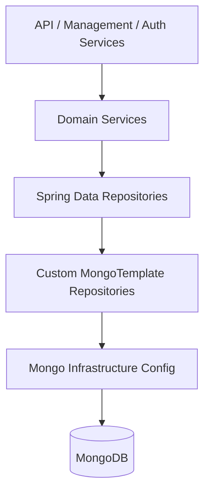
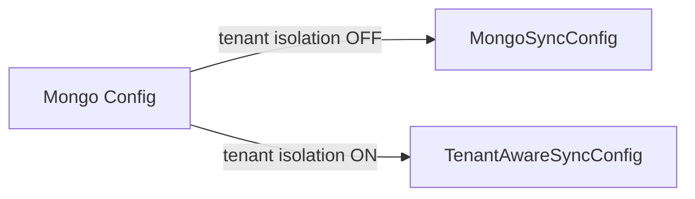
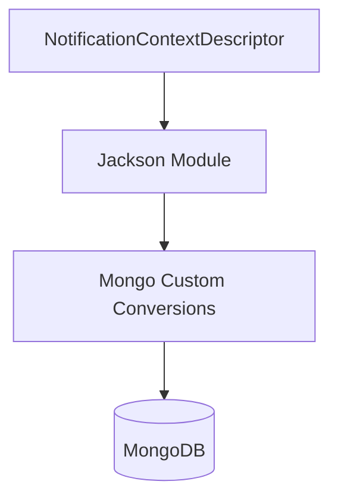
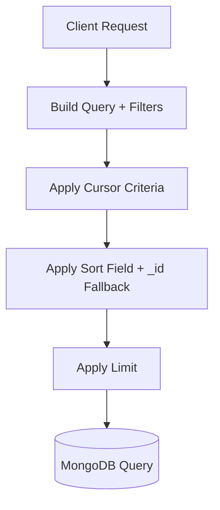
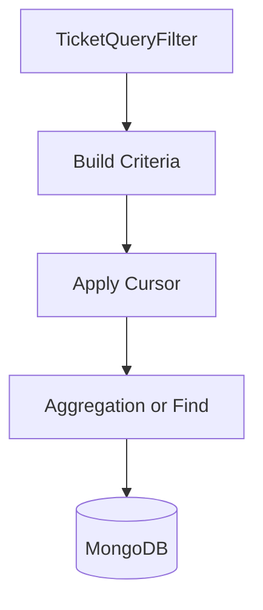

# Data Mongo Sync Configuration And Custom Repositories

## Overview

The **Data Mongo Sync Configuration And Custom Repositories** module provides the MongoDB infrastructure layer for OpenFrame services. It is responsible for:

- Bootstrapping MongoDB infrastructure (auditing, converters, type mapping)
- Enabling repository scanning based on tenant isolation mode
- Defining custom MongoTemplate-based repositories for advanced queries
- Managing indexes and schema evolution concerns
- Providing retry and optimistic locking support
- Seeding system-level data such as ticket status definitions

This module sits between the Mongo domain model (documents and base repositories) and higher-level domain services (API, management, authorization, stream services).

---

## Architectural Position

### Responsibilities by Layer

- **Mongo Infrastructure Config**: Configures converters, auditing, and repository scanning.
- **Spring Data Repositories**: Standard `MongoRepository` interfaces.
- **Custom MongoTemplate Repositories**: Complex filtering, cursor pagination, aggregations, and bulk updates.
- **Domain Services**: Consume repositories and apply business logic.

---

# Configuration Components

## Mongo Infrastructure

### MongoInfraConfig

- Enabled only when `spring.data.mongodb.enabled=true`
- Activates `@EnableMongoAuditing`
- Customizes `MappingMongoConverter`
  - Applies `MongoCustomConversions`
  - Sets `mapKeyDotReplacement` to `__dot__` to safely persist dotted map keys

This ensures:
- Proper document-to-object mapping
- Support for custom read/write converters
- Auditing fields such as `createdAt` and `updatedAt`

---

### MongoSyncConfig

Enabled when:

- `spring.data.mongodb.enabled=true`
- `openframe.tenant-isolation.enabled=false`

Scans `com.openframe.data.repository` but **excludes** repositories annotated with `TenantAwareRepository`.

This is the non-tenant-isolated mode.

---

### TenantAwareSyncConfig

Enabled when:

- `spring.data.mongodb.enabled=true`
- `openframe.tenant-isolation.enabled=true`

Enables full repository scanning, including tenant-aware repositories.

---

### MongoIndexConfig

Runs at startup (`@PostConstruct`) and ensures:

- Compound indexes on `application_events`
  - `{ userId ASC, timestamp DESC }`
  - `{ type ASC, metadata.tags ASC }`
- Removal of stale legacy indexes (e.g., `key_org_idx`)

This guarantees:
- Query performance for event lookups
- Safe schema evolution
- Clean-up of obsolete indexes after migrations

---

## Notification Context Serialization

Notifications use polymorphic context payloads.

### NotificationContextJacksonConfig

- Registers subtypes dynamically via `NotificationContextDescriptor`
- Adds a Jackson `SimpleModule` with named subtypes

### NotificationContextMongoConfig

- Registers:
  - `NotificationContextReadConverter`
  - `NotificationContextWriteConverter`
- Injects `MongoCustomConversions`
- Overrides Mongo type mapping with `NotificationContextSelectiveTypeMapper`

This allows:
- Clean polymorphic serialization
- Reduced `_class` pollution
- Controlled type resolution

---

# Custom Repository Implementations

Custom repositories provide advanced behavior not supported by default Spring Data repositories.

Common patterns include:

- Cursor-based pagination using `_id`
- Secondary sort fallback on `_id`
- Regex-based search
- Aggregation pipelines
- Bulk updates and statistics

---

## Cursor Pagination Pattern

Most repositories implement this strategy:

Rules:

- If sorting by `_id`, compare directly (`lt` / `gt`).
- If sorting by another field:
  - Fetch cursor document.
  - Compare by sort field.
  - Break ties using `_id`.

This guarantees deterministic pagination.

---

# Domain-Specific Repository Groups

## Assignments

### CustomItemAssignmentRepositoryImpl

Features:
- Cursor pagination
- Search by `displayName`
- Grouping via aggregation (`countByItemIdGroupedByTargetType`)
- Validation of sortable fields

Uses `$or` criteria to combine:
- Past sort values
- Same sort value + `_id` tie-breaker

---

## Devices

### CustomMachineRepositoryImpl

Features:
- Complex filtering via `MachineQueryFilter`
- Multi-field search (hostname, IP, model, etc.)
- Cursor pagination
- Sort allowlist enforcement

All filtering occurs at database level for scalability.

---

## Events

### ExternalApplicationEventRepository

Standard `MongoRepository` with:
- Time range queries
- Tag-based query (`@Query`)

### CustomEventRepositoryImpl

Provides:
- Date-range filtering with UTC normalization
- Distinct value extraction (`userId`, `type`)
- Cursor pagination
- Search on `type` and `data`

---

## Knowledge Base

### CustomKnowledgeBaseItemRepositoryImpl

Supports:
- Folder retrieval by parent
- Article filtering by status
- Archived vs active logic
- Composite `$and` / `$or` merging
- Cursor based on `updatedAt` + `_id`

Special handling prevents multiple root-level `$or` conflicts in Spring Data.

---

## Notifications

### CustomNotificationRepositoryImpl

Implements recipient-scoped pagination:

- Queries `NotificationReadState`
- Applies read/unread filter
- Applies search on title
- Preserves ordering using `LinkedHashMap`
- Fetches actual `Notification` documents separately

This two-phase approach ensures:

- Efficient filtering on read state
- Stable ordering
- Lightweight ID-first pagination

### CustomNotificationReadStateRepositoryImpl

- Uses unordered bulk insert
- Swallows duplicate key errors (code `11000`)
- Ensures idempotent read-state creation

---

## OAuth Tokens

### OAuthTokenRepository

Provides lookup by:

- `accessToken`
- `refreshToken`

Used by authorization flows and BFF layers.

---

## Organizations

### CustomOrganizationRepositoryImpl

Features:
- Status defaulting to ACTIVE
- Contract date filtering
- Employee range filtering
- Regex-based category filtering
- Cursor pagination

All criteria are combined into a single `$and` block for predictable behavior.

---

## Scripts (RMM)

### CustomScriptRepositoryImpl

Tenant-scoped queries with:

- Status filtering (hides DELETED by default)
- Platform and shell filtering
- Exact tag match via anchored regex
- Cursor pagination based on `_id`
- Direction flipping for backward pagination

Handles invalid ObjectId cursors gracefully.

---

## Tickets

### CustomTicketRepositoryImpl

One of the most feature-rich repositories.

Provides:

- Complex filter composition
- Cursor pagination with tie-breaker logic
- Aggregations:
  - Count by `status`
  - Count by `statusKind`
  - Count by `statusId`
  - Average resolution time
- Bulk status updates
- Reassignment of status definitions
- Partial update operations

---

### TicketAttachmentRepository
### TicketNoteRepository
### TicketStatusDefinitionRepository

Standard Spring Data repositories for:

- Attachments
- Notes
- Status definitions

---

## Tools

### CustomIntegratedToolRepositoryImpl

Provides:

- Filtering by enabled, type, category
- Search on name/description
- Distinct type/category extraction
- Controlled sortable fields

---

## Users

### CustomUserRepositoryImpl

Supports:

- Email regex filtering
- Name regex filtering
- Status filtering
- Sorting by `createdAt`

---

# Retry and Concurrency

## OptimisticLockingRetryListener

Spring Retry listener that:

- Logs retry attempts
- Logs success after retries
- Logs failure when retries are exhausted

Used to improve resilience when concurrent updates trigger optimistic locking exceptions.

---

# Seeding and Ordering

## TicketStatusSeedCatalog

Defines system ticket statuses:

- AI Assistance
- Tech Required
- Resolved
- Archived
- On Hold (custom)

Uses `LexoRank` to generate stable ordering positions.

This enables:

- Deterministic UI ordering
- Easy insertion between ranks
- Custom + system status coexistence

---

# Key Design Principles

1. **Database-Level Filtering** – Avoid in-memory filtering.
2. **Deterministic Pagination** – Always combine sort field + `_id`.
3. **Sortable Field Allowlist** – Prevent arbitrary sorting.
4. **Graceful Cursor Handling** – Invalid cursor never crashes queries.
5. **Schema Evolution Safety** – Drop stale indexes automatically.
6. **Polymorphic Safety** – Controlled notification context mapping.

---

# Summary

The **Data Mongo Sync Configuration And Custom Repositories** module forms the backbone of MongoDB interaction within OpenFrame.

It:

- Configures Mongo infrastructure and auditing
- Handles tenant-aware repository bootstrapping
- Provides optimized, scalable custom repositories
- Implements cursor-based pagination consistently
- Supports aggregations and bulk operations
- Ensures schema stability and evolution safety

Without this module, higher-level services would lack efficient, scalable, and deterministic access to MongoDB data structures.
