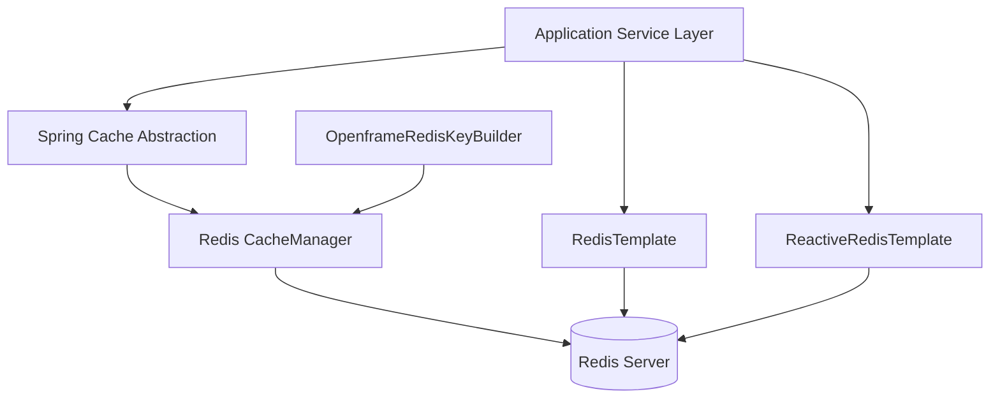
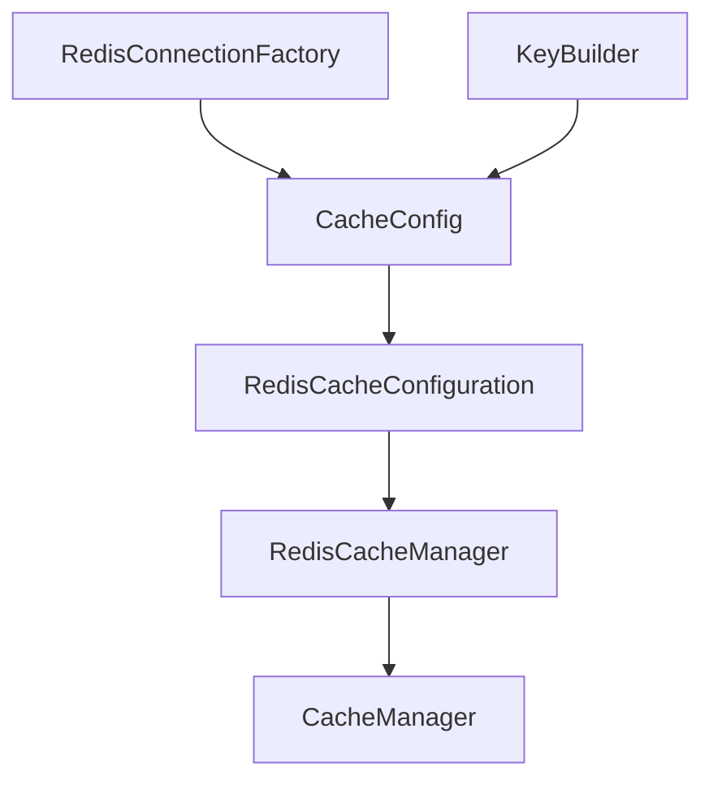
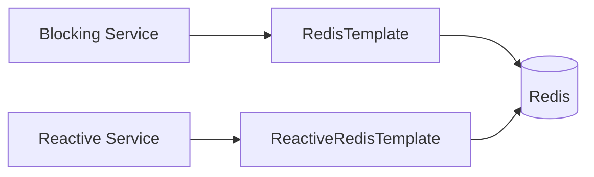
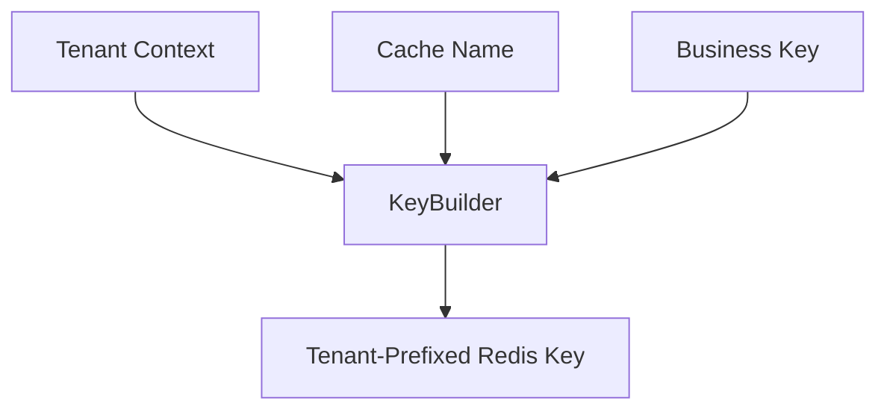

# Data Redis Cache

The **Data Redis Cache** module provides Redis-based caching and key management infrastructure for the OpenFrame platform. It integrates Spring Cache with Redis, enables both synchronous and reactive Redis operations, and enforces tenant-aware key generation across services.

This module is designed as a reusable infrastructure component consumed by service modules such as API, Gateway, Authorization, Management, and Stream services.

---

## Purpose and Responsibilities

The Data Redis Cache module is responsible for:

- Enabling Spring Cache backed by Redis
- Providing `RedisTemplate` and reactive Redis templates
- Enforcing tenant-aware key prefixing
- Standardizing key/value serialization
- Supporting conditional activation via configuration

It acts as a foundational data layer component similar to Mongo and Kafka modules, but focused specifically on in-memory caching and distributed coordination via Redis.

---

## High-Level Architecture



### Flow Overview

1. Services use Spring's `@Cacheable`, `@CachePut`, or `@CacheEvict` annotations.
2. The `CacheManager` delegates cache operations to Redis.
3. Keys are prefixed using `OpenframeRedisKeyBuilder`.
4. Data is serialized and stored in Redis with defined TTL rules.

---

## Core Components

The module contains three primary configuration components:

- `CacheConfig`
- `RedisConfig`
- `OpenframeRedisKeyConfiguration`

Each plays a specific role in enabling and standardizing Redis usage across the platform.

---

## 1. Cache Configuration

**Class:** `CacheConfig`

This component enables and configures Spring Cache backed by Redis.

### Key Features

- Enabled via `@EnableCaching`
- Activated only when `spring.redis.enabled=true`
- Provides a default `CacheManager` if none exists
- Sets a default TTL of 6 hours
- Disables caching of `null` values
- Uses tenant-aware key prefixing
- Serializes:
  - Keys → `StringRedisSerializer`
  - Values → `GenericJackson2JsonRedisSerializer`

### Cache Key Format

The cache prefix is computed using the key builder:

```text
<prefix>:<cacheName>::<key>
```

This ensures:

- Multi-tenant isolation
- Clear cache namespace boundaries
- Reduced key collision risk

### Cache Manager Construction



---

## 2. Redis Infrastructure Configuration

**Class:** `RedisConfig`

This configuration defines the Redis templates and enables Redis repositories.

### Activation

The configuration is enabled only when:

```text
spring.redis.enabled=true
```

This allows services to disable Redis entirely in local or test environments.

### Provided Beans

#### 1. RedisTemplate<String, String>

- Used for synchronous operations
- String serialization for:
  - Keys
  - Values
  - Hash keys
  - Hash values

#### 2. ReactiveStringRedisTemplate

- Simplified reactive string-based operations
- Used in reactive service layers

#### 3. ReactiveRedisTemplate<String, String>

- Fully configurable reactive Redis client
- Explicit serialization context

### Reactive vs Blocking Model



This enables:

- Compatibility with traditional Spring MVC services
- Support for WebFlux/reactive pipelines

---

## 3. Redis Key Configuration

**Class:** `OpenframeRedisKeyConfiguration`

This component defines the `OpenframeRedisKeyBuilder` bean.

### Responsibilities

- Binds Redis-related configuration properties
- Creates a centralized key builder
- Ensures consistent key generation logic

### Tenant-Aware Key Strategy

The key builder ensures:

- Tenant isolation
- Environment scoping
- Logical namespacing

Conceptually:



---

## Conditional Activation Strategy

The module uses Spring Boot conditional annotations to ensure safe integration:

- `@ConditionalOnProperty(name = "spring.redis.enabled")`
- `@ConditionalOnMissingBean`

This guarantees:

- No accidental bean override
- Easy extensibility
- Optional Redis dependency per service

---

## Serialization Strategy

| Layer | Serializer | Purpose |
|--------|------------|----------|
| Cache Keys | StringRedisSerializer | Human-readable keys |
| Cache Values | GenericJackson2JsonRedisSerializer | JSON-based object storage |
| Templates | StringRedisSerializer | Uniform string operations |

Using JSON serialization ensures:

- Forward compatibility
- Cross-service readability
- Easier debugging

---

## Interaction with Other Platform Modules

The Data Redis Cache module is infrastructure-level and consumed by multiple services:

- API services for caching query results
- Authorization services for token/state caching
- Gateway services for rate limiting or session state
- Management services for temporary synchronization data
- Stream services for enrichment caching

It complements:

- Mongo (persistent storage)
- Kafka (event streaming)
- Security modules (authentication and token handling)

Redis is not the system of record — it is a performance and coordination layer.

---

## Typical Usage Patterns

### 1. Declarative Caching

```java
@Cacheable(value = "devices", key = "#deviceId")
public Device getDevice(String deviceId) {
    // Database lookup
}
```

### 2. Manual Redis Access

```java
redisTemplate.opsForValue().set("key", "value");
```

### 3. Reactive Usage

```java
reactiveRedisTemplate.opsForValue()
    .set("key", "value")
    .subscribe();
```

---

## Design Principles

The module follows several architectural principles:

- ✅ Infrastructure-first design
- ✅ Tenant-aware by default
- ✅ Reactive and blocking support
- ✅ Conditional activation
- ✅ Non-invasive extension model

---

## Summary

The **Data Redis Cache** module provides a standardized, tenant-aware Redis integration layer across the OpenFrame platform.

It ensures:

- Consistent key structure
- Safe cache configuration
- Flexible Redis access patterns
- Clean integration with Spring Boot

By abstracting Redis configuration and key management, the module allows higher-level services to focus on business logic while maintaining consistent caching behavior across the platform.
