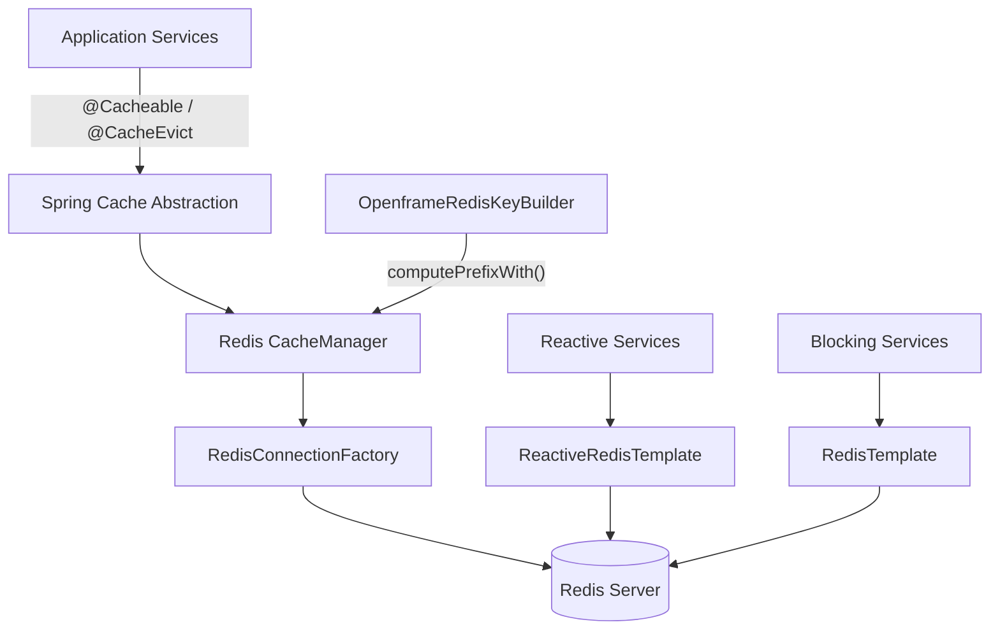
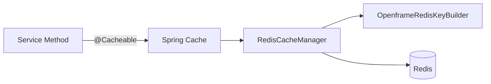
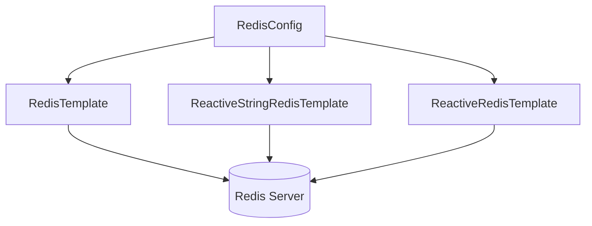
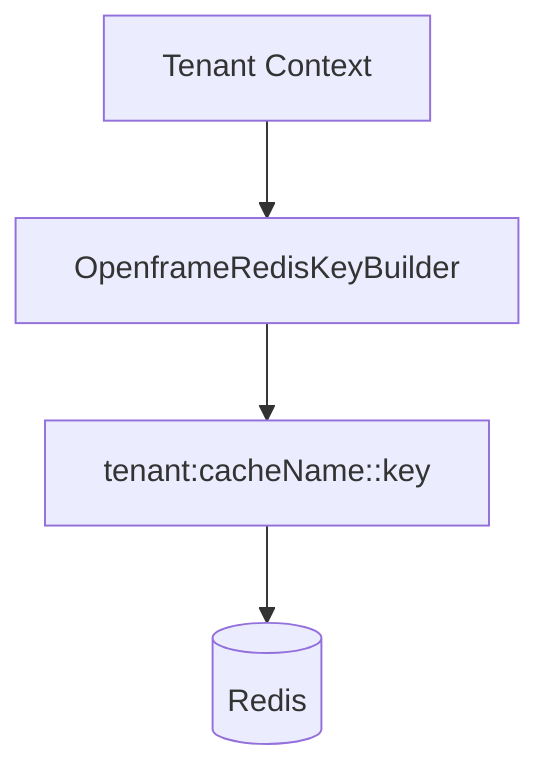

# Data Cache Redis

## Overview

The **Data Cache Redis** module provides Redis-based caching and key management capabilities for the OpenFrame platform. It integrates Spring Cache with Redis, configures synchronous and reactive Redis templates, and enforces tenant-aware key prefixing across all cache entries.

This module acts as a shared infrastructure component used by multiple services such as:

- API Service
- Authorization Server
- Gateway Service
- Management Service
- Stream Processing

Its primary responsibilities are:

- Configuring Redis connectivity
- Enabling Spring Cache with Redis
- Providing reactive and blocking Redis templates
- Enforcing tenant-aware cache key strategies

---

## High-Level Architecture



### Architectural Role

The Data Cache Redis module sits between application-level services and the Redis server. It standardizes:

- Cache TTL behavior
- Serialization strategy
- Tenant-aware key prefixing
- Reactive and blocking data access patterns

---

## Core Components

This module consists of three primary configuration classes:

1. **CacheConfig**  
2. **RedisConfig**  
3. **OpenframeRedisKeyConfiguration**  

Each plays a distinct role in enabling Redis across the platform.

---

## CacheConfig

**Component:**  
`deps.openframe-oss-lib.openframe-data-redis.src.main.java.com.openframe.data.config.CacheConfig.CacheConfig`

### Purpose

Configures Spring's `CacheManager` backed by Redis and enables annotation-driven caching.

### Key Responsibilities

- Enables Spring caching via `@EnableCaching`
- Creates a `RedisCacheManager` if none exists
- Sets default TTL to 6 hours
- Disables caching of null values
- Configures JSON value serialization
- Applies tenant-aware key prefixing

### Cache Configuration Details

```text
Default TTL: 6 hours
Null values: Disabled
Key Serializer: StringRedisSerializer
Value Serializer: GenericJackson2JsonRedisSerializer
Prefix Strategy: Tenant-aware via OpenframeRedisKeyBuilder
```

### Tenant-Aware Cache Keys

The configuration uses:

```java
.computePrefixWith(cacheName -> keyBuilder.cacheKeyPrefix(null, cacheName))
```

This ensures that all cache entries follow a structured prefix format:

```text
<prefix>:<cacheName>::<key>
```

This design prevents:

- Cross-tenant cache collisions
- Key namespace pollution
- Data leakage between organizations

### Cache Flow



---

## RedisConfig

**Component:**  
`deps.openframe-oss-lib.openframe-data-redis.src.main.java.com.openframe.data.config.RedisConfig.RedisConfig`

### Purpose

Provides Redis connectivity and template beans for both blocking and reactive use cases.

### Conditional Activation

The configuration is enabled only when:

```text
spring.redis.enabled=true
```

This allows Redis to be toggled per environment.

---

### Provided Beans

#### 1. RedisTemplate (Blocking)

```text
Type: RedisTemplate<String, String>
Serialization: String-based for keys and values
Use Case: Imperative services
```

Used for:

- Simple key-value operations
- Hash operations
- Direct Redis interactions

---

#### 2. ReactiveStringRedisTemplate

```text
Type: ReactiveStringRedisTemplate
Use Case: Reactive pipelines
```

Used in WebFlux-based or reactive services.

---

#### 3. ReactiveRedisTemplate

```text
Type: ReactiveRedisTemplate<String, String>
Serialization: String-based for all structures
```

Provides full reactive access to:

- Key-value operations
- Hashes
- Streams
- Lists and sets

---

### Redis Template Architecture



---

## OpenframeRedisKeyConfiguration

**Component:**  
`deps.openframe-oss-lib.openframe-data-redis.src.main.java.com.openframe.data.redis.OpenframeRedisKeyConfiguration.OpenframeRedisKeyConfiguration`

### Purpose

Provides the `OpenframeRedisKeyBuilder`, responsible for constructing structured and tenant-aware Redis keys.

### Key Responsibilities

- Enables `OpenframeRedisProperties`
- Creates `OpenframeRedisKeyBuilder` if missing
- Centralizes key format logic

### Why This Matters

Without a centralized key builder:

- Each service could generate inconsistent key formats
- Tenant separation could break
- Cache invalidation could become unreliable

By injecting `OpenframeRedisKeyBuilder` into `CacheConfig`, the module guarantees uniform key prefixing.

---

## Multi-Tenant Key Strategy

Tenant isolation is a core architectural principle in OpenFrame.

The Data Cache Redis module enforces:



This ensures:

- Logical isolation within shared Redis infrastructure
- Safe multi-tenant deployments
- Predictable cache invalidation

---

## Integration with Other Modules

The Data Cache Redis module is used by:

- API Service for caching domain queries
- Authorization Server for token or metadata caching
- Gateway Service for rate limiting or token introspection caching
- Management Service for scheduled statistics caching
- Stream Processing for transient enrichment caches

It complements:

- Data Persistence Mongo (primary data store)
- Data Transport Kafka (event streaming)
- Shared Security and OAuth BFF (token validation caching)

Redis is not a primary source of truth — it acts strictly as:

- A performance accelerator
- A distributed cache
- A short-lived data store

---

## Conditional Enablement Strategy

Redis functionality is fully conditional:

```text
Property: spring.redis.enabled
Value: true
```

If disabled:

- CacheManager is not created
- Redis templates are not registered
- Services fall back to default behavior

This makes Redis optional and environment-configurable.

---

## Serialization Strategy

### Cache Serialization

```text
Keys: StringRedisSerializer
Values: GenericJackson2JsonRedisSerializer
```

Benefits:

- Human-readable keys
- Flexible JSON-based value storage
- Backward compatibility with evolving DTOs

### Template Serialization

```text
Keys: String
Values: String
Hashes: String
```

Optimized for lightweight operations and reactive pipelines.

---

## Design Principles

The Data Cache Redis module follows these principles:

1. Infrastructure-first design (no domain logic)
2. Strict tenant isolation
3. Conditional activation
4. Reactive + imperative compatibility
5. Centralized key management
6. Safe default TTL

---

## Summary

The **Data Cache Redis** module provides:

- Spring-integrated Redis caching
- Tenant-aware key prefixing
- Reactive and blocking Redis access
- Environment-controlled activation
- Consistent serialization strategies

It is a foundational infrastructure module that enhances performance, ensures tenant isolation, and standardizes Redis usage across the entire OpenFrame ecosystem.
