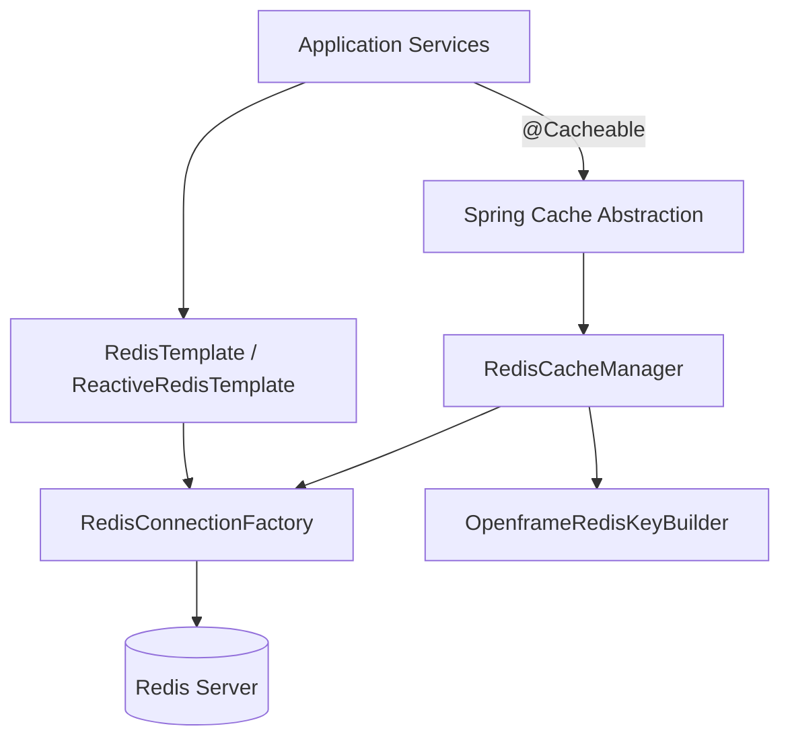
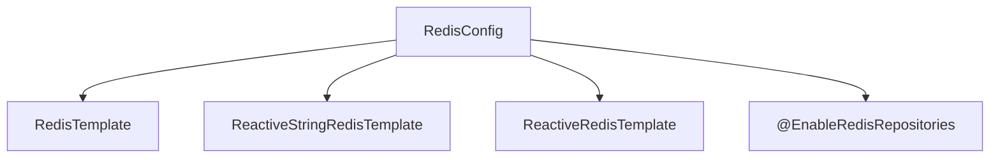
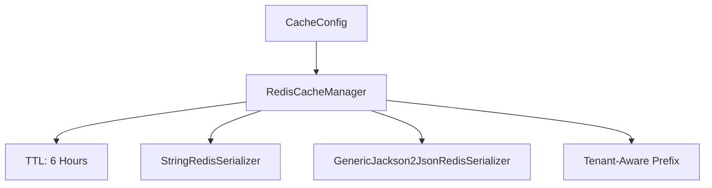
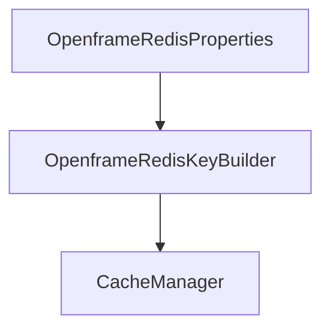
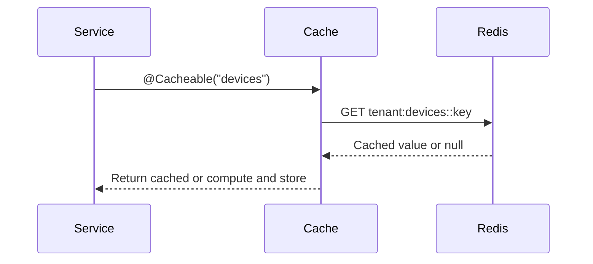
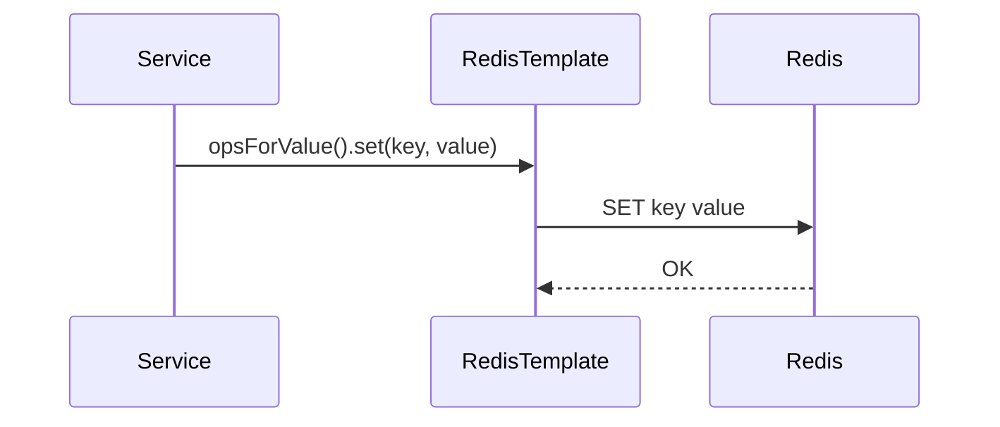

# Data Cache Redis

## Overview

The **Data Cache Redis** module provides Redis-based caching and key management infrastructure for the OpenFrame platform. It integrates with Spring Boot’s caching abstraction and Spring Data Redis to deliver:

- Centralized Redis configuration
- Tenant-aware cache key generation
- Synchronous and reactive Redis templates
- Conditional auto-configuration based on environment properties

This module acts as the Redis foundation layer for higher-level services such as API, Gateway, Authorization, Management, and Stream Processing services.

Redis is primarily used for:

- Application-level caching
- Short-lived state management
- Token and session support (indirectly via other modules)
- Distributed coordination patterns (when applicable)

---

## Activation and Conditional Configuration

All configurations in this module are conditionally enabled using the property:

```text
spring.redis.enabled=true
```

If this property is not set to `true`, the entire Redis configuration layer remains disabled. This ensures that Redis can be toggled per environment (e.g., disabled in local development or specific deployments).

---

## Architecture Overview

The Data Cache Redis module is composed of three primary configuration components:

- `RedisConfig` – Core Redis connection and template setup
- `CacheConfig` – Spring Cache integration backed by Redis
- `OpenframeRedisKeyConfiguration` – Tenant-aware key builder wiring

### High-Level Architecture



This design cleanly separates:

- Cache abstraction
- Low-level Redis access
- Tenant-aware key generation

---

# Core Components

## 1. RedisConfig

**Component:**  
`deps.openframe-oss-lib.openframe-data-redis.src.main.java.com.openframe.data.config.RedisConfig.RedisConfig`

### Purpose

Provides the foundational Redis beans used across the platform:

- `RedisTemplate<String, String>`
- `ReactiveStringRedisTemplate`
- `ReactiveRedisTemplate<String, String>`
- Enables Redis repositories

### Key Characteristics

- Enabled only when `spring.redis.enabled=true`
- Uses `@EnableRedisRepositories` for `com.openframe.data.repository.redis`
- All serializers default to `StringRedisSerializer`
- Supports both imperative and reactive programming models

### Bean Structure



### Serialization Strategy

All templates use:

- Key serializer: `StringRedisSerializer`
- Value serializer: `StringRedisSerializer`
- Hash key/value serializer: `StringRedisSerializer`

This ensures:

- Predictable key formats
- Human-readable Redis entries
- Interoperability across services

---

## 2. CacheConfig

**Component:**  
`deps.openframe-oss-lib.openframe-data-redis.src.main.java.com.openframe.data.config.CacheConfig.CacheConfig`

### Purpose

Integrates Redis with Spring’s `@Cacheable`, `@CacheEvict`, and `@CachePut` annotations using a `RedisCacheManager`.

### Key Features

- Default TTL: **6 hours**
- Null values are not cached
- JSON serialization for cache values
- Tenant-aware cache key prefixes

### Cache Manager Configuration



### Serialization Details

- **Keys** → `StringRedisSerializer`
- **Values** → `GenericJackson2JsonRedisSerializer`

This enables structured object caching while keeping keys consistent.

### Tenant-Aware Key Prefixing

A critical feature of this module is automatic cache key prefixing:

```text
<prefix>:<cacheName>::<key>
```

The prefix is computed using:

```text
OpenframeRedisKeyBuilder.cacheKeyPrefix(null, cacheName)
```

This ensures:

- Logical isolation between tenants
- Prevention of cross-tenant cache collisions
- Safer multi-tenant deployments

---

## 3. OpenframeRedisKeyConfiguration

**Component:**  
`deps.openframe-oss-lib.openframe-data-redis.src.main.java.com.openframe.data.redis.OpenframeRedisKeyConfiguration.OpenframeRedisKeyConfiguration`

### Purpose

Registers and wires the `OpenframeRedisKeyBuilder` using `OpenframeRedisProperties`.

### Responsibilities

- Enables configuration properties for Redis key settings
- Exposes a default `OpenframeRedisKeyBuilder` bean
- Allows override via `@ConditionalOnMissingBean`

### Bean Wiring Flow



This design allows:

- Custom key strategies per environment
- Centralized control of Redis key structure
- Consistent naming across all services

---

# Data Flow Scenarios

## Scenario 1: Using Spring Cache



If the value is missing:

1. Service method executes.
2. Result is serialized using JSON.
3. Entry is stored in Redis with 6-hour TTL.

---

## Scenario 2: Direct Redis Access



This path bypasses the Spring Cache abstraction and gives full control over:

- Key naming
- Expiration
- Hash operations
- Reactive streaming access

---

# Integration Within the Platform

The Data Cache Redis module serves as a foundational infrastructure layer.

Typical consumers include:

- API services caching computed queries
- Authorization flows storing short-lived state
- Gateway rate limiting metadata
- Management service operational state

It does not implement business logic. Instead, it provides:

- Infrastructure configuration
- Key management
- Cache lifecycle control

---

# Design Principles

## 1. Conditional Infrastructure

Redis can be completely disabled via configuration without impacting application startup.

## 2. Multi-Tenant Safety

All cache keys are prefixed using a builder strategy to prevent tenant data leakage.

## 3. Serialization Clarity

- Strings for direct Redis operations
- JSON for structured cache objects

## 4. Extensibility

All beans are declared with `@ConditionalOnMissingBean`, allowing:

- Custom cache managers
- Alternative serializers
- Custom key strategies

---

# Summary

The **Data Cache Redis** module provides a clean, extensible, and tenant-aware Redis integration layer for OpenFrame.

It standardizes:

- Cache TTL policies
- Key naming conventions
- Serialization strategies
- Reactive and imperative Redis access

By isolating Redis infrastructure concerns in a dedicated module, the platform ensures consistency, multi-tenant safety, and operational flexibility across all services.