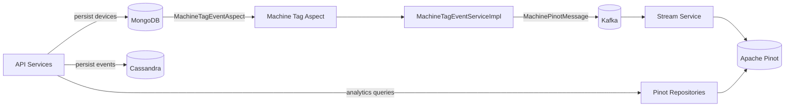
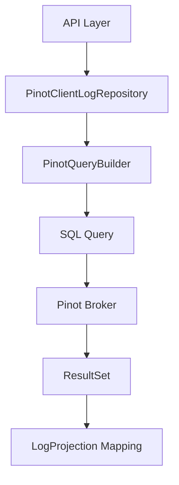
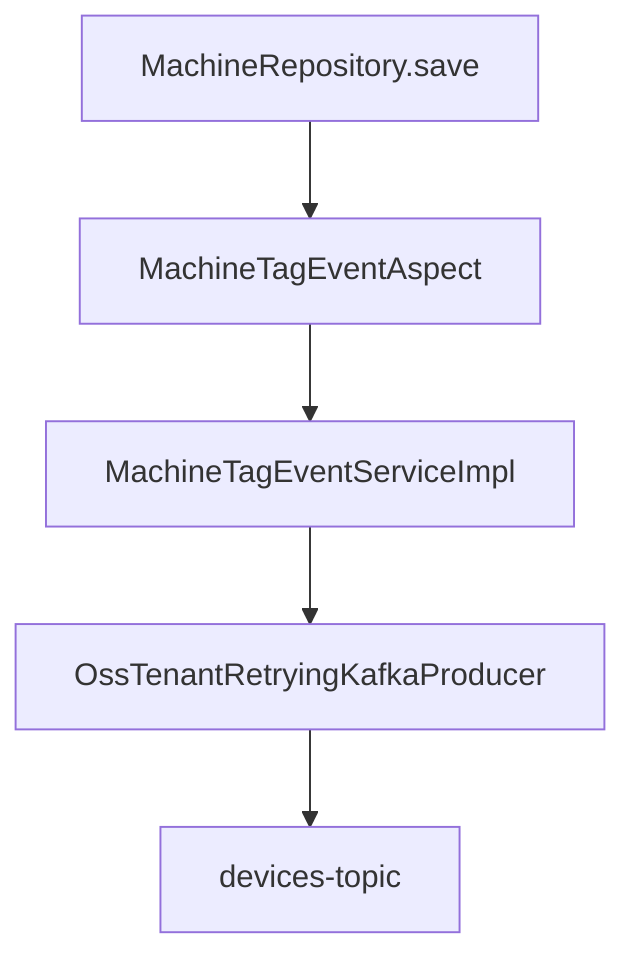
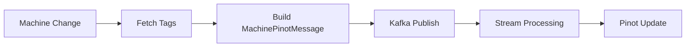
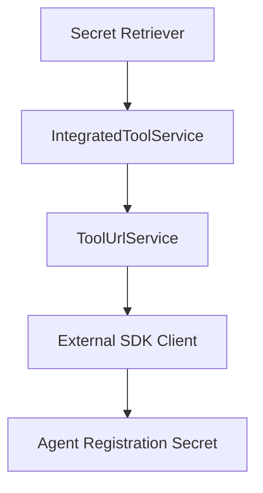

# Data Core Cassandra Pinot And Models

## Overview

The **Data Core Cassandra Pinot And Models** module is the central data infrastructure layer for OpenFrame. It provides:

- Cassandra configuration and lifecycle management
- Apache Pinot analytical query integration
- Cross-cutting event processing for machine and tag updates
- Domain models shared across services (Kafka, NATS, Pinot)
- Tool integration support (Fleet MDM, Tactical RMM)
- Health indicators and runtime configuration visibility

This module sits between:

- Upstream application services (API, Stream, Management, Client)
- Data infrastructure (Cassandra, Pinot, Kafka, Redis, MongoDB)

It ensures that operational data (devices, logs, tags, tool connections) flows consistently across storage, analytics, and streaming pipelines.

---

## Architectural Role in the Platform



### Responsibilities

| Area | Responsibility |
|------|----------------|
| Cassandra | Keyspace creation, session config, health checks |
| Pinot | Query execution, filtering, analytics aggregation |
| Events | Machine & Tag change detection via AOP |
| Kafka | Publish enriched device updates for analytics |
| Models | Shared event payloads and integration DTOs |
| Tool Integration | Agent registration secret retrieval |

---

## Core Components

### 1. Cassandra Infrastructure

#### CassandraConfig
- Extends `AbstractCassandraConfiguration`
- Automatically creates keyspace if missing
- Configures:
  - Local datacenter
  - Contact points
  - Replication factor
  - Session builder options
- Uses `CREATE_IF_NOT_EXISTS` schema action

#### CassandraKeyspaceNormalizer
- Normalizes keyspace names
- Replaces dashes (`-`) with underscores (`_`)
- Ensures Cassandra-compatible naming
- Runs as `ApplicationContextInitializer`

#### CassandraHealthIndicator
- Executes lightweight query against `system.local`
- Integrated with Spring Boot Actuator
- Marks service `UP` or `DOWN`

#### DataConfiguration.CassandraConfiguration
- Enables Cassandra repositories conditionally
- Activated only when `spring.data.cassandra.enabled=true`

---

### 2. Apache Pinot Integration

The module integrates Pinot for fast analytical queries over logs and devices.

#### PinotConfig
- Creates:
  - Broker connection
  - Controller connection
- Injected via Spring beans

#### PinotClientDeviceRepository
Provides:
- Filter option aggregations
- Device count queries
- Dynamic WHERE clause construction

Supports filtering by:
- Status
- Device type
- OS type
- Organization
- Tags

#### PinotClientLogRepository
Provides:
- Time range queries
- Cursor-based pagination
- Full-text log search
- Distinct filter options
- Organization projection
- Safe sortable field validation

Query flow:



Error handling wraps failures in `PinotQueryException`.

---

### 3. Machine and Tag Event Processing

This is one of the most critical features of the module.

#### MachineTagEventAspect
An AOP component that intercepts:

- `MachineRepository.save`
- `MachineRepository.saveAll`
- `MachineTagRepository.save`
- `MachineTagRepository.saveAll`
- `TagRepository.save`
- `TagRepository.saveAll`

It delegates processing to `MachineTagEventService`.

Aspect Flow:



Enabled by property:

```text
openframe.device.aspect.enabled=true
```

---

### 4. MachineTagEventServiceImpl

Core responsibilities:

- Build `MachinePinotMessage`
- Enrich with:
  - Machine data
  - Organization ID
  - Status
  - OS type
  - Tag names
- Publish to Kafka topic

Key logic:

- On machine save → publish full device state
- On machine tag change → refresh tag list and republish
- On tag rename → find all affected machines and republish

Event propagation model:



This ensures analytics always reflect the latest tag and device state.

---

### 5. Domain Models

#### IntegratedToolTypes
Defines constant tool identifiers such as:

- MONGODB
- REDIS
- CASSANDRA
- KAFKA
- PINOT
- FLEET
- AUTHENTIK
- MYSQL
- POSTGRESQL

Used across services to standardize tool identification.

#### ToolCredentials
Generic credential container:

- Username
- Password
- Token
- API Key
- Client ID
- Client Secret

---

### 6. NATS Event Models

Used by client and management services for tool and agent coordination.

Models include:

- ClientConnectionEvent
- InstalledAgentMessage
- ToolConnectionMessage
- ToolInstallationMessage
- DownloadConfiguration

These represent:

- Agent installation events
- Tool connection states
- Download metadata
- Installation commands

---

### 7. Tool Agent Registration Secret Retrieval

Conditional feature enabled by:

```text
openframe.integration.tool.enabled=true
```

#### FleetMdmAgentRegistrationSecretRetriever
- Fetches tool configuration
- Creates Fleet client
- Retrieves enroll secret

#### TacticalRmmAgentRegistrationSecretRetriever
- Uses `TacticalRmmClient`
- Builds default registration request
- Retrieves installation secret

Integration Flow:



---

### 8. Runtime Configuration Visibility

#### ConfigurationLogger
Logs at application startup:

- Mongo URI
- Cassandra contact points
- Redis host
- Pinot controller URL
- Pinot broker URL

Helps with debugging multi-database deployments.

---

## Cross-Module Integration

This module is consumed by:

- API services for analytics queries
- Stream services for device event enrichment
- Management services for tool orchestration
- Client services for agent coordination

It does **not** expose HTTP endpoints directly. Instead, it provides:

- Repositories
- Kafka publishing logic
- Data models
- Infrastructure configuration

---

## Configuration Properties

### Cassandra

```text
spring.data.cassandra.enabled=true
spring.data.cassandra.keyspace-name=<tenant>
spring.data.cassandra.contact-points=<host>
spring.data.cassandra.local-datacenter=<dc>
spring.data.cassandra.replication-factor=1
```

### Pinot

```text
pinot.broker.url=<broker>
pinot.controller.url=<controller>
pinot.tables.devices.name=devices
pinot.tables.logs.name=logs
```

### Event Processing

```text
openframe.device.aspect.enabled=true
openframe.oss-tenant.kafka.topics.outbound.devices-topic=devices-topic
```

---

## Design Principles

1. Conditional activation via properties
2. Clear separation of infrastructure and business logic
3. Event-driven propagation to analytics systems
4. Tenant-aware Kafka publishing
5. Defensive query building for Pinot
6. Fail-safe logging and exception wrapping

---

## Summary

The **Data Core Cassandra Pinot And Models** module is the backbone of OpenFrame’s data layer. It:

- Configures Cassandra and Pinot
- Synchronizes device and tag changes into Kafka
- Enables fast analytics queries
- Provides shared event models
- Integrates external tool SDKs
- Ensures operational observability

Without this module, the platform would lose:

- Real-time analytics consistency
- Cross-service data standardization
- Reliable infrastructure initialization

It acts as the foundational data engine powering device management, logging analytics, and integrated tool orchestration across the entire system.
