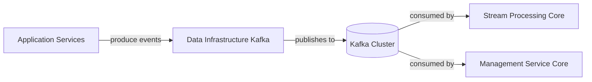
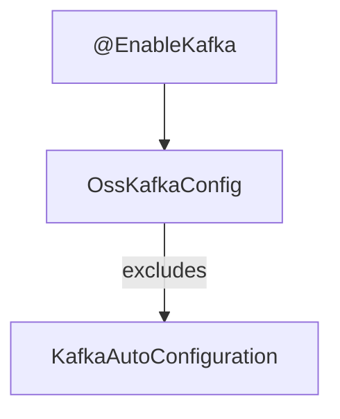
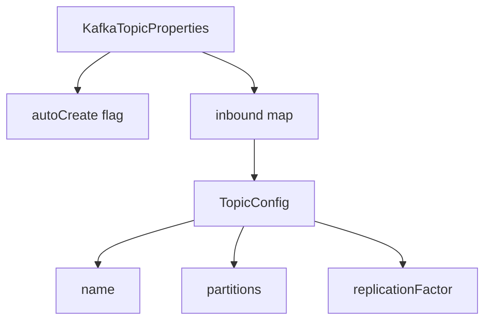
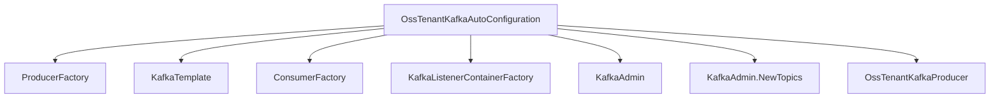
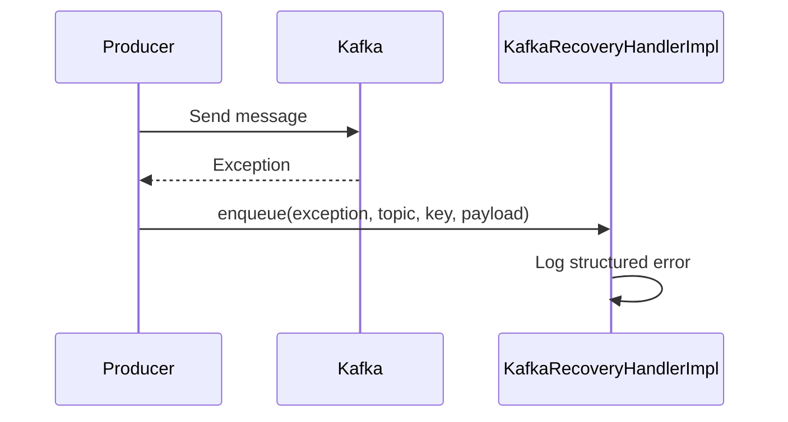
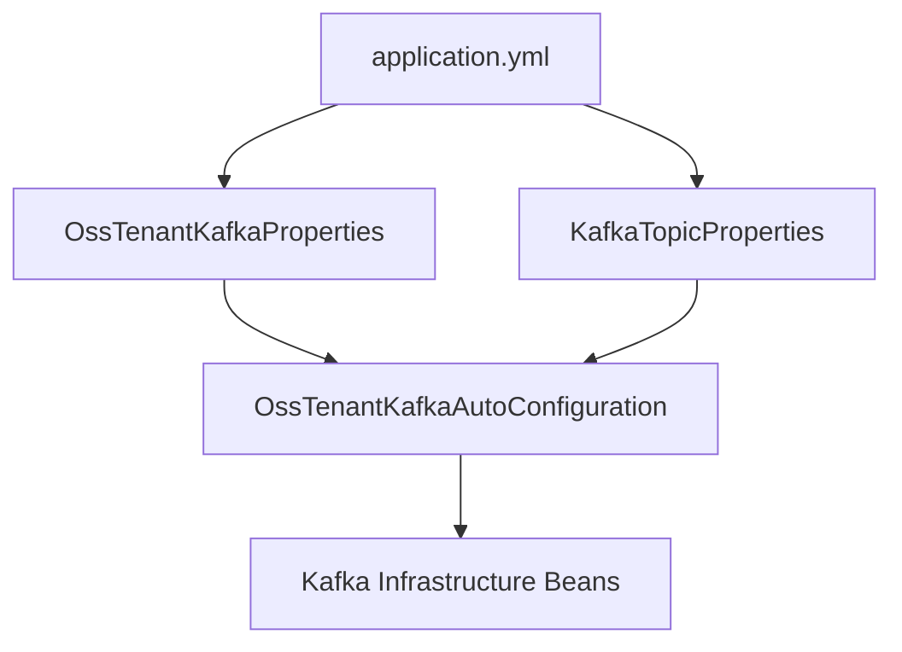

# Data Infrastructure Kafka

## Overview

The **Data Infrastructure Kafka** module provides the foundational Kafka configuration and infrastructure for the OpenFrame platform. It standardizes how services connect to, produce to, and consume from the OSS (tenant-aware) Kafka cluster.

This module is responsible for:

- Centralized Kafka configuration for the OSS tenant cluster
- Producer and consumer factory setup
- Listener container configuration
- Topic auto-creation
- Kafka admin configuration
- Standardized message headers
- Recovery logging for failed producer operations

It acts as the infrastructure layer used by higher-level modules such as stream processing, management services, and other event-driven components.

---

## Architectural Context

Data Infrastructure Kafka sits at the core of the event-driven backbone of the system.



### Responsibilities Split

- **Data Infrastructure Kafka**: Configuration, factories, templates, admin, topic creation.
- **Stream Processing Core**: Business-level message handling and enrichment.
- **Management Service Core**: Stream initialization and operational coordination.

This separation ensures a clean layering between infrastructure concerns and business logic.

---

## Core Components

### 1. OssKafkaConfig

Class:
- `deps.openframe-oss-lib.openframe-data-kafka.src.main.java.com.openframe.kafka.config.OssKafkaConfig.OssKafkaConfig`

**Purpose:**
- Enables Kafka support with `@EnableKafka`.
- Explicitly excludes Spring Boot's default `KafkaAutoConfiguration`.

This ensures that the platform uses its own controlled configuration strategy rather than implicit Spring defaults.



---

### 2. OssTenantKafkaProperties

Class:
- `deps.openframe-oss-lib.openframe-data-kafka.src.main.java.com.openframe.kafka.config.OssTenantKafkaProperties.OssTenantKafkaProperties`

**Purpose:**
- Binds configuration under the prefix `spring.oss-tenant`.
- Wraps Spring's `KafkaProperties`.
- Controls whether the OSS Kafka cluster configuration is enabled.

Key Features:

- `enabled` flag (default: `true`)
- Full access to producer, consumer, admin, and listener properties
- Bootstrap servers and serialization settings inherited from `KafkaProperties`

This class acts as the root configuration entry point for the OSS Kafka cluster.

---

### 3. KafkaTopicProperties

Class:
- `deps.openframe-oss-lib.openframe-data-kafka.src.main.java.com.openframe.kafka.config.KafkaTopicProperties.KafkaTopicProperties`

**Purpose:**
- Binds topic configuration under:

```text
openframe.oss-tenant.kafka.topics
```

### Structure



Each inbound topic configuration defines:

- `name`
- `partitions` (default: 1)
- `replicationFactor` (default: 1)

This is used by the auto-configuration class to create topics automatically at startup when admin is enabled.

---

### 4. OssTenantKafkaAutoConfiguration

Class:
- `deps.openframe-oss-lib.openframe-data-kafka.src.main.java.com.openframe.kafka.config.OssTenantKafkaAutoConfiguration.OssTenantKafkaAutoConfiguration`

**Purpose:**
Provides full Kafka infrastructure auto-configuration for the OSS tenant cluster.

Activated when:

```text
spring.oss-tenant.kafka.enabled=true
```

#### Beans Created



#### Producer Configuration

- Key serializer: `StringSerializer`
- Value serializer: `JsonSerializer`
- Uses properties from `KafkaProperties`

#### Consumer Configuration

- Key deserializer: `StringDeserializer`
- Value deserializer: `JsonDeserializer`
- Configurable:
  - Concurrency
  - Ack mode (defaults to `RECORD`)
  - Poll timeout
  - Idle event interval

#### Listener Container Behavior

If no ack mode is configured, it defaults to:

```text
ContainerProperties.AckMode.RECORD
```

This ensures per-record acknowledgment, improving reliability and replay safety.

#### Topic Auto-Creation

When admin is enabled:

- Reads inbound topics from `KafkaTopicProperties`
- Registers them via `KafkaAdmin.NewTopics`
- Logs topic name, partitions, and replication factor

---

### 5. KafkaHeader

Class:
- `deps.openframe-oss-lib.openframe-data-kafka.src.main.java.com.openframe.kafka.enumeration.KafkaHeader.KafkaHeader`

Defines standardized Kafka headers used across services.

Currently:

```text
message-type
```

This header is typically used to:

- Identify event type
- Enable routing or polymorphic deserialization
- Support downstream stream processors

---

### 6. KafkaRecoveryHandlerImpl

Class:
- `deps.openframe-oss-lib.openframe-data-kafka.src.main.java.com.openframe.kafka.producer.retry.KafkaRecoveryHandlerImpl.KafkaRecoveryHandlerImpl`

**Purpose:**
Handles producer-side recovery scenarios.

When message publishing fails, the `enqueue` method:

- Logs structured error details
- Includes topic, key, error class, message
- Logs the payload snapshot
- Attaches stack trace



This implementation currently focuses on observability rather than dead-letter routing, but it provides a clear extension point for:

- Dead-letter topics
- Retry queues
- External alerting

---

## Configuration Model

The configuration hierarchy is intentionally layered:



This ensures:

- Clear separation between connection config and topic config
- Full control via externalized configuration
- Predictable startup behavior

---

## Multi-Tenant Considerations

Although this module configures a shared OSS tenant cluster, it is designed to:

- Support tenant-scoped topics
- Work alongside tenant-aware headers
- Integrate with higher-level tenant context mechanisms

Tenant resolution and context propagation are handled at higher layers, but this module ensures that the Kafka infrastructure is consistent and extensible.

---

## Interaction With Other Modules

Data Infrastructure Kafka is used by:

- Stream Processing components for consuming and enriching events
- Management services for initialization and orchestration
- Any service that publishes domain events

It does not implement business logic. Instead, it provides:

- Stable, reusable Kafka wiring
- Centralized configuration patterns
- Reliable message publishing and consumption infrastructure

---

## Design Principles

1. **Infrastructure First** – No business logic in this module.
2. **Spring Boot Compatible** – Leverages `KafkaProperties` for full flexibility.
3. **Explicit Over Implicit** – Default auto-configuration is excluded.
4. **Observable Failures** – Recovery handler logs structured errors.
5. **Configurable by Property** – Fully driven by external configuration.

---

## Summary

The **Data Infrastructure Kafka** module is the foundational Kafka integration layer of the platform. It:

- Defines OSS tenant Kafka configuration
- Creates producer and consumer factories
- Configures listener containers
- Manages topic creation
- Standardizes message headers
- Provides recovery logging hooks

By isolating Kafka infrastructure concerns here, the platform achieves a clean separation between:

- Messaging infrastructure
- Stream processing logic
- Domain and business services

This modular approach ensures scalability, maintainability, and operational clarity across the OpenFrame ecosystem.
