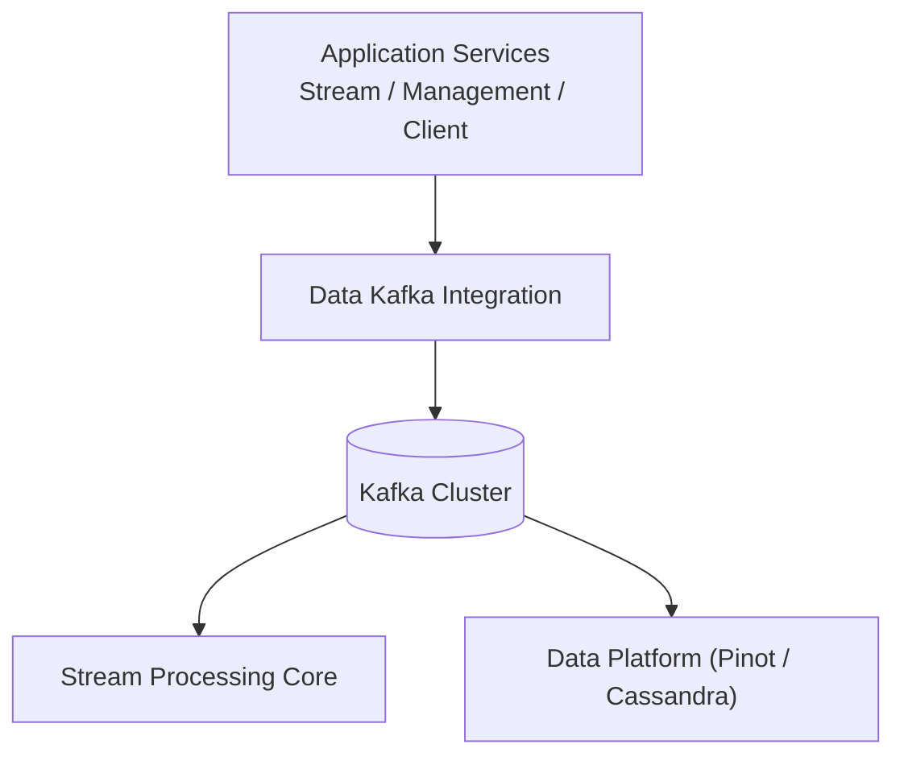
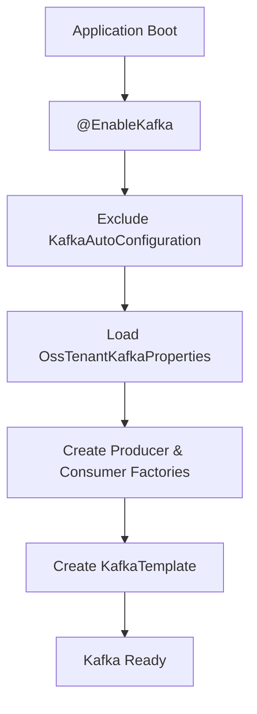
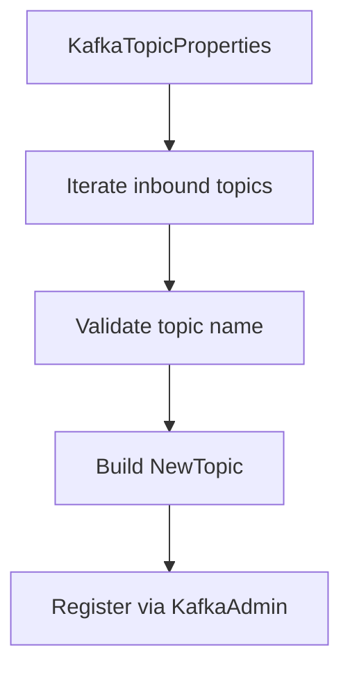
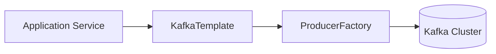
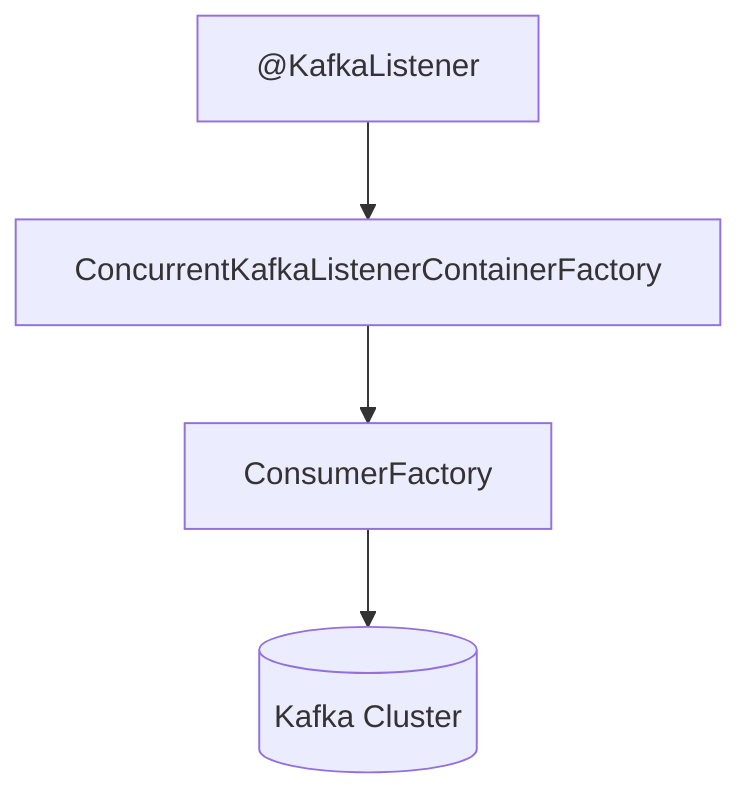
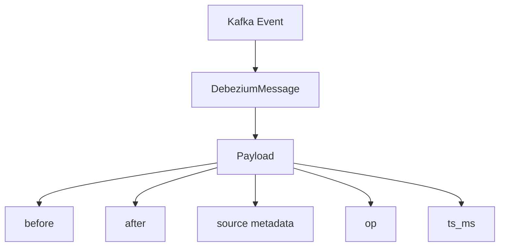
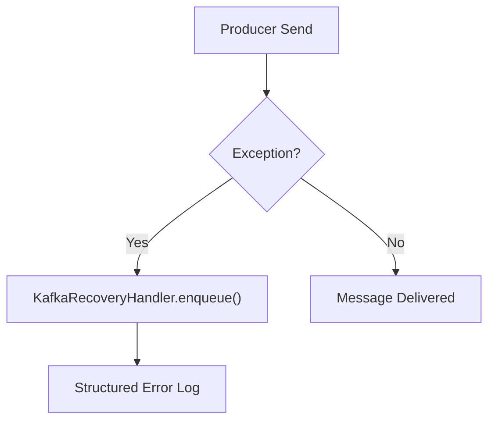

# Data Kafka Integration

The **Data Kafka Integration** module provides the foundational Kafka infrastructure for the OpenFrame OSS tenant platform. It standardizes how services connect to Kafka, configure producers and consumers, manage topics, and process change data capture (CDC) events such as Debezium messages.

This module acts as the **Kafka infrastructure layer** for:

- [Stream Processing Core](../stream_processing_core/stream_processing_core.md)
- [Management Service Core Initialization Scheduling](../management_service_core_initialization_scheduling/management_service_core_initialization_scheduling.md)
- [Client Service Core](../client_service_core/client_service_core.md)
- Any other service that requires tenant-aware Kafka connectivity

It centralizes:

- OSS tenant Kafka cluster configuration
- Topic auto-creation and provisioning
- Producer and consumer factory setup
- Standard headers and message conventions
- Debezium CDC message modeling
- Producer recovery logging strategy

---

## Architectural Role in the Platform

The Data Kafka Integration module sits between application services and the Kafka cluster, abstracting configuration complexity and enforcing consistent conventions.



### Responsibilities

1. Replace default Spring Kafka auto-configuration with tenant-aware configuration.
2. Provide configurable topic registration and lifecycle management.
3. Expose standardized producer and consumer factories.
4. Support Debezium-based CDC pipelines.
5. Provide structured error handling for failed Kafka sends.

---

## Module Structure

The Data Kafka Integration module consists of the following core components:

### 1. Kafka Configuration Layer

- `OssKafkaConfig`
- `OssTenantKafkaAutoConfiguration`
- `OssTenantKafkaProperties`
- `KafkaTopicProperties`

These classes define how the OSS tenant Kafka cluster is configured and bootstrapped.

### 2. Messaging Conventions

- `KafkaHeader`

Defines shared Kafka header constants used across services.

### 3. CDC Message Modeling

- `DebeziumMessage<T>`

Provides a strongly-typed model for Debezium change events.

### 4. Producer Recovery Strategy

- `KafkaRecoveryHandlerImpl`

Handles structured logging and recovery logic when Kafka producer operations fail.

---

## OSS Tenant Kafka Configuration Flow

The module disables Spring’s default Kafka auto-configuration and replaces it with a controlled, tenant-scoped configuration.



### OssKafkaConfig

- Enables Kafka support via `@EnableKafka`
- Excludes `KafkaAutoConfiguration`
- Ensures only OSS tenant configuration is active

This guarantees predictable Kafka behavior across services.

---

## Tenant-Aware Kafka Properties

### OssTenantKafkaProperties

Prefix:

```text
spring.oss-tenant
```

This class wraps Spring’s `KafkaProperties`, allowing full reuse of:

- Producer settings
- Consumer settings
- Listener settings
- Template settings
- Admin settings

Feature flag:

```text
spring.oss-tenant.enabled=true
```

Kafka beans are only created if enabled.

---

## Topic Management and Auto-Creation

### KafkaTopicProperties

Prefix:

```text
openframe.oss-tenant.kafka.topics
```

Structure:

```text
autoCreate: true|false
inbound:
  logicalName:
    name: actual.kafka.topic
    partitions: 3
    replicationFactor: 2
```

### Topic Creation Flow



If `spring.oss-tenant.kafka.admin.enabled=true`, topics are registered automatically at startup using `KafkaAdmin.NewTopics`.

This ensures:

- Idempotent topic provisioning
- Environment portability
- Declarative topic definitions

---

## Producer Infrastructure

Created Beans:

- `ossTenantKafkaProducerFactory`
- `ossTenantKafkaTemplate`
- `ossTenantKafkaProducer`

### Serialization Defaults

- Key: `StringSerializer`
- Value: `JsonSerializer`

### Producer Flow



The template can optionally set a default topic via configuration.

---

## Consumer Infrastructure

Created Beans:

- `ossTenantKafkaConsumerFactory`
- `ossTenantKafkaListenerContainerFactory`

### Deserialization Defaults

- Key: `StringDeserializer`
- Value: `JsonDeserializer`

### Listener Configuration

Supports:

- Concurrency
- Ack mode (defaults to `RECORD`)
- Poll timeout
- Idle event interval
- Logging of container config



This configuration is used heavily by the [Stream Processing Core](../stream_processing_core/stream_processing_core.md).

---

## Kafka Headers Convention

### KafkaHeader

Defines shared header names used across services.

```text
MESSAGE_TYPE_HEADER = "message-type"
```

This enables downstream services to:

- Route events
- Apply different deserialization strategies
- Perform enrichment logic based on message type

---

## Debezium Change Data Capture Model

### DebeziumMessage<T>

Provides a generic wrapper for Debezium CDC events.



#### Payload Fields

- `before` — entity state before change
- `after` — entity state after change
- `operation` — insert/update/delete
- `timestamp` — event time
- `source` — connector metadata (database, table, collection)

This model is consumed by:

- Stream handlers
- Debezium message processors
- Data enrichment services

It provides a consistent abstraction for CDC events coming from MongoDB, Cassandra, or other connectors.

---

## Producer Recovery Strategy

### KafkaRecoveryHandlerImpl

Implements a recovery mechanism when producer send operations fail.

Current strategy:

- Logs structured error
- Includes:
  - Topic
  - Key
  - Exception class
  - Exception message
  - Payload summary
  - Stack trace



This design allows:

- Future dead-letter queue support
- Retry policies
- Observability integration
- Structured error analytics

---

## How Other Modules Use This Module

### Stream Processing Core

Consumes Kafka events using the listener factory and deserializers configured here.

Reference:
- [Stream Processing Core](../stream_processing_core/stream_processing_core.md)

### Management Service Core Initialization Scheduling

Uses Kafka for:

- Debezium initialization
- Event publishing
- Background scheduling tasks

Reference:
- [Management Service Core Initialization Scheduling](../management_service_core_initialization_scheduling/management_service_core_initialization_scheduling.md)

### Client Service Core

Publishes metrics, heartbeat events, and agent registration events.

Reference:
- [Client Service Core](../client_service_core/client_service_core.md)

---

## Design Principles

1. **Tenant Isolation**
   - Uses `spring.oss-tenant` namespace.
   - Avoids collision with other Kafka clusters.

2. **Convention Over Configuration**
   - Default serializers/deserializers.
   - Default ack mode fallback.

3. **Declarative Topic Management**
   - Infrastructure-as-configuration.

4. **Extensibility**
   - Easily extend recovery handler.
   - Add dead-letter or retry topics.

5. **Operational Observability**
   - Structured logging for recovery.
   - Startup logging for topic registration.

---

## Summary

The **Data Kafka Integration** module provides the standardized Kafka infrastructure for the OpenFrame OSS tenant platform.

It ensures:

- Predictable Kafka configuration
- Tenant-aware isolation
- Automatic topic provisioning
- CDC compatibility via Debezium modeling
- Safe producer error handling

All higher-level streaming and event-driven services rely on this module to interact with Kafka in a consistent, production-ready manner.