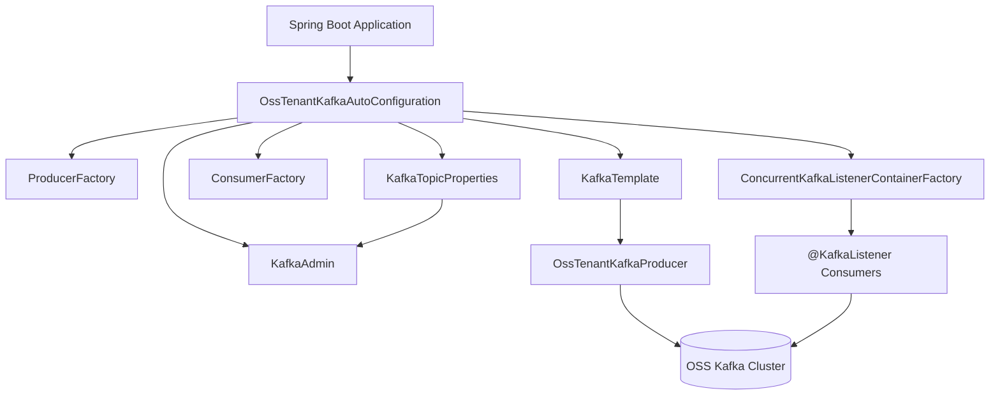
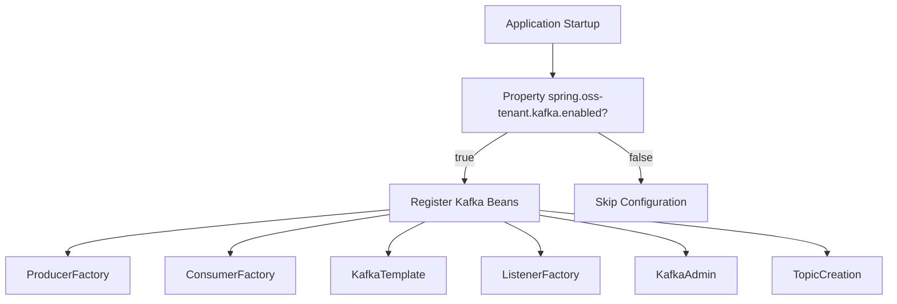
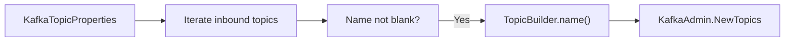
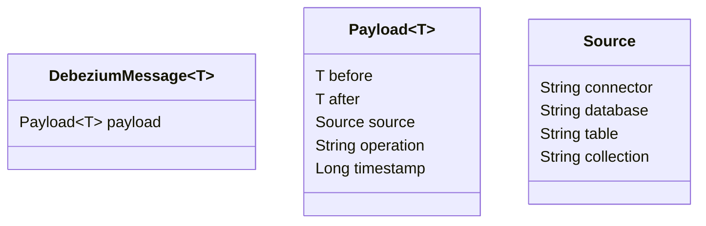
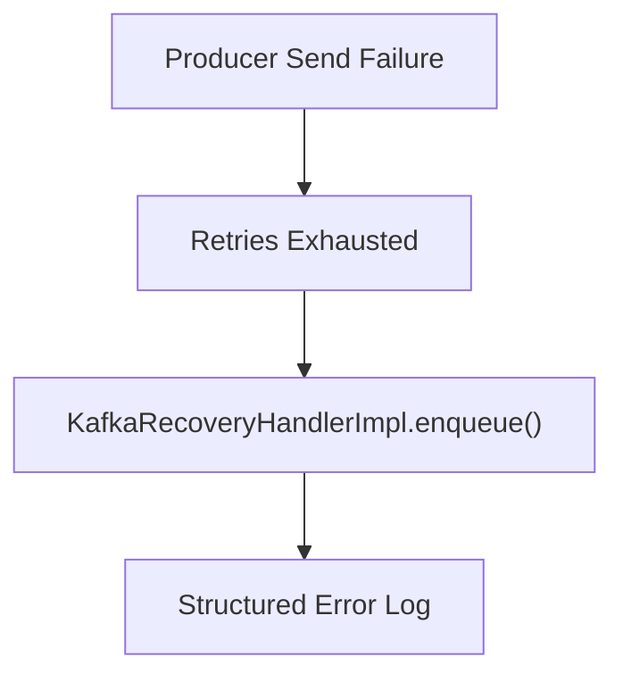
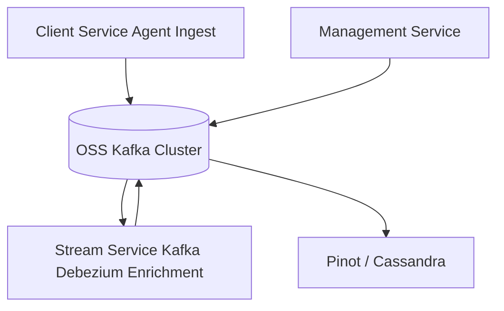

# Data Kafka Tenant Autoconfig

## Overview

The **Data Kafka Tenant Autoconfig** module provides opinionated, multi-tenant–aware Kafka auto-configuration for the OpenFrame OSS Tenant platform. It replaces the default Spring Boot Kafka auto-configuration with a dedicated configuration namespace (`spring.oss-tenant`) and wires all required producer, consumer, admin, and topic management beans for the main OSS Kafka cluster.

This module acts as the foundational Kafka infrastructure layer used by higher-level services such as:

- [Stream Service Kafka Debezium Enrichment](../stream_service_kafka_debezium_enrichment/stream_service_kafka_debezium_enrichment.md)
- [Management Service Initializers Schedulers](../management_service_initializers_schedulers/management_service_initializers_schedulers.md)
- [Client Service Agent Ingest](../client_service_agent_ingest/client_service_agent_ingest.md)

It centralizes:

- Kafka cluster configuration
- Topic auto-creation
- Producer and consumer factories
- JSON serialization/deserialization
- Multi-tenant enablement controls
- Structured recovery logging for failed producer sends

---

## High-Level Architecture



### Key Design Decisions

1. **Custom Namespace**: Uses `spring.oss-tenant.kafka` instead of default `spring.kafka`.
2. **Auto-configuration Control**: Activated only when `spring.oss-tenant.kafka.enabled=true`.
3. **Default Kafka Exclusion**: Explicitly excludes `KafkaAutoConfiguration` to prevent conflicting bean definitions.
4. **JSON by Default**: Uses `JsonSerializer` and `JsonDeserializer` for message payloads.
5. **Topic Bootstrapping**: Supports declarative topic creation via configuration properties.

---

## Configuration Model

### OssTenantKafkaProperties

`OssTenantKafkaProperties` binds configuration under:

```text
spring.oss-tenant
```

It wraps Spring’s `KafkaProperties` object and adds an `enabled` flag:

- `enabled` (default: true)
- Full access to standard Kafka properties (bootstrap servers, producer, consumer, listener, template, etc.)

This design ensures compatibility with Spring Kafka while isolating tenant-specific configuration.

---

### KafkaTopicProperties

`KafkaTopicProperties` binds topic configuration under:

```text
openframe.oss-tenant.kafka.topics
```

Structure:

```text
openframe:
  oss-tenant:
    kafka:
      topics:
        autoCreate: true
        inbound:
          machine-events:
            name: machine.pinot.topic
            partitions: 3
            replicationFactor: 2
```

Each inbound topic supports:

- `name`
- `partitions` (default: 1)
- `replicationFactor` (default: 1)

When Kafka admin is enabled, topics are automatically registered using `TopicBuilder`.

---

## Auto-Configuration Lifecycle

The core orchestration happens in `OssTenantKafkaAutoConfiguration`.



### Conditional Activation

The configuration is annotated with:

- `@AutoConfiguration`
- `@ConditionalOnProperty(prefix = "spring.oss-tenant.kafka", name = "enabled", havingValue = "true")`

This ensures that:

- Kafka is fully disabled when not required
- No partial or conflicting beans are created

---

## Core Beans

### 1. ProducerFactory

Bean name:

```text
ossTenantKafkaProducerFactory
```

Configuration:

- Key serializer: `StringSerializer`
- Value serializer: `JsonSerializer`

Builds producer properties via:

```java
properties.getKafka().buildProducerProperties(null);
```

---

### 2. KafkaTemplate

Bean name:

```text
ossTenantKafkaTemplate
```

Features:

- Uses the custom producer factory
- Applies `defaultTopic` if defined in properties
- Used by `OssTenantKafkaProducer`

---

### 3. ConsumerFactory

Bean name:

```text
ossTenantKafkaConsumerFactory
```

Configuration:

- Key deserializer: `StringDeserializer`
- Value deserializer: `JsonDeserializer`

---

### 4. KafkaListenerContainerFactory

Bean name:

```text
ossTenantKafkaListenerContainerFactory
```

Configurable properties include:

- `concurrency`
- `ackMode` (defaults to `RECORD`)
- `pollTimeout`
- `idleEventInterval`
- `logContainerConfig`

This enables fine-grained control over consumer threading and acknowledgment strategy.

---

### 5. KafkaAdmin and Topic Registration

If `spring.oss-tenant.kafka.admin.enabled=true` (default):

- A `KafkaAdmin` bean is created.
- Topics defined in `KafkaTopicProperties` are registered.

Topic registration flow:



Each topic is logged upon registration.

---

## Message Models

### MachinePinotMessage

Represents machine state changes for analytical pipelines (e.g., Pinot).

Fields:

- `machineId`
- `organizationId`
- `deviceType`
- `status`
- `osType`
- `tags`

Used when:

- Device state changes
- Tags are updated
- Machine-related events occur

This model integrates naturally with:

- [Data Core Cassandra Pinot And Models](../data_core_cassandra_pinot_and_models/data_core_cassandra_pinot_and_models.md)

---

### DebeziumMessage<T>

A generic wrapper for Debezium CDC events.

Structure:



Key attributes:

- `before`: previous state
- `after`: new state
- `operation`: c (create), u (update), d (delete)
- `source`: metadata about DB/connector

This model supports event-driven data pipelines, especially in:

- [Stream Service Kafka Debezium Enrichment](../stream_service_kafka_debezium_enrichment/stream_service_kafka_debezium_enrichment.md)

---

## Kafka Headers

`KafkaHeader` defines shared header constants.

Currently:

```text
message-type
```

This allows consumers to:

- Differentiate payload types
- Route logic dynamically
- Support polymorphic message handling

---

## Error Recovery Strategy

### KafkaRecoveryHandlerImpl

Implements a recovery mechanism invoked when producer retries are exhausted.

Behavior:

- Serializes payload to string
- Logs structured error details
- Includes:
  - Topic
  - Key
  - Exception class
  - Exception message
  - Payload summary
  - Full stack trace



Currently, recovery logs only. This design allows future extension to:

- Dead-letter topics
- Persistent failure storage
- Alerting pipelines

---

## Multi-Tenant Considerations

The module supports tenant-aware isolation through:

- Dedicated Kafka namespace (`spring.oss-tenant`)
- Configurable topic naming strategies
- Segregated producer and consumer beans
- Independent enable/disable toggle

This enables:

- Multiple Kafka clusters (if needed)
- Clean separation between OSS tenant traffic and other environments
- Safe extension for enterprise multi-cluster setups

---

## Integration Within the Platform



The Data Kafka Tenant Autoconfig module provides the infrastructure glue enabling:

- CDC pipelines (Debezium → Kafka → Stream processing)
- Machine analytics updates
- Event-driven microservices communication
- Scheduled management publishing

It is intentionally infrastructure-focused and does not contain business logic. Instead, it standardizes Kafka behavior across all tenant services.

---

## Summary

The **Data Kafka Tenant Autoconfig** module:

- Replaces default Spring Kafka auto-configuration
- Provides tenant-scoped Kafka configuration
- Enables declarative topic creation
- Standardizes producer/consumer factories
- Supports CDC message modeling
- Implements structured recovery logging

It forms the Kafka backbone of the OpenFrame OSS Tenant architecture, ensuring consistency, configurability, and multi-tenant safety across the entire platform.