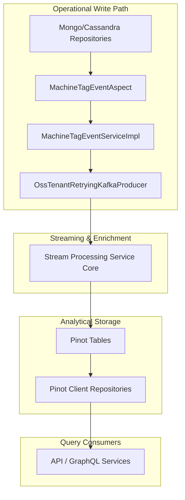
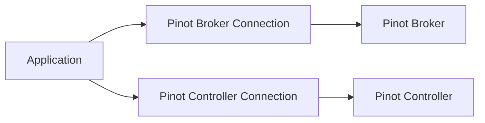
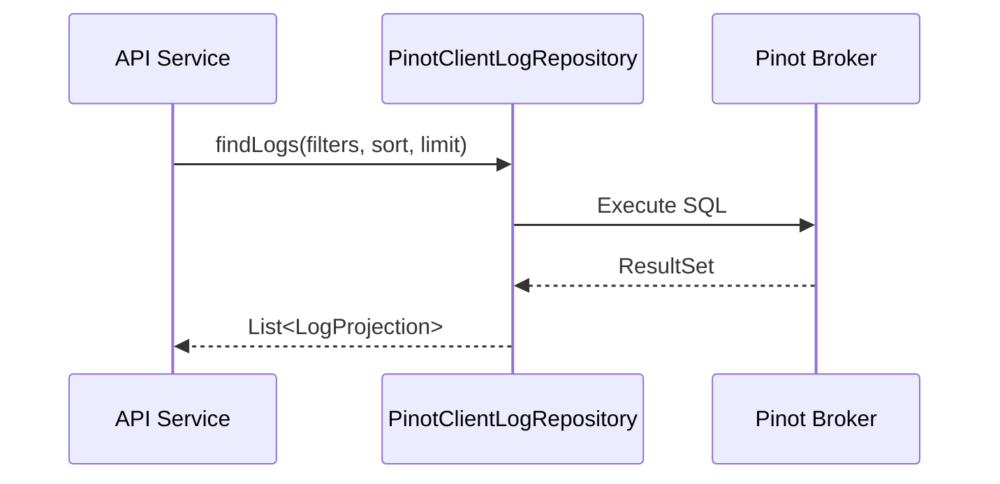
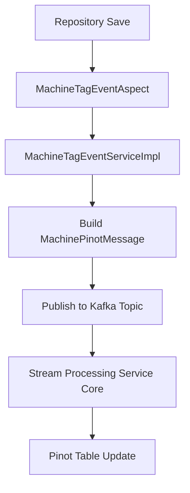
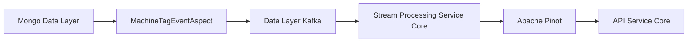

# Data Layer Core Datastores And Pinot

The **Data Layer Core Datastores And Pinot** module provides the foundational infrastructure for multi-datastore persistence and analytical querying in OpenFrame. It bridges operational data stores (Cassandra), analytical storage (Apache Pinot), and event-driven propagation (Kafka) to ensure device and log data remain consistent, queryable, and scalable.

This module is responsible for:

- Cassandra configuration and lifecycle management
- Apache Pinot connectivity and repository abstractions
- Cross-entity event propagation via AOP
- Kafka message emission for device/tag changes
- Health monitoring of core datastores

It acts as the central integration point between:

- [Data Layer Mongo Models And Repositories](../data_layer_mongo_models_and_repositories/data_layer_mongo_models_and_repositories.md)
- [Data Layer Kafka](../data_layer_kafka/data_layer_kafka.md)
- [Stream Processing Service Core](../stream_processing_service_core/stream_processing_service_core.md)

---

## Architectural Overview



### Core Responsibilities

| Concern | Component | Responsibility |
|----------|------------|----------------|
| Cassandra setup | `CassandraConfig` | Keyspace creation, session configuration |
| Keyspace normalization | `CassandraKeyspaceNormalizer` | Converts dashed tenant IDs to valid Cassandra keyspaces |
| Pinot connectivity | `PinotConfig` | Broker and controller connections |
| Event interception | `MachineTagEventAspect` | Intercepts repository saves |
| Event processing | `MachineTagEventServiceImpl` | Builds and publishes Kafka messages |
| Analytics querying | `PinotClientDeviceRepository`, `PinotClientLogRepository` | Executes dynamic Pinot SQL queries |
| Health monitoring | `CassandraHealthIndicator` | Validates Cassandra connectivity |

---

# Cassandra Integration

Cassandra is used for distributed, horizontally scalable operational storage.

## Key Components

### CassandraConfig

- Extends `AbstractCassandraConfiguration`
- Automatically creates keyspace if missing
- Configures:
  - Contact points
  - Local datacenter
  - Replication factor
  - Load balancing strategy

Keyspace creation occurs before session initialization to prevent startup race conditions.

### CassandraKeyspaceNormalizer

Because Cassandra keyspaces only allow alphanumeric characters and underscores, tenant IDs containing dashes are normalized.

```text
Original: tenant-prod-1
Normalized: tenant_prod_1
```

This runs as an `ApplicationContextInitializer`, ensuring normalization occurs after configuration loading.

### CassandraHealthIndicator

Provides Spring Boot Actuator integration.

Health check query:

```sql
SELECT release_version FROM system.local
```

If the query fails, the service reports `DOWN`.

---

# Apache Pinot Integration

Apache Pinot provides low-latency OLAP querying for:

- Devices
- Logs
- Aggregations
- Filter options

## PinotConfig

Creates two connection beans:

- Broker connection (query execution)
- Controller connection (administrative operations)



---

## PinotClientDeviceRepository

Provides dynamic filtering and aggregation for devices.

### Features

- Dynamic WHERE clause construction
- Excludes `DELETED` status automatically
- Aggregation queries for filter options
- Count queries for pagination

### Query Pattern

```sql
SELECT status, COUNT(*) as count
FROM "devices"
WHERE <dynamic conditions>
GROUP BY status
ORDER BY count DESC
```

### Supported Filters

- Status
- Device type
- OS type
- Organization ID
- Tags

This repository powers filter sidebars and device dashboards.

---

## PinotClientLogRepository

Provides advanced log querying and search capabilities.

### Capabilities

- Date range filtering
- Cursor-based pagination
- Full-text relevance search
- Sort validation
- Distinct value extraction

### Sortable Columns

```text
- eventTimestamp
- severity
- eventType
- toolType
- organizationId
- deviceId
- ingestDay
```

### Query Flow



---

# Event-Driven Synchronization

One of the most critical responsibilities of this module is maintaining synchronization between operational entities and analytical storage.

## MachineTagEventAspect

An AOP aspect that intercepts repository operations:

Intercepted operations:

- `MachineRepository.save`
- `MachineRepository.saveAll`
- `MachineTagRepository.save`
- `MachineTagRepository.saveAll`
- `TagRepository.save`
- `TagRepository.saveAll`

This ensures analytics are updated whenever:

- A device changes status
- A device receives a tag
- A tag name changes

---

## MachineTagEventServiceImpl

Implements business logic for:

- Aggregating machine + tags
- Building `MachinePinotMessage`
- Publishing to Kafka



### MachinePinotMessage Contents

- machineId
- organizationId
- deviceType
- status
- osType
- tag names

The message key is the `machineId`, ensuring partition consistency.

---

# Supporting Models

## ToolCredentials

Generic credential container used across integrations.

Fields include:

- username
- password
- token
- apiKey
- clientId
- clientSecret

## NATS Event Models

Lightweight event models:

- `ClientConnectionEvent`
- `InstalledAgentMessage`
- `ToolConnectionMessage`

These are used for real-time event propagation and stream ingestion.

---

# Cross-Module Relationships



### Integration Points

- Mongo persistence is defined in [Data Layer Mongo Models And Repositories](../data_layer_mongo_models_and_repositories/data_layer_mongo_models_and_repositories.md)
- Kafka producer configuration is defined in [Data Layer Kafka](../data_layer_kafka/data_layer_kafka.md)
- Stream ingestion and enrichment are handled by [Stream Processing Service Core](../stream_processing_service_core/stream_processing_service_core.md)

---

# Design Characteristics

## Multi-Store Architecture

- MongoDB → transactional document storage
- Cassandra → distributed wide-column storage
- Pinot → real-time OLAP analytics
- Kafka → event propagation backbone

## Tenant-Aware Design

- Keyspace normalization supports tenant-based isolation
- Kafka topic routing is tenant-scoped
- Machine events are keyed by machineId

## Scalability Strategy

- Write operations are decoupled via Kafka
- Analytical queries avoid operational database load
- Filter aggregations run inside Pinot

---

# Summary

The **Data Layer Core Datastores And Pinot** module provides the backbone for:

- Distributed storage configuration
- Analytical query access
- Event-driven synchronization
- Tenant-aware scalability

It ensures that operational changes (devices, tags, logs) are automatically propagated to analytical systems while keeping service boundaries clean and decoupled.