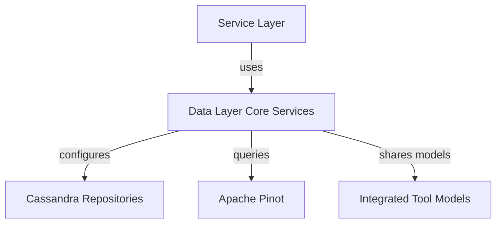
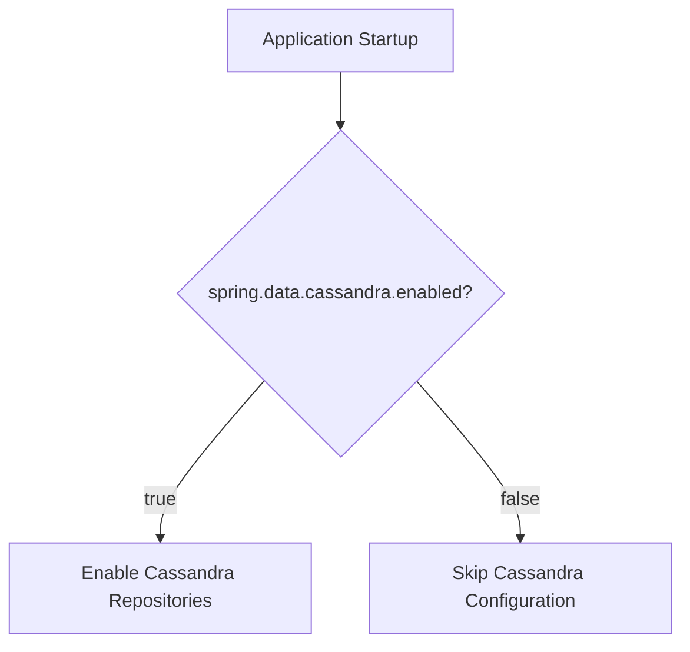
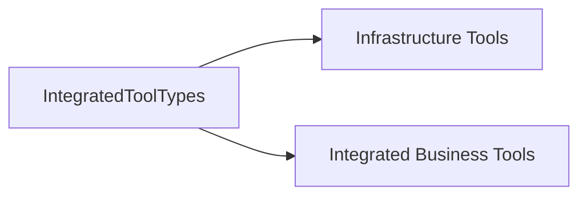
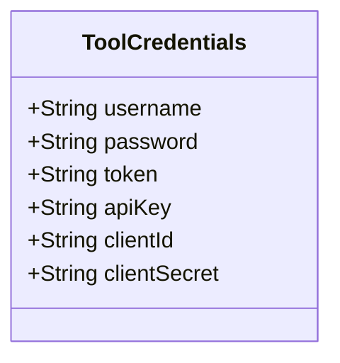
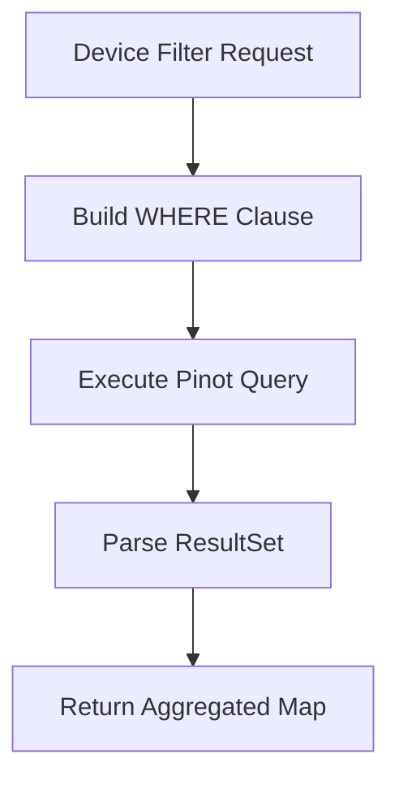
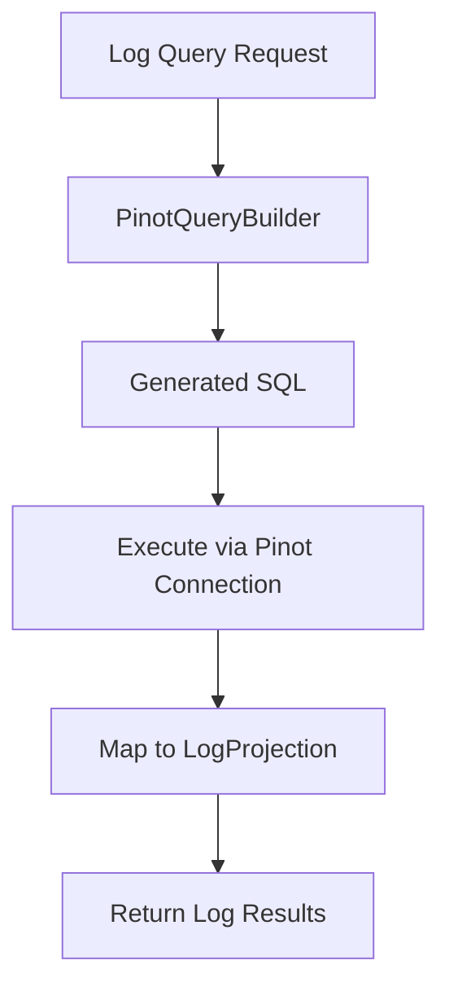
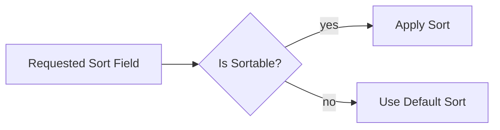

# Data Layer Core Services

## Overview

The **Data Layer Core Services** module provides foundational, database-adjacent abstractions and analytical repository implementations used across the OpenFrame platform. It acts as a bridge between domain services and specialized data stores such as Cassandra and Apache Pinot.

This module focuses on:

- Conditional data store configuration
- Cross-service data models for integrated tools
- Credential abstraction for tool integrations
- High-performance analytical querying via Apache Pinot

Unlike storage-specific modules (e.g., Mongo or Kafka integrations), Data Layer Core Services defines reusable configuration and analytical access patterns that are consumed by API, Stream, and Management services.

---

## Architectural Role in the Platform

At a high level, this module sits between business services and specialized analytical data stores.



### Responsibilities

1. **Conditional Data Configuration** (Cassandra enablement)
2. **Shared Domain Models** (tool types and credentials)
3. **Analytical Repositories** (Pinot device and log queries)
4. **Query Abstraction and Error Handling**

---

# Core Components

## 1. Data Configuration

**Component:** `DataConfiguration`

This class provides conditional activation of Cassandra repositories.

### Behavior

Cassandra repositories are enabled only if the following property is set:

```text
spring.data.cassandra.enabled=true
```

If this property is not present or set to false, Cassandra repositories are not initialized.

### Configuration Flow



### Impact

- Allows flexible deployment across environments
- Prevents unnecessary repository initialization
- Supports modular infrastructure enablement

---

## 2. Integrated Tool Types

**Component:** `IntegratedToolTypes`

This class defines standardized string constants representing infrastructure and integrated tools used throughout the platform.

### Infrastructure Tools

- MONGODB
- REDIS
- CASSANDRA
- KAFKA
- NIFI
- PINOT
- PROMETHEUS
- GRAFANA
- LOKI

### Integrated Business Tools

- FLEET
- AUTHENTIK
- MYSQL
- POSTGRESQL

### Design Rationale

- Prevents string duplication
- Enables consistent tool-type comparisons
- Centralizes integration identifiers



---

## 3. Tool Credentials Model

**Component:** `ToolCredentials`

This data model encapsulates multiple authentication patterns used by integrated tools.

### Supported Credential Types

- Username / Password
- Token
- API Key
- Client ID / Client Secret

All fields are nullable to support flexible authentication strategies.



### Usage Context

This model is commonly used when:

- Registering integrated tools
- Connecting to external systems
- Authenticating service-to-service calls

---

# Apache Pinot Analytical Repositories

The most critical part of Data Layer Core Services is its Apache Pinot integration layer.

Two primary repositories provide analytical querying capabilities:

- `PinotClientDeviceRepository`
- `PinotClientLogRepository`

These repositories support high-performance, filterable, and aggregatable queries for UI dashboards and API endpoints.

---

## 4. Pinot Client Device Repository

**Component:** `PinotClientDeviceRepository`

### Purpose

Provides filter aggregation and count queries for device analytics.

### Key Capabilities

- Device status filter options
- Device type filter options
- OS type filter options
- Organization filter options
- Tag filter options
- Filtered device count

### Query Construction Strategy

The repository dynamically builds SQL WHERE clauses based on filter inputs.

Key characteristics:

- Always excludes deleted devices
- Combines filters with AND
- Combines values within a filter using OR

### Device Query Flow



### Error Handling

All execution errors are wrapped in a `PinotQueryException`, ensuring:

- Consistent exception propagation
- Clear logging
- Isolation of Pinot-specific failures

---

## 5. Pinot Client Log Repository

**Component:** `PinotClientLogRepository`

### Purpose

Provides time-range-based, filterable, sortable, and searchable log queries.

### Core Features

- Date-range filtering
- Cursor-based pagination
- Multi-field filtering (toolType, severity, eventType, organization)
- Search relevance filtering
- Dynamic sorting with validation
- Distinct filter option retrieval

### Log Query Pipeline



### Sort Validation

Sortable columns are restricted to a predefined set to prevent invalid queries.



### Advanced Capabilities

- Distinct organization option retrieval
- Severity and event type filter discovery
- Efficient column index mapping for projection building

---

# Internal Design Patterns

## 1. Repository Isolation

Pinot repositories encapsulate:

- SQL generation
- Result mapping
- Exception wrapping
- Logging

This prevents analytical logic from leaking into service layers.

## 2. Conditional Infrastructure Activation

Cassandra enablement is environment-driven, supporting multi-deployment strategies.

## 3. Strongly Typed Projections

Log results are mapped into projection objects rather than generic maps, improving:

- Type safety
- Maintainability
- API clarity

---

# Cross-Service Impact

Data Layer Core Services supports multiple service domains:

- API services (device and log endpoints)
- Stream services (event ingestion into analytical stores)
- Management services (tool integration analytics)

It enables:

- Real-time log filtering
- Device dashboard aggregations
- Organization-based segmentation
- High-volume analytical reads

---

# Summary

The **Data Layer Core Services** module provides the analytical backbone of the OpenFrame platform by:

- Enabling conditional Cassandra repositories
- Standardizing integrated tool identifiers
- Abstracting multi-mode authentication credentials
- Delivering high-performance Apache Pinot analytics repositories

It ensures scalable, filterable, and performant data access patterns while maintaining clean separation between infrastructure and business logic.