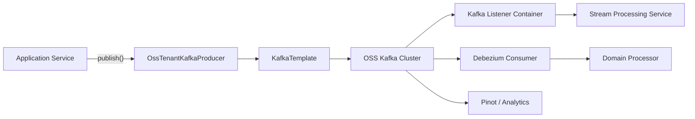
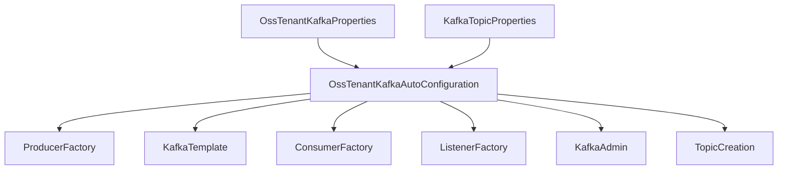
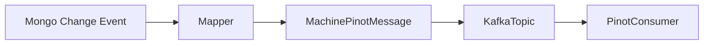
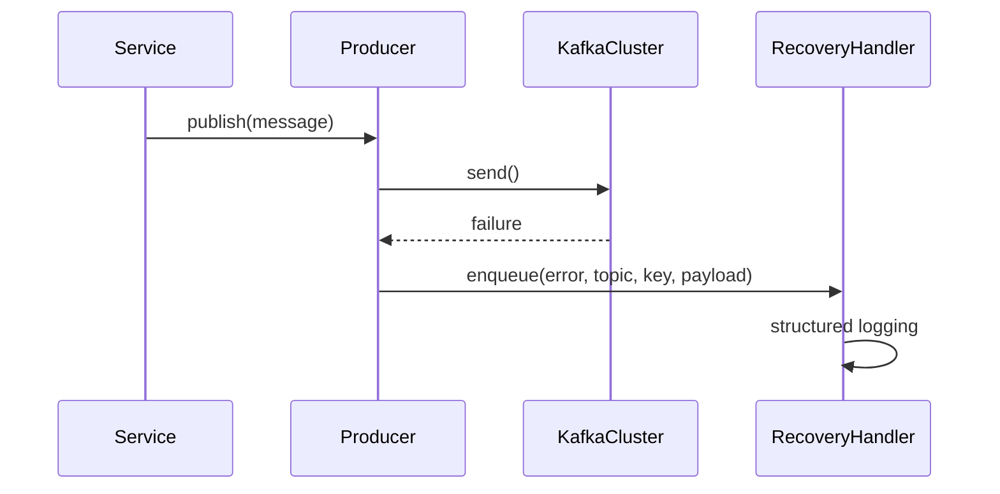
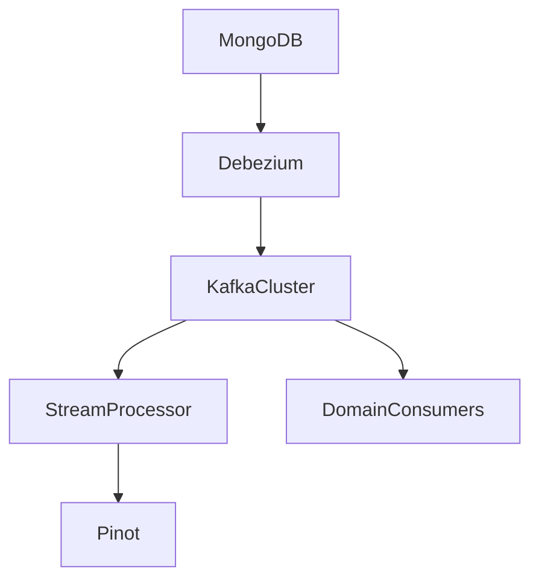

# Data Layer Kafka

The **Data Layer Kafka** module provides the foundational Kafka infrastructure for the OpenFrame platform. It standardizes Kafka configuration, topic management, message models, and recovery handling for all OSS tenant services.

This module acts as the integration backbone between:

- Stream processing services
- Management and initialization services
- Debezium change data capture pipelines
- Pinot and analytics ingestion
- Domain-level event publishers

It encapsulates Spring Kafka auto-configuration, multi-tenant configuration properties, topic auto-creation, message schemas, and failure recovery logic.

---

## Architectural Overview

The Data Layer Kafka module provides reusable Kafka infrastructure consumed by multiple services such as Stream Processing Service Core and Management Service Core.



### Key Responsibilities

1. Centralized Kafka configuration
2. Multi-tenant property isolation
3. Topic lifecycle management
4. Standardized message models
5. Structured recovery handling
6. Debezium message abstraction

---

# Core Components

## 1. Configuration Layer

### OssKafkaConfig

Disables Spring Boot's default Kafka auto-configuration and enables explicit Kafka configuration.

**Purpose:**
- Prevents accidental use of `KafkaAutoConfiguration`
- Ensures controlled configuration via OSS-specific properties

---

### OssTenantKafkaProperties

Configuration wrapper over Spring's `KafkaProperties` using the prefix:

```text
spring.oss-tenant.*
```

**Key features:**
- Toggle Kafka enablement
- Full producer/consumer/admin configuration
- Inherits all standard Spring Kafka configuration capabilities

---

### KafkaTopicProperties

Configuration properties for topic auto-creation.

```text
openframe.oss-tenant.kafka.topics.inbound.*
```

Supports:
- Topic name
- Partition count
- Replication factor
- Auto-create flag

This enables environment-driven topic provisioning without manual Kafka CLI usage.

---

### OssTenantKafkaAutoConfiguration

This is the central auto-configuration class.

It provides:

- ProducerFactory
- KafkaTemplate
- ConsumerFactory
- KafkaListenerContainerFactory
- KafkaAdmin
- Topic registration
- OssTenantKafkaProducer bean



### Listener Behavior

The listener container factory supports:

- Configurable concurrency
- Configurable ack mode (defaults to RECORD)
- Poll timeout configuration
- Idle event interval configuration

This ensures flexible runtime behavior across environments.

---

## 2. Messaging Models

### MachinePinotMessage

Represents machine-related change events sent to Kafka.

Triggered when changes occur in:
- Machine
- MachineTag
- Tag

Fields include:

- machineId
- organizationId
- deviceType
- status
- osType
- tags

Used primarily for:

- Pinot ingestion
- Device indexing
- Analytics pipelines



---

### DebeziumMessage<T>

Generic wrapper for Debezium CDC messages.

Structure:

```text
payload
  ├─ before
  ├─ after
  ├─ operation
  ├─ timestamp
  └─ source
```

This abstraction allows:

- Database-agnostic CDC handling
- Type-safe event processing
- Schema-aware message routing

It is typically consumed by Stream Processing Service Core.

---

## 3. Kafka Headers

### KafkaHeader

Defines standardized Kafka header keys.

Currently includes:

```text
message-type
```

This enables:

- Type-based message routing
- Consumer differentiation
- Polymorphic payload handling

---

## 4. Producer & Recovery

### OssTenantKafkaProducer

Exposed as a Spring bean via auto-configuration.

Wraps `KafkaTemplate` to provide:

- Simplified publishing
- Tenant-aware usage
- Standardized sending patterns

---

### KafkaRecoveryHandlerImpl

Handles producer failure scenarios.

Current behavior:

- Logs structured error details
- Includes topic, key, exception class, message, and payload
- Attaches stacktrace



This design allows future enhancement to:

- Dead-letter topics
- Retry queues
- Persistent failure stores

---

# Integration with Other Modules

## Stream Processing Service Core

The Stream Processing Service Core consumes Kafka topics configured by this module.

See:  
[Stream Processing Service Core](stream_processing_service_core/stream_processing_service_core.md)

---

## Data Layer Core Datastores and Pinot

MachinePinotMessage integrates with Pinot ingestion pipelines defined in:

[Data Layer Core Datastores and Pinot](data_layer_core_datastores_and_pinot/data_layer_core_datastores_and_pinot.md)

---

# Multi-Tenant Design Considerations

The module uses:

```text
spring.oss-tenant.kafka.*
```

This ensures:

- Tenant-specific configuration isolation
- Dedicated cluster flexibility
- Clean separation from default Spring Kafka properties

All beans are conditionally loaded using:

```text
spring.oss-tenant.kafka.enabled=true
```

This allows services to:

- Disable Kafka completely
- Run in lightweight mode
- Enable Kafka only where required

---

# Topic Lifecycle Management

When admin is enabled:

```text
spring.oss-tenant.kafka.admin.enabled=true
```

Topics defined under:

```text
openframe.oss-tenant.kafka.topics.inbound
```

are automatically created at startup.

This supports:

- Infrastructure as configuration
- Environment portability
- Automated provisioning

---

# End-to-End Data Flow



---

# Design Principles

1. Explicit over implicit configuration
2. Tenant isolation
3. Infrastructure as code
4. Message model standardization
5. Observable failure handling
6. Clean separation between producer, consumer, and admin responsibilities

---

# Summary

The **Data Layer Kafka** module is the messaging backbone of the OpenFrame platform. It provides:

- Fully controlled Kafka auto-configuration
- Tenant-aware property management
- Topic lifecycle automation
- Standardized message contracts
- Structured recovery handling
- Debezium CDC integration

It enables reliable event-driven communication across services including stream processing, analytics ingestion, management services, and domain processors while maintaining clean configuration boundaries and extensibility for future growth.
