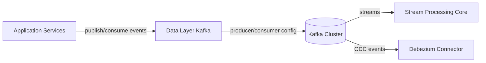
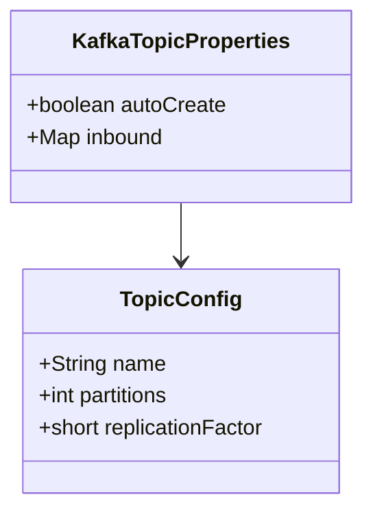
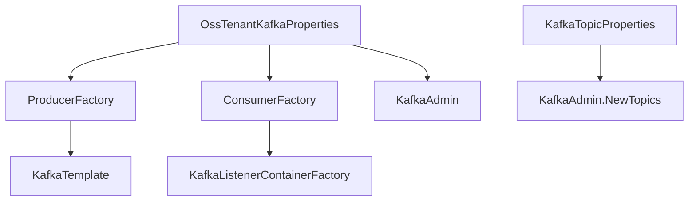
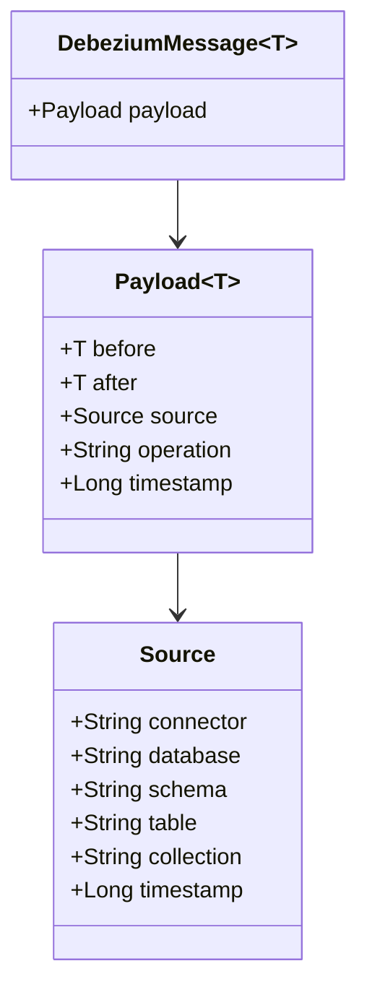
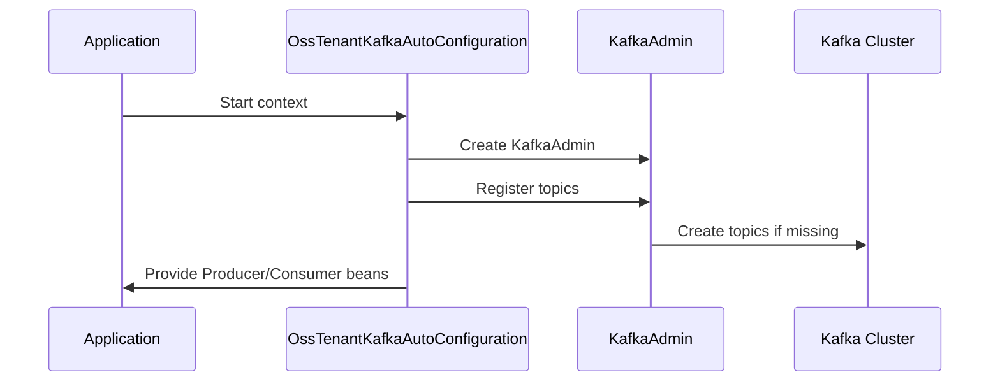

# Data Layer Kafka

## Overview

The **Data Layer Kafka** module provides the foundational Kafka configuration, topic management, and message model abstractions for the OpenFrame OSS tenant architecture. It acts as the standardized integration layer between application services and the Kafka messaging infrastructure.

This module does not implement business logic. Instead, it:

- Configures Kafka producers, consumers, and listener containers
- Provides tenant-aware Kafka properties
- Enables topic auto-creation
- Defines shared Kafka headers
- Models Debezium change data capture (CDC) messages

It is primarily consumed by stream-processing and service modules that require reliable, event-driven communication.

---

## Architectural Role in the Platform

Within the OpenFrame microservices architecture, Kafka is used for:

- Event streaming
- Change Data Capture (CDC)
- Asynchronous service-to-service communication
- Integration with external systems

The Data Layer Kafka module centralizes Kafka configuration so that all services use a consistent setup.



### Key Responsibilities

- Replace Spring Boot default Kafka auto-configuration
- Provide OSS tenant-scoped Kafka configuration
- Support dynamic topic registration
- Standardize message headers
- Provide a strongly-typed Debezium message model

---

## Module Components

The Data Layer Kafka module consists of the following core components:

### 1. KafkaTopicProperties

**Component:** `KafkaTopicProperties`

Provides configuration binding for topic definitions under the prefix:

```text
openframe.oss-tenant.kafka.topics
```

#### Capabilities

- Enable or disable automatic topic creation
- Define inbound topics
- Configure partitions and replication factor per topic

#### Structure



This allows services to declaratively define topics without manually provisioning them in Kafka.

---

### 2. OssKafkaConfig

**Component:** `OssKafkaConfig`

This configuration class:

- Enables Kafka support (`@EnableKafka`)
- Explicitly excludes Spring Boot's default `KafkaAutoConfiguration`

This ensures the platform uses a fully controlled, OSS-tenant-specific Kafka configuration rather than the default Spring Boot behavior.

---

### 3. OssTenantKafkaProperties

**Component:** `OssTenantKafkaProperties`

Binds configuration under:

```text
spring.oss-tenant
```

It wraps Spring’s `KafkaProperties` and introduces:

- `enabled` flag to toggle OSS Kafka cluster configuration
- Full access to standard Kafka producer, consumer, admin, and listener properties

This allows each tenant deployment to customize:

- Bootstrap servers
- Producer behavior
- Consumer settings
- Listener concurrency
- Template defaults

---

### 4. OssTenantKafkaAutoConfiguration

**Component:** `OssTenantKafkaAutoConfiguration`

This is the central auto-configuration class that wires all Kafka infrastructure beans when:

```text
spring.oss-tenant.kafka.enabled=true
```

#### Beans Provided

- `ProducerFactory`
- `KafkaTemplate`
- `ConsumerFactory`
- `ConcurrentKafkaListenerContainerFactory`
- `KafkaAdmin`
- `OssTenantKafkaProducer`
- Topic auto-registration

#### Configuration Flow



#### Producer Configuration

- Key serializer: `StringSerializer`
- Value serializer: `JsonSerializer`

#### Consumer Configuration

- Key deserializer: `StringDeserializer`
- Value deserializer: `JsonDeserializer`
- Configurable acknowledgment mode (default: `RECORD`)
- Configurable concurrency and poll timeout

#### Topic Auto-Creation

If admin is enabled, topics defined in `KafkaTopicProperties` are automatically registered using:

- Configured partitions
- Configured replication factor

This simplifies infrastructure bootstrapping in development and controlled environments.

---

### 5. KafkaHeader

**Component:** `KafkaHeader`

Defines shared Kafka header constants.

Currently:

```text
message-type
```

This header is used to:

- Distinguish event types
- Enable polymorphic message handling
- Support routing logic in stream processors

---

### 6. DebeziumMessage

**Component:** `DebeziumMessage<T>`

A generic model representing Debezium change events.

Debezium publishes database changes as structured events containing:

- `before` state
- `after` state
- operation type
- source metadata
- timestamp

#### Structure



#### Operational Semantics

- `operation` values typically represent create, update, delete
- `before` and `after` enable diff-based processing
- `source` metadata enables multi-tenant and multi-database routing

This model is consumed by stream-processing modules that transform CDC events into domain events.

---

## Runtime Behavior

### Initialization Sequence



### Conditional Activation

The entire configuration activates only when:

```text
spring.oss-tenant.kafka.enabled=true
```

This allows:

- Disabling Kafka in lightweight deployments
- Using alternate messaging strategies if required

---

## Multi-Tenant Considerations

Although this module does not directly manage tenant context, it supports tenant-based isolation through:

- Configurable topic naming conventions
- Header-based message typing
- Per-tenant Kafka cluster configuration

Tenant-aware modules can extend topic naming strategies or routing logic on top of this standardized Kafka layer.

---

## Integration with Other Modules

The Data Layer Kafka module is typically used by:

- Stream processing components for event transformation
- Management services for publishing system events
- Client services for emitting lifecycle events
- CDC pipelines via Debezium

It does not depend on business-layer modules, ensuring a clean separation between infrastructure and domain logic.

---

## Design Principles

1. Infrastructure-first abstraction
2. Spring-native configuration model
3. Explicit override of default auto-configuration
4. Environment-driven configuration
5. Minimal business coupling

---

## Summary

The **Data Layer Kafka** module is the foundational Kafka integration layer for OpenFrame OSS tenant deployments. It provides:

- Controlled Kafka auto-configuration
- Standardized producer and consumer setup
- Topic lifecycle management
- CDC event modeling
- Shared header conventions

By centralizing Kafka configuration and modeling, it ensures consistent, reliable, and tenant-aware event streaming across the platform.