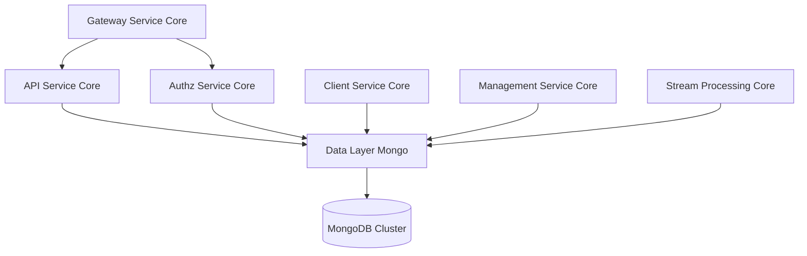
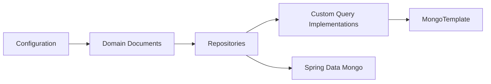
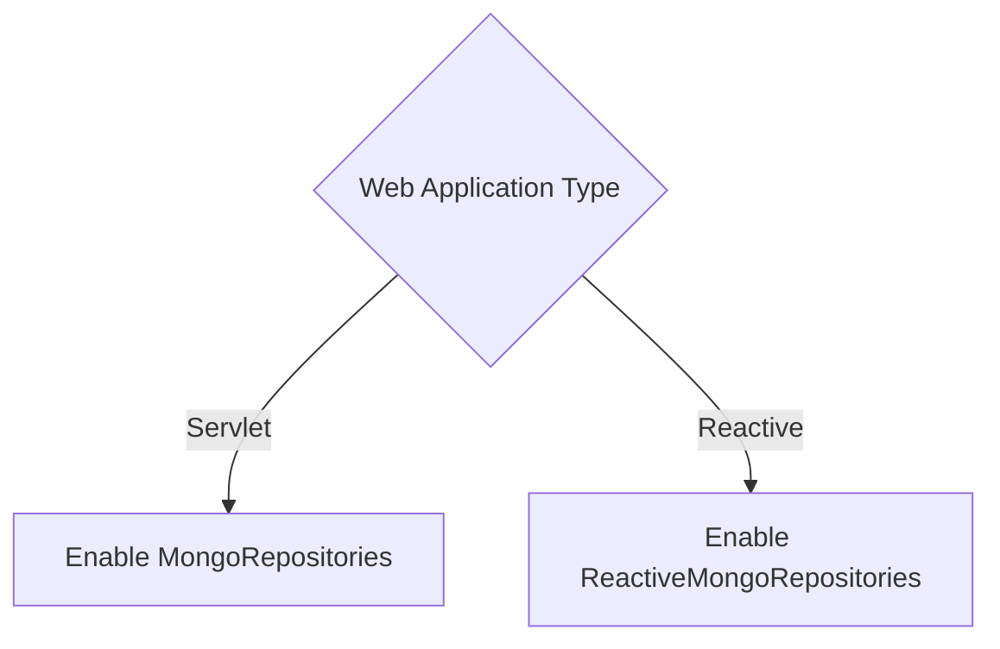
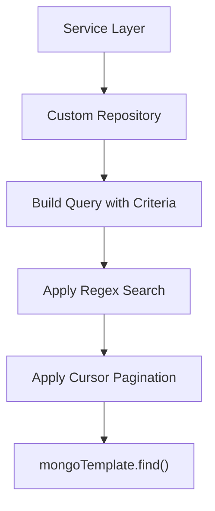
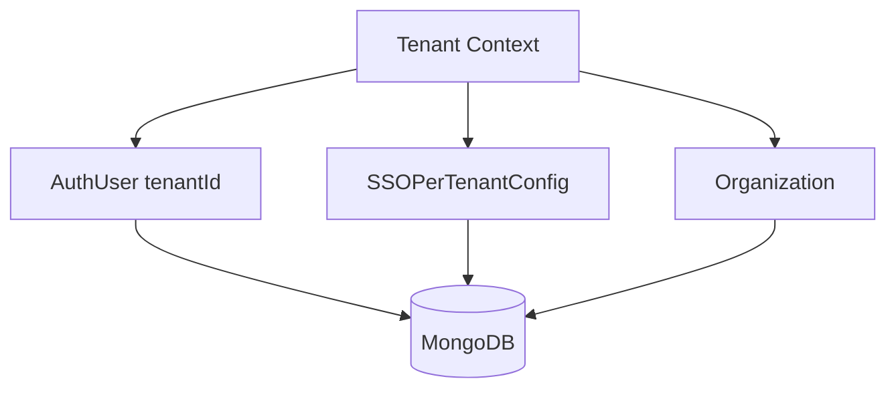

# Data Layer Mongo

## Overview

The **Data Layer Mongo** module provides the primary MongoDB-based persistence layer for the OpenFrame platform. It defines:

- MongoDB configuration and indexing
- Core domain documents (users, organizations, devices, events, OAuth, tools)
- Blocking and reactive repository interfaces
- Custom repository implementations for advanced filtering, search, and cursor-based pagination

This module is consumed by higher-level services such as:

- API Service Core
- Authz Service Core
- Client Service Core
- Management Service Core
- Stream Processing Core

It acts as the authoritative document storage layer for multi-tenant identity, organization management, device inventory, events, OAuth clients, and integrated tools.

---

## High-Level Architecture



The Data Layer Mongo module abstracts MongoDB access behind Spring Data repositories and custom query implementations. Services interact with repositories rather than raw database drivers.

---

## Internal Module Structure



The module is organized into four logical layers:

1. **Configuration** – Enables MongoDB repositories and auditing
2. **Domain Documents** – MongoDB document models
3. **Repository Interfaces** – Spring Data repository abstractions
4. **Custom Implementations** – Advanced filtering, cursor pagination, and search

---

# 1. Configuration Layer

## MongoConfig

Enables both blocking and reactive Mongo repositories.

Key features:

- Conditional activation via `spring.data.mongodb.enabled=true`
- `@EnableMongoRepositories` for blocking repositories
- `@EnableReactiveMongoRepositories` for reactive stacks
- Custom `MappingMongoConverter` configuration
- Map key dot replacement using `__dot__`
- Mongo auditing support (`@CreatedDate`, `@LastModifiedDate`)

### Reactive vs Blocking Support



This allows the same data module to support:

- Traditional Spring MVC services
- Reactive WebFlux services (e.g., Authorization Server)

---

## MongoIndexConfig

Defines manual indexes during application startup using `MongoTemplate`.

Indexes created for `application_events`:

- `(userId ASC, timestamp DESC)`
- `(type ASC, metadata.tags ASC)`

These indexes optimize:

- Time-range queries per user
- Filtering by event type and tags

---

# 2. Domain Documents

The module defines MongoDB document models for all major platform entities.

## Identity & Authorization Documents

### User

Collection: `users`

Core fields:

- email (normalized to lowercase)
- roles
- status (ACTIVE, etc.)
- emailVerified
- createdAt, updatedAt (audited)

### AuthUser

Extends `User` for Authorization Server use.

Additional fields:

- tenantId (indexed)
- passwordHash
- loginProvider (LOCAL, GOOGLE, etc.)
- externalUserId
- lastLogin

Compound unique index:

```text
{ tenantId: 1, email: 1 }
```

Ensures multi-tenant uniqueness of email per tenant.

---

## OAuth Documents

### MongoRegisteredClient

Collection: `oauth_registered_clients`

Stores OAuth client configuration:

- clientId (unique index)
- grantTypes
- redirectUris
- scopes
- PKCE requirements
- token TTL configuration

Used by the Authz Service Core for dynamic client registration.

### OAuthToken

Collection: `oauth_tokens`

Stores:

- accessToken
- refreshToken
- expiry timestamps
- clientId
- scopes

Used for token persistence and validation.

---

## Organization Document

Collection: `organizations`

Represents tenant-scoped business entities.

Key features:

- Immutable `organizationId` (unique index)
- Soft delete support (`deleted`, `deletedAt`)
- Contract lifecycle fields
- Auditing fields

Soft delete logic is enforced at query level in custom repositories.

---

## Device & Event Documents

### Device

Collection: `devices`

Represents managed endpoints:

- machineId
- serialNumber
- model
- osVersion
- status
- lastCheckin
- configuration
- health

### CoreEvent

Collection: `events`

Represents system events:

- type
- payload
- timestamp
- userId
- status (CREATED, PROCESSING, COMPLETED, FAILED)

Events are frequently filtered by:

- user
- type
- date range
- search term

---

## Tool & Tag Documents

### Tag

Collection: `tags`

- Unique name
- Organization-scoped
- Optional color

### ToolAgentAsset

Embedded configuration for tool agent artifacts:

- version
- downloadConfigurations
- source
- localFilenameConfiguration
- executable flag

Used by Client and Management services.

---

## Tenant-Specific SSO Configuration

### SSOPerTenantConfig

Extends base SSO configuration with:

- tenantId (unique, sparse index)
- createdAt
- updatedAt

Used by Authz Service Core for per-tenant SSO customization.

---

# 3. Repository Layer

The module provides both blocking and reactive repositories.

## Reactive Repositories

- ReactiveUserRepository
- ReactiveOAuthClientRepository

Example (ReactiveUserRepository):

- findByEmail
- existsByEmail
- existsByEmailAndStatus

Reactive repositories extend `ReactiveMongoRepository` and technology-agnostic base interfaces.

---

## Base Technology-Agnostic Interfaces

These interfaces allow reuse across blocking and reactive implementations:

- BaseUserRepository
- BaseTenantRepository
- BaseApiKeyRepository
- BaseIntegratedToolRepository

They abstract return types:

```text
Blocking: Optional<T>, boolean, List<T>
Reactive: Mono<T>, Mono<Boolean>, Flux<T>
```

This enables service modules to remain decoupled from the underlying reactive or blocking model.

---

# 4. Custom Repository Implementations

Custom repositories use `MongoTemplate` for advanced behavior.

## Common Patterns



Key capabilities:

- Dynamic filter composition
- Regex-based search
- Cursor-based pagination using `_id`
- Sort field validation
- Distinct field extraction

---

## CustomMachineRepositoryImpl

Supports:

- Filter by status, type, OS, organization
- Regex search across hostname, IP, serialNumber, manufacturer
- Cursor-based pagination using ObjectId
- Secondary sort on `_id`

Cursor pagination logic:

```text
If cursor present:
  Add criteria: _id < cursorId
Apply limit
Apply sort
Execute query
```

---

## CustomEventRepositoryImpl

Supports:

- Filtering by userIds and eventTypes
- Date range filtering with UTC normalization
- Regex search on type and data
- Bidirectional cursor pagination
- Distinct queries for userIds and eventTypes

---

## CustomOrganizationRepositoryImpl

Implements database-level filtering for:

- Soft delete exclusion
- Category (case-insensitive exact match)
- Employee count ranges
- Active contract filtering
- Search by name, organizationId, category
- Cursor pagination

All criteria combined using `$and` to ensure correct Mongo semantics.

---

## CustomIntegratedToolRepositoryImpl

Supports:

- Filtering by enabled, type, category, platformCategory
- Regex search on name and description
- Sorted queries
- Distinct extraction for type, category, platformCategory

---

# Multi-Tenancy Strategy

Multi-tenancy is implemented at document and query levels.



Key mechanisms:

- Compound unique indexes (tenantId + email)
- Sparse unique index for per-tenant SSO
- Query-level filtering by organizationId or tenantId

The module itself is tenant-aware but does not enforce tenant isolation. Isolation is handled at service layer level.

---

# Indexing & Performance Considerations

The module combines:

1. Annotation-based indexes (`@Indexed`, `@CompoundIndex`)
2. Programmatic indexes via `MongoIndexConfig`
3. Cursor-based pagination for large collections
4. Distinct queries executed server-side

Cursor pagination avoids performance issues of offset-based pagination.

---

# How Other Modules Use Data Layer Mongo

- **Authz Service Core** uses:
  - AuthUser
  - MongoRegisteredClient
  - OAuthToken
  - SSOPerTenantConfig

- **API Service Core** uses:
  - Organization
  - User
  - Device
  - Tag
  - IntegratedTool repositories

- **Stream Processing Core** writes events into Mongo collections.

- **Client Service Core** manages tool agents and device-related documents.

The Data Layer Mongo module is therefore a foundational infrastructure module shared across all backend services.

---

# Summary

The **Data Layer Mongo** module:

- Centralizes all MongoDB document models
- Provides both reactive and blocking repository support
- Implements advanced query logic via MongoTemplate
- Supports multi-tenancy and soft deletion patterns
- Optimizes performance with indexing and cursor-based pagination

It forms the persistence backbone of the OpenFrame platform and enables consistent, scalable data access across all service modules.
