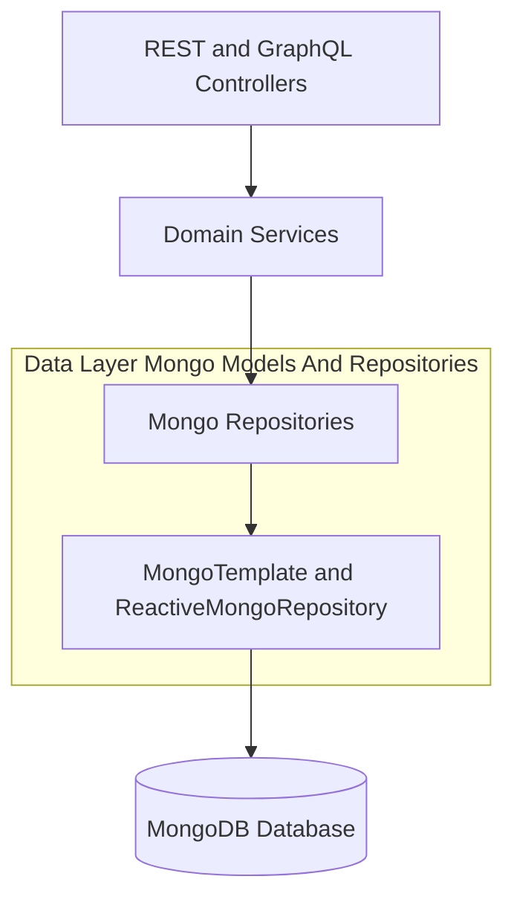
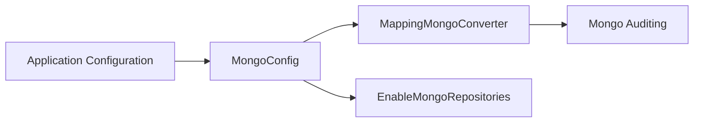
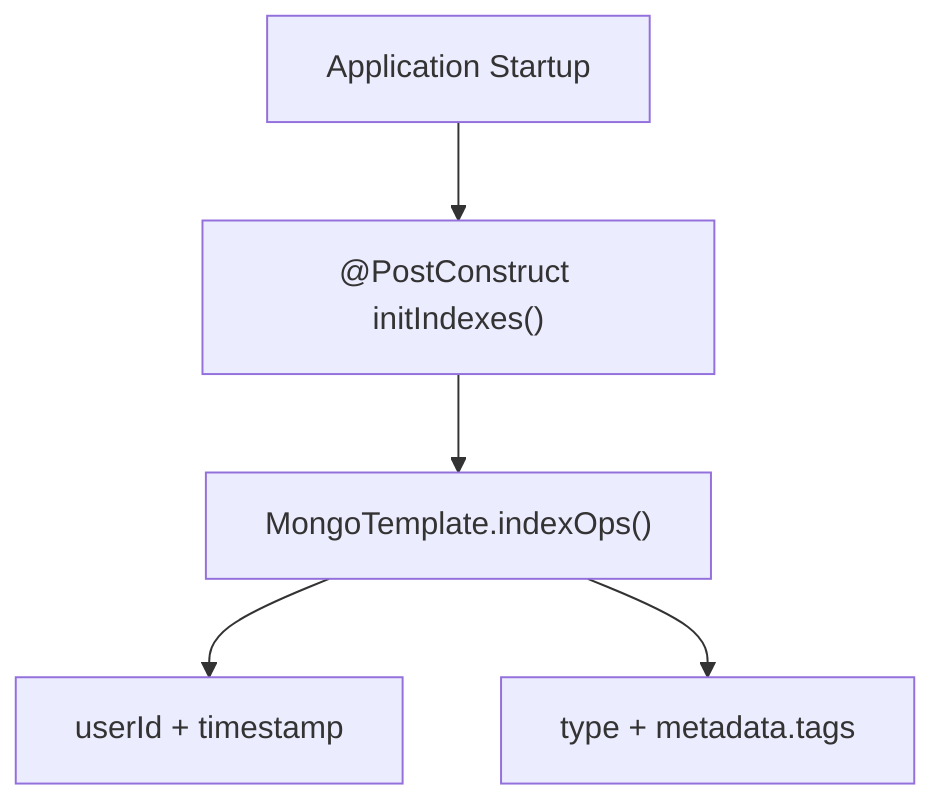
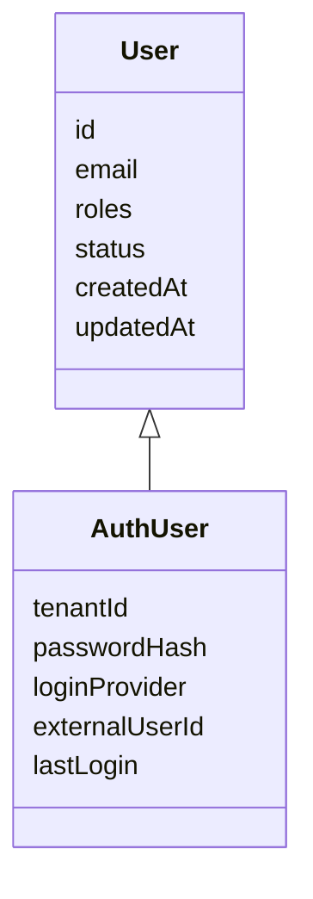
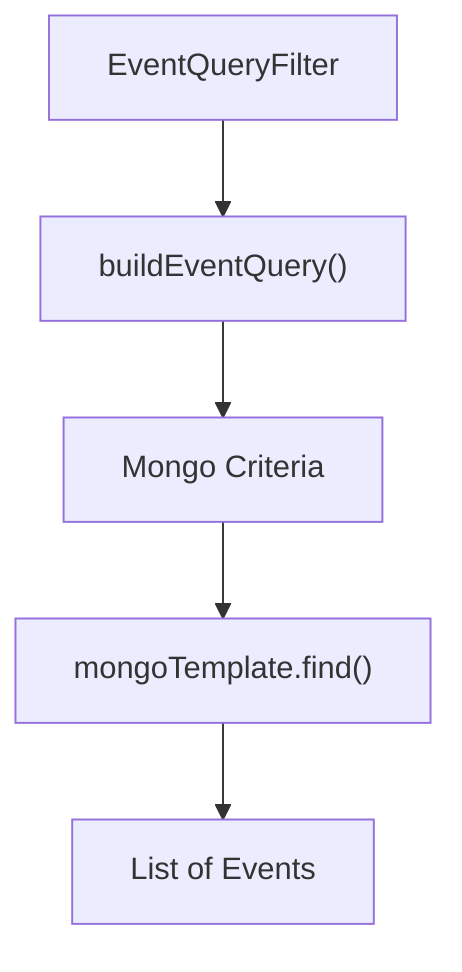
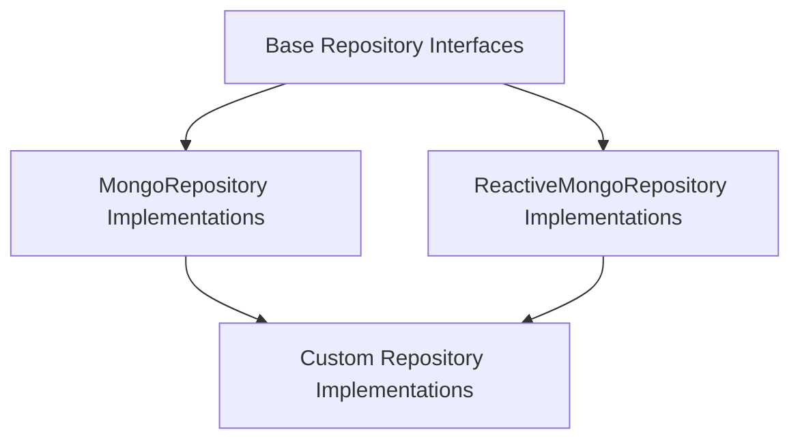
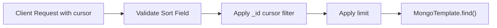

# Data Layer Mongo Models And Repositories

## Overview

The **Data Layer Mongo Models And Repositories** module is the MongoDB-backed persistence layer for the OpenFrame platform. It defines:

- MongoDB configuration and index management
- Domain documents (users, organizations, devices, events, tools, OAuth, tenants)
- Technology-agnostic base repository contracts
- Blocking and reactive repository implementations
- Advanced query builders with filtering, cursor pagination, and sorting

This module is the foundation for higher-level modules such as API services, authorization server, management services, and stream processors, which rely on it for durable storage and efficient querying.

---

## Architectural Role in the Platform

At runtime, this module sits between domain services and MongoDB, encapsulating persistence logic and query construction.

### Responsibilities

1. **Document Modeling** – Define MongoDB collections and embedded documents.
2. **Index Strategy** – Ensure performant access patterns.
3. **Query Abstraction** – Provide reusable filtering and cursor-based pagination.
4. **Reactive + Blocking Support** – Enable both traditional and reactive stacks.
5. **Multi-Tenancy Support** – Support tenant-aware user and SSO configuration.

---

# Configuration Layer

## MongoConfig

The `MongoConfig` class bootstraps MongoDB integration.

### Blocking Configuration

Enabled when:

- `spring.data.mongodb.enabled=true`

Features:

- `@EnableMongoRepositories` for `com.openframe.data.repository`
- `@EnableMongoAuditing` for `@CreatedDate` and `@LastModifiedDate`
- Custom `MappingMongoConverter`
  - Custom conversions
  - Map key dot replacement using `__dot__`

### Reactive Configuration

When running in a reactive web environment:

- `@EnableReactiveMongoRepositories`
- Reactive repositories under `com.openframe.data.reactive.repository`

---

## MongoIndexConfig

`MongoIndexConfig` ensures runtime index creation using `MongoTemplate`.

### Example Indexes

On `application_events` collection:

- Compound index on `userId ASC, timestamp DESC`
- Compound index on `type ASC, metadata.tags ASC`

This ensures optimized querying for:

- User-scoped event history
- Event-type and tag filtering

---

# Domain Documents

This module defines MongoDB `@Document` classes and embedded subdocuments.

## User Domain

### User

Collection: `users`

Key characteristics:

- Normalized email (lowercased)
- Roles and status management
- Auditing fields

### AuthUser

Extends `User` for multi-tenant authorization.

- Compound unique index on `tenantId + email`
- Password hash storage
- Login provider (LOCAL, GOOGLE, etc.)
- Last login tracking

---

## Organization Domain

### Organization

Collection: `organizations`

Features:

- Unique `organizationId`
- Soft delete support (`deleted`, `deletedAt`)
- Contract lifecycle logic
- Revenue and metadata fields
- Indexed fields for filtering and search

### OrganizationQueryFilter

Supports filtering by:

- Category
- Employee range
- Active contract state

Custom repository implementation:

- Excludes soft-deleted records
- Combines criteria using `$and`
- Supports cursor-based pagination

---

## Device Domain

### Device

Collection: `devices`

Fields include:

- Machine identifiers
- OS and model metadata
- Status and last check-in
- Embedded configuration and health

### MachineTag

Collection: `machine_tags`

- Compound unique index on `machineId + tagId`
- Tracks tagging metadata

### Alert and SecurityAlert

Embedded alert models:

- Severity
- Resolution status
- Timestamps

---

## Event Domain

### CoreEvent

Collection: `events`

- Type
- Payload
- Status lifecycle (CREATED, PROCESSING, COMPLETED, FAILED)

### ExternalApplicationEvent

Collection: `external_application_events`

- Type
- Metadata with tags
- Timestamp and user linkage

### EventQueryFilter

Supports:

- User IDs
- Event types
- Date ranges

### CustomEventRepositoryImpl

Implements:

- Dynamic query building
- Cursor-based pagination
- Sort validation
- Distinct user and type extraction

---

## OAuth Domain

### MongoRegisteredClient

Collection: `oauth_registered_clients`

- Unique `clientId`
- Grant types and scopes
- PKCE and consent configuration
- Token TTL settings

### OAuthToken

Collection: `oauth_tokens`

- Access and refresh tokens
- Expiry timestamps
- Client and scope tracking

### Repositories

- `OAuthTokenRepository`
- `ReactiveOAuthClientRepository`

These support both blocking and reactive authentication flows.

---

## Tool and Integration Domain

### Tag

Collection: `tags`

- Unique name
- Organization-scoped tagging
- Metadata (color, description)

### ToolQueryFilter

Supports filtering by:

- Enabled state
- Type
- Category
- Platform category

### CustomIntegratedToolRepositoryImpl

Provides:

- Dynamic filtering
- Sorting with secondary `_id`
- Distinct category/type extraction

---

## Tenant and SSO Domain

### SSOPerTenantConfig

Extends base SSO configuration with:

- Unique tenantId
- Created and updated timestamps

### BaseTenantRepository

Technology-agnostic interface supporting:

- `findByDomain`
- `existsByDomain`

Designed for both reactive and blocking implementations.

---

# Repository Abstraction Strategy

The module uses layered repository abstraction:

## Base Interfaces

Examples:

- `BaseUserRepository`
- `BaseApiKeyRepository`
- `BaseIntegratedToolRepository`
- `BaseTenantRepository`

They abstract return types:

- Blocking: `Optional`, `List`, `boolean`
- Reactive: `Mono`, `Flux`

This ensures portability and technology neutrality.

---

# Advanced Query and Pagination Strategy

Several custom repositories implement consistent patterns:

### 1. Cursor-Based Pagination

- Uses Mongo `_id` as cursor
- Supports ASC and DESC sorting
- Prevents invalid cursor crashes

### 2. Sort Field Validation

Each repository defines:

- `SORTABLE_FIELDS`
- `DEFAULT_SORT_FIELD`
- `isSortableField()` validation

### 3. Search with Regex

Implements case-insensitive search across multiple fields using `$or` criteria.

---

# Auditing and Soft Delete Patterns

## Auditing

Using `@CreatedDate` and `@LastModifiedDate`:

- Automatically populated
- Enabled via `@EnableMongoAuditing`

## Soft Delete

Example: `Organization`

- `deleted` flag
- `deletedAt` timestamp
- Repository-level exclusion

This prevents physical deletion and preserves historical data.

---

# Reactive vs Blocking Design

The module supports both execution models:

| Feature | Blocking | Reactive |
|----------|----------|----------|
| Repository Type | MongoRepository | ReactiveMongoRepository |
| Return Types | Optional, List | Mono, Flux |
| Web Stack | Servlet | WebFlux |

This dual support enables flexible deployment architectures across services.

---

# Key Design Principles

1. **Separation of Concerns** – Domain models are clean POJOs; repositories encapsulate persistence logic.
2. **Performance-Oriented** – Indexing, cursor pagination, and query-level filtering.
3. **Multi-Tenant Aware** – Tenant-specific constraints and unique indexes.
4. **Extensible Filtering** – Query filter objects decouple API from persistence.
5. **Technology Agnostic Contracts** – Base repositories abstract blocking vs reactive.

---

# Conclusion

The **Data Layer Mongo Models And Repositories** module is the persistence backbone of the OpenFrame platform.

It provides:

- Strong domain modeling
- Optimized indexing
- Flexible and reusable query builders
- Multi-tenant support
- Reactive and blocking compatibility

By centralizing MongoDB configuration, document modeling, and repository logic, this module ensures consistent, performant, and maintainable data access across all services in the ecosystem.
