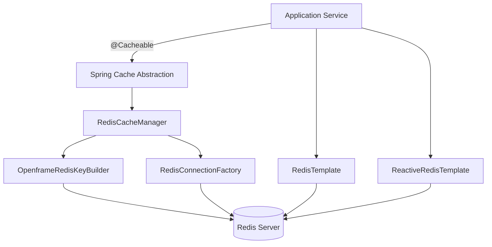
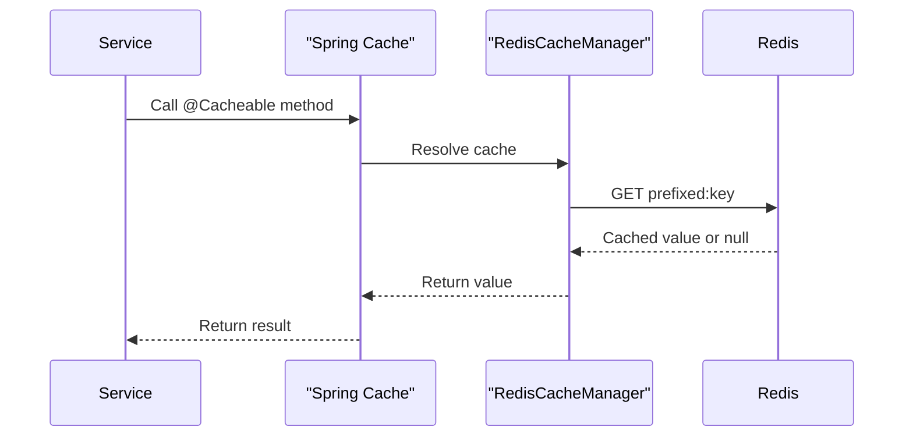
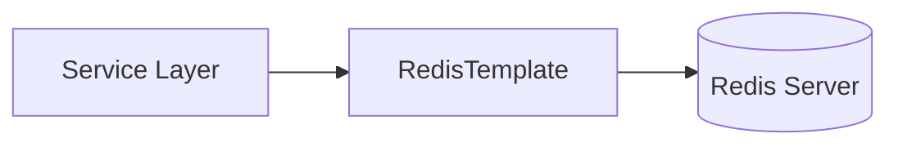
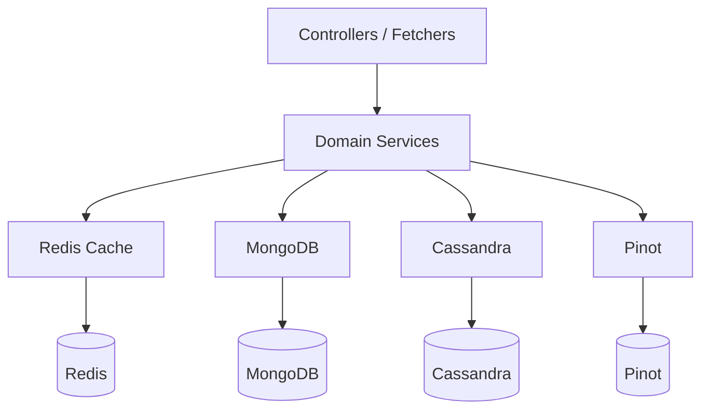

# Data Layer Redis Cache

## Overview

The **Data Layer Redis Cache** module provides Redis-based caching and key management capabilities for the OpenFrame platform. It integrates Spring Cache abstraction with Redis, enables both synchronous and reactive Redis access patterns, and enforces tenant-aware key generation by default.

This module acts as a cross-cutting infrastructure layer used by multiple backend services such as API Service Core, Authorization Server Core, Gateway Service Core, and Management Service Core to:

- Cache frequently accessed data (users, organizations, configuration, etc.)
- Reduce load on MongoDB, Cassandra, and Pinot
- Provide fast, in-memory distributed access across service instances
- Enforce tenant-scoped key prefixes in multi-tenant deployments

The module is conditionally enabled via configuration and does not activate unless Redis support is explicitly turned on.

---

## Activation and Conditional Configuration

The entire module is guarded by the property:

```text
spring.redis.enabled=true
```

If this property is not set (or set to false), none of the Redis beans in this module are created. This allows:

- Local development without Redis
- Environment-specific activation (e.g., enabled in staging/production only)
- Safe fallback to non-cached execution

---

## High-Level Architecture



The module exposes three main responsibilities:

1. **Spring Cache integration via RedisCacheManager**
2. **Redis template configuration (blocking and reactive)**
3. **Tenant-aware key prefix configuration**

---

## Core Components

The Data Layer Redis Cache module consists of three primary configuration classes:

- `CacheConfig`
- `RedisConfig`
- `OpenframeRedisKeyConfiguration`

Each is described in detail below.

---

## CacheConfig

**Class:** `CacheConfig`  
**Responsibility:** Configure Spring Cache to use Redis as the backing store.

### Key Features

- Enables Spring caching via `@EnableCaching`
- Provides a default `CacheManager` if none is defined
- Configures:
  - Default TTL (6 hours)
  - JSON value serialization
  - String key serialization
  - Tenant-aware key prefix computation

### Default Cache Configuration

```java
RedisCacheConfiguration.defaultCacheConfig()
    .entryTtl(Duration.ofHours(6))
    .disableCachingNullValues()
    .serializeKeysWith(StringRedisSerializer)
    .serializeValuesWith(GenericJackson2JsonRedisSerializer)
    .computePrefixWith(cacheName -> keyBuilder.cacheKeyPrefix(null, cacheName));
```

### Design Decisions

- **6-hour TTL** provides a balance between freshness and performance.
- **Null values are not cached**, preventing ambiguous cache entries.
- **GenericJackson2JsonRedisSerializer** ensures compatibility across services.
- **Prefix computation is delegated to OpenframeRedisKeyBuilder**, enforcing tenant scoping.

### Cache Key Structure

Keys follow a structured format:

```text
<prefix>:<cacheName>::<key>
```

Example:

```text
tenantA:userCache::12345
```

This prevents cross-tenant data leakage in multi-tenant deployments.

---

## RedisConfig

**Class:** `RedisConfig`  
**Responsibility:** Provide Redis templates for both blocking and reactive access patterns.

This configuration enables:

```java
@EnableRedisRepositories(basePackages = "com.openframe.data.repository.redis")
```

### Beans Provided

#### 1. RedisTemplate<String, String>

Used for standard (blocking) Redis operations.

- Key serializer: `StringRedisSerializer`
- Value serializer: `StringRedisSerializer`
- Hash key/value serializers: `StringRedisSerializer`

Suitable for:

- Simple key-value storage
- Counters
- Lightweight coordination data

---

#### 2. ReactiveStringRedisTemplate

Used in reactive pipelines (WebFlux-based services).

Provides:

- Non-blocking Redis operations
- Integration with Reactor (Mono/Flux)

---

#### 3. ReactiveRedisTemplate<String, String>

Custom reactive template with explicit serialization context:

```java
RedisSerializationContext
    .<String, String>newSerializationContext()
    .key(StringRedisSerializer)
    .value(StringRedisSerializer)
    .hashKey(StringRedisSerializer)
    .hashValue(StringRedisSerializer)
    .build();
```

Ensures consistent serialization across:

- Standard keys
- Hash keys
- Hash values

---

## OpenframeRedisKeyConfiguration

**Class:** `OpenframeRedisKeyConfiguration`  
**Responsibility:** Register the tenant-aware Redis key builder.

This configuration:

- Enables `OpenframeRedisProperties`
- Registers `OpenframeRedisKeyBuilder` if missing

```java
@Bean
@ConditionalOnMissingBean
public OpenframeRedisKeyBuilder openframeRedisKeyBuilder(OpenframeRedisProperties props) {
    return new OpenframeRedisKeyBuilder(props);
}
```

### Role in Multi-Tenant Architecture

The key builder ensures:

- All cache keys are prefixed consistently
- Tenant identifiers are embedded in cache namespaces
- Key collision across tenants is prevented

This is critical for services such as:

- Authorization Server Core (tenant-scoped clients and tokens)
- API Service Core (organization and user data)
- Gateway Service Core (rate limiting and auth context)

---

## Data Flow Scenarios

### Scenario 1: Using @Cacheable



If the value does not exist:

1. Method executes.
2. Result is serialized to JSON.
3. Value is stored in Redis with TTL.

---

### Scenario 2: Direct RedisTemplate Usage



Used when:

- Manual key control is required
- Counters or locks are needed
- Reactive pipelines must remain non-blocking

---

## Integration Within the OpenFrame Platform

The Data Layer Redis Cache module complements other data layers:

- MongoDB (primary document storage)
- Cassandra (distributed data storage)
- Pinot (analytics and event queries)
- Kafka (event streaming)

Redis acts as:

- A performance accelerator
- A distributed cache across microservices
- A short-term consistency layer

### Layered Architecture View



Redis reduces pressure on persistent datastores and improves response latency.

---

## Serialization Strategy

### Keys

- Always serialized as strings
- Tenant-aware prefix included

### Values

- JSON serialization for cached objects
- String serialization for template-based operations

This separation allows:

- Flexible object caching
- Lightweight string-based Redis usage

---

## Configuration Example

```yaml
spring:
  redis:
    enabled: true
    host: localhost
    port: 6379
```

Optional properties for key prefixing are provided via `OpenframeRedisProperties`.

---

## Extensibility

The module is designed for extension:

- Custom `CacheManager` can override the default
- Custom TTL strategies can be introduced per cache
- Alternative serializers can replace the default JSON serializer
- Custom key builder logic can be injected

Because all beans are guarded with `@ConditionalOnMissingBean`, services may override configuration safely.

---

## Operational Considerations

### TTL Management

Default TTL: **6 hours**  
Override strategies may include:

- Short-lived caches (minutes)
- Long-lived reference data caches (24h+)

### Multi-Instance Deployments

Redis provides:

- Shared cache across pods
- Consistent data access
- Reduced database pressure under load

### Failure Behavior

If Redis is unavailable:

- Spring Cache operations may fail depending on configuration
- Services should degrade gracefully
- Production deployments should use high-availability Redis setups

---

## Summary

The **Data Layer Redis Cache** module provides:

- Spring-integrated distributed caching
- Blocking and reactive Redis templates
- Tenant-aware key prefixing
- JSON-based object serialization
- Conditional activation per environment

It serves as a critical performance optimization layer in the OpenFrame architecture, ensuring scalable, multi-tenant-safe caching across all backend services.