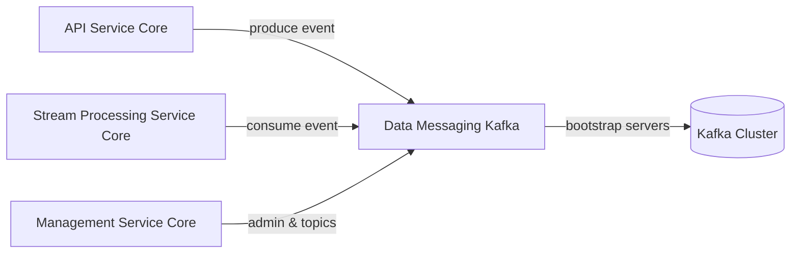
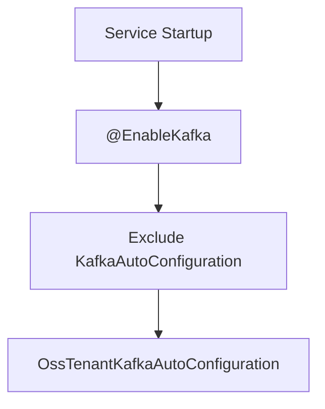
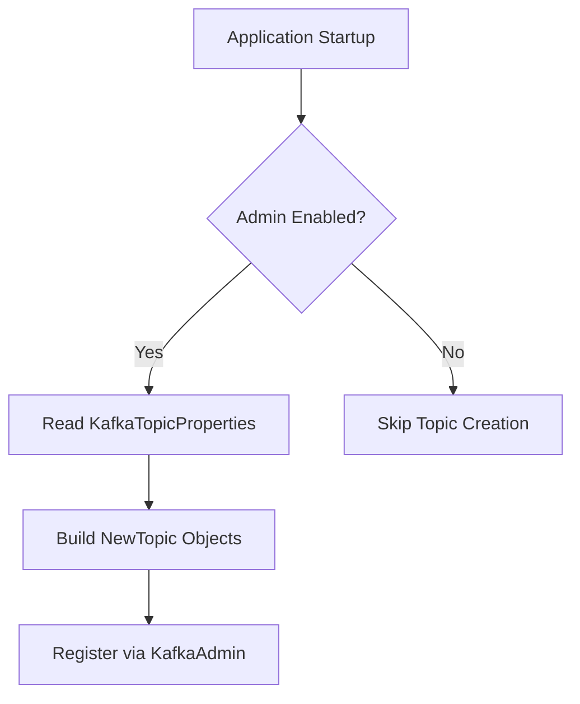
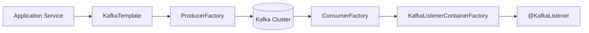
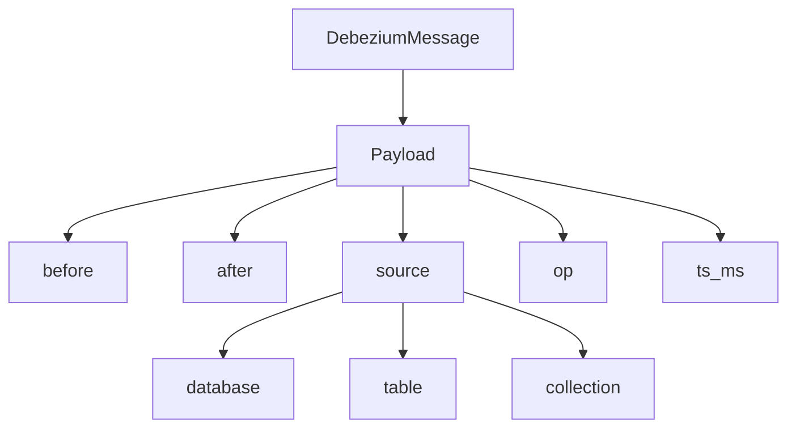
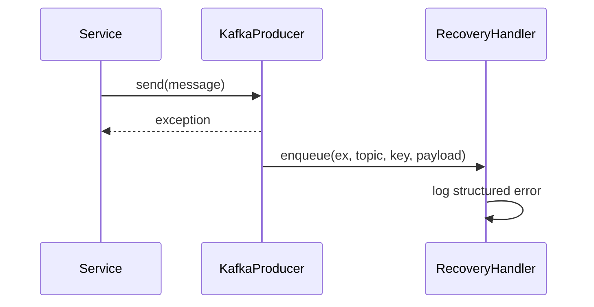

# Data Messaging Kafka

## Overview

The **Data Messaging Kafka** module provides the foundational Kafka integration layer for the OpenFrame OSS tenant platform. It standardizes how services connect to Kafka, define topics, produce and consume messages, and integrate with change data capture (CDC) pipelines such as Debezium.

This module is intentionally infrastructure-focused. It does not implement business logic itself. Instead, it provides:

- Centralized Kafka configuration for OSS tenant services  
- Auto-configuration of producers, consumers, and admin clients  
- Topic auto-registration support  
- Standardized message headers  
- Debezium message model for CDC pipelines  
- Recovery handler for producer failures  

It is primarily consumed by modules such as Stream Processing Service Core, Management Service Core, and other services that interact with Kafka.

---

## Architectural Role in the Platform

The Data Messaging Kafka module sits between platform services and the Kafka cluster.



### Responsibilities

- Encapsulate Spring Kafka configuration
- Provide OSS tenant–scoped Kafka properties
- Create and configure:
  - ProducerFactory
  - ConsumerFactory
  - KafkaTemplate
  - KafkaListenerContainerFactory
  - KafkaAdmin
- Register topics dynamically
- Support Debezium CDC message structures
- Provide error recovery hooks for producer failures

---

## Core Components

### 1. OssKafkaConfig

**Class:** `OssKafkaConfig`  
Enables Kafka support while explicitly excluding Spring Boot's default `KafkaAutoConfiguration`.

Purpose:

- Avoid conflicts with default Kafka auto-configuration
- Ensure all Kafka beans are controlled via OSS-specific configuration



---

### 2. OssTenantKafkaProperties

**Class:** `OssTenantKafkaProperties`  
Configuration binding under the prefix:

```text
spring.oss-tenant
```

This class wraps Spring's `KafkaProperties`, allowing full control over:

- Bootstrap servers
- Producer settings
- Consumer settings
- Listener settings
- Admin settings
- Template settings

Key property:

```text
enabled = true
```

If disabled, no Kafka beans are created.

---

### 3. KafkaTopicProperties

**Class:** `KafkaTopicProperties`  
Configuration binding under:

```text
openframe.oss-tenant.kafka.topics
```

Used for declarative topic creation.

### TopicConfig Structure

```text
inbound:
  some-topic:
    name: device-events
    partitions: 3
    replicationFactor: 2
```

Fields:

- `name` – topic name  
- `partitions` – number of partitions (default: 1)  
- `replicationFactor` – replication factor (default: 1)  
- `autoCreate` – whether topics should be created automatically  

When admin is enabled, topics are created during startup.



---

### 4. OssTenantKafkaAutoConfiguration

**Class:** `OssTenantKafkaAutoConfiguration`  
Main auto-configuration entry point.

Condition:

```text
spring.oss-tenant.kafka.enabled=true
```

This class wires all Kafka infrastructure beans.

### Beans Created

#### Producer Side

- `ProducerFactory<String, Object>`
- `KafkaTemplate<String, Object>`
- `OssTenantKafkaProducer`

Configuration:

- Key serializer: `StringSerializer`
- Value serializer: `JsonSerializer`

#### Consumer Side

- `ConsumerFactory<Object, Object>`
- `ConcurrentKafkaListenerContainerFactory`

Configuration:

- Key deserializer: `StringDeserializer`
- Value deserializer: `JsonDeserializer`
- Configurable concurrency
- Configurable acknowledgment mode
- Default ack mode: `RECORD`

#### Admin Side

- `KafkaAdmin`
- `KafkaAdmin.NewTopics`

---

### Producer and Consumer Flow



This abstraction ensures that all services use a consistent and centrally managed Kafka configuration.

---

### 5. KafkaHeader

**Interface:** `KafkaHeader`

Defines standardized header keys.

Current header:

```text
MESSAGE_TYPE_HEADER = "message-type"
```

Purpose:

- Enable event type routing
- Support polymorphic message handling
- Maintain consistent cross-service header naming

---

### 6. DebeziumMessage

**Class:** `DebeziumMessage<T>`  
Represents a structured CDC event emitted by Debezium.

### Structure



Key fields:

- `before` – state before change  
- `after` – state after change  
- `operation` – CDC operation (c, u, d, r)  
- `timestamp` – event timestamp  
- `source` – metadata about connector, database, table, etc.  

This model enables strong typing of CDC events in downstream processors such as Stream Processing Service Core.

---

### 7. KafkaRecoveryHandlerImpl

**Class:** `KafkaRecoveryHandlerImpl`  
Implements `KafkaRecoveryHandler`.

Purpose:

- Invoked when Kafka producer send fails
- Logs structured failure information
- Includes stack trace
- Logs topic, key, and payload snapshot



This implementation currently logs errors but can be extended to:

- Dead-letter topic publishing
- Retry queues
- Alerting integration

---

## Multi-Tenant Considerations

The OSS tenant configuration prefix ensures isolation:

```text
spring.oss-tenant.kafka
```

This allows:

- Dedicated Kafka clusters per tenant
- Logical isolation through topic namespaces
- Custom producer/consumer configurations per tenant

---

## Configuration Example

```yaml
spring:
  oss-tenant:
    kafka:
      enabled: true
      kafka:
        bootstrap-servers: localhost:9092
        producer:
          acks: all
        consumer:
          group-id: openframe-stream

openframe:
  oss-tenant:
    kafka:
      topics:
        inbound:
          deviceEvents:
            name: device-events
            partitions: 3
            replicationFactor: 2
```

---

## Integration with Other Modules

The Data Messaging Kafka module is infrastructure used by:

- Stream Processing Service Core – consumes Debezium and domain events  
- Management Service Core – may register topics and manage infrastructure  
- Client Service Core – may publish device or agent lifecycle events  
- API Service Core – may emit domain events  

It does not depend on business modules but acts as a shared messaging backbone.

---

## Design Principles

1. Explicit Auto-Configuration  
   Default Spring Kafka auto-config is excluded to ensure full control.

2. Tenant Isolation  
   All configuration is scoped under OSS tenant prefixes.

3. Declarative Topic Management  
   Topics can be defined in configuration and auto-created.

4. CDC-First Design  
   Debezium message model ensures first-class CDC support.

5. Observability  
   Structured logging for recovery and topic registration.

---

## Summary

The **Data Messaging Kafka** module provides the standardized Kafka integration layer for the OpenFrame OSS platform. It ensures:

- Consistent producer and consumer setup  
- Centralized topic management  
- Tenant-scoped configuration  
- CDC compatibility  
- Controlled auto-configuration  

By isolating Kafka infrastructure into this module, the platform achieves clean separation of concerns between messaging infrastructure and business logic, enabling scalable, event-driven microservices across the ecosystem.
