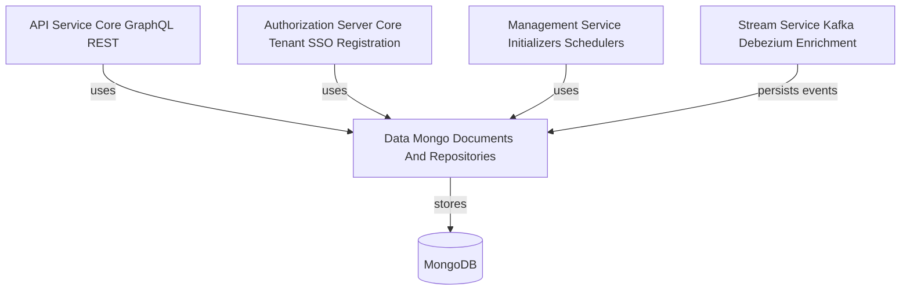
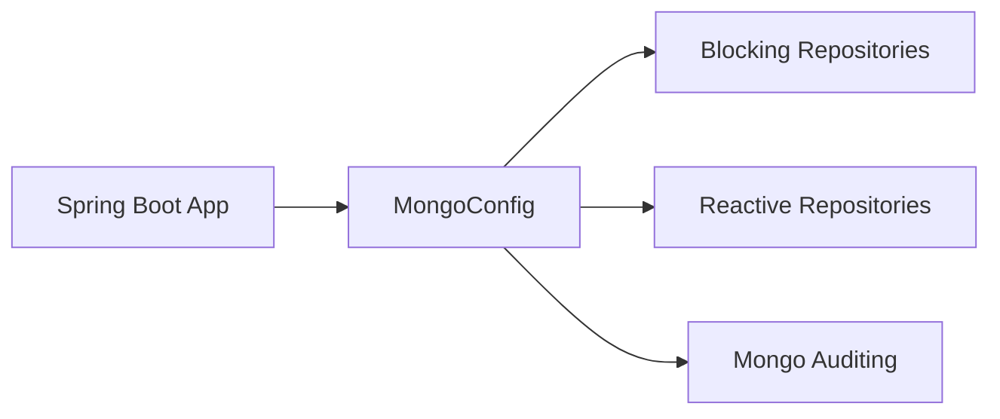
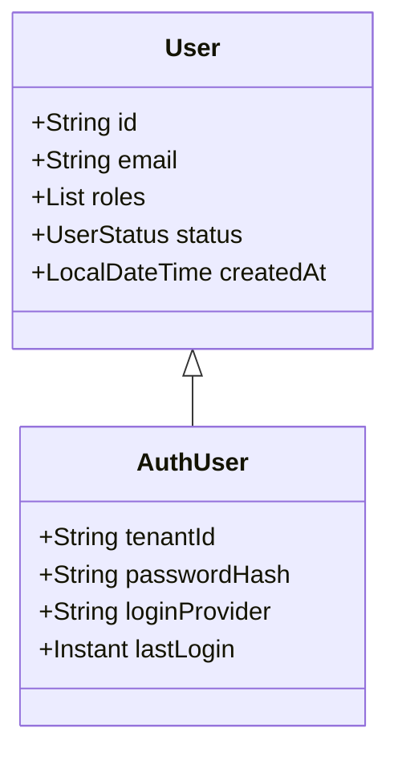
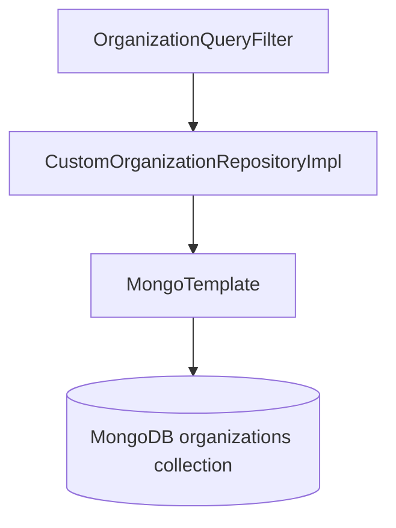
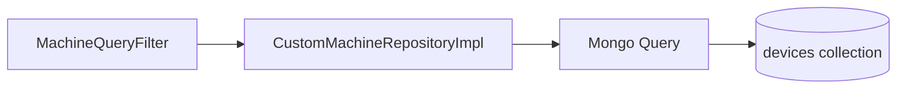
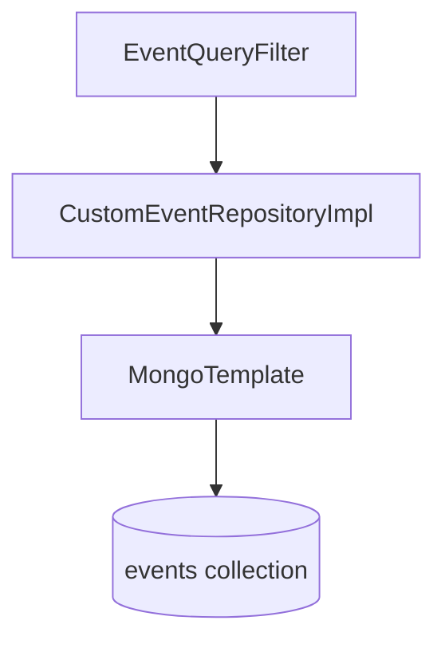
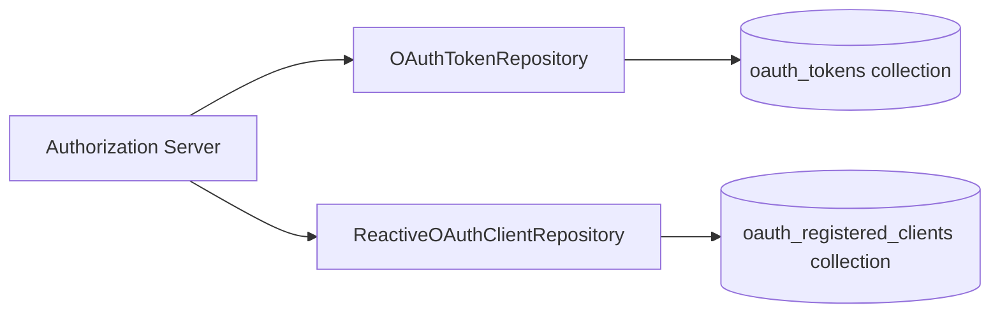
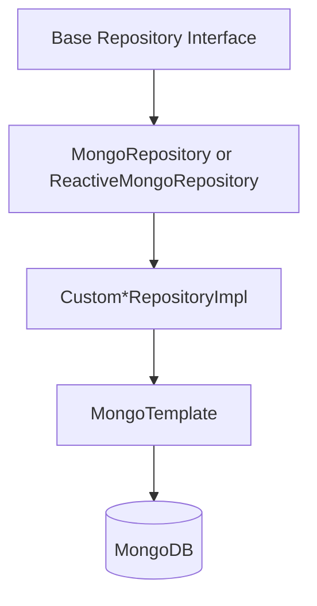
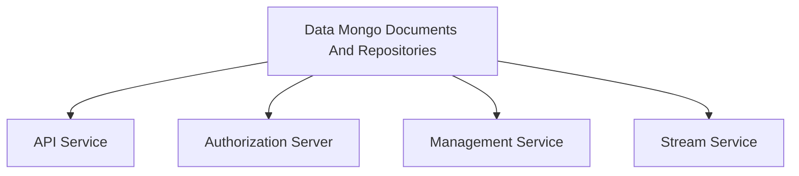

# Data Mongo Documents And Repositories

The **Data Mongo Documents And Repositories** module is the primary MongoDB persistence layer for the OpenFrame platform. It defines:

- MongoDB configuration and indexing
- Domain documents (collections and embedded documents)
- Reactive and blocking repository contracts
- Custom query implementations with filtering, search, and cursor-based pagination

This module acts as the foundation for higher-level modules such as API Service Core GraphQL REST, Authorization Server Core Tenant SSO Registration, Management Service Initializers Schedulers, and Stream Service Kafka Debezium Enrichment.

---

## 1. Architectural Role in the Platform

The module encapsulates all MongoDB-specific concerns and exposes clean repository abstractions to service-layer modules.

### Responsibilities

1. Define MongoDB collections via `@Document` annotated classes.
2. Provide blocking and reactive repositories.
3. Implement complex query logic using `MongoTemplate`.
4. Enforce indexing strategies and uniqueness constraints.
5. Support multi-tenant and SSO-aware data models.

---

## 2. Configuration Layer

### 2.1 MongoConfig

`MongoConfig` enables:

- `@EnableMongoRepositories` for blocking repositories
- `@EnableReactiveMongoRepositories` for reactive repositories
- `@EnableMongoAuditing` for `@CreatedDate` and `@LastModifiedDate`
- Custom `MappingMongoConverter` with map key dot replacement

### 2.2 MongoIndexConfig

`MongoIndexConfig` programmatically ensures indexes on the `application_events` collection:

- Composite index on `userId` + `timestamp`
- Composite index on `type` + `metadata.tags`

This improves filtering and analytics queries executed by event repositories and stream consumers.

---

## 3. Domain Document Model

The module organizes documents into domain-specific packages:

- auth
- user
- organization
- device
- event
- oauth
- tool
- tenant
- clientconfiguration

### 3.1 User and Authentication

#### User

- Collection: `users`
- Indexed email
- Roles and status
- Email normalization
- Audited timestamps

#### AuthUser

Extends `User` and adds:

- `tenantId` (indexed, compound unique with email)
- `passwordHash`
- `loginProvider`
- `externalUserId`
- `lastLogin`

Used by the Authorization Server Core Tenant SSO Registration module.

---

### 3.2 Organization Domain

#### Organization

- Collection: `organizations`
- Unique `organizationId`
- Soft delete (`deleted`, `deletedAt`)
- Contract lifecycle logic
- Embedded `ContactInformation`
- Indexed fields for filtering and search

#### OrganizationQueryFilter

Supports filtering by:

- Category
- Employee range
- Active contract status

#### CustomOrganizationRepositoryImpl

Implements:

- Database-level filtering
- Soft delete exclusion
- Cursor-based pagination
- Sort validation

---

### 3.3 Device and Machine Domain

#### Device

Collection: `devices`

Fields include:

- machineId
- serialNumber
- model
- osVersion
- status
- type
- lastCheckin
- configuration
- health

#### MachineTag

- Collection: `machine_tags`
- Unique compound index on `machineId` + `tagId`

#### Alert and SecurityAlert

Embedded documents representing operational and security signals.

#### CustomMachineRepositoryImpl

Provides:

- Filter-based queries via `MachineQueryFilter`
- Search across hostname, IP, manufacturer, etc.
- Cursor-based pagination using `_id`
- Controlled sortable fields

---

### 3.4 Event Domain

#### CoreEvent

- Collection: `events`
- Type, payload, timestamp, status
- Lifecycle enum: CREATED, PROCESSING, COMPLETED, FAILED

#### ExternalApplicationEvent

- Collection: `external_application_events`
- Nested metadata with tags map

#### EventQueryFilter

Filters by:

- userIds
- eventTypes
- date range

#### CustomEventRepositoryImpl

Implements:

- Dynamic query construction
- Date conversion to UTC Instants
- Regex search
- Cursor-based pagination
- Distinct value queries

Used by API Service Core GraphQL REST and Stream Service Kafka Debezium Enrichment.

---

### 3.5 OAuth and Client Registration

#### MongoRegisteredClient

- Collection: `oauth_registered_clients`
- Unique clientId
- Grant types, scopes, redirect URIs
- PKCE and consent configuration

#### OAuthToken

- Collection: `oauth_tokens`
- Access and refresh tokens
- Expiry timestamps
- Associated userId and clientId

#### OAuthTokenRepository

Provides lookup by accessToken and refreshToken.

#### ReactiveOAuthClientRepository

Reactive lookup by clientId.

---

### 3.6 Tool and Integration Domain

#### Tag

- Collection: `tags`
- Unique name
- Scoped to organization

#### ToolAgentAsset

Defines:

- Versioned agent assets
- Download configurations
- Local filename mapping

#### ToolQueryFilter

Supports filtering by:

- enabled
- type
- category
- platformCategory

#### CustomIntegratedToolRepositoryImpl

Provides:

- Dynamic filtering
- Search by name and description
- Sorting with whitelist validation
- Distinct type/category queries

---

### 3.7 Tenant and SSO Configuration

#### SSOPerTenantConfig

Extends base SSO configuration and adds:

- Unique tenantId
- Audited timestamps

#### BaseTenantRepository

Technology-agnostic interface for tenant lookup by domain.

This supports domain-based tenancy in the Authorization Server.

---

## 4. Repository Abstraction Strategy

The module follows a layered repository design:

1. Base technology-agnostic interfaces (BaseUserRepository, BaseApiKeyRepository, BaseTenantRepository, BaseIntegratedToolRepository)
2. Spring Data MongoRepository or ReactiveMongoRepository
3. Custom implementations using MongoTemplate

### Key Patterns

- Cursor-based pagination using `_id`
- Whitelisted sortable fields
- Regex search support
- Soft delete enforcement at query level
- Distinct queries for filter options

---

## 5. Reactive vs Blocking Support

The module supports both programming models:

- Blocking: `MongoRepository`
- Reactive: `ReactiveMongoRepository`

Reactive repositories are conditionally enabled for reactive web applications.

This allows the API and Authorization Server to operate in either servlet or reactive stack configurations.

---

## 6. Cross-Module Integration

The Data Mongo Documents And Repositories module is consumed by:

- API Service Core GraphQL REST for CRUD and filtering operations
- Authorization Server Core Tenant SSO Registration for user, tenant, OAuth, and SSO storage
- Management Service Initializers Schedulers for configuration and metadata persistence
- Stream Service Kafka Debezium Enrichment for event persistence

---

## 7. Design Principles

1. Clear separation between document model and service logic.
2. Database-level filtering for performance.
3. Index-first thinking for scalability.
4. Multi-tenant safe constraints (compound unique indexes).
5. Reactive compatibility.
6. Consistent pagination and sorting contracts.

---

## 8. Summary

The **Data Mongo Documents And Repositories** module provides the complete MongoDB persistence foundation for OpenFrame. It standardizes:

- Document modeling
- Repository abstraction
- Query construction
- Pagination and filtering
- Multi-tenant support
- OAuth and SSO persistence

By centralizing all MongoDB logic, the platform ensures consistency, scalability, and clean separation of concerns across services.