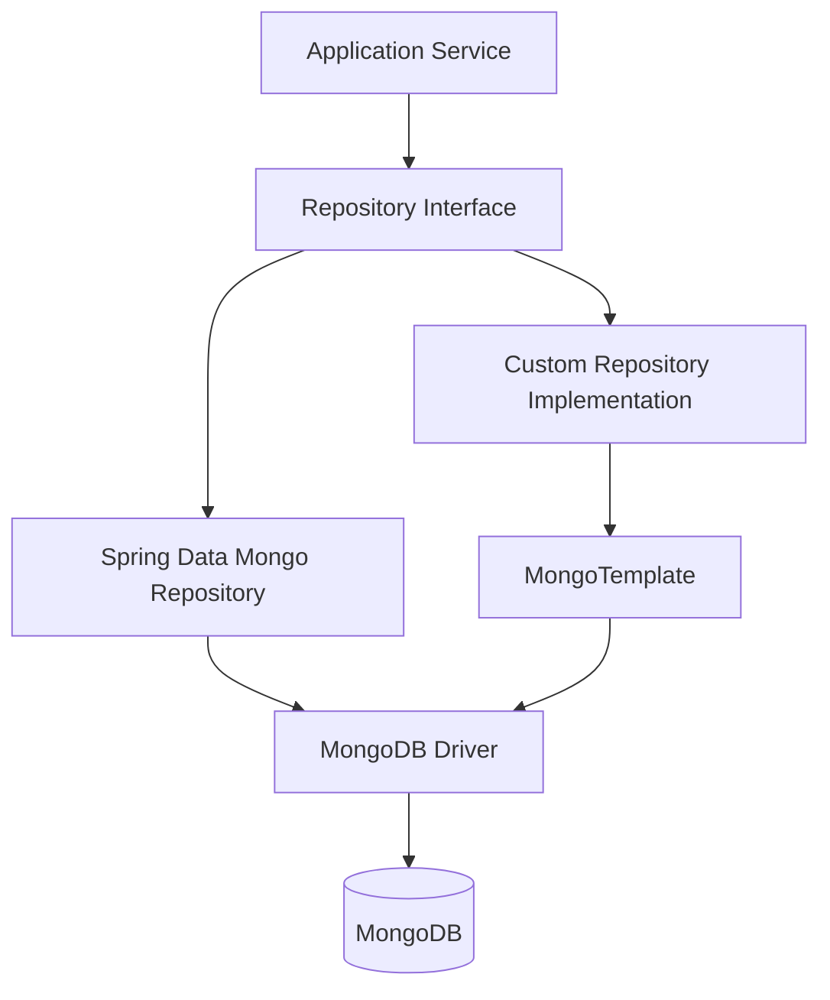
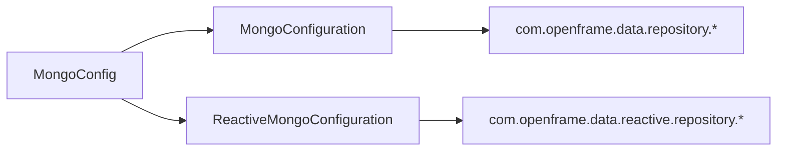
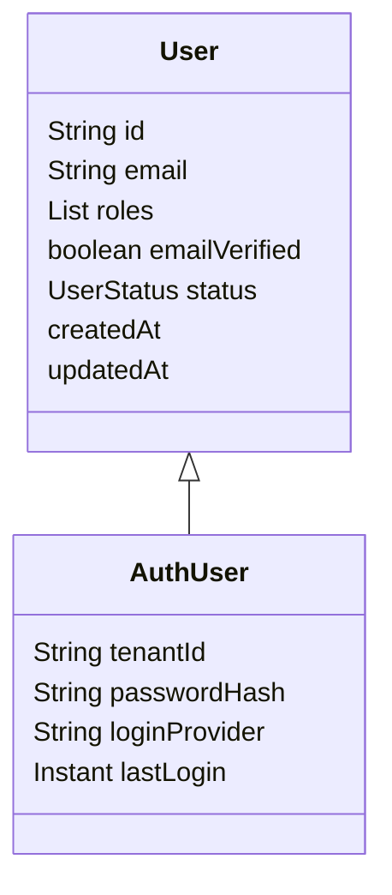
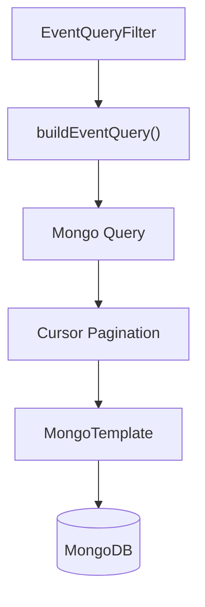
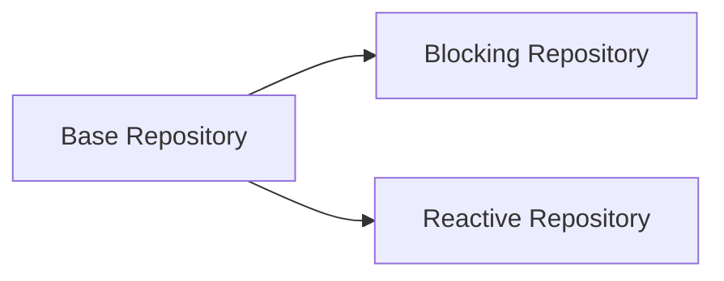
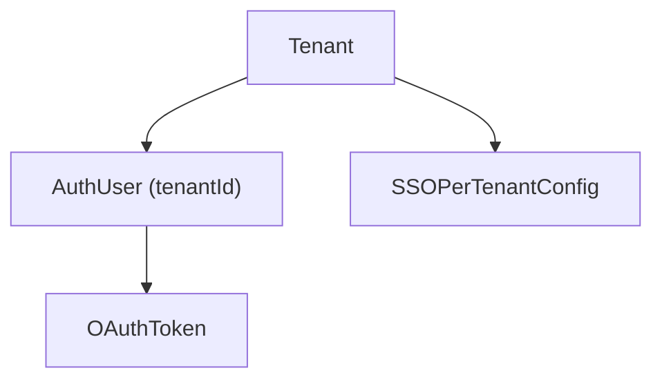

# Data Mongo Documents Repositories

The **Data Mongo Documents Repositories** module provides the MongoDB persistence layer for the OpenFrame platform. It defines:

- MongoDB configuration and indexing
- Domain documents (users, organizations, devices, events, OAuth, tools)
- Blocking and reactive repository abstractions
- Custom query builders with filtering, search, and cursor-based pagination

This module acts as the **document-oriented data backbone** for services such as:

- API Service Core
- Authorization Server Core
- Gateway Service Core
- Management Service Core
- Stream Processing Core

It encapsulates MongoDB access patterns so higher-level services operate through repositories rather than directly through `MongoTemplate`.

---

## 1. Architectural Overview

The module is structured into four primary layers:

1. **Configuration Layer** – MongoDB setup, auditing, converters, and indexes
2. **Document Layer** – MongoDB `@Document` domain models
3. **Repository Layer** – Spring Data repositories (blocking + reactive)
4. **Custom Query Layer** – Advanced filtering, sorting, and cursor pagination



### Key Design Principles

- **Technology-agnostic base repositories** for reactive and blocking usage
- **Cursor-based pagination** using `_id` (ObjectId) for scalable queries
- **Database-level filtering** instead of in-memory filtering
- **Soft-delete support** for business entities (e.g., Organization)
- **Multi-tenant support** via tenant-aware documents (e.g., AuthUser, SSOPerTenantConfig)

---

## 2. Mongo Configuration

### 2.1 MongoConfig

Enables:

- `@EnableMongoRepositories` for blocking repositories
- `@EnableReactiveMongoRepositories` for reactive environments
- `@EnableMongoAuditing` for `@CreatedDate` and `@LastModifiedDate`

It also customizes the `MappingMongoConverter`:

- Sets custom conversions
- Replaces map keys containing dots (`.`) with `__dot__`



### 2.2 MongoIndexConfig

Initializes indexes programmatically at startup:

Collection: `application_events`

Indexes:

- `{ userId: ASC, timestamp: DESC }`
- `{ type: ASC, metadata.tags: ASC }`

This ensures efficient:

- Time-range queries per user
- Tag-based event filtering

---

## 3. Document Model

The module defines MongoDB documents for multiple bounded contexts.

### 3.1 User & Authentication

#### User
- Collection: `users`
- Indexed fields: `email`, `status`
- Supports roles and email verification
- Audited timestamps

#### AuthUser
Extends `User` and adds:

- `tenantId` (indexed, compound unique with email)
- `passwordHash`
- `loginProvider`
- `externalUserId`
- `lastLogin`



This structure supports:

- Multi-tenant authorization
- SSO and local authentication
- Domain-based tenancy

---

### 3.2 Organization

Collection: `organizations`

Key features:

- Unique `organizationId`
- Soft delete via `deleted` flag
- Contract lifecycle tracking
- Indexed fields for filtering

Custom repository supports:

- Category filtering
- Employee range filtering
- Active contract detection
- Cursor pagination

---

### 3.3 Devices & Machine Tags

#### Device
- Collection: `devices`
- Tracks machine identity, status, OS, health
- Links to external machine systems

#### MachineTag
- Collection: `machine_tags`
- Compound unique index: `{ machineId, tagId }`
- Prevents duplicate tagging

CustomMachineRepositoryImpl supports:

- Filtering by status, type, OS, organization
- Full-text-like regex search across multiple fields
- Cursor pagination using `_id`

---

### 3.4 Events

#### CoreEvent
- Collection: `events`
- Tracks internal event lifecycle
- Status: CREATED, PROCESSING, COMPLETED, FAILED

#### ExternalApplicationEvent
- Collection: `external_application_events`
- Contains metadata with tags
- Indexed for tag-based querying

CustomEventRepositoryImpl provides:

- Filtering by user, type, date range
- Regex search
- Cursor-based pagination
- Distinct value extraction (user IDs, event types)



---

### 3.5 OAuth & Security

#### MongoRegisteredClient
- Collection: `oauth_registered_clients`
- Unique `clientId`
- Stores grant types, scopes, PKCE requirements

#### OAuthToken
- Collection: `oauth_tokens`
- Access and refresh tokens
- Expiration timestamps
- Linked to `userId` and `clientId`

Repositories:

- `OAuthTokenRepository`
- `ReactiveOAuthClientRepository`

These integrate directly with the Authorization Server Core module.

---

### 3.6 Tools & Integrated Tools

#### Tag
- Collection: `tags`
- Unique name
- Scoped to organization

#### ToolAgentAsset
Represents tool binaries and metadata:

- Version
- Download configurations
- Executable flag

CustomIntegratedToolRepositoryImpl provides:

- Filtering by enabled, type, category, platform
- Regex search
- Distinct type/category discovery

---

### 3.7 Tenant & SSO Configuration

#### SSOPerTenantConfig
- Extends base SSO configuration
- Unique sparse index on `tenantId`
- Audited timestamps

Used by Authorization Server for tenant-specific identity providers.

---

## 4. Repository Architecture

The repository layer follows a structured pattern:

### 4.1 Base Interfaces

Generic, technology-agnostic interfaces:

- `BaseUserRepository`
- `BaseApiKeyRepository`
- `BaseTenantRepository`
- `BaseIntegratedToolRepository`

These abstract:

- Blocking (Optional, boolean, List)
- Reactive (Mono, Flux)



This allows services to switch between WebMVC and WebFlux without changing business logic.

---

### 4.2 Reactive vs Blocking

| Type | Technology | Enabled When |
|------|------------|-------------|
| Blocking | `MongoRepository` | Standard web app |
| Reactive | `ReactiveMongoRepository` | WebFlux app |

Reactive repositories are conditionally enabled with:

```text
@ConditionalOnWebApplication(type = REACTIVE)
```

---

### 4.3 Custom Repository Implementations

Used when:

- Dynamic filtering is required
- Cursor-based pagination is needed
- Multi-field sorting is necessary
- Distinct value aggregation is required

Common patterns:

```text
1. Build Criteria from filter object
2. Add search criteria (regex)
3. Apply cursor logic using ObjectId
4. Apply compound sorting
5. Execute via MongoTemplate
```

Cursor pagination pattern:

```text
if cursor exists:
    add _id < cursor (DESC)
    or _id > cursor (ASC)
```

This ensures:

- O(1) pagination performance
- No offset-based performance degradation

---

## 5. Indexing Strategy

Indexes are defined using:

- `@Indexed`
- `@CompoundIndex`
- Programmatic index creation (MongoIndexConfig)

Common indexed fields:

- `email`
- `organizationId`
- `tenantId`
- `_id`
- `type`
- `userId`
- `deleted`

This supports:

- Multi-tenant isolation
- Soft-delete filtering
- Time-range event queries
- Efficient authentication lookups

---

## 6. Multi-Tenancy Model

Multi-tenancy is implemented at the document level.



Key characteristics:

- Compound index on `{ tenantId, email }`
- Sparse unique SSO configuration per tenant
- Tenant-aware OAuth clients

This design avoids database-per-tenant complexity while maintaining isolation.

---

## 7. Soft Delete Strategy

Entities such as `Organization` implement soft delete via:

- `deleted` flag
- `deletedAt` timestamp

CustomOrganizationRepositoryImpl ensures:

```text
Always exclude:
    deleted = true
Include:
    deleted = false OR deleted not present
```

This protects historical data while keeping it queryable if needed.

---

## 8. Integration with Other Modules

The Data Mongo Documents Repositories module supports:

- API Service Core → user, device, organization queries
- Authorization Server Core → AuthUser, OAuthToken, MongoRegisteredClient
- Gateway Service Core → API key lookups
- Management Service Core → tool and organization management
- Stream Processing Core → event persistence

It acts as the **persistence contract** between business services and MongoDB.

---

# Summary

The **Data Mongo Documents Repositories** module provides:

- Structured MongoDB configuration
- Rich domain document modeling
- Multi-tenant-aware authentication persistence
- High-performance filtering and cursor pagination
- Reactive and blocking repository abstraction
- Soft delete and auditing support

It is the central MongoDB persistence layer for the OpenFrame platform, ensuring scalable, maintainable, and multi-tenant-safe data access across services.
