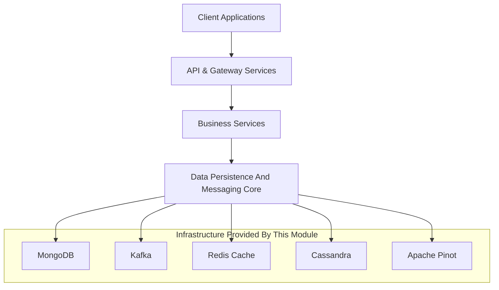
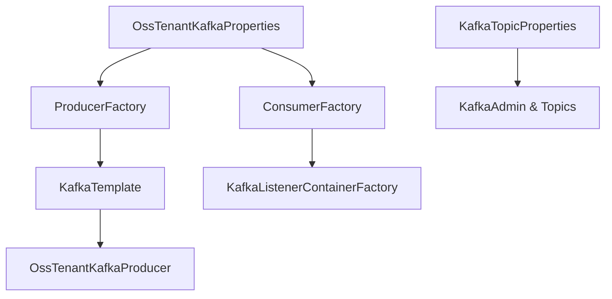
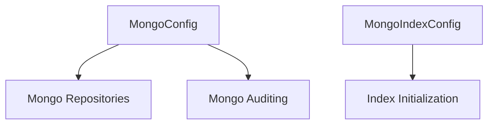
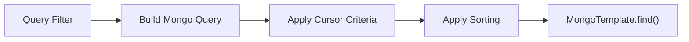
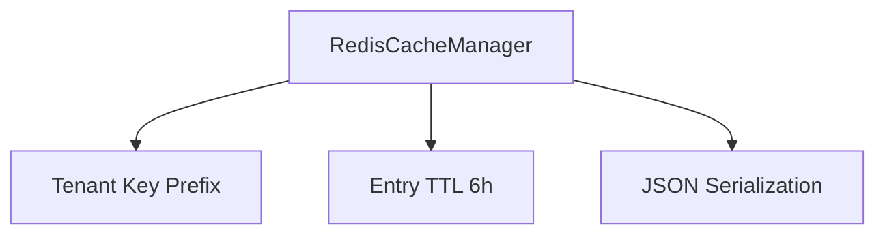
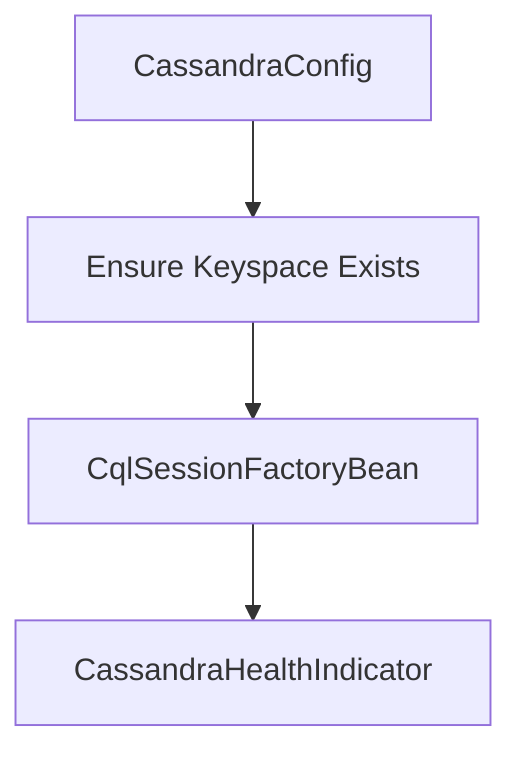
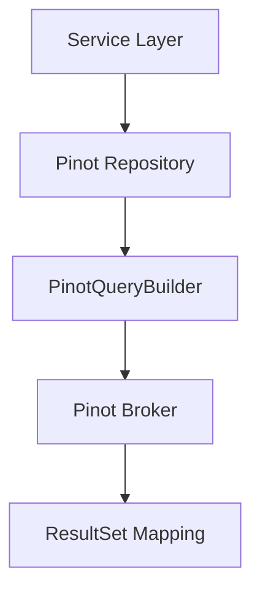
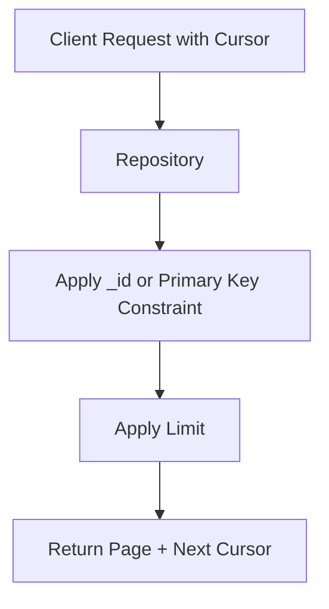

# Data Persistence And Messaging Core

## Overview

The **Data Persistence And Messaging Core** module provides the foundational infrastructure for data storage, caching, event streaming, and analytical querying across the OpenFrame platform. It centralizes configuration and reusable abstractions for:

- MongoDB (primary operational datastore)
- Kafka (event-driven messaging backbone)
- Redis (caching and fast key-value access)
- Cassandra (optional distributed storage)
- Apache Pinot (real-time analytics and filtering)

All higher-level services such as API Service Core, Authorization Server Core, Stream Processing Service Core, Management Service Core, and Gateway Service Core depend on this module for consistent data access and messaging behavior.

---

## Architectural Position in the Platform

The module acts as the infrastructure layer beneath all business services.

This design ensures:

- Centralized configuration
- Multi-tenant consistency
- Shared repository abstractions
- Reusable streaming and analytics integration

---

# 1. Kafka Messaging Infrastructure

Kafka is the primary event backbone used for domain events, CDC streams, and cross-service communication.

## Core Configuration Components

- `OssKafkaConfig` – Enables Kafka while disabling Spring’s default auto-configuration.
- `OssTenantKafkaAutoConfiguration` – Custom auto-configuration for the OSS tenant Kafka cluster.
- `OssTenantKafkaProperties` – Strongly typed configuration bound to `spring.oss-tenant`.
- `KafkaTopicProperties` – Topic metadata and auto-creation configuration.
- `KafkaRecoveryHandlerImpl` – Structured recovery logging for failed message production.
- `KafkaHeader` – Standard header definitions (e.g., `message-type`).

## Kafka Auto-Configuration Flow

### Key Design Characteristics

- Explicit exclusion of `KafkaAutoConfiguration`
- Tenant-aware property prefix (`spring.oss-tenant.kafka`)
- JSON serialization by default
- Configurable concurrency and acknowledgment modes
- Optional topic auto-creation

### Failure Handling

`KafkaRecoveryHandlerImpl` provides structured logging when retries are exhausted:

- Topic name
- Message key
- Exception type
- Serialized payload snapshot

This ensures traceability without coupling to a dead-letter implementation.

---

# 2. MongoDB – Primary Operational Store

MongoDB serves as the primary document database for tenant data.

## Configuration Layer

- `MongoConfig` – Enables repositories and auditing.
- `MongoIndexConfig` – Programmatic index creation.
- Custom `MappingMongoConverter` with dot replacement for map keys.

## Core Documents

### Device
- Stored in `devices` collection
- Tracks status, OS, configuration, and health

### CoreEvent
- Stored in `events` collection
- Contains event type, payload, timestamp, and lifecycle state

### Organization
- Soft-delete enabled
- Indexed by `organizationId`
- Contract lifecycle validation

### OAuth Entities
- `MongoRegisteredClient`
- `OAuthToken`

Used by the Authorization Server Core for OAuth2 flows.

---

## Advanced Repository Implementations

Custom repositories implement database-level filtering and cursor-based pagination.

### Device Repository
`CustomMachineRepositoryImpl`

- Cursor-based pagination using `_id`
- Regex search across hostname, IP, serial number
- Validated sortable fields

### Event Repository
`CustomEventRepositoryImpl`

- Date-range filtering
- Distinct queries for user IDs and event types
- Cursor pagination

### Organization Repository
`CustomOrganizationRepositoryImpl`

- Soft-delete exclusion
- Contract active filtering
- Combined AND criteria

---

# 3. Redis – Caching Layer

Redis provides caching and fast-access storage for frequently requested data.

## Components

- `RedisConfig` – RedisTemplate and ReactiveRedisTemplate configuration
- `CacheConfig` – Spring Cache integration

## Key Features

- Tenant-aware cache key prefixing
- 6-hour default TTL
- JSON value serialization
- Reactive and blocking support

Redis is typically used by API and Management services to reduce MongoDB load.

---

# 4. Cassandra – Distributed Storage (Optional)

Cassandra support is enabled via property `spring.data.cassandra.enabled`.

## Components

- `CassandraConfig` – Session and keyspace management
- `DataConfiguration` – Repository enabling
- `CassandraHealthIndicator` – Actuator health integration

## Key Capabilities

- Automatic keyspace creation
- Configurable replication factor
- Programmatic session builder customization
- Health verification query against `system.local`

Cassandra is typically used for distributed or time-series workloads.

---

# 5. Apache Pinot – Real-Time Analytics

Pinot provides high-performance analytics for logs and device filtering.

## Device Analytics

`PinotClientDeviceRepository`

- Filter option aggregation
- Status counts
- Device-type distributions
- Organization and tag grouping

## Log Analytics

`PinotClientLogRepository`

- Time-range log queries
- Full-text search
- Distinct option retrieval
- Cursor-based pagination
- Safe sortable column validation

Pinot is optimized for:

- Aggregation queries
- Filtering dimensions
- Real-time operational dashboards

---

# 6. Technology-Agnostic Repository Abstractions

Several base repository interfaces allow dual implementations (blocking and reactive):

- `BaseApiKeyRepository`
- `BaseTenantRepository`
- `BaseIntegratedToolRepository`
- `BaseUserRepository`

These abstractions:

- Decouple service layer from implementation style
- Enable reactive or blocking repositories
- Standardize cross-cutting query patterns

---

# 7. Cross-Cutting Concerns

## Multi-Tenancy

- Kafka cluster configured under OSS tenant namespace
- Redis cache keys prefixed per tenant
- Mongo repositories structured for tenant isolation

## Cursor-Based Pagination Pattern

Implemented consistently across Mongo and Pinot layers:

## Soft Delete Strategy

- Organizations use `deleted` flag
- Queries exclude soft-deleted records by default

---

# Summary

The **Data Persistence And Messaging Core** module provides:

- Unified messaging infrastructure (Kafka)
- Operational document storage (MongoDB)
- High-performance caching (Redis)
- Distributed persistence option (Cassandra)
- Real-time analytics (Pinot)
- Consistent repository abstractions

It is the foundational infrastructure layer enabling all higher-level OpenFrame services to remain clean, domain-focused, and scalable.
