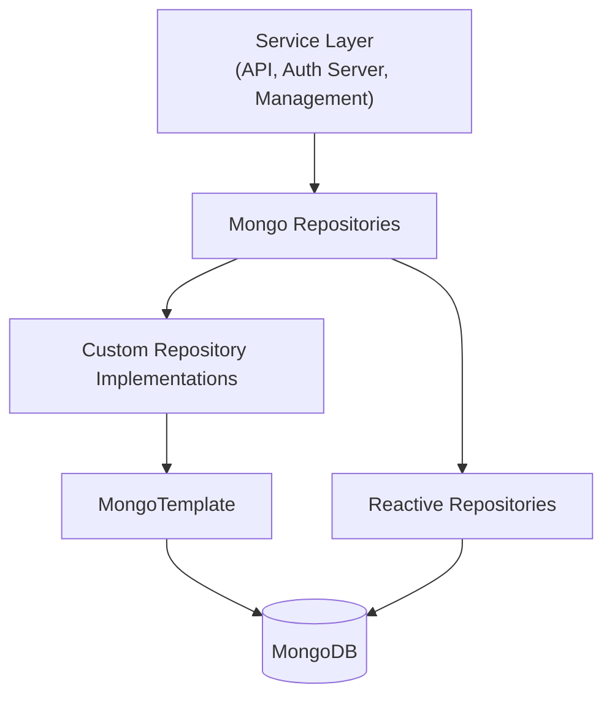
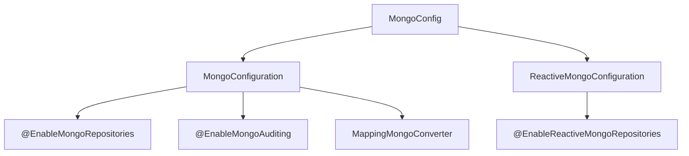
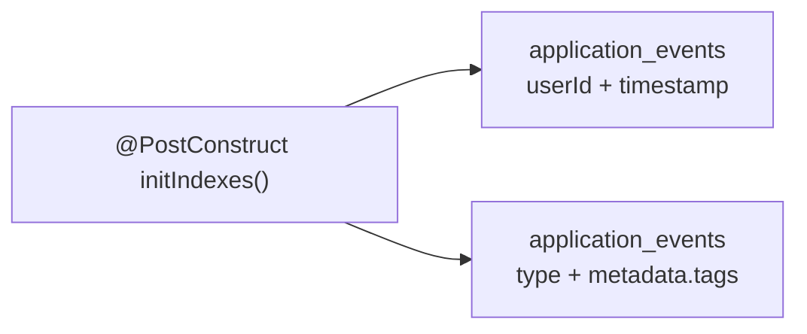
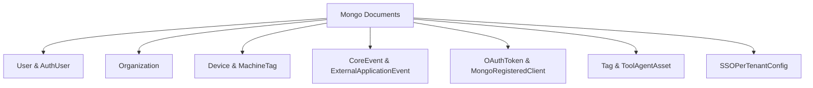
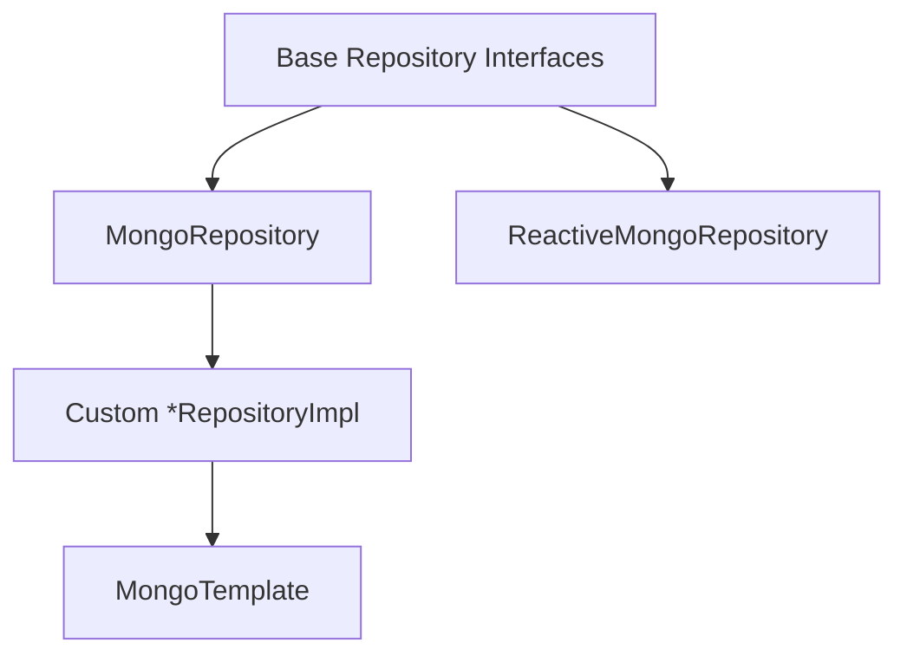
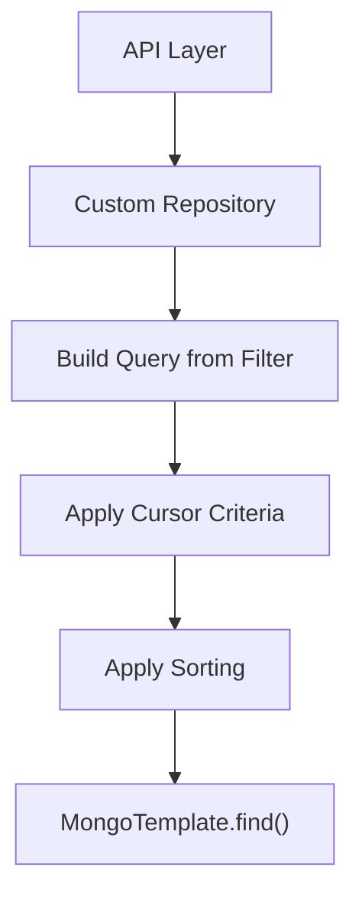
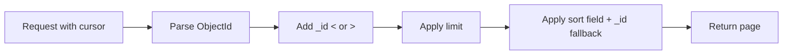

# Data Persistence Mongo

The **Data Persistence Mongo** module provides the MongoDB-based data layer for the OpenFrame platform. It defines:

- MongoDB configuration (blocking and reactive)
- Document models (collections and embedded documents)
- Repository abstractions (blocking and reactive)
- Custom query implementations with filtering, search, and cursor-based pagination
- Index configuration for performance optimization

This module acts as the **primary operational data store** for users, organizations, devices, tools, OAuth entities, tenants, and events.

---

## 1. Architectural Overview

At a high level, Data Persistence Mongo sits between the domain/service layer (API, Authorization Server, Gateway, etc.) and MongoDB.

### Responsibilities

- Define MongoDB collections via `@Document`
- Configure auditing and repository scanning
- Provide type-safe repositories
- Implement advanced filtering and cursor-based pagination
- Enforce domain constraints via indexes

---

## 2. Mongo Configuration

### 2.1 MongoConfig

The `MongoConfig` class provides conditional configuration for both **blocking** and **reactive** MongoDB usage.

#### MongoConfiguration

Activated when:

- `spring.data.mongodb.enabled=true`

Key features:

- Enables repository scanning under `com.openframe.data.repository`
- Enables auditing (`@CreatedDate`, `@LastModifiedDate`)
- Custom `MappingMongoConverter`
  - Registers `MongoCustomConversions`
  - Replaces `.` in map keys with `__dot__`

#### ReactiveMongoConfiguration

Activated in reactive web applications.

- Enables scanning under `com.openframe.data.reactive.repository`
- Supports non-blocking data access via `ReactiveMongoRepository`

---

### 2.2 MongoIndexConfig

Ensures indexes are created at startup.

These compound indexes optimize:

- User-based event lookups
- Tag and type-based filtering

---

## 3. Document Model

The module defines MongoDB documents grouped by domain.

---

### 3.1 User & Authentication

#### User

- Stored in `users` collection
- Indexed email
- Roles and status
- Audited with `createdAt` and `updatedAt`

#### AuthUser

Extends `User` for multi-tenant authorization.

Key features:

- Compound unique index on `(tenantId, email)`
- Supports local and external providers
- Tracks `lastLogin`

This model is used by the Authorization Server.

---

### 3.2 Organization Domain

#### Organization

Collection: `organizations`

Features:

- Unique `organizationId`
- Soft delete (`deleted`, `deletedAt`)
- Contract lifecycle tracking
- Indexed name and flags
- Embedded `ContactInformation`

#### OrganizationQueryFilter

Used to build database-level filtering:

- Category
- Employee range
- Active contract status

Custom repository logic ensures:

- Soft-deleted entities are excluded
- Filters are combined with `$and`
- Efficient cursor-based pagination

---

### 3.3 Device & Machine Domain

#### Device

Collection: `devices`

Stores:

- Machine metadata
- Status
- OS information
- Health and configuration

#### MachineTag

Collection: `machine_tags`

- Compound unique index `(machineId, tagId)`
- Supports tagging system

#### Alert & SecurityAlert

Embedded documents representing:

- Operational alerts
- Security findings
- Resolution tracking

---

### 3.4 Events

#### CoreEvent

Collection: `events`

- Type
- Payload
- Timestamp
- Status lifecycle (CREATED → COMPLETED)

#### ExternalApplicationEvent

Collection: `external_application_events`

- External source metadata
- Tag-based filtering
- Indexed for type and metadata tags

#### EventQueryFilter

Supports:

- User filtering
- Event type filtering
- Date range filtering

Custom implementation supports:

- Regex-based search
- Cursor-based pagination
- Distinct value extraction

---

### 3.5 OAuth & Security

#### MongoRegisteredClient

Collection: `oauth_registered_clients`

- Unique `clientId`
- Grant types, scopes, redirect URIs
- Token TTL configuration

#### OAuthToken

Collection: `oauth_tokens`

- Access & refresh tokens
- Expiration timestamps
- Client association

Blocking and reactive repositories support:

- Lookup by access token
- Lookup by refresh token

---

### 3.6 Tools & Assets

#### Tag

Collection: `tags`

- Unique name
- Scoped by organization
- Indexed for fast lookup

#### ToolAgentAsset

Embedded model describing:

- Version
- Download configurations
- Local filename mappings
- Executable flags

#### ToolQueryFilter

Supports filtering by:

- Enabled flag
- Type
- Category
- Platform category

---

### 3.7 Tenant & SSO

#### SSOPerTenantConfig

Extends base SSO configuration with:

- Unique `tenantId`
- Auditing timestamps

#### TenantRepository

- Lookup by domain
- Domain existence checks
- DomainView projection

---

## 4. Repository Architecture

The module uses a layered repository pattern.

### 4.1 Base Interfaces

Technology-agnostic contracts:

- `BaseUserRepository`
- `BaseApiKeyRepository`
- `BaseTenantRepository`
- `BaseIntegratedToolRepository`

These allow:

- Blocking implementations
- Reactive implementations
- Shared domain contracts

---

### 4.2 Custom Repository Implementations

Implemented using `MongoTemplate` for advanced logic.

#### Common Capabilities

- Database-level filtering
- Regex search
- Cursor-based pagination
- Sort field validation
- Distinct value extraction

Examples:

- `CustomMachineRepositoryImpl`
- `CustomEventRepositoryImpl`
- `CustomOrganizationRepositoryImpl`
- `CustomIntegratedToolRepositoryImpl`

These implementations ensure:

- Only sortable fields are allowed
- Stable cursor pagination using `_id`
- Efficient compound sorting

---

## 5. Cursor-Based Pagination Pattern

Several repositories implement a consistent cursor strategy.

Characteristics:

- Uses `_id` as stable pagination anchor
- Supports ASC and DESC directions
- Adds `_id` as secondary sort for deterministic ordering

---

## 6. Auditing & Data Integrity

Enabled via `@EnableMongoAuditing`.

Supported annotations:

- `@CreatedDate`
- `@LastModifiedDate`

Data integrity mechanisms:

- Compound indexes (AuthUser, MachineTag)
- Unique constraints (organizationId, tag name, clientId)
- Soft delete enforcement at query level

---

## 7. Reactive vs Blocking Strategy

The module supports both runtime modes.

| Mode        | Repository Type                | Used By |
|------------|--------------------------------|---------|
| Blocking   | MongoRepository                | API, Management |
| Reactive   | ReactiveMongoRepository        | Reactive services |

Reactive repositories return:

- `Mono<T>`
- `Flux<T>`

Blocking repositories return:

- `Optional<T>`
- `List<T>`
- Primitive values

---

## 8. Role Within the Platform

Data Persistence Mongo is the **operational datastore** for:

- Users and authentication
- Organizations and contracts
- Devices and tags
- Tools and assets
- OAuth clients and tokens
- Tenants and SSO configuration
- Events and audit trails

It integrates with:

- Authorization Server (OAuth + AuthUser)
- API Service (domain queries)
- Management Service (tool and version management)
- Gateway (tenant resolution)
- Stream processing (event persistence)

---

# Conclusion

The **Data Persistence Mongo** module provides a robust, extensible, and performance-aware MongoDB data layer for OpenFrame.

Its design emphasizes:

- Clean domain modeling
- Strong indexing and constraints
- Database-level filtering
- Cursor-based pagination
- Reactive and blocking support
- Clear separation between domain contracts and persistence technology

It serves as the foundation for multi-tenant, secure, and scalable data operations across the platform.