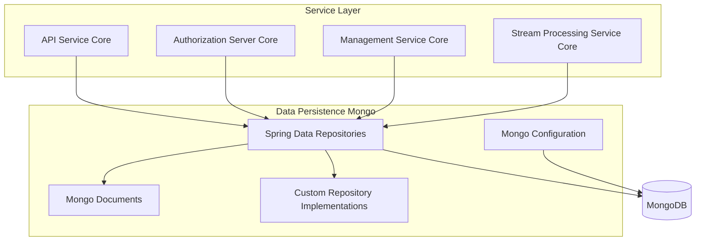
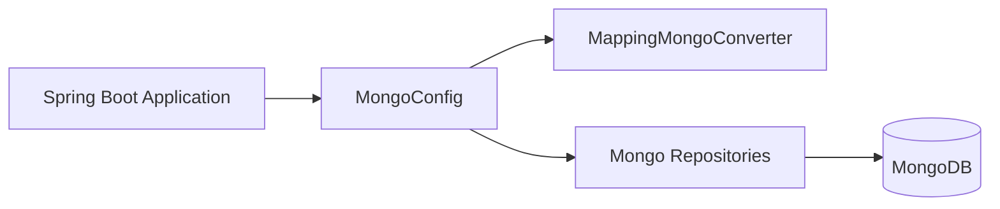
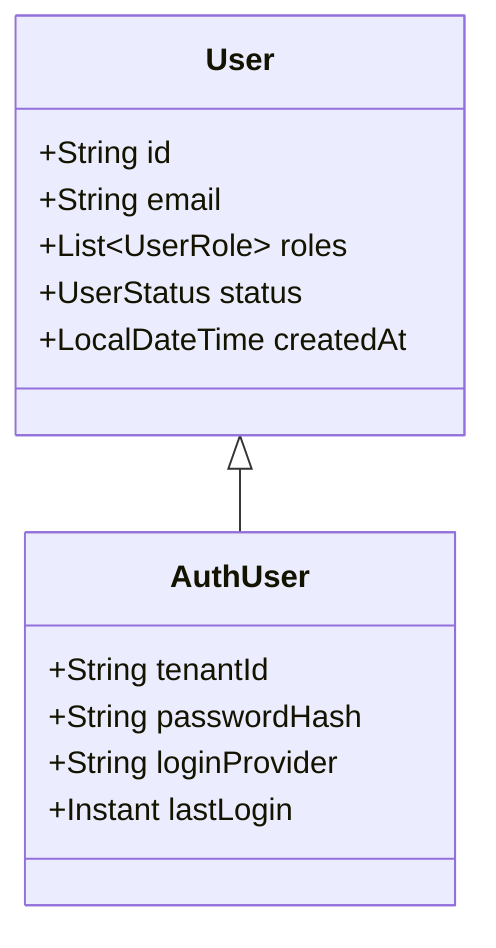
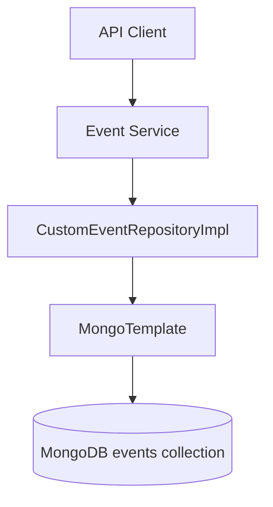
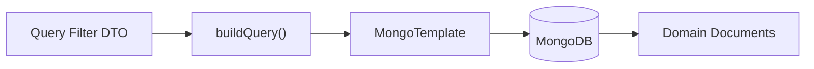

# Data Persistence Mongo

The **Data Persistence Mongo** module provides the primary MongoDB-based persistence layer for the OpenFrame platform. It defines:

- MongoDB configuration and indexing
- Domain document models (users, organizations, devices, events, OAuth, tools, tenants)
- Blocking and reactive repositories
- Custom query implementations with filtering, cursor pagination, and search

This module is consumed by higher-level modules such as API Service Core, Authorization Server Core, Management Service Core, and Stream Processing Service Core.

---

## 1. Architectural Overview

At a high level, Data Persistence Mongo acts as the infrastructure boundary between the business services and MongoDB.

### Responsibilities

1. Define Mongo collections and document schemas.
2. Provide reusable base repository contracts.
3. Implement advanced filtering and cursor-based pagination.
4. Support both blocking and reactive access patterns.
5. Enforce indexes and compound uniqueness constraints.

---

## 2. Mongo Configuration

### 2.1 MongoConfig

**Core component:**
- `MongoConfig`

This class enables MongoDB repositories and auditing when `spring.data.mongodb.enabled=true`.

Key features:

- `@EnableMongoRepositories` for blocking repositories.
- `@EnableReactiveMongoRepositories` for reactive applications.
- Custom `MappingMongoConverter` with:
  - Custom conversions
  - Dot replacement for map keys using `__dot__`
- `@EnableMongoAuditing` to support `@CreatedDate` and `@LastModifiedDate`.

### 2.2 MongoIndexConfig

**Core component:**
- `MongoIndexConfig`

On application startup, indexes are programmatically ensured for the `application_events` collection:

- `{ userId: 1, timestamp: -1 }`
- `{ type: 1, metadata.tags: 1 }`

This guarantees optimized filtering by user, time range, type, and tags.

---

## 3. Domain Documents

The module defines MongoDB `@Document` classes that represent core platform entities.

### 3.1 Users and Authentication

#### User

- Collection: `users`
- Indexed fields: `email`, `status`
- Audited fields: `createdAt`, `updatedAt`

Normalizes email to lowercase and supports role-based access.

#### AuthUser

- Extends `User`
- Adds `tenantId`, `passwordHash`, `loginProvider`, `externalUserId`, `lastLogin`
- Compound unique index on `{ tenantId, email }`

This model supports multi-tenant authentication used by Authorization Server Core.

---

### 3.2 Organization

- Collection: `organizations`
- Unique index: `organizationId`
- Soft delete: `deleted`, `deletedAt`
- Contract lifecycle logic (`isContractActive()`)

`CustomOrganizationRepositoryImpl` implements:

- Category filtering
- Employee range filtering
- Active contract filtering
- Search by name, ID, category
- Cursor-based pagination
- Sort field validation

---

### 3.3 Devices and Tags

#### Device

- Collection: `devices`
- Tracks hardware metadata, OS, health, configuration
- Status: `ACTIVE`, `OFFLINE`, `MAINTENANCE`

#### MachineTag

- Collection: `machine_tags`
- Unique compound index on `{ machineId, tagId }`

#### Tag

- Collection: `tags`
- Unique index on `name`
- Scoped by `organizationId`

`CustomMachineRepositoryImpl` provides:

- Flexible filtering (status, device type, OS, organization)
- Regex search on hostname, serial, manufacturer, etc.
- Cursor-based pagination using `_id`
- Deterministic secondary sorting

---

### 3.4 Events

#### CoreEvent

- Collection: `events`
- Status lifecycle: `CREATED`, `PROCESSING`, `COMPLETED`, `FAILED`

#### ExternalApplicationEvent

- Collection: `external_application_events`
- Supports metadata with tag maps

`ExternalApplicationEventRepository` enables:

- Time range queries
- Type and tag filtering via `@Query`

`CustomEventRepositoryImpl` provides:

- Date-range filtering
- Event type filtering
- Text search
- Cursor-based pagination (ascending or descending)
- Distinct queries for `userId` and `type`

---

### 3.5 OAuth and Clients

#### MongoRegisteredClient

- Collection: `oauth_registered_clients`
- Unique index on `clientId`
- Stores grant types, scopes, redirect URIs, TTL configuration

#### OAuthToken

- Collection: `oauth_tokens`
- Stores access and refresh tokens
- Linked to `userId` and `clientId`

`OAuthTokenRepository` enables lookup by access or refresh token.

Reactive variant:
- `ReactiveOAuthClientRepository`

These are consumed by Authorization Server Core.

---

### 3.6 Tenant and SSO

#### SSOPerTenantConfig

- Extends base `SSOConfig`
- Unique sparse index on `tenantId`
- Audited timestamps

`BaseTenantRepository` defines a technology-agnostic contract:

- `findByDomain`
- `existsByDomain`

---

### 3.7 Tools and Integrated Tools

#### ToolAgentAsset

Represents downloadable tool agent metadata:

- Version
- Download configurations
- Executable flag

#### BaseIntegratedToolRepository

Generic contract for retrieving tools by type.

#### CustomIntegratedToolRepositoryImpl

Provides:

- Filtering by enabled, type, category, platform category
- Regex search on name and description
- Distinct type and category extraction
- Validated sortable fields

---

## 4. Repository Design Patterns

The module follows three key repository patterns:

### 4.1 Base Repository Interfaces

Examples:

- `BaseUserRepository`
- `BaseApiKeyRepository`
- `BaseTenantRepository`
- `BaseIntegratedToolRepository`

These define technology-agnostic contracts using generics:

- Blocking: `Optional`, `List`, `boolean`
- Reactive: `Mono`, `Flux`

This enables consistent APIs across blocking and reactive stacks.

---

### 4.2 Spring Data Repositories

Standard repositories extend:

- `MongoRepository`
- `ReactiveMongoRepository`

They provide CRUD, derived queries, and custom method naming conventions.

---

### 4.3 Custom Repository Implementations

Classes like:

- `CustomMachineRepositoryImpl`
- `CustomEventRepositoryImpl`
- `CustomOrganizationRepositoryImpl`
- `CustomIntegratedToolRepositoryImpl`

Use `MongoTemplate` for:

- Dynamic query construction
- Complex AND/OR criteria combinations
- Cursor pagination via `_id`
- Secondary sorting guarantees

---

## 5. Cursor-Based Pagination Strategy

Several repositories implement cursor pagination using Mongo `_id`.

Pattern:

1. Convert cursor string to `ObjectId`.
2. Apply `<` or `>` criteria depending on sort direction.
3. Limit results.
4. Apply primary + secondary sort.

This ensures:

- Stable ordering
- Efficient pagination without `skip`
- Horizontal scalability for large datasets

---

## 6. Auditing and Soft Deletes

Enabled via:

- `@EnableMongoAuditing`
- `@CreatedDate`
- `@LastModifiedDate`

Soft delete strategy (e.g., Organization):

- `deleted = true`
- `deletedAt` timestamp
- Queries automatically exclude deleted records via repository logic

---

## 7. Reactive vs Blocking Support

Data Persistence Mongo supports both models:

- Blocking repositories for traditional MVC services.
- Reactive repositories for WebFlux applications.

`ReactiveUserRepository` demonstrates combining:

- `ReactiveMongoRepository`
- `BaseUserRepository`

This dual-model design allows services to choose execution model without changing domain logic.

---

## 8. Role in the Overall Platform

Within the OpenFrame platform, Data Persistence Mongo:

- Persists tenant-aware users and authentication state.
- Stores devices and operational metadata.
- Captures events from stream processing.
- Manages OAuth clients and tokens.
- Stores integrated tool configurations.

It forms the canonical system-of-record for transactional and operational data in MongoDB, while analytics and streaming are handled by complementary modules.

---

## 9. Key Design Principles

1. Multi-tenancy support via indexed `tenantId`.
2. Strong indexing and compound uniqueness.
3. Cursor pagination for scalability.
4. Technology-agnostic repository contracts.
5. Clean separation of document model and query logic.

---

# Summary

The **Data Persistence Mongo** module is the MongoDB backbone of OpenFrame. It provides:

- Well-defined document schemas
- Audited entities
- High-performance indexed queries
- Advanced filtering and pagination
- Blocking and reactive repository support

It enables higher-level services to operate on a consistent, scalable, and multi-tenant data layer without directly managing MongoDB infrastructure concerns.