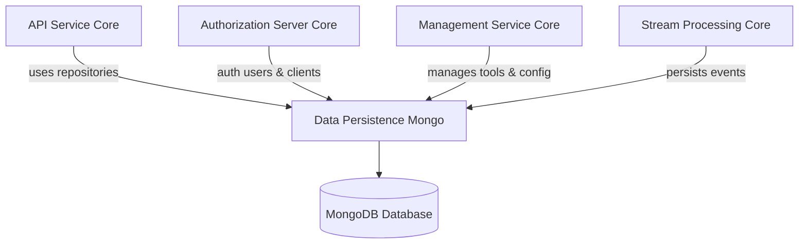
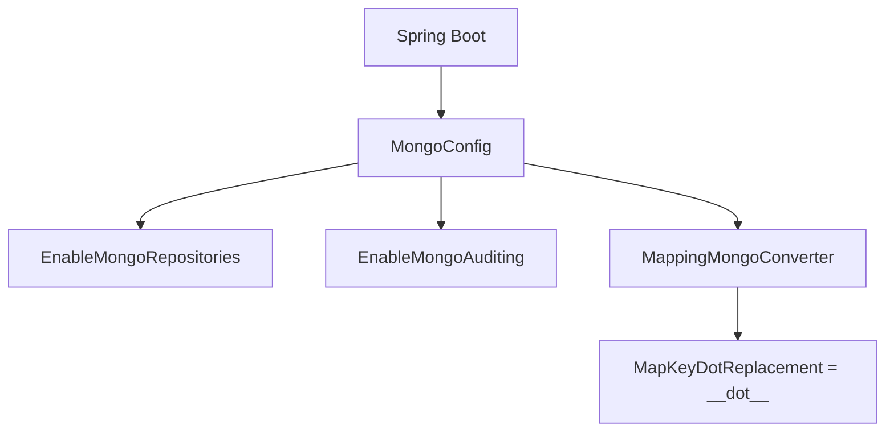
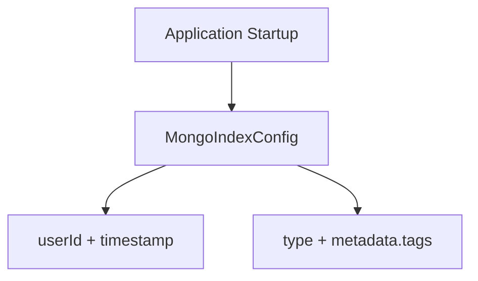
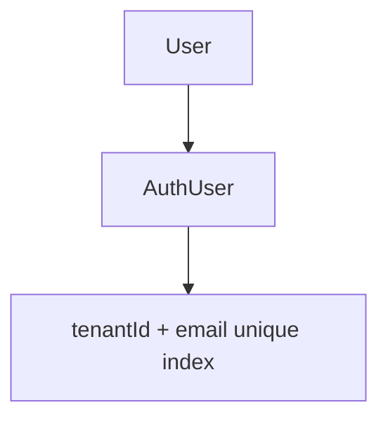
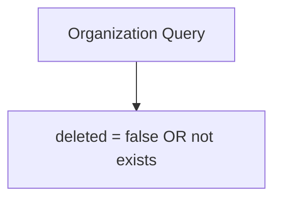
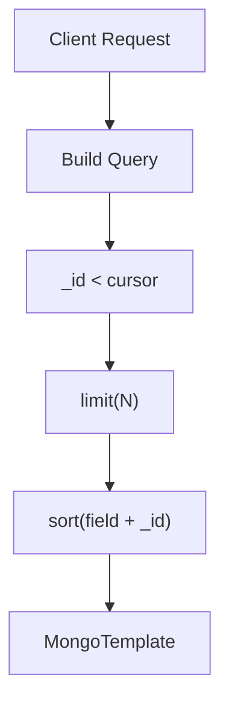
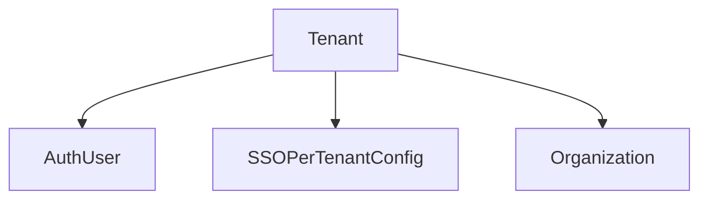

# Data Persistence Mongo

## Overview

The **Data Persistence Mongo** module provides the MongoDB-based data layer for the OpenFrame platform. It defines:

- MongoDB configuration (blocking and reactive)
- Domain document models
- Base and custom repositories
- Query filtering and cursor-based pagination
- Index management and auditing support

This module acts as the persistence backbone for higher-level services such as API Service Core, Authorization Server Core, Management Service Core, and Stream Processing Core.

It encapsulates MongoDB access behind Spring Data abstractions, ensuring consistent data modeling, query construction, and performance optimization across the platform.

---

## Architectural Role in the Platform

Data Persistence Mongo sits at the bottom of the service stack and is consumed by multiple service modules.



### Responsibilities

1. Provide Mongo configuration (blocking + reactive)
2. Define Mongo documents for core entities
3. Implement advanced filtering logic using MongoTemplate
4. Support cursor-based pagination for scalable APIs
5. Manage indexes for performance
6. Support auditing fields (createdAt, updatedAt)

---

# Configuration Layer

## MongoConfig

The `MongoConfig` class configures MongoDB integration in two modes:

### 1. Blocking Configuration

Activated when:

- `spring.data.mongodb.enabled=true`

Features:

- Enables `@EnableMongoRepositories`
- Enables `@EnableMongoAuditing`
- Configures a custom `MappingMongoConverter`
- Replaces map key dots with `__dot__`



### 2. Reactive Configuration

Activated when the application is a reactive web application.

- Enables `@EnableReactiveMongoRepositories`
- Used by reactive services (e.g., OAuth, reactive user flows)

---

## MongoIndexConfig

Responsible for ensuring indexes at startup.

Currently defines indexes on:

Collection: `application_events`

Indexes:

1. `userId ASC + timestamp DESC`
2. `type ASC + metadata.tags ASC`



This ensures efficient filtering and sorting for event queries.

---

# Domain Documents

The module defines Mongo `@Document` entities that represent persistent domain objects.

## User and Authentication

### User

Collection: `users`

Fields:

- `email` (normalized to lowercase)
- `roles`
- `status`
- `emailVerified`
- `createdAt`, `updatedAt`

Indexes:

- Indexed email
- Indexed status

### AuthUser

Extends `User`.

Additional fields:

- `tenantId`
- `passwordHash`
- `loginProvider`
- `externalUserId`
- `lastLogin`

Compound index:

```text
{ tenantId: 1, email: 1 } (unique, partial)
```

This enforces per-tenant unique emails in multi-tenant setups.



---

## Organization

Collection: `organizations`

Features:

- Immutable `organizationId` (unique)
- Soft delete via `deleted` flag
- Contract date validation logic
- Auditing fields

Soft delete logic ensures:



Custom repository ensures deleted records are excluded automatically.

---

## Device

Collection: `devices`

Represents managed devices.

Fields:

- `machineId`
- `serialNumber`
- `model`
- `status`
- `type`
- `lastCheckin`
- `configuration`
- `health`

Used heavily by API and Management services.

---

## CoreEvent

Collection: `events`

Fields:

- `type`
- `payload`
- `timestamp`
- `userId`
- `status` (CREATED, PROCESSING, COMPLETED, FAILED)

Supports filtering by:

- user
- type
- date range
- search

---

## Tag

Collection: `tags`

- Unique `name`
- Scoped by `organizationId`
- Metadata (color, description)

---

## SSOPerTenantConfig

Extends base SSO configuration and links it to a specific tenant.

Fields:

- `tenantId` (unique, sparse)
- `createdAt`
- `updatedAt`

Supports dynamic per-tenant SSO configuration.

---

# Repository Layer

The repository layer combines:

- Spring Data repositories
- Base repository abstractions
- Custom MongoTemplate implementations

---

## Base Repository Interfaces

### BaseUserRepository
Defines:

- `findByEmail`
- `existsByEmail`
- `existsByEmailAndStatus`

Technology-agnostic design supports both:

- Blocking (Optional / boolean)
- Reactive (Mono / Mono<Boolean>)

### BaseTenantRepository
Defines:

- `findByDomain`
- `existsByDomain`

### BaseIntegratedToolRepository
Defines:

- `findByType`

This abstraction allows multiple implementations without coupling higher layers to Mongo specifics.

---

## Reactive Repositories

### ReactiveUserRepository

Extends:

- `ReactiveMongoRepository<User, String>`
- `BaseUserRepository`

Used in reactive authentication and OAuth flows.

### ReactiveOAuthClientRepository

Provides:

- `findByClientId`

Used by Authorization Server Core.

---

## Custom Repository Implementations

Custom repositories use `MongoTemplate` to implement:

- Advanced filtering
- Cursor pagination
- Distinct queries
- Safe sorting validation

### Cursor Pagination Pattern

All major repositories implement cursor-based pagination using `_id`.



Advantages:

- Avoids offset-based performance issues
- Scales with large collections

---

## CustomMachineRepositoryImpl

Features:

- Machine filtering by status, type, OS, organization
- Regex-based search
- Sort validation
- Cursor-based pagination

Prevents unsafe sorting via whitelist of sortable fields.

---

## CustomEventRepositoryImpl

Features:

- Filter by userIds
- Filter by event types
- Date range filtering
- Regex search
- Distinct queries for:
  - userIds
  - event types

Implements bi-directional cursor pagination.

---

## CustomOrganizationRepositoryImpl

Features:

- Soft delete exclusion
- Category filtering
- Employee range filtering
- Active contract filtering
- Search on name, organizationId, category
- Cursor pagination

Ensures all criteria are combined using `$and`.

---

## CustomIntegratedToolRepositoryImpl

Features:

- Enabled filter
- Type filter
- Category filter
- Platform category filter
- Distinct queries for metadata
- Controlled sorting

---

# Cross-Cutting Concerns

## 1. Auditing

Enabled via `@EnableMongoAuditing`.

Documents using:

- `@CreatedDate`
- `@LastModifiedDate`

Automatically track lifecycle timestamps.

---

## 2. Multi-Tenancy Support

Multi-tenancy is enforced at:

- AuthUser level (tenantId + email unique index)
- SSOPerTenantConfig level
- Organization scoping



---

## 3. Soft Deletes

Implemented in Organization via:

- `deleted` flag
- `deletedAt`

Repositories ensure deleted entries are excluded by default.

---

## 4. Performance Optimization

Mechanisms used:

- Explicit index creation
- Compound indexes
- Sort field whitelisting
- Cursor-based pagination
- Distinct field queries

---

# Summary

The **Data Persistence Mongo** module provides:

- A robust MongoDB persistence layer
- Multi-tenant user and organization modeling
- Reactive and blocking repository support
- Advanced filtering and pagination
- Built-in indexing and auditing

It forms the foundational data layer for all major OpenFrame services and ensures consistency, scalability, and performance across the platform.