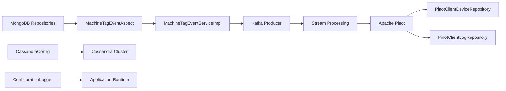
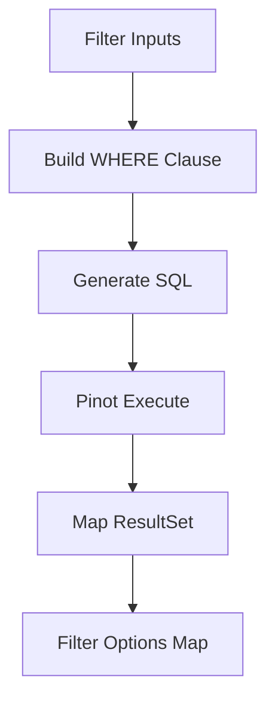
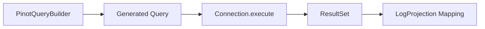
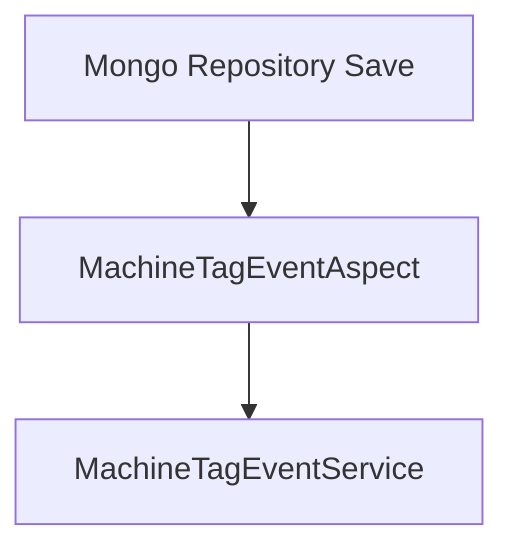
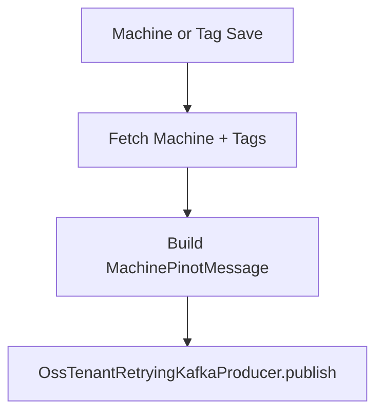
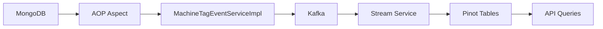

# Data Platform And Pinot Cassandra

## Overview

The **Data Platform And Pinot Cassandra** module is the backbone of OpenFrame's analytical and event-driven data layer. It connects operational persistence (MongoDB, Cassandra), real-time streaming (Kafka), and analytical querying (Apache Pinot) into a cohesive, tenant-aware data platform.

This module is responsible for:

- Cassandra configuration and keyspace lifecycle
- Apache Pinot connectivity and query repositories
- Device and log analytical queries
- Event propagation from MongoDB repositories to Kafka
- Machine–Tag synchronization logic
- Tool SDK wiring and external secret retrieval
- Health monitoring and runtime configuration visibility

It acts as a bridge between:

- **Operational data** (MongoDB)
- **Streaming infrastructure** (Kafka)
- **Analytical store** (Pinot)
- **Wide-column storage** (Cassandra)

---

## High-Level Architecture



### Flow Summary

1. MongoDB entities are saved.
2. AOP interceptors detect changes.
3. Machine and tag updates are converted into `MachinePinotMessage`.
4. Kafka publishes device update events.
5. Downstream stream processing updates Pinot tables.
6. Pinot repositories provide analytical queries for APIs.

---

# Core Responsibilities

## 1. Cassandra Configuration Layer

### CassandraConfig

- Extends `AbstractCassandraConfiguration`
- Auto-creates keyspaces if missing
- Configures:
  - Contact points
  - Datacenter
  - Port
  - Replication factor
  - Load balancing policy

Key behavior:

```text
- Ensures keyspace exists before session initialization
- Uses SimpleStrategy replication
- Uses server-side timestamp generator
```

### CassandraKeyspaceNormalizer

Cassandra keyspaces cannot contain dashes.

This initializer:

- Reads `spring.data.cassandra.keyspace-name`
- Replaces `-` with `_`
- Injects normalized property into Spring environment

This allows tenant IDs like:

```text
tenant-abc-123
```

To become:

```text
tenant_abc_123
```

Without breaking configuration semantics.

### CassandraHealthIndicator

Implements Spring Boot `HealthIndicator`.

Performs:

```text
SELECT release_version FROM system.local
```

Returns:

- `UP` if query succeeds
- `DOWN` if exception occurs

---

## 2. Apache Pinot Integration

### PinotConfig

Provides two `Connection` beans:

- `pinotBrokerConnection` → for analytical queries
- `pinotControllerConnection` → for metadata/controller access

Configured via:

```text
pinot.broker.url
pinot.controller.url
```

---

## 3. Analytical Repositories

### PinotClientDeviceRepository

Provides filter aggregation and device count queries.

Supports dynamic filtering by:

- status
- deviceType
- osType
- organizationId
- tagNames

Query strategy:



Key characteristics:

- Always excludes `DELETED` devices
- Dynamically excludes target column when building filter options
- Uses grouped aggregation queries

---

### PinotClientLogRepository

Handles advanced log queries with:

- Date range filtering
- Cursor-based pagination
- Full-text search
- Sorting with whitelist validation
- Distinct filter option extraction

Sortable columns are restricted to a predefined list to prevent invalid sort injection.

Internally:



This repository powers:

- Log search APIs
- Filter dropdown options
- Organization selection lists

---

## 4. Event Propagation Layer

### MachineTagEventAspect

An AOP interceptor that listens to:

- `MachineRepository.save`
- `MachineRepository.saveAll`
- `MachineTagRepository.save`
- `MachineTagRepository.saveAll`
- `TagRepository.save`
- `TagRepository.saveAll`

Enabled by property:

```text
openframe.device.aspect.enabled=true
```

Intercept pattern:



This decouples persistence from event publication.

---

### MachineTagEventServiceImpl

Responsible for:

- Fetching related entities
- Enriching tag lists
- Building `MachinePinotMessage`
- Publishing to Kafka

Event publishing flow:



Design features:

- Deduplicates machine IDs for batch saves
- Rebuilds full tag state on tag update
- Handles missing machine scenarios safely
- Uses machineId as Kafka key

This ensures Pinot always reflects complete and consistent machine state.

---

## 5. NATS Message Models

The module defines transport models used in streaming:

- `ClientConnectionEvent`
- `InstalledAgentMessage`
- `ToolConnectionMessage`
- `ToolInstallationMessage`
- `DownloadConfiguration`

These represent structured payloads for:

- Agent installation
- Tool updates
- Client connections
- Asset distribution

---

## 6. Integrated Tool Support

### IntegratedToolTypes

Defines supported tool constants such as:

```text
MONGODB
REDIS
CASSANDRA
KAFKA
PINOT
FLEET
AUTHENTIK
```

Ensures consistent tool identification across services.

---

### ToolCredentials

Generic credential container supporting:

- username
- password
- apiKey
- token
- clientId
- clientSecret

---

## 7. External Tool Secret Retrieval

### FleetMdmAgentRegistrationSecretRetriever

- Retrieves Fleet enroll secret
- Uses IntegratedTool configuration
- Builds SDK client dynamically

### TacticalRmmAgentRegistrationSecretRetriever

- Retrieves installation secret from Tactical RMM
- Builds `AgentRegistrationSecretRequest`
- Uses injected `TacticalRmmClient`

These components are enabled when:

```text
openframe.integration.tool.enabled=true
```

---

## 8. Tool SDK Configuration

### ToolSdkConfig

Provides:

- `TacticalRmmClient` bean

Allows integration services to consume SDK clients without manual instantiation.

---

## 9. Configuration Logging

### ConfigurationLogger

On `ApplicationReadyEvent`, logs:

- MongoDB URI
- Cassandra contact points
- Redis host
- Pinot controller URL
- Pinot broker URL

This improves runtime visibility in multi-environment deployments.

---

# End-to-End Data Flow



### Operational vs Analytical Separation

| Layer | Responsibility |
|--------|----------------|
| MongoDB | Transactional storage |
| Cassandra | Wide-column scalable storage |
| Kafka | Event transport |
| Pinot | OLAP analytical queries |
| This Module | Configuration + Integration |

---

# Key Design Principles

## Event-Driven Consistency

MongoDB is the source of truth.

Pinot is eventually consistent via Kafka events.

## Tenant-Aware Infrastructure

- Cassandra keyspace normalization
- Tenant-based Kafka producer
- Tool-based credential isolation

## Conditional Activation

Many components use `@ConditionalOnProperty` for flexible deployments.

## Separation of Concerns

- Configuration classes handle infrastructure wiring
- Aspects handle interception
- Services handle business logic
- Repositories handle data access

---

# Summary

The **Data Platform And Pinot Cassandra** module forms the analytical and event backbone of OpenFrame.

It:

- Connects MongoDB events to Kafka
- Enables analytical querying via Pinot
- Configures Cassandra for scalable storage
- Provides health checks and configuration transparency
- Integrates external infrastructure tools

Without this module, the platform would lack:

- Real-time device analytics
- Log search capabilities
- Cross-service event synchronization
- Tenant-safe Cassandra initialization

It is the foundational layer enabling scalable, event-driven, and analytics-ready infrastructure across the OpenFrame ecosystem.
