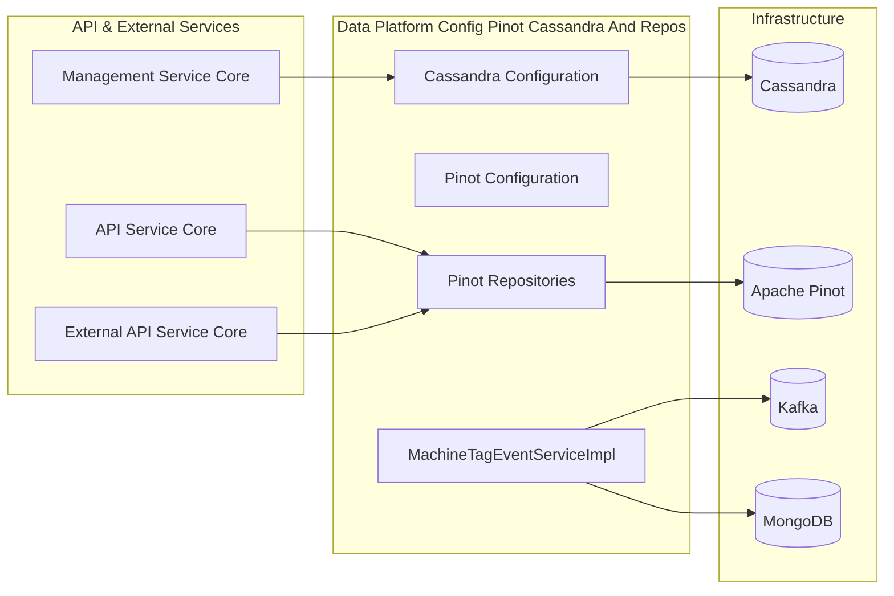
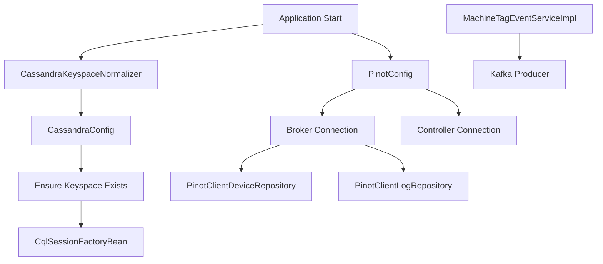
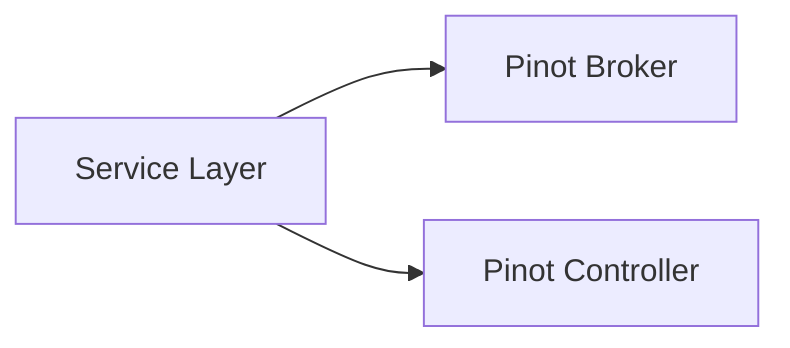
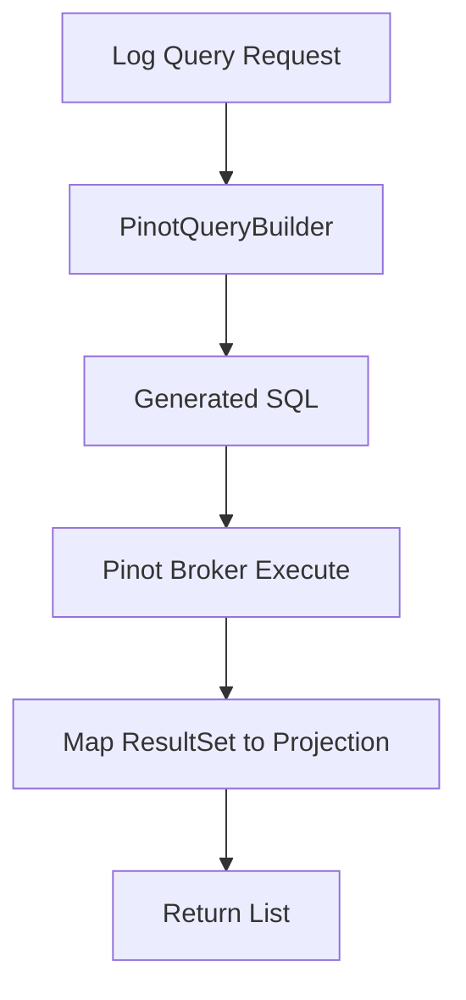
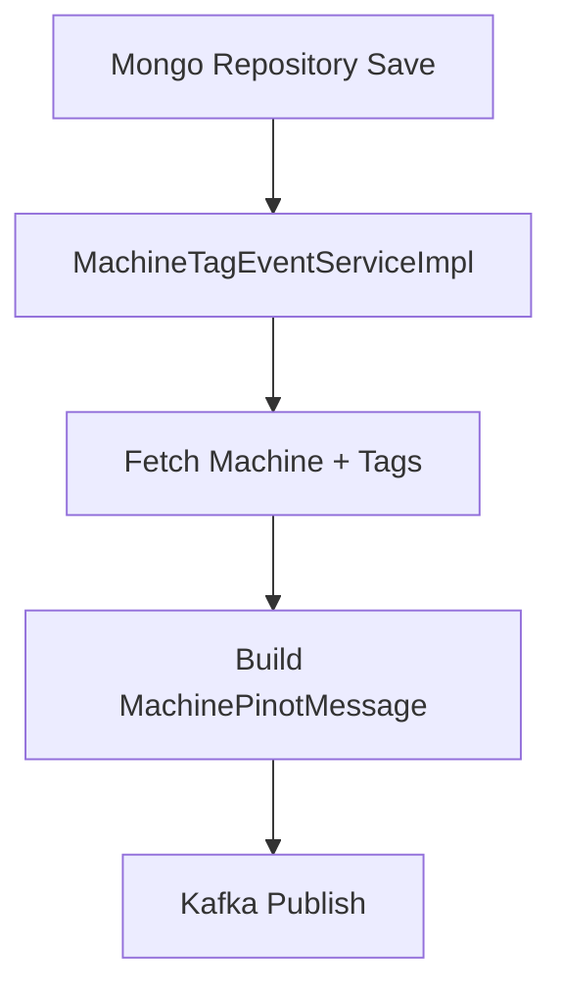
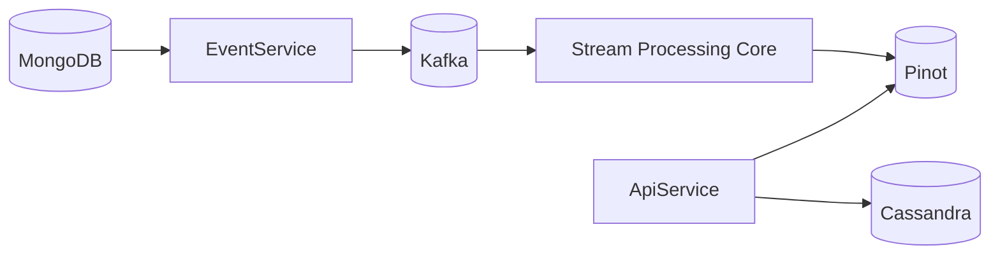

# Data Platform Config Pinot Cassandra And Repos

## Overview

The **Data Platform Config Pinot Cassandra And Repos** module provides the foundational data infrastructure configuration and analytics repositories for the OpenFrame platform.

It is responsible for:

- Configuring and initializing **Cassandra** (operational data store)
- Configuring **Apache Pinot** (real-time analytics and filtering)
- Providing **Pinot-backed repositories** for devices and logs
- Managing keyspace normalization for multi-tenant environments
- Exposing health indicators for Cassandra
- Emitting Kafka events for device and tag changes
- Defining shared data models such as tool types and credentials

This module acts as the bridge between:

- Operational data stores (Cassandra, MongoDB)
- Analytics infrastructure (Pinot)
- Stream processing (Kafka)
- Higher-level API services (API, External API, Management)

---

## Architectural Context

The module sits at the core of the data platform layer.



---

## Module Responsibilities

### 1. Cassandra Configuration and Lifecycle

Core components:

- `CassandraConfig`
- `CassandraKeyspaceNormalizer`
- `DataConfiguration.CassandraConfiguration`
- `CassandraHealthIndicator`

Responsibilities:

- Conditional activation via `spring.data.cassandra.enabled`
- Automatic keyspace creation using `CREATE KEYSPACE IF NOT EXISTS`
- Keyspace normalization for tenant IDs
- Driver-level configuration (datacenter, contact points, timestamp generator)
- Actuator health checks

---

### 2. Pinot Configuration and Analytics Repositories

Core components:

- `PinotConfig`
- `PinotClientDeviceRepository`
- `PinotClientLogRepository`
- `PinotEventEntity`

Responsibilities:

- Broker and controller connection setup
- Dynamic SQL generation for filter options
- Aggregation queries for device filters
- Cursor-based pagination for logs
- Search with relevance filtering
- Sort validation and defaulting

Pinot is used for:

- High-performance filtering
- Analytics-style aggregation
- Real-time log querying
- Dashboard support

---

### 3. Event Propagation to Kafka

Core component:

- `MachineTagEventServiceImpl`

Responsibilities:

- React to Machine, MachineTag, and Tag persistence events
- Build `MachinePinotMessage`
- Publish device state updates to Kafka
- Ensure tag changes propagate to analytics pipeline

This integrates tightly with:

- `data_kafka_integration`
- `stream_processing_core`

---

### 4. Shared Models

Core components:

- `IntegratedToolTypes`
- `ToolCredentials`

These provide:

- Standardized infrastructure tool type constants
- Credential abstraction for integrated tools

---

### 5. Configuration Observability

Core component:

- `ConfigurationLogger`

On application startup, logs:

- Mongo URI
- Cassandra contact points
- Redis host
- Pinot controller and broker URLs

This improves deployment transparency.

---

## Internal Architecture



---

## Cassandra Configuration Deep Dive

### Conditional Activation

Cassandra configuration is enabled only when:

```text
spring.data.cassandra.enabled=true
```

This supports:

- Local development without Cassandra
- Multi-service deployments
- Flexible service composition

### Keyspace Normalization

Multi-tenant environments often use tenant IDs with dashes.

Cassandra requires:

```text
[a-zA-Z0-9_]
```

`CassandraKeyspaceNormalizer` converts:

```text
tenant-abc-prod → tenant_abc_prod
```

This occurs during `ApplicationContextInitializer`, after Spring Cloud Config loads.

---

### Keyspace Auto-Creation

Before the session connects:

```sql
CREATE KEYSPACE IF NOT EXISTS <keyspace>
WITH replication = {'class': 'SimpleStrategy', 'replication_factor': N}
```

This ensures:

- Idempotent startup
- No manual schema bootstrap required

---

### Health Monitoring

`CassandraHealthIndicator` runs:

```sql
SELECT release_version FROM system.local
```

If successful → `Health.up()`
If failure → `Health.down()`

---

## Pinot Analytics Layer

### Connection Model

`PinotConfig` creates two beans:

- Broker connection (query execution)
- Controller connection (metadata operations)



---

## PinotClientDeviceRepository

Used for:

- Filter option counts
- Device aggregation
- Device count queries

Example filter query structure:

```sql
SELECT status, COUNT(*) as count
FROM "devices"
WHERE status != 'DELETED'
GROUP BY status
ORDER BY count DESC
```

Key characteristics:

- Excludes `DELETED` devices
- Dynamically builds `WHERE` clauses
- Supports multi-field filtering
- Returns ordered aggregation results

---

## PinotClientLogRepository

Supports:

- Date range filtering
- Full-text style search
- Cursor-based pagination
- Sort field validation
- Organization filtering

Sortable fields:

```text
eventTimestamp
severity
eventType
toolType
organizationId
deviceId
ingestDay
```

Default sort:

```text
eventTimestamp
```

### Query Execution Flow



---

## MachineTagEventServiceImpl

This service ensures analytics consistency.

### Trigger Sources

- Machine save
- MachineTag save
- Tag save

### Event Propagation Flow



Purpose:

- Keep Pinot analytics updated
- Synchronize tag changes
- Avoid stale device filter results

---

## Data Flow Summary



---

## Cross-Module Relationships

This module integrates with:

- `data_mongo_documents_repositories`
- `data_kafka_integration`
- `stream_processing_core`
- `api_service_core_rest_graphql`
- `external_api_service_core`
- `management_service_core_initialization_scheduling`

It does **not** duplicate repository logic from Mongo. Instead:

- Mongo stores operational documents
- Cassandra may store distributed data
- Pinot stores analytics projections

---

## Design Principles

1. Infrastructure is optional and conditional
2. Analytics is separated from operational storage
3. Startup is idempotent
4. Observability is built-in
5. Multi-tenant safe keyspace handling
6. Event-driven consistency

---

## When To Modify This Module

Modify when:

- Adding new analytics tables in Pinot
- Introducing new Cassandra keyspace behaviors
- Adding new device filter dimensions
- Extending Kafka event publication
- Introducing new infrastructure tool types

Do not modify for:

- API DTO changes
- Mongo repository logic
- Stream processing transformations

---

## Conclusion

The **Data Platform Config Pinot Cassandra And Repos** module forms the backbone of OpenFrame's data infrastructure layer.

It ensures:

- Reliable Cassandra initialization
- Robust Pinot analytics integration
- Event-driven synchronization
- Multi-tenant safety
- Clean separation between operational and analytical storage

It is a critical foundational module for any service that relies on analytics, device filtering, or event-driven data propagation.
