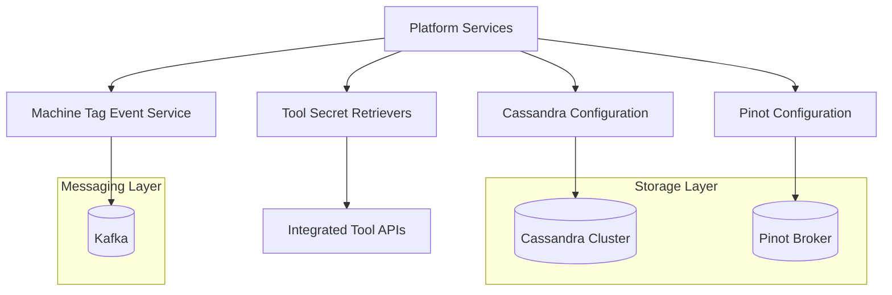
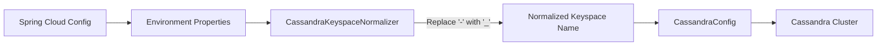
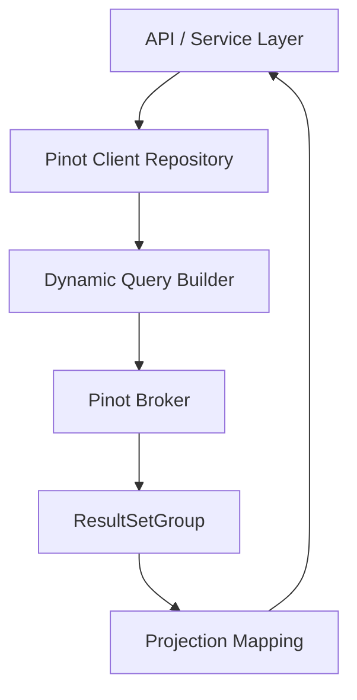
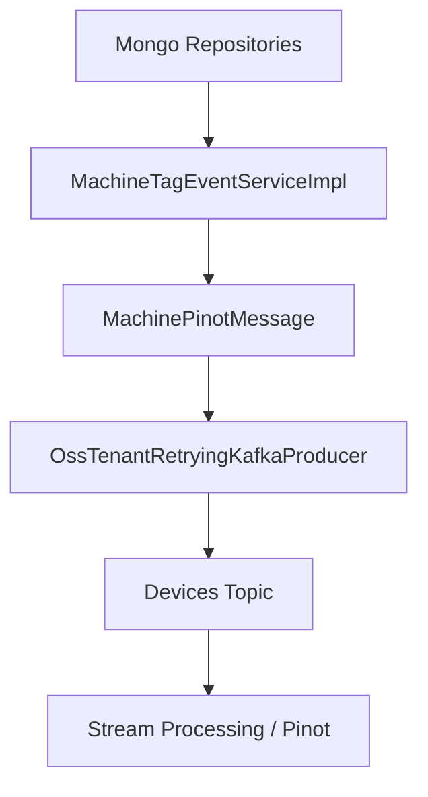
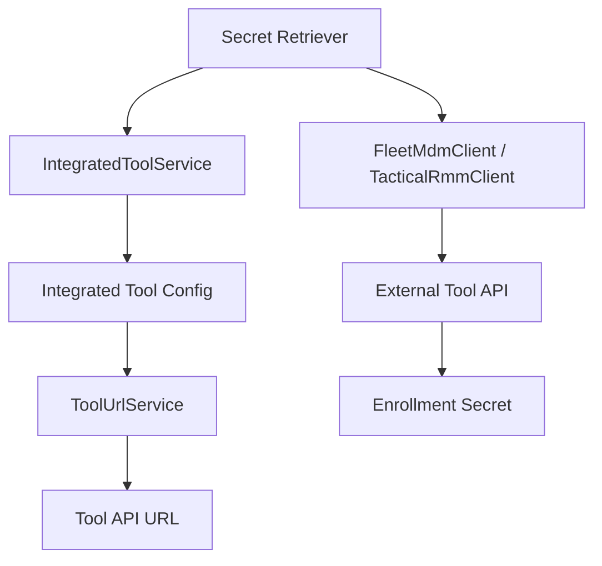
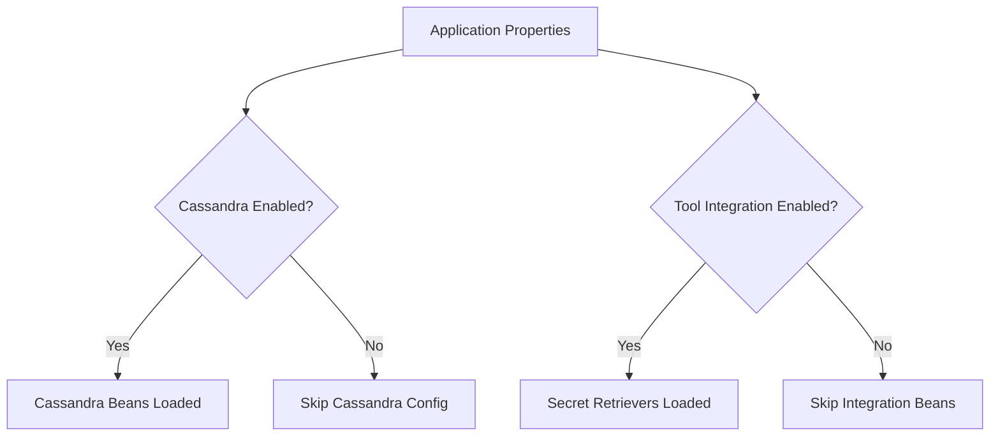
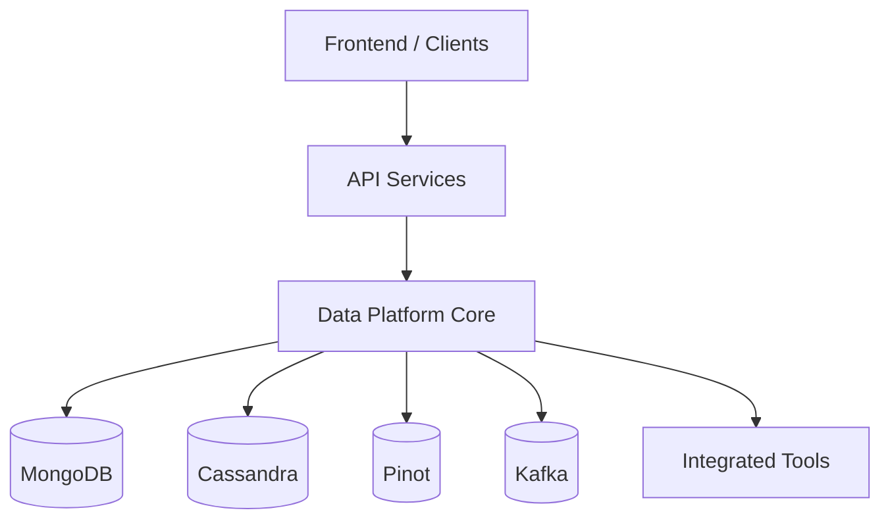

# Data Platform Core

The **Data Platform Core** module provides the foundational data infrastructure layer for the OpenFrame ecosystem. It centralizes configuration, connectivity, health monitoring, analytical querying, event propagation, and secure integration with external tools.

This module acts as the backbone for:

- Distributed data storage (Cassandra)
- Real-time analytics (Apache Pinot)
- Event-driven synchronization (Kafka)
- Multi-tenant keyspace normalization
- Tool credential handling and secret retrieval
- Cross-service configuration visibility

It is consumed by higher-level services such as API Service Core, Management Service Core, Stream Processing Service Core, and External API Service Core.

---

# Architecture Overview

The Data Platform Core integrates storage, analytics, messaging, and tool integrations into a unified abstraction layer.



---

# Core Responsibilities

## 1. Cassandra Configuration and Keyspace Management

### Components
- `CassandraConfig`
- `CassandraKeyspaceNormalizer`
- `DataConfiguration.CassandraConfiguration`
- `CassandraHealthIndicator`

### Key Capabilities

✅ Automatic keyspace creation (CREATE IF NOT EXISTS)  
✅ Multi-tenant keyspace normalization (dash → underscore)  
✅ Programmatic driver configuration  
✅ Health monitoring via Actuator  
✅ Conditional activation via `spring.data.cassandra.enabled`

### Keyspace Normalization Flow



This ensures tenant IDs containing dashes remain valid for Cassandra keyspace naming constraints.

### Key Features of CassandraConfig

- Ensures keyspace exists before session initialization
- Configures load balancing with local datacenter awareness
- Uses server-side timestamp generation
- Supports configurable replication factor

### Health Monitoring

`CassandraHealthIndicator` validates connectivity by querying:

```text
SELECT release_version FROM system.local
```

If the query fails, the service reports `DOWN` status.

---

## 2. Apache Pinot Analytics Integration

### Components
- `PinotConfig`
- `PinotClientDeviceRepository`
- `PinotClientLogRepository`

### Purpose
Pinot provides fast analytical queries for:

- Device filtering
- Log searching
- Aggregated counts
- Filter option generation
- Cursor-based pagination

### Analytics Query Flow



### Device Repository Capabilities

- Filter options by status, device type, OS, organization, tags
- Excludes logically deleted devices
- Dynamic WHERE clause building
- Aggregation using GROUP BY

### Log Repository Capabilities

- Date range filtering
- Multi-criteria filtering (severity, toolType, eventType)
- Relevance-based search
- Cursor-based pagination
- Safe sortable field validation

Pinot is used strictly for analytical workloads, not transactional writes.

---

## 3. Machine Tag Event Synchronization

### Component
- `MachineTagEventServiceImpl`

### Purpose
Propagates machine and tag changes to Kafka for downstream analytics and indexing systems (e.g., Pinot ingestion pipelines).

### Event Processing Flow



### Events Triggered

- Machine save
- Machine bulk save
- MachineTag save
- Tag updates (propagates to all related machines)

### Design Highlights

- Fetches full tag set before publishing
- Avoids duplicate machine processing
- Publishes tenant-scoped Kafka messages
- Fail-safe logging and retry-enabled producer

This keeps analytical storage eventually consistent with transactional storage.

---

## 4. Tool Integration and Secret Retrieval

### Components
- `FleetMdmAgentRegistrationSecretRetriever`
- `TacticalRmmAgentRegistrationSecretRetriever`
- `IntegratedToolTypes`
- `ToolCredentials`

### Purpose
Securely retrieve enrollment/registration secrets from integrated external systems.

### Retrieval Flow



### Key Properties

- Enabled only when `openframe.integration.tool.enabled=true`
- Fetches credentials from stored tool configuration
- Uses SDK clients for external API calls
- Logs success and fails fast on configuration errors

This enables secure agent onboarding without hardcoding secrets.

---

## 5. System Configuration Visibility

### Component
- `ConfigurationLogger`

At application startup, logs connectivity configuration for:

- MongoDB
- Cassandra
- Redis
- Pinot Controller
- Pinot Broker

This provides operational visibility without exposing credentials.

---

# Conditional Activation Strategy

The module relies heavily on Spring conditional configuration:



This allows flexible deployments:

- Minimal footprint environments
- Analytics-only deployments
- Full distributed production clusters

---

# Multi-Tenant Considerations

The Data Platform Core supports multi-tenancy via:

- Keyspace normalization
- Tenant-scoped Kafka producers
- Tool credential scoping
- Analytics filtering by organization ID

Cassandra keyspaces are dynamically aligned to tenant identifiers while respecting Cassandra naming constraints.

---

# How It Fits Into the Overall System

The Data Platform Core serves as the infrastructure abstraction layer beneath business services.



It does not expose REST endpoints directly. Instead, it provides:

- Repository infrastructure
- Event publishing services
- Analytical query engines
- Integration abstractions
- Health checks

Higher-level modules rely on this layer for all durable data and analytical interactions.

---

# Design Principles

✅ Infrastructure abstraction  
✅ Tenant-aware configuration  
✅ Event-driven synchronization  
✅ Analytics-first query design  
✅ Conditional feature activation  
✅ Secure secret management  
✅ Observability and health monitoring  

---

# Summary

The **Data Platform Core** module is the foundational data layer of OpenFrame. It orchestrates distributed storage, real-time analytics, event streaming, and secure tool integration in a multi-tenant, scalable architecture.

By cleanly separating infrastructure concerns from business logic, it enables the rest of the platform to remain modular, scalable, and cloud-native.
