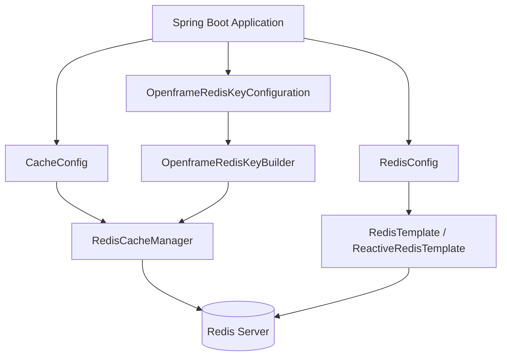
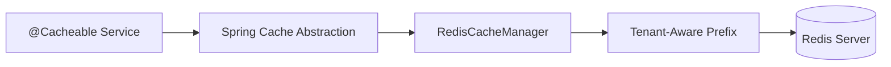
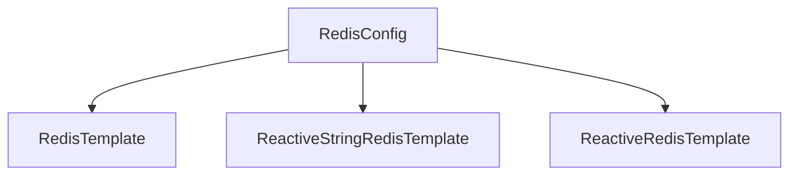
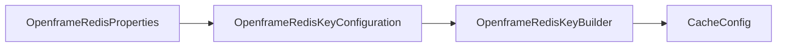
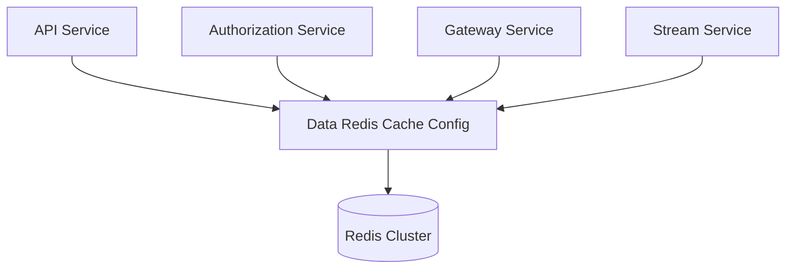

# Data Redis Cache Config

The **Data Redis Cache Config** module provides Redis integration and distributed caching capabilities across the OpenFrame platform. It centralizes:

- Redis connection and template configuration (blocking and reactive)
- Spring Cache integration backed by Redis
- Tenant-aware cache key prefixing
- Repository support for Redis-based data access

This module is activated conditionally and is designed to be reused across multiple services (API, Authorization, Gateway, Stream, etc.) whenever Redis is enabled.

---

## Purpose and Responsibilities

The Data Redis Cache Config module ensures that:

1. All cache entries are stored in Redis with consistent serialization.
2. Cache keys are tenant-aware by default.
3. Both imperative and reactive Redis access patterns are supported.
4. Redis repositories can be enabled when needed.

It acts as the infrastructure layer for distributed caching and transient data storage.

---

## High-Level Architecture



### Key Concepts

- **Conditional Activation**: Controlled by the `spring.redis.enabled` property.
- **Spring Cache Integration**: Uses `RedisCacheManager`.
- **Tenant Awareness**: Cache prefixes computed via `OpenframeRedisKeyBuilder`.
- **Serialization Strategy**: JSON for cache values, string-based for templates.

---

## Conditional Activation

Both `CacheConfig` and `RedisConfig` are enabled only when:

```text
spring.redis.enabled=true
```

This allows services to:

- Run without Redis in local or minimal deployments.
- Enable distributed caching in production environments.

---

## Core Components

### 1. CacheConfig

**Component:**
- `deps.openframe-oss-lib.openframe-data-redis.src.main.java.com.openframe.data.config.CacheConfig.CacheConfig`

**Responsibilities:**

- Enables Spring caching (`@EnableCaching`)
- Defines a `CacheManager` backed by Redis
- Configures:
  - Default TTL: 6 hours
  - Null value caching disabled
  - String key serialization
  - JSON value serialization
  - Tenant-aware key prefixing

### Cache Configuration Flow



### Cache Defaults

```text
TTL: 6 hours
Null values: Not cached
Key serializer: StringRedisSerializer
Value serializer: GenericJackson2JsonRedisSerializer
Prefix format: <prefix>:<cacheName>::<key>
```

#### Tenant-Aware Prefixing

The cache key prefix is computed using:

```text
keyBuilder.cacheKeyPrefix(null, cacheName)
```

This ensures that cache entries are logically isolated per tenant.

---

### 2. RedisConfig

**Component:**
- `deps.openframe-oss-lib.openframe-data-redis.src.main.java.com.openframe.data.config.RedisConfig.RedisConfig`

**Responsibilities:**

- Enables Redis repositories
- Provides imperative and reactive Redis templates
- Standardizes string-based serialization

### Beans Provided



#### RedisTemplate

- Blocking API
- String serialization for keys and values
- Suitable for imperative services

#### ReactiveStringRedisTemplate

- Reactive API
- Optimized for string operations
- Used in reactive service pipelines

#### ReactiveRedisTemplate

- Fully customizable reactive template
- Explicit serialization context

---

### 3. OpenframeRedisKeyConfiguration

**Component:**
- `deps.openframe-oss-lib.openframe-data-redis.src.main.java.com.openframe.data.redis.OpenframeRedisKeyConfiguration.OpenframeRedisKeyConfiguration`

**Responsibilities:**

- Enables configuration properties (`OpenframeRedisProperties`)
- Exposes `OpenframeRedisKeyBuilder` as a bean
- Allows overriding with custom implementations

### Key Builder Integration



The `OpenframeRedisKeyBuilder` centralizes key format logic so that:

- Cache keys
- Custom Redis keys
- Tenant scoping rules

are consistent across the entire platform.

---

## Serialization Strategy

The module defines two main serialization strategies:

### 1. Cache Values

```text
GenericJackson2JsonRedisSerializer
```

- Stores objects as JSON
- Allows polymorphic types
- Ensures compatibility across services

### 2. Direct Redis Templates

```text
StringRedisSerializer
```

- Simple key/value storage
- No object mapping
- Suitable for flags, counters, tokens, and lightweight metadata
```

---

## Multi-Tenant Considerations

The OpenFrame platform is multi-tenant. This module ensures:

- Cache keys are namespaced.
- Cross-tenant data leakage is prevented.
- Shared Redis clusters can be safely used.

### Tenant-Aware Cache Key Pattern

```text
<prefix>:<cacheName>::<businessKey>
```

Example:

```text
tenantA:userCache::user_123
```

---

## How It Fits into the Overall System

The Data Redis Cache Config module is a foundational infrastructure layer used by:

- API services for caching query results
- Authorization services for transient state
- Gateway services for rate limiting and token handling
- Stream and management services for coordination and locks

### Platform Integration Overview



This design ensures:

- Horizontal scalability
- Shared caching layer
- Consistent key strategy across services

---

## Extension and Customization

The module supports customization through:

- Overriding `CacheManager`
- Providing a custom `OpenframeRedisKeyBuilder`
- Adjusting TTL or serialization settings

Because all beans are declared with `@ConditionalOnMissingBean`, downstream services can replace defaults without modifying this module.

---

## Summary

The **Data Redis Cache Config** module provides:

- ✅ Centralized Redis configuration
- ✅ Spring Cache integration
- ✅ Tenant-aware key management
- ✅ Blocking and reactive templates
- ✅ Extensibility through conditional beans

It acts as the Redis infrastructure backbone for the OpenFrame distributed platform, ensuring consistency, scalability, and safe multi-tenant caching behavior.