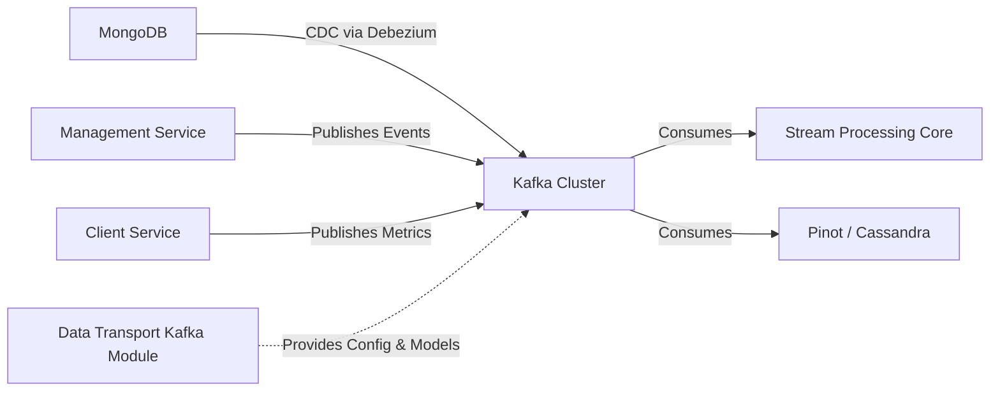
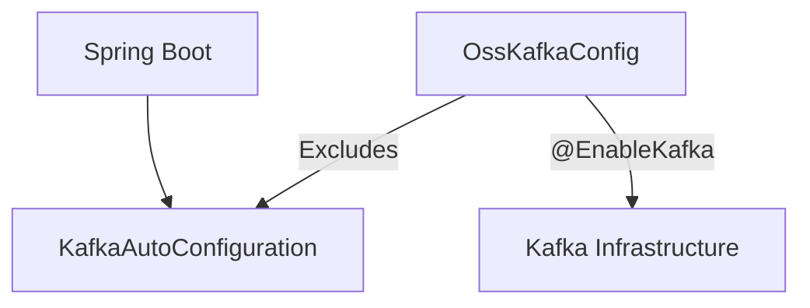
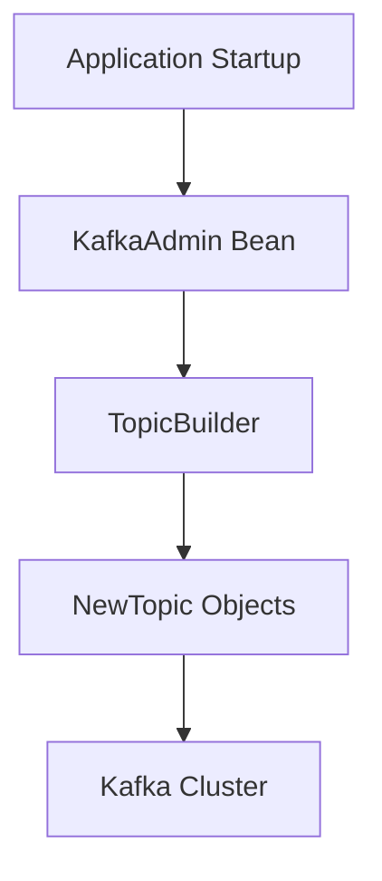
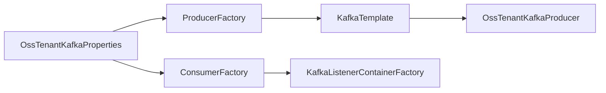
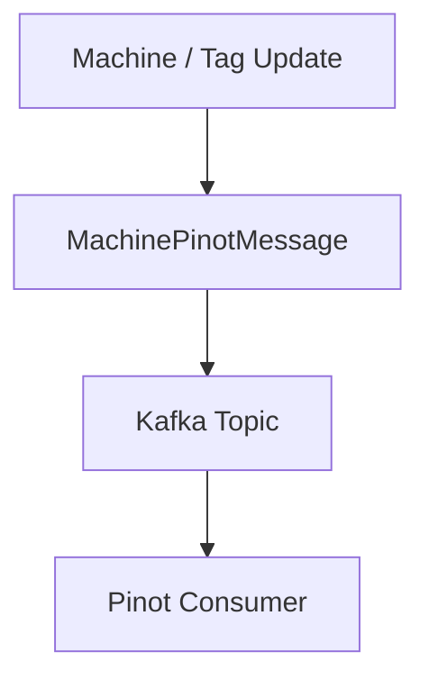
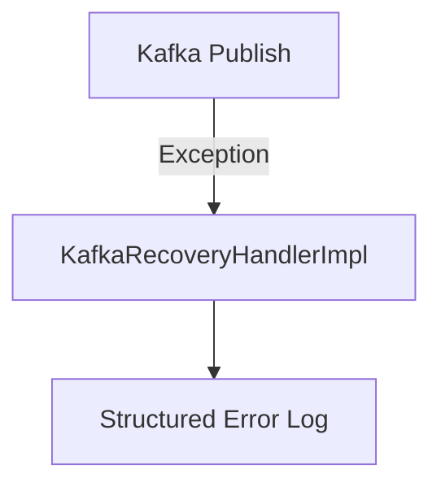
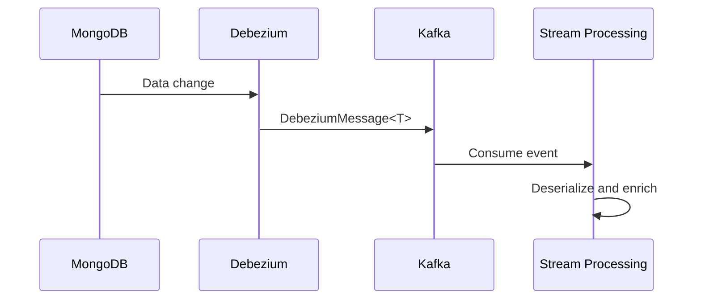

# Data Transport Kafka

## Overview

The **Data Transport Kafka** module provides the foundational Kafka infrastructure layer for the OpenFrame platform. It standardizes how services publish and consume events, manages tenant-scoped Kafka configuration, and defines shared message models used across streaming and data-processing services.

This module is intentionally infrastructure-focused. It does not contain business logic. Instead, it provides:

- Centralized Kafka configuration and auto-configuration
- Topic provisioning support
- Shared message contracts (e.g., Debezium and machine events)
- A tenant-aware producer abstraction
- Recovery logging for failed Kafka publish attempts

It is primarily consumed by services such as:

- [Stream Processing Core](../stream_processing_core/stream_processing_core.md)
- [Management Service Core](../management_service_core/management_service_core.md)
- [Data Platform and Pinot Cassandra](../data_platform_and_pinot_cassandra/data_platform_and_pinot_cassandra.md)

---

## Architectural Role in the Platform

At a high level, Data Transport Kafka acts as the event backbone between data producers (e.g., Mongo change streams via Debezium, management jobs, client services) and stream processors.



### Responsibilities

1. Provide a tenant-scoped Kafka configuration (`spring.oss-tenant.kafka`)
2. Expose standardized `KafkaTemplate`, `ProducerFactory`, and `ConsumerFactory`
3. Enable automatic topic creation when configured
4. Define canonical Kafka message structures
5. Provide a recovery handler for failed message publishing

---

## Module Structure

The Data Transport Kafka module is composed of the following key areas:

- **Configuration Layer**
  - `OssKafkaConfig`
  - `OssTenantKafkaAutoConfiguration`
  - `OssTenantKafkaProperties`
  - `KafkaTopicProperties`
- **Message Contracts**
  - `MachinePinotMessage`
  - `DebeziumMessage<T>`
- **Headers and Metadata**
  - `KafkaHeader`
- **Producer Recovery**
  - `KafkaRecoveryHandlerImpl`

---

# Configuration Layer

## OssKafkaConfig

The `OssKafkaConfig` class enables Kafka support while explicitly excluding Spring Boot’s default `KafkaAutoConfiguration`.

### Why this matters

By excluding the default auto-configuration, the platform:

- Avoids conflicts with multi-cluster setups
- Ensures full control over serializer/deserializer configuration
- Guarantees tenant-scoped configuration is used



---

## OssTenantKafkaProperties

`OssTenantKafkaProperties` binds configuration under:

```text
spring.oss-tenant.kafka
```

It wraps Spring’s native `KafkaProperties`, allowing the platform to reuse all standard Kafka configuration options while isolating them under a dedicated tenant prefix.

### Key Fields

- `enabled` – toggles the OSS tenant Kafka cluster
- `kafka` – full `KafkaProperties` object

This design ensures that:

- Kafka can be disabled entirely via configuration
- All producer, consumer, listener, and admin properties remain customizable

---

## KafkaTopicProperties

`KafkaTopicProperties` defines inbound topic configuration under:

```text
openframe.oss-tenant.kafka.topics
```

### TopicConfig Structure

```text
TopicConfig
- name
- partitions
- replicationFactor
```

If `autoCreate` is enabled and Kafka admin is active, topics are automatically provisioned at startup.



This removes manual topic provisioning in most environments.

---

## OssTenantKafkaAutoConfiguration

This is the core infrastructure configuration class.

It creates:

- `ProducerFactory<String, Object>`
- `KafkaTemplate<String, Object>`
- `ConsumerFactory<Object, Object>`
- `ConcurrentKafkaListenerContainerFactory`
- `KafkaAdmin`
- `OssTenantKafkaProducer`

### Conditional Activation

The configuration is activated only if:

```text
spring.oss-tenant.kafka.enabled=true
```

### Producer Configuration

- Key serializer: `StringSerializer`
- Value serializer: `JsonSerializer`

### Consumer Configuration

- Key deserializer: `StringDeserializer`
- Value deserializer: `JsonDeserializer`
- Configurable:
  - Concurrency
  - Ack mode (defaults to `RECORD`)
  - Poll timeout
  - Idle event interval



This encapsulates all Kafka infrastructure in a reusable, tenant-aware configuration layer.

---

# Message Contracts

## MachinePinotMessage

`MachinePinotMessage` represents a normalized machine state event sent to Kafka when changes occur in:

- Machine
- MachineTag
- Tag

### Fields

- `machineId`
- `organizationId`
- `deviceType`
- `status`
- `osType`
- `tags`

This message is typically consumed by stream processors and analytics layers such as Pinot.



---

## DebeziumMessage<T>

`DebeziumMessage<T>` models the canonical Debezium CDC envelope.

### Structure

```text
DebeziumMessage
 └─ Payload
     ├─ before
     ├─ after
     ├─ source
     ├─ operation
     └─ timestamp
```

It supports generic payload types and maps directly to Debezium’s event structure.

### Source Metadata Includes

- Connector name
- Database
- Table / Collection
- Snapshot flag
- Schema

This abstraction allows stream consumers in [Stream Processing Core](../stream_processing_core/stream_processing_core.md) to deserialize change events safely and consistently.

---

# Kafka Headers

## KafkaHeader

Defines shared header constants used across producers and consumers.

```text
MESSAGE_TYPE_HEADER = "message-type"
```

This enables:

- Message routing
- Polymorphic deserialization
- Event type identification

---

# Producer Recovery

## KafkaRecoveryHandlerImpl

Implements a recovery strategy for failed Kafka publishing attempts.

### Behavior

When publishing fails:

1. Captures the topic, key, and payload
2. Logs structured error information
3. Includes stacktrace for observability



Currently, recovery is logging-based. It can be extended to:

- Dead-letter topics
- Retry queues
- External error stores

---

# Runtime Flow Example

Below is a typical end-to-end data flow using this module:



The Data Transport Kafka module provides the configuration and models that make this pipeline consistent and reusable across services.

---

# Integration with Other Modules

### Stream Processing Core

Consumes `DebeziumMessage` and domain-specific messages such as `MachinePinotMessage` to perform enrichment, transformation, and routing.

See: [Stream Processing Core](../stream_processing_core/stream_processing_core.md)

### Data Platform and Pinot Cassandra

Receives normalized machine and event data for analytics and storage.

See: [Data Platform and Pinot Cassandra](../data_platform_and_pinot_cassandra/data_platform_and_pinot_cassandra.md)

### Management Service Core

May publish events such as tool updates or configuration changes.

See: [Management Service Core](../management_service_core/management_service_core.md)

---

# Design Principles

The Data Transport Kafka module follows several architectural principles:

1. **Tenant Isolation** – Dedicated configuration namespace (`spring.oss-tenant.kafka`)
2. **Spring Native Compatibility** – Leverages `KafkaProperties`
3. **Infrastructure Separation** – No business logic included
4. **Message Standardization** – Shared canonical models
5. **Operational Safety** – Structured error logging for publish failures

---

# Summary

The **Data Transport Kafka** module is the foundational event transport layer of OpenFrame. It standardizes Kafka usage, enforces tenant-aware configuration, provides shared event contracts, and ensures consistent producer and consumer setup across the platform.

It enables scalable, event-driven communication between:

- Data persistence layers
- Stream processing
- Analytics systems
- Management and client services

Without embedding business logic, it acts as the reliable backbone for all Kafka-based integration within the system.
