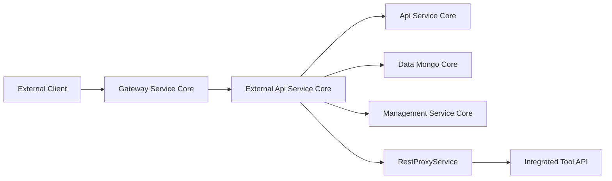
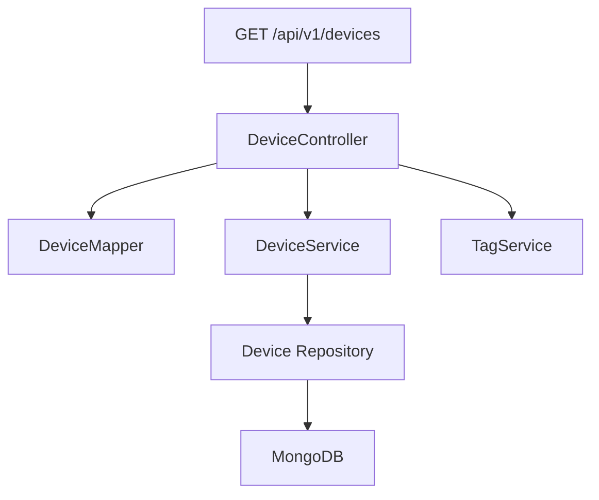
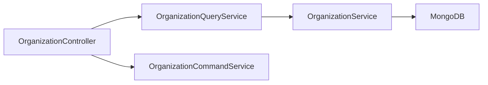
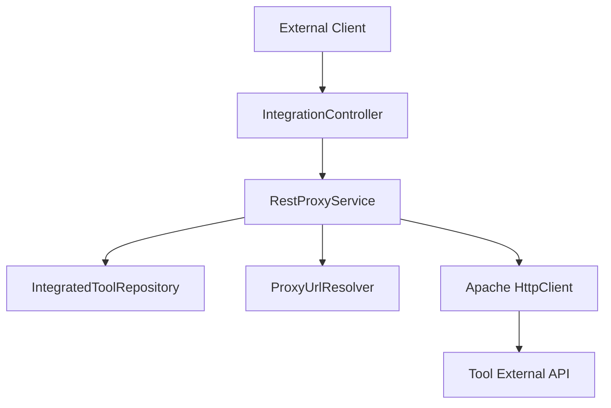

# External Api Service Core

## Overview

The **External Api Service Core** module exposes a secure, API-key–based REST interface for programmatic access to the OpenFrame platform. It is designed for:

- External integrations
- Third-party automation tools
- Managed service provider (MSP) workflows
- Data extraction and synchronization use cases

Unlike internal service-to-service APIs, this module focuses on:

- API key authentication
- Rate limiting (enforced at gateway level)
- Stable, versioned REST endpoints (`/api/v1/**`)
- OpenAPI documentation generation
- Tool API proxying via `/tools/**`

This module is packaged into the `ExternalApiApplication` in the service layer and deployed behind the Gateway.

---

## Position in the Overall Architecture

The External Api Service Core sits between the Gateway layer and the internal domain services such as API Service Core, Data Mongo Core, and Management Service Core.



### Responsibilities Split

- **Gateway Service Core**: API key validation, rate limiting, JWT handling, CORS.
- **External Api Service Core**: REST controllers, DTO mapping, filtering, pagination, tool proxying.
- **Api Service Core**: Business logic and domain services.
- **Data Mongo Core**: Persistence layer (devices, events, logs, organizations, tools).

---

## Module Structure

The External Api Service Core consists of:

- Configuration
- REST Controllers
- Proxy Service for integrated tools

### Core Components

- `OpenApiConfig`
- `DeviceController`
- `EventController`
- `OrganizationController`
- `LogController`
- `ToolController`
- `IntegrationController`
- `RestProxyService`

---

# Configuration

## OpenApiConfig

The `OpenApiConfig` class configures Swagger / OpenAPI documentation for the external API.

### Key Features

- API title: **OpenFrame External API**
- Version: `1.0.0`
- API key authentication scheme (`X-API-Key` header)
- Security requirement applied globally
- Grouped endpoints:
  - Included: `/tools/**`, `/test/**`, `/api/v1/**`
  - Excluded: `/actuator/**`, `/api/core/**`

### API Key Format

```text
X-API-Key: ak_keyId.sk_secretKey
            ↑         ↑
         Key ID     Secret Key
```

Authentication is based on the `X-API-Key` header and enforced upstream by the Gateway.

---

# REST Controllers

All REST endpoints are versioned under:

```text
/api/v1/**
```

Each controller:

- Accepts filtering parameters
- Supports cursor-based pagination
- Supports sorting
- Uses mappers to transform internal domain models into external DTOs
- Receives `X-User-Id` and `X-API-Key-Id` headers (injected by gateway layer)

---

## DeviceController

**Base Path:** `/api/v1/devices`

### Responsibilities

- List devices with filters
- Retrieve device by machine ID
- Retrieve filter options
- Update device status

### Filtering & Pagination

Supports:

- `statuses`
- `deviceTypes`
- `osTypes`
- `organizationIds`
- `tagNames`
- `search`
- `limit`
- `cursor`
- `sortField`
- `sortDirection`

### Data Flow



If `includeTags=true`, the controller performs an additional tag lookup using `TagService`.

---

## EventController

**Base Path:** `/api/v1/events`

### Responsibilities

- Query events with date range and type filters
- Retrieve event by ID
- Create event
- Update event
- Retrieve event filter metadata

### Supported Filters

- `userIds`
- `eventTypes`
- `startDate`
- `endDate`
- `search`
- `limit`
- `cursor`

### Write Operations

- `POST /api/v1/events`
- `PUT /api/v1/events/{id}`

Delegates to `EventService` for persistence and validation.

---

## OrganizationController

**Base Path:** `/api/v1/organizations`

### Responsibilities

- Query organizations
- Get by database ID
- Get by business `organizationId`
- Create organization
- Update organization
- Delete organization

### Special Logic

- Prevents deletion when machines are associated (`OrganizationHasMachinesException`)
- Supports filtering by:
  - `category`
  - `minEmployees`
  - `maxEmployees`
  - `hasActiveContract`

### Interaction Flow



---

## LogController

**Base Path:** `/api/v1/logs`

### Responsibilities

- Query logs
- Retrieve log filters
- Retrieve detailed log entry

### Filters

- Date range
- Tool types
- Event types
- Severities
- Organization IDs
- Device ID
- Search text

### Detailed Lookup

The `getLogDetails` endpoint retrieves a specific log entry using:

- `ingestDay`
- `toolType`
- `eventType`
- `timestamp`
- `toolEventId`

This supports efficient partition-based lookups in MongoDB.

---

## ToolController

**Base Path:** `/api/v1/tools`

### Responsibilities

- List integrated tools
- Retrieve filter options

### Supported Filters

- `enabled`
- `type`
- `category`
- `search`

Delegates to `ToolService` for querying and filter aggregation.

---

# IntegrationController and RestProxyService

## IntegrationController

**Base Path:** `/tools/{toolId}/**`

This controller proxies arbitrary HTTP requests to integrated tools.

Supported methods:

- GET
- POST
- PUT
- PATCH
- DELETE
- OPTIONS

---

## RestProxyService

The `RestProxyService` performs dynamic HTTP proxying to integrated tool APIs.

### Responsibilities

1. Validate tool existence and enabled status
2. Resolve tool base URL via `ToolUrlService`
3. Construct target URI via `ProxyUrlResolver`
4. Attach authentication headers (if configured)
5. Execute HTTP request using Apache HttpClient
6. Return raw response body and status

### Proxy Flow



### Credential Injection Modes

Depending on `APIKeyType`:

- HEADER → Custom header name/value
- BEARER_TOKEN → `Authorization: Bearer token`
- NONE → No additional authentication

---

# Cross-Cutting Concerns

## Authentication

- API key is required via `X-API-Key`
- Enforced by Gateway layer
- `X-User-Id` and `X-API-Key-Id` propagated downstream

## Pagination Strategy

Cursor-based pagination is used for:

- Devices
- Events
- Logs
- Organizations

Benefits:

- Stable ordering
- High-performance queries
- Avoids large offset scans

## Sorting

Sorting is standardized via:

- `sortField`
- `sortDirection` (ASC or DESC)

Mapped internally to domain-level `SortInput` objects.

---

# Relationship to Other Modules

The External Api Service Core depends heavily on the following modules:

- [Gateway Service Core](../gateway-service-core/gateway-service-core.md)
- [Api Service Core](../api-service-core/api-service-core.md)
- [Data Mongo Core](../data-mongo-core/data-mongo-core.md)
- [Management Service Core](../management-service-core/management-service-core.md)

It does not contain business logic itself; instead, it acts as a secure, external-facing adapter layer over internal services.

---

# Summary

The **External Api Service Core** module provides:

- A stable, versioned external REST API
- API key–based access model
- Rich filtering, sorting, and pagination
- OpenAPI documentation generation
- Tool API proxying

It plays a critical role in enabling:

- Third-party integrations
- Automation pipelines
- MSP external workflows
- Secure exposure of OpenFrame platform capabilities

Architecturally, it functions as a boundary layer between external consumers and the internal OpenFrame domain services while maintaining strong separation of concerns.