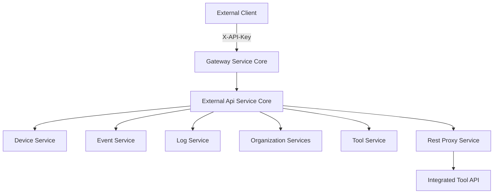
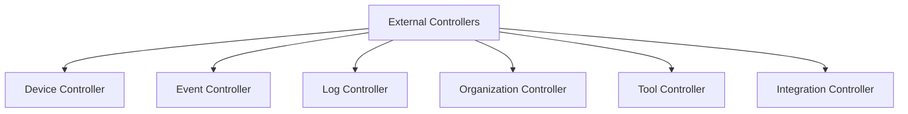
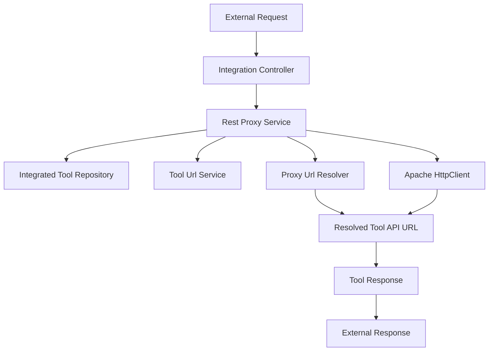

# External Api Service Core

The **External Api Service Core** module exposes a secure, API key–based REST interface for third-party systems and integrations to interact with the OpenFrame platform.

It acts as a controlled façade over internal domain services (devices, events, logs, organizations, tools) and provides:

- ✅ API key authentication
- ✅ Rate limiting support (via gateway)
- ✅ Cursor-based pagination
- ✅ Filtering, sorting, and search
- ✅ Tool API proxying
- ✅ OpenAPI (Swagger) documentation

This module is used by the `ExternalApiApplication` in the platform applications layer.

---

## 1. Architectural Role in the Platform

The External Api Service Core sits between external consumers and internal domain services.

It does **not** implement core business logic. Instead, it:

- Delegates to internal services (from Api Service Core)
- Maps internal domain models to external DTOs
- Enforces API-key-based access
- Proxies tool-specific API calls

### High-Level Architecture



### Key Dependencies

- **Api Service Core** – business services and domain logic
- **Data Mongo Core** – persistence layer
- **Gateway Service Core** – rate limiting and API key enforcement
- **Security OAuth Core** – shared security constants and JWT utilities

The External Api Service Core is intentionally thin and integration-focused.

---

## 2. API Authentication Model

Authentication is based on API keys.

Clients must include the following header:

```text
X-API-Key: ak_keyId.sk_secretKey
```

The Gateway validates the key and injects:

- `X-User-Id`
- `X-API-Key-Id`

These headers are consumed by controllers for logging and contextual behavior.

---

## 3. OpenAPI and Documentation Configuration

### OpenApiConfig

The `OpenApiConfig` class configures:

- OpenAPI metadata
- API key security scheme
- Swagger grouping
- Server base path (`/external-api`)

It defines:

- Security scheme: `ApiKeyAuth`
- Header: `X-API-Key`
- Grouped API paths:
  - `/api/v1/**`
  - `/tools/**`

This enables automatic Swagger UI generation for external integrators.

---

## 4. REST Controllers Overview

The module exposes domain-specific controllers under `/api/v1`.

### Controller Structure



Each controller follows a consistent pattern:

1. Accept query parameters
2. Build filter + pagination criteria
3. Delegate to internal service
4. Map domain results to external DTOs
5. Return structured response

---

## 5. Domain Endpoints

### 5.1 Device Controller

Base path: `/api/v1/devices`

Responsibilities:

- List devices with filtering
- Cursor-based pagination
- Sorting
- Optional tag inclusion
- Retrieve device by machine ID
- Update device status
- Retrieve device filter options

Delegates to:

- `DeviceService`
- `DeviceFilterService`
- `TagService`

Implements defensive fallback when tag loading fails.

---

### 5.2 Event Controller

Base path: `/api/v1/events`

Capabilities:

- Query events by:
  - User IDs
  - Event types
  - Date range
  - Search
- Cursor pagination
- Sorting
- Create event
- Update event
- Retrieve filter metadata

Delegates to `EventService`.

---

### 5.3 Log Controller

Base path: `/api/v1/logs`

Provides:

- Log search with:
  - Date range
  - Tool type
  - Severity
  - Organization
  - Device ID
- Cursor pagination
- Sorting
- Filter options
- Detailed log lookup by composite key

Delegates to `LogService`.

---

### 5.4 Organization Controller

Base path: `/api/v1/organizations`

Provides full CRUD operations:

- List with filtering + search
- Retrieve by database ID
- Retrieve by business `organizationId`
- Create
- Update
- Delete (protected if machines exist)

Delegates to:

- `OrganizationQueryService`
- `OrganizationCommandService`
- `OrganizationService`

---

### 5.5 Tool Controller

Base path: `/api/v1/tools`

Provides:

- List integrated tools
- Filter by enabled/type/category
- Search
- Sorting
- Filter metadata

Delegates to `ToolService`.

---

## 6. Tool API Proxying

### Integration Controller

Base path: `/tools/{toolId}/**`

This controller forwards arbitrary HTTP requests to an integrated tool.

Supported methods:

- GET
- POST
- PUT
- PATCH
- DELETE
- OPTIONS

All requests are handled by `RestProxyService`.

---

## 7. Rest Proxy Service

The `RestProxyService` is the most integration-heavy component.

### Responsibilities

1. Validate tool existence
2. Verify tool is enabled
3. Resolve target URL
4. Attach credentials
5. Forward HTTP request
6. Return upstream response transparently

### Proxy Flow



### Credential Injection

Depending on `APIKeyType`, credentials are added as:

- Custom header
- Bearer token
- None

This allows OpenFrame to act as a secure API gateway for integrated tools.

---

## 8. Pagination and Sorting Strategy

All list endpoints follow a unified pattern:

- Cursor-based pagination
- Maximum limit: 100
- Default limit: 20
- Sort field + direction

Internal mapping converts:

- External `PaginationCriteria`
- External `SortCriteria`

Into core service inputs.

This ensures consistency across:

- Devices
- Events
- Logs
- Organizations
- Tools

---

## 9. Error Handling Model

The API uses standard HTTP codes:

- `200` – Success
- `201` – Created
- `204` – No Content
- `400` – Bad Request
- `401` – Unauthorized
- `404` – Not Found
- `409` – Conflict
- `429` – Rate Limit Exceeded
- `500` – Internal Server Error

Domain-specific exceptions are translated into structured `ErrorResponse` objects.

---

## 10. Design Principles

The External Api Service Core follows several architectural principles:

- **Thin Controller Layer** – Delegates to core services
- **Clear DTO Boundary** – External DTOs separate from internal models
- **Consistent Query Model** – Filters + pagination + sort
- **Tool Isolation** – Proxy logic encapsulated in one service
- **Gateway-Oriented Security** – Authentication handled upstream

---

## 11. Summary

The **External Api Service Core** module provides a secure, documented, and integration-friendly REST API for external systems.

It acts as:

- A façade over internal business services
- A proxy for integrated tool APIs
- A standardized external interface to the OpenFrame ecosystem

It is intentionally lightweight, consistent, and integration-focused—ensuring external consumers can interact with OpenFrame without direct exposure to internal implementation details.
