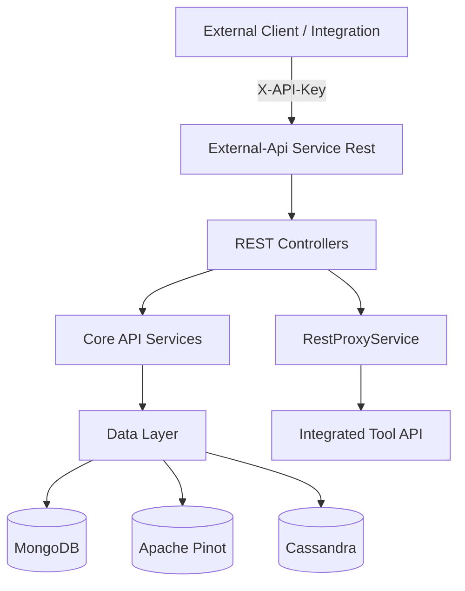
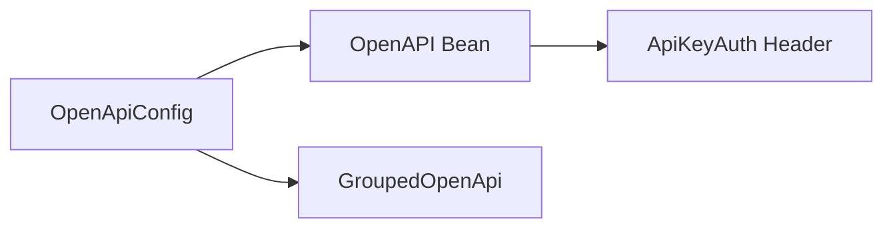
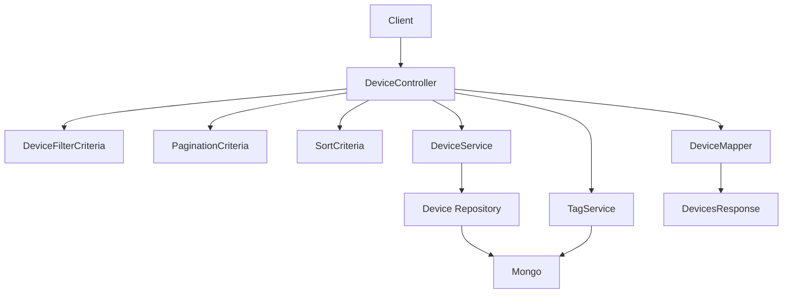
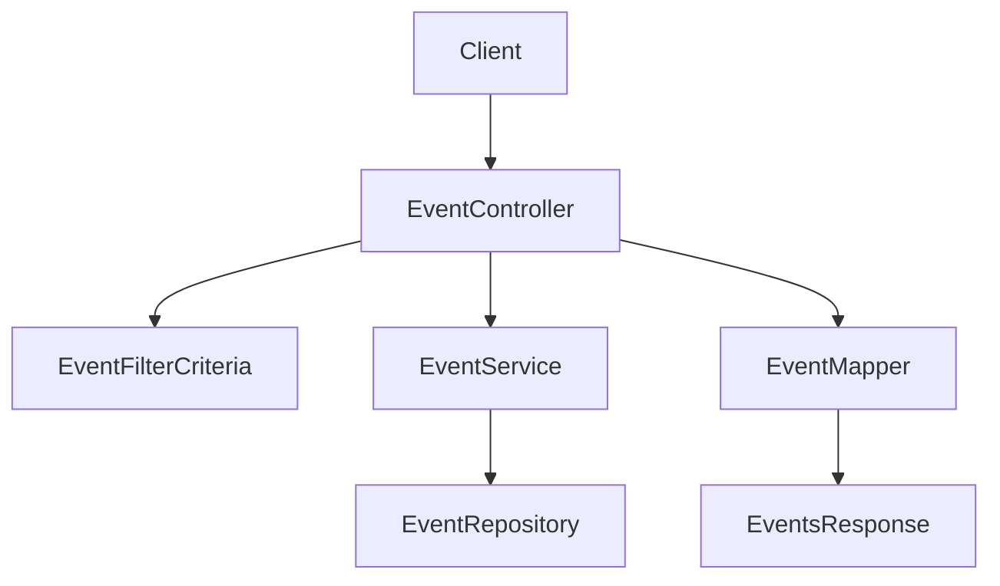
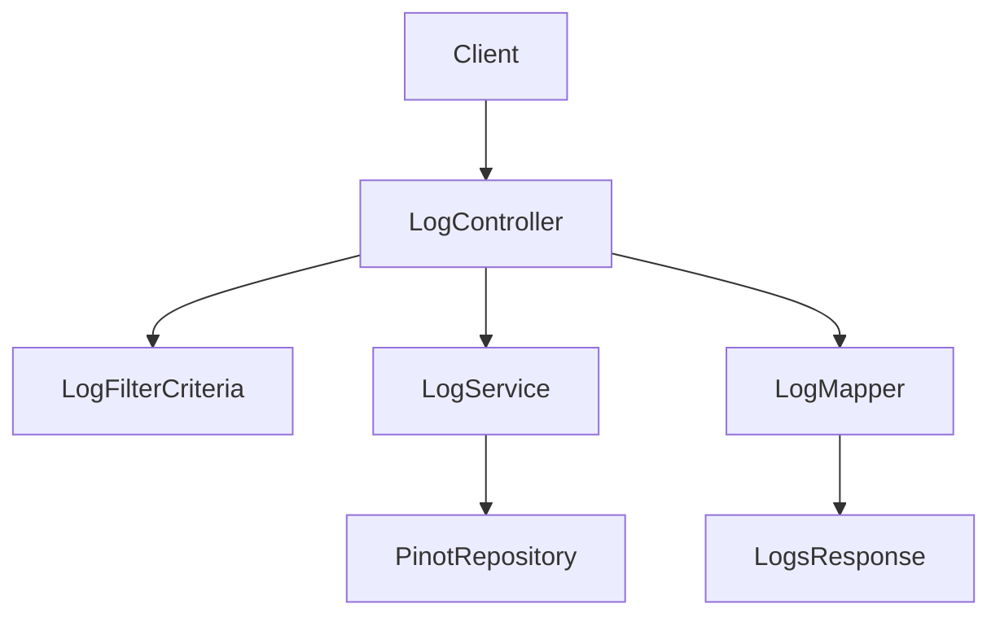
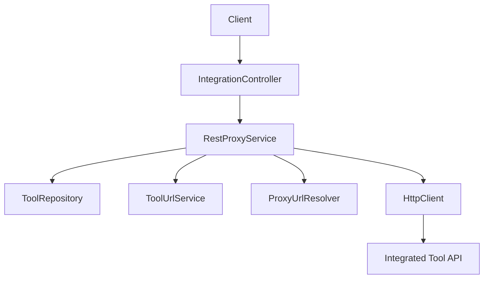
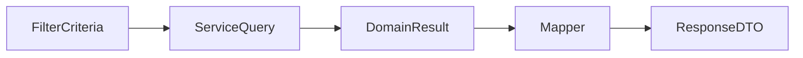
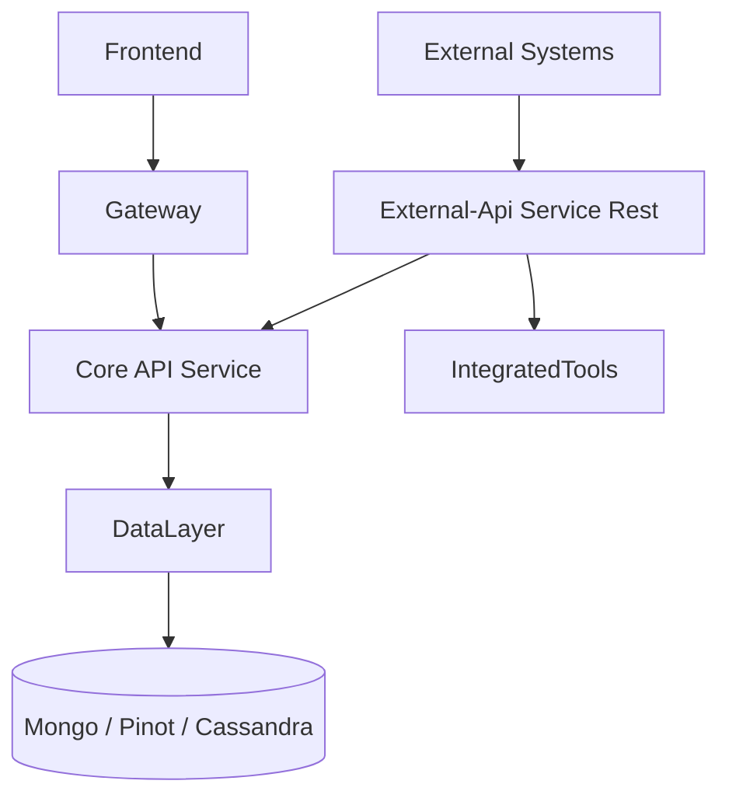

# External-Api Service Rest

## Overview

The **External-Api Service Rest** module exposes a secure, API key–protected REST interface for third-party integrations and external systems to interact with the OpenFrame platform.

It provides:

- Device management and filtering
- Event ingestion and querying
- Log retrieval and filtering
- Organization CRUD operations
- Integrated tool discovery
- Secure HTTP proxying to integrated tools
- OpenAPI (Swagger) documentation for all endpoints

This module acts as the **public programmatic gateway** into the OpenFrame ecosystem, designed for automation, integrations, and external services.

---

## High-Level Architecture

The External-Api Service Rest module sits on top of core API services and data layers while enforcing API key–based authentication.



### Responsibilities

- Expose versioned REST endpoints under `/api/v1/**`
- Authenticate using `X-API-Key`
- Apply filtering, sorting, and cursor-based pagination
- Map internal domain models to external DTOs
- Proxy requests to integrated tools when required

---

## Authentication Model

All endpoints require an API key in the request header:

```text
X-API-Key: ak_keyId.sk_secretKey
```

OpenAPI configuration defines:

- API key security scheme
- Rate limiting documentation
- Standardized error responses

Authentication and rate limiting are enforced upstream (Gateway + Security modules), while this service consumes resolved headers such as:

- `X-User-Id`
- `X-API-Key-Id`

---

## OpenAPI Configuration

**Core Component:**
- `OpenApiConfig`

### Responsibilities

- Configures Swagger UI metadata
- Defines API key security scheme (`ApiKeyAuth`)
- Groups endpoints under `external-api`
- Excludes internal and actuator endpoints



---

# REST Controllers

Each controller follows a consistent pattern:

1. Accept query parameters
2. Build FilterCriteria + PaginationCriteria + SortCriteria
3. Call core service
4. Map result to external response DTO

---

## Device API

**Core Component:**
- `DeviceController`

### Endpoints

- `GET /api/v1/devices`
- `GET /api/v1/devices/{machineId}`
- `GET /api/v1/devices/filters`
- `PATCH /api/v1/devices/{machineId}`

### Features

- Multi-criteria filtering:
  - Status
  - Device type
  - OS type
  - Organization
  - Tags
- Cursor-based pagination
- Sorting by arbitrary fields
- Optional tag enrichment
- Status updates (DELETED / ARCHIVED)

### Device Query Flow



---

## Event API

**Core Component:**
- `EventController`

### Endpoints

- `GET /api/v1/events`
- `GET /api/v1/events/{id}`
- `POST /api/v1/events`
- `PUT /api/v1/events/{id}`
- `GET /api/v1/events/filters`

### Capabilities

- Filter by:
  - User IDs
  - Event types
  - Date range
- Full CRUD for events
- Cursor pagination
- Sorting support



---

## Log API

**Core Component:**
- `LogController`

### Endpoints

- `GET /api/v1/logs`
- `GET /api/v1/logs/filters`
- `GET /api/v1/logs/details`

### Advanced Filtering

Supports filtering by:

- Date range
- Tool types
- Event types
- Severity
- Organization
- Device ID

Logs are typically backed by high-performance analytical storage (Pinot) and optimized for search and filtering.



---

## Organization API

**Core Component:**
- `OrganizationController`

### Endpoints

- `GET /api/v1/organizations`
- `GET /api/v1/organizations/{id}`
- `GET /api/v1/organizations/by-organization-id/{organizationId}`
- `POST /api/v1/organizations`
- `PUT /api/v1/organizations/{id}`
- `DELETE /api/v1/organizations/{id}`

### Capabilities

- Full CRUD support
- Filtering by:
  - Category
  - Employee range
  - Contract status
- Search support
- Cursor-based pagination
- Conflict protection (cannot delete org with machines)

---

## Tool API

**Core Component:**
- `ToolController`

### Endpoints

- `GET /api/v1/tools`
- `GET /api/v1/tools/filters`

### Features

- Filter by:
  - Enabled state
  - Type
  - Category
  - Platform category
- Sorting
- Returns tool URLs and credentials metadata

---

# Integration Proxy API

**Core Components:**
- `IntegrationController`
- `RestProxyService`

This feature allows the External-Api Service Rest module to proxy HTTP requests directly to integrated tools.

### Endpoint

- `/{toolId}/**`

Example:

```text
GET /tools/tactical-rmm/api/devices
```

### Proxy Flow



### Proxy Responsibilities

- Validate tool exists
- Ensure tool is enabled
- Resolve target URL
- Inject credentials (Header or Bearer token)
- Forward method, headers, and body
- Return downstream response transparently

---

# Shared DTO Model

The module defines dedicated REST DTOs separate from internal domain models.

## Common Patterns

- `FilterCriteria` classes → input filters
- `Response` classes → output payload
- `PaginationCriteria` → cursor + limit
- `SortCriteria` → field + direction

Example structure:



This ensures:

- Clear API contracts
- Backward compatibility
- Decoupling from internal models

---

# Pagination Model

All major list endpoints use **cursor-based pagination**.

```text
GET /api/v1/devices?limit=20&cursor=eyJpZCI6MTIzNDU2fQ==
```

Responses include:

- `pageInfo`
- `hasNextPage`
- `hasPreviousPage`
- `startCursor`
- `endCursor`

Advantages:

- Efficient for large datasets
- Stable pagination
- No offset-based performance degradation

---

# Error Handling Strategy

The module uses:

- Domain-specific exceptions
- Standard HTTP status codes
- Structured `ErrorResponse` bodies

Common status codes:

- `200` Success
- `201` Created
- `204` No Content
- `400` Bad Request
- `401` Unauthorized
- `404` Not Found
- `409` Conflict
- `429` Too Many Requests
- `500` Internal Server Error

---

# How External-Api Service Rest Fits Into the Platform



### Role in the Ecosystem

- Provides secure public API surface
- Enables automation and integrations
- Decouples external contracts from internal GraphQL or core services
- Offers controlled access via API keys

---

# Key Design Principles

- ✅ Strict API key authentication
- ✅ Versioned REST endpoints
- ✅ Consistent filtering + sorting + pagination
- ✅ Clean DTO separation
- ✅ Proxy support for integrated tools
- ✅ Fully documented via OpenAPI

---

# Summary

The **External-Api Service Rest** module is the official REST integration surface of OpenFrame.

It provides:

- Secure programmatic access
- Structured data querying
- Full CRUD for core entities
- High-performance log retrieval
- Dynamic tool proxying
- Enterprise-ready API documentation

This module enables partners, automation platforms, and external systems to interact with OpenFrame safely and efficiently while maintaining strict isolation from internal service implementations.
