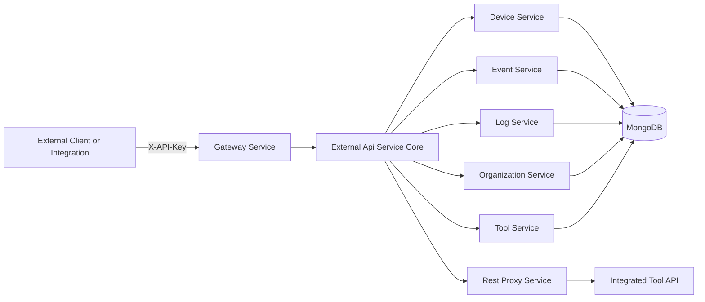
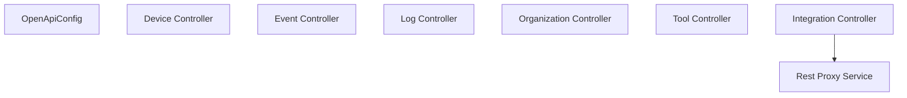
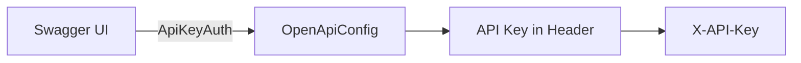
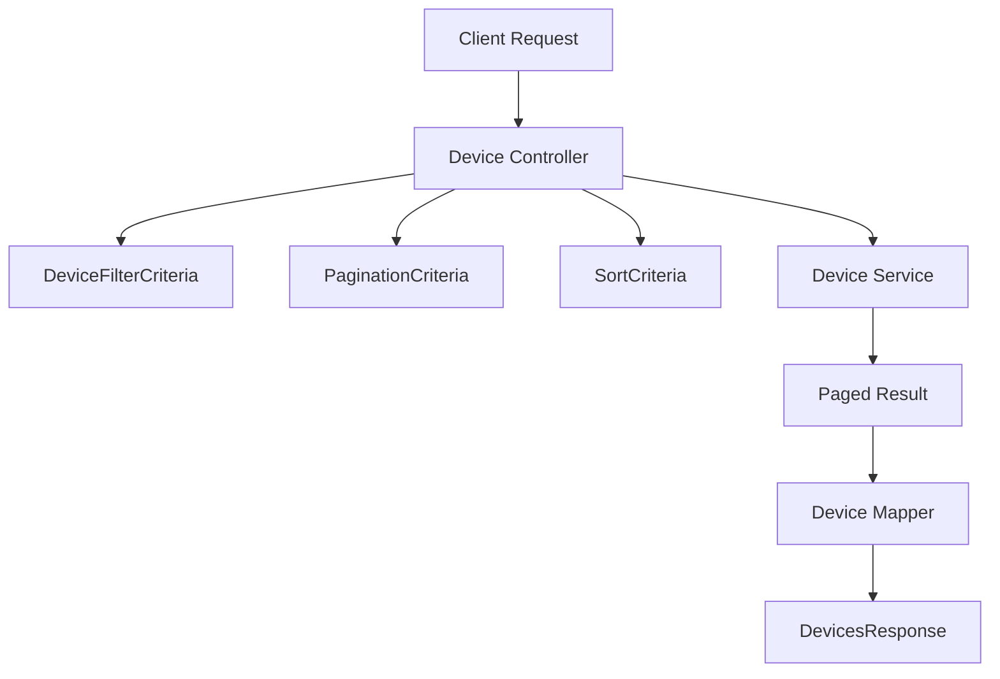
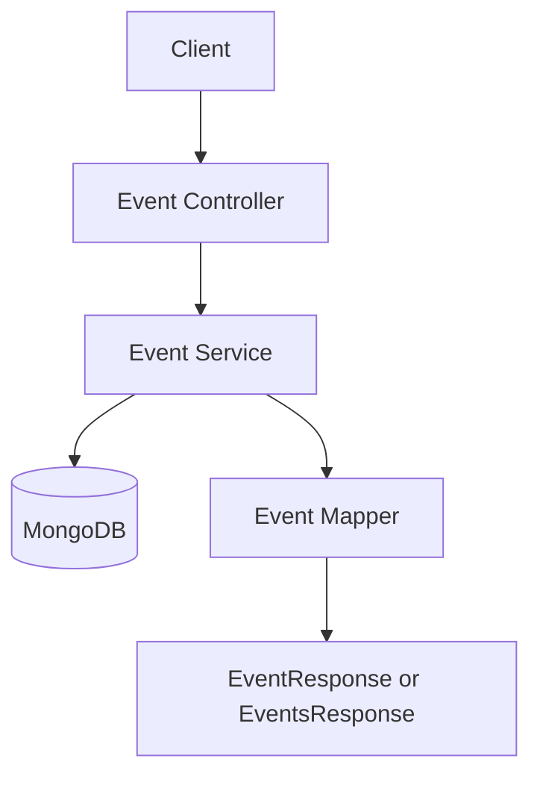
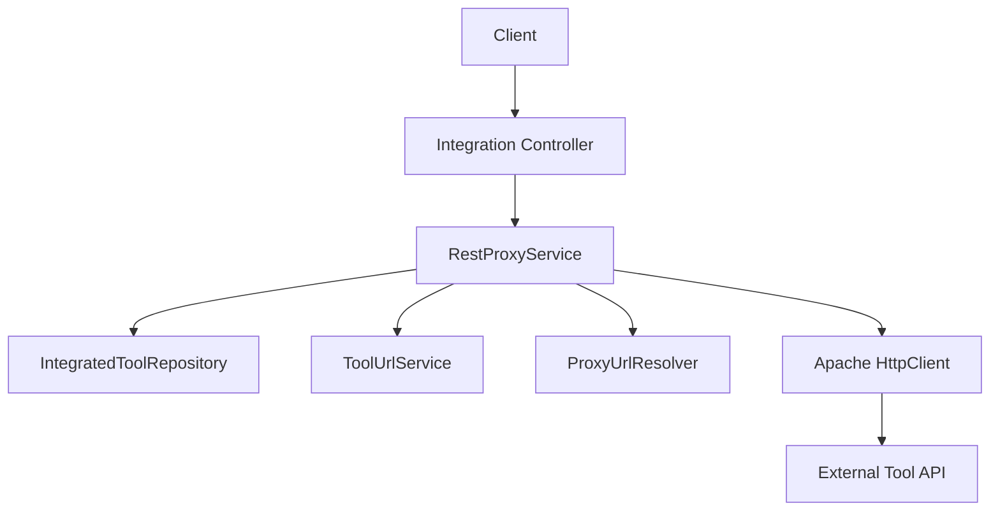
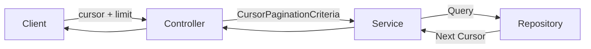

# External Api Service Core

## Overview

The **External Api Service Core** module exposes a stable, API key–secured REST interface for third-party integrations and external systems to interact with the OpenFrame platform.

It acts as a controlled façade over internal services such as device management, events, logs, organizations, and integrated tools, while enforcing:

- API key authentication
- Rate limiting (configured upstream at gateway level)
- Consistent pagination and sorting
- OpenAPI (Swagger) documentation
- Controlled proxying to external integrated tools

This module is deployed via the `ExternalApiApplication` entrypoint and is typically exposed behind the Gateway service under the `/external-api` base path.

---

## Architectural Role in the Platform

The External Api Service Core sits between external consumers and the internal domain services.



### Responsibilities

- Provide versioned REST endpoints under `/api/v1/**`
- Enforce API key–based access
- Map external DTOs to internal domain models
- Offer cursor-based pagination and flexible sorting
- Expose filter metadata endpoints
- Proxy requests to configured integrated tools
- Publish OpenAPI documentation for consumers

---

## Authentication Model

All endpoints require an API key provided in the `X-API-Key` header.

```text
X-API-Key: ak_keyId.sk_secretKey
```

Internally:

- The Gateway validates and extracts API key information.
- Headers such as `X-User-Id` and `X-API-Key-Id` are propagated.
- Controllers log and rely on upstream validation.

The OpenAPI configuration registers an `ApiKeyAuth` security scheme so that Swagger UI correctly reflects authentication requirements.

---

## Module Structure

The External Api Service Core consists of:

- Configuration
- REST Controllers
- DTOs and Mappers (external-facing contracts)
- RestProxyService (tool proxying)



---

# Configuration

## OpenApiConfig

The `OpenApiConfig` class configures:

- API title and metadata
- Contact and license information
- Server base path (`/external-api`)
- API key security scheme
- GroupedOpenApi filtering to include only external endpoints

### Security Scheme



This ensures that:

- All documented endpoints require `X-API-Key`
- Consumers clearly understand authentication and rate limiting behavior

---

# REST Controllers

Each controller exposes a domain-specific API surface built on top of internal services.

All controllers follow common patterns:

- `@RestController`
- `/api/v1/...` base paths
- Cursor-based pagination
- Optional filtering
- Sort field + direction
- Structured error responses

---

## Device Controller

Base Path:

```text
/api/v1/devices
```

### Capabilities

- List devices with filtering
- Get device by machine ID
- Retrieve filter options with counts
- Update device status (PATCH)

### Filtering Model

Supports filtering by:

- Status
- Device type
- OS type
- Organization IDs
- Tag names
- Search term

### Pagination and Sorting



If `includeTags=true`, the controller:

- Collects machine IDs
- Fetches tags in batch
- Enriches the response

---

## Event Controller

Base Path:

```text
/api/v1/events
```

### Capabilities

- Query events with date filtering
- Get event by ID
- Create event
- Update event
- Retrieve event filter metadata

### Flow



Supports:

- Date range (`startDate`, `endDate`)
- Event types
- User IDs
- Search
- Cursor-based pagination

---

## Log Controller

Base Path:

```text
/api/v1/logs
```

### Capabilities

- Query logs with advanced filters
- Retrieve filter metadata
- Get detailed log entry by composite key

### Advanced Filtering

- Tool types
- Event types
- Severity levels
- Organization IDs
- Device ID
- Date range
- Search in summary/content

Log details are retrieved using a composite identifier:

```text
ingestDay + toolType + eventType + timestamp + toolEventId
```

---

## Organization Controller

Base Path:

```text
/api/v1/organizations
```

### Capabilities

- List organizations with filtering
- Get by database ID
- Get by business organizationId
- Create organization
- Update organization
- Delete organization (with validation)

Deletion enforces domain rules (e.g., cannot delete organizations with associated machines).

---

## Tool Controller

Base Path:

```text
/api/v1/tools
```

### Capabilities

- Query integrated tools
- Retrieve filter metadata

Supports filtering by:

- Enabled status
- Tool type
- Category
- Search term
- Sort field and direction

---

## Integration Controller

Base Path:

```text
/tools/{toolId}/**
```

This controller enables dynamic proxying of API calls to integrated tools.

It delegates to `RestProxyService`.

---

# RestProxyService

The **RestProxyService** dynamically forwards HTTP requests to configured integrated tools.

## Responsibilities

- Resolve tool configuration
- Validate tool is enabled
- Resolve target URL via `ProxyUrlResolver`
- Inject tool-specific authentication headers
- Forward request using Apache HttpClient
- Return raw downstream response



## Credential Injection

Depending on `APIKeyType`:

- `HEADER` → Custom header name/value
- `BEARER_TOKEN` → `Authorization: Bearer <token>`
- `NONE` → No credential header

All proxy requests use:

- JSON content type
- Configured timeouts (connection and response)

---

# Pagination and Sorting Strategy

Across controllers, the module standardizes:

- Cursor-based pagination
- Explicit limit constraints (min 1, max 100)
- Sort field + direction



This ensures:

- Stateless paging
- Consistent behavior across domains
- Scalability for large datasets

---

# Error Handling Model

Controllers consistently:

- Throw domain-specific exceptions (e.g., `DeviceNotFoundException`)
- Return structured `ErrorResponse`
- Use appropriate HTTP status codes:
  - 200 OK
  - 201 Created
  - 204 No Content
  - 400 Bad Request
  - 401 Unauthorized
  - 404 Not Found
  - 409 Conflict
  - 500 Internal Server Error

---

# Deployment and Exposure

The module is bootstrapped via:

- `ExternalApiApplication`

It is typically:

- Deployed as its own Spring Boot service
- Exposed behind the Gateway
- Mounted under `/external-api`
- Documented via Swagger/OpenAPI

---

# Summary

The **External Api Service Core** provides a clean, secure, and extensible external interface for the OpenFrame platform.

It delivers:

- API key–secured REST endpoints
- Rich filtering and pagination
- Standardized error responses
- OpenAPI documentation
- Dynamic proxying for integrated tools

By acting as a dedicated external façade, it protects internal services while enabling powerful automation, reporting, and third-party integrations.