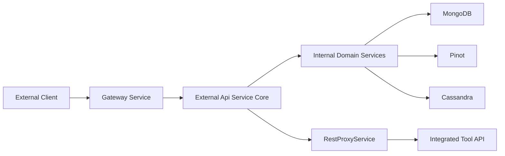
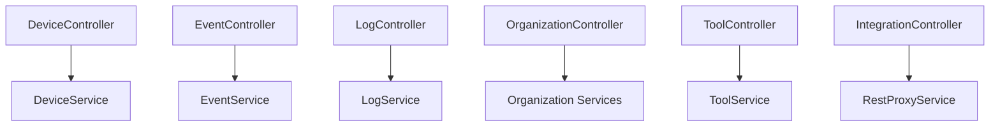
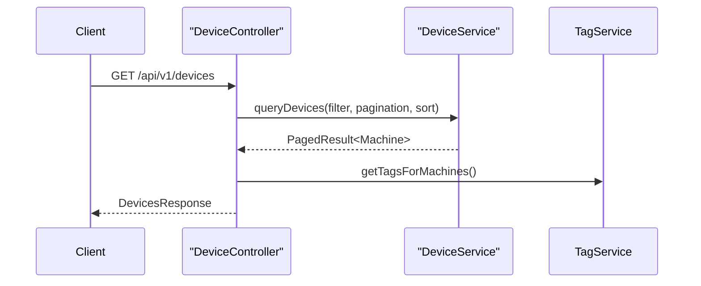
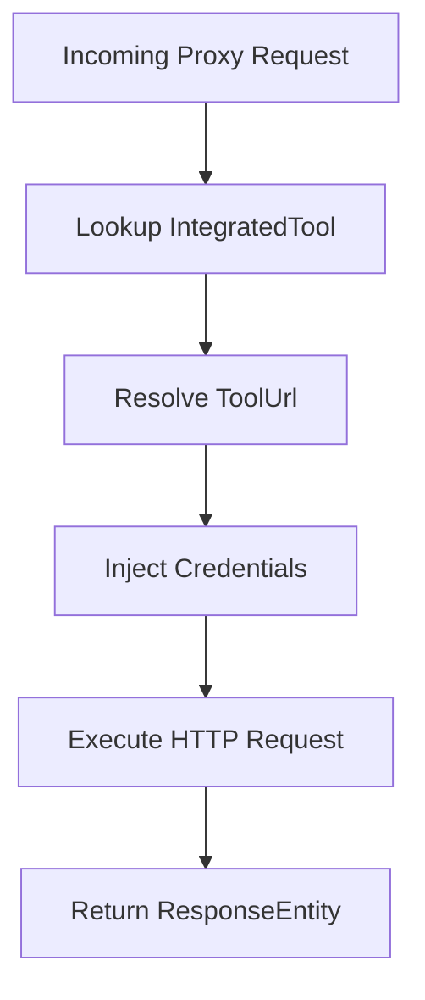

# External Api Service Core

## Overview

The **External Api Service Core** module exposes a stable, API key–secured REST interface for third-party integrations and external systems to interact with the OpenFrame platform.

It acts as a controlled façade over internal domain services (devices, events, logs, organizations, and tools), translating HTTP requests into domain queries and commands while enforcing:

- API key–based authentication
- Rate limiting (enforced upstream at gateway level)
- Cursor-based pagination
- Structured filtering and sorting
- Consistent REST DTO contracts
- Tool API proxying for integrated platforms

This module is designed for:

- External automation platforms
- MSP integrations
- SIEM and monitoring systems
- Custom dashboards and partner tools

---

## Position in the Overall Architecture

The External Api Service Core sits between external consumers and internal domain services.



### Key Responsibilities

1. Provide versioned REST endpoints under `/api/v1/**`
2. Enforce API key authentication via `X-API-Key`
3. Map internal domain models to external DTOs
4. Support filtering, search, sorting, and cursor pagination
5. Proxy tool-specific API calls via `/tools/{toolId}/**`
6. Expose OpenAPI (Swagger) documentation

---

## Authentication Model

All endpoints require an API key passed in the `X-API-Key` header.

```text
Header:
X-API-Key: ak_keyId.sk_secretKey
```

Internally:

- The gateway validates the API key.
- The request is enriched with:
  - `X-User-Id`
  - `X-API-Key-Id`
- The External Api Service Core trusts these headers for audit logging and contextual access.

---

## OpenAPI Configuration

### Component
- `OpenApiConfig`

The `OpenApiConfig` class:

- Defines OpenAPI metadata (title, description, license, contact)
- Configures API key security scheme (`ApiKeyAuth`)
- Groups endpoints under:
  - `/tools/**`
  - `/api/v1/**`
- Excludes internal and actuator endpoints

This ensures a clean, public-facing contract for external consumers.

---

# REST Controllers

The module is organized around domain-focused REST controllers.



---

## DeviceController

**Base path:** `/api/v1/devices`

### Capabilities

- List devices with filtering
- Get device by machine ID
- Retrieve available filter options
- Update device status (ARCHIVED / DELETED)

### Filtering Features

Supports filtering by:

- Status
- Device type
- OS type
- Organization IDs
- Tag names
- Search string

### Pagination & Sorting

Uses:

- `PaginationCriteria` (cursor + limit)
- `SortCriteria` (field + direction)

Tags are optionally loaded via `TagService` when `includeTags=true`.

### Data Flow



---

## EventController

**Base path:** `/api/v1/events`

### Capabilities

- Query events (filter + search + pagination)
- Get event by ID
- Create event
- Update event
- Retrieve available event filters

### Filtering

Uses `EventFilterCriteria`:

- User IDs
- Event types
- Date range

### Domain Integration

Delegates to `EventService` and maps results using `EventMapper`.

---

## LogController

**Base path:** `/api/v1/logs`

### Capabilities

- Query logs with filtering
- Retrieve filter options
- Retrieve detailed log entry

### Advanced Filtering

`LogFilterCriteria` supports:

- Date range
- Tool types
- Event types
- Severity levels
- Organization IDs
- Device ID

### Log Detail Retrieval

Logs are uniquely identified by:

```text
ingestDay + toolType + eventType + timestamp + toolEventId
```

This aligns with Pinot-based storage and indexing strategies.

---

## OrganizationController

**Base path:** `/api/v1/organizations`

### Capabilities

- List organizations (filter + search + pagination)
- Get by database ID
- Get by business organizationId
- Create organization
- Update organization
- Delete organization

### Separation of Concerns

- `OrganizationQueryService` → Read operations
- `OrganizationCommandService` → Write operations
- `OrganizationService` → Direct retrieval logic

Deletion safeguards against removing organizations that still contain machines.

---

## ToolController

**Base path:** `/api/v1/tools`

### Capabilities

- List integrated tools
- Filter by:
  - enabled
  - type
  - category
- Retrieve tool filter options

Delegates to `ToolService` and maps results using `ToolMapper`.

---

## IntegrationController (Tool API Proxy)

**Base path:** `/tools/{toolId}/**`

This controller enables full HTTP proxying to integrated tool APIs.

### Delegation

- Delegates to `RestProxyService`
- Supports: GET, POST, PUT, PATCH, DELETE, OPTIONS

---

# RestProxyService

The `RestProxyService` is responsible for securely forwarding API calls to integrated tools.

## Responsibilities

1. Validate tool existence and enabled status
2. Resolve tool API URL
3. Inject credentials
4. Forward request using Apache HttpClient
5. Return upstream status + body transparently

## Credential Injection

Supports API key types:

- HEADER
- BEARER_TOKEN
- NONE



### HTTP Client Configuration

- Connection timeout: 10 seconds
- Response timeout: 60 seconds
- JSON content type by default

This design allows OpenFrame to act as a secure integration gateway.

---

# DTO Layer

The External Api Service Core defines dedicated REST DTOs to isolate internal models from external contracts.

## Categories

- Device DTOs
- Event DTOs
- Log DTOs
- Organization DTOs
- Tool DTOs
- Shared pagination & sorting DTOs

### Pagination Model

```text
PaginationCriteria
  - cursor
  - limit (default 20, max 100)
```

All list endpoints return:

- Items
- PageInfo (cursor metadata)
- Filtered count (where applicable)

This ensures:

- Stable API contract
- Internal model evolution without breaking clients

---

# Cross-Cutting Concerns

## Logging

All controllers log:

- userId
- apiKeyId
- filtering parameters
- pagination

This supports auditability and API usage tracking.

## Error Handling

Common HTTP statuses:

- 200 – Success
- 201 – Created
- 204 – No Content
- 400 – Bad Request
- 401 – Unauthorized
- 404 – Not Found
- 409 – Conflict
- 500 – Internal Error

Domain-specific exceptions are translated into REST-friendly error responses.

---

# How It Fits in the Platform

The External Api Service Core is:

- Public-facing
- API key–secured
- REST-based (unlike internal GraphQL in Api Service Core)
- Designed for automation and integrations

It complements:

- Api Service Core (internal GraphQL + UI APIs)
- Gateway Service Core (routing, rate limiting, auth)
- Authorization Server Core (OAuth & identity)
- Data modules (Mongo, Pinot, Cassandra)

---

# Summary

The **External Api Service Core** provides a clean, secure, and extensible REST interface for the OpenFrame ecosystem.

It:

- Encapsulates domain services
- Enforces API key authentication
- Supports advanced filtering & cursor pagination
- Proxies integrated tool APIs
- Publishes structured OpenAPI documentation

This module is a critical integration surface for MSP automation, partner ecosystems, and third-party system interoperability.
