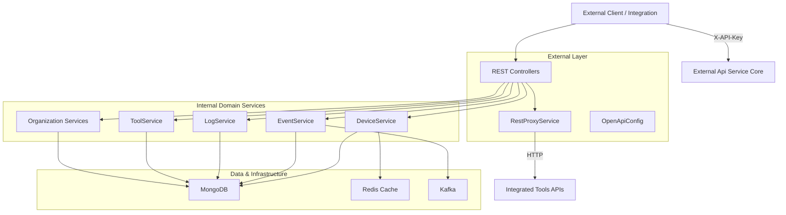
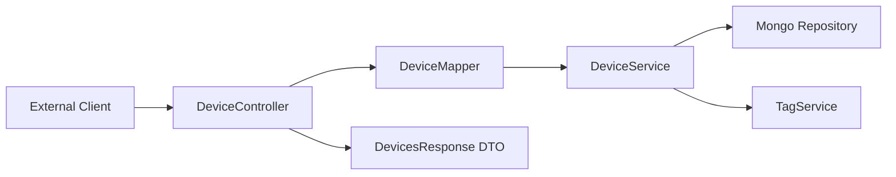
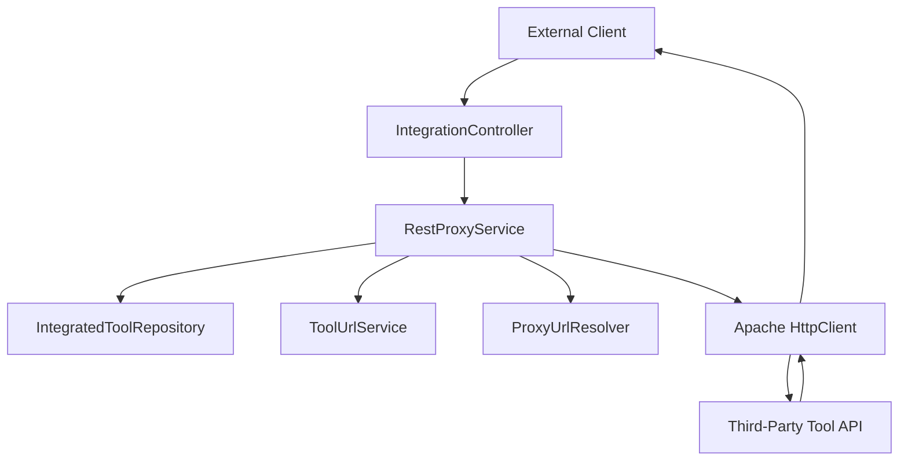

# External Api Service Core

## Overview

The **External Api Service Core** module exposes a stable, API key–secured REST interface for third-party integrations with the OpenFrame platform. It provides controlled external access to devices, events, logs, organizations, tools, and integrated tool APIs without exposing internal service contracts.

This module is implemented as a Spring Boot application and acts as:

- A secure external-facing API layer
- A REST facade over internal domain services
- A proxy gateway for integrated third-party tools
- A documented OpenAPI (Swagger) interface for integrators

It relies on shared services from the API layer, data persistence modules, and core utilities, while enforcing API key authentication and rate limiting.

---

## Application Entry Point

### ExternalApiApplication

The `ExternalApiApplication` class bootstraps the Spring Boot application.

It scans the following base packages:

- `com.openframe.external` (external controllers and services)
- `com.openframe.data` (Mongo, Redis, Kafka data layer)
- `com.openframe.core` (shared utilities and constants)
- `com.openframe.api` (core business services)
- `com.openframe.kafka` (event/messaging integration)

This makes the External Api Service Core a composition layer that reuses internal domain logic while presenting a clean external contract.

---

## High-Level Architecture



### Architectural Responsibilities

- **Controllers**: Define external REST endpoints under `/api/v1/**` and `/tools/**`
- **Mappers**: Convert between internal domain models and external DTOs
- **Core Services**: Reuse internal application services (query, command, filter logic)
- **RestProxyService**: Dynamically forwards API requests to integrated third-party tools
- **OpenApiConfig**: Documents and groups endpoints for Swagger/OpenAPI

---

## Authentication Model

All endpoints require API key authentication using the `X-API-Key` header.

Example format:

```text
X-API-Key: ak_keyId.sk_secretKey
```

Headers such as `X-User-Id` and `X-API-Key-Id` are injected downstream (typically by gateway or security filters) and used for logging and authorization context.

### Security Characteristics

- API key–based authentication
- Rate limiting (per minute, hour, day)
- Standard HTTP error codes
- Isolation from internal service contracts

---

## OpenAPI Documentation

### OpenApiConfig

The `OpenApiConfig` class:

- Defines OpenAPI metadata (title, version, license)
- Configures API key security scheme
- Groups endpoints under the `external-api` group
- Excludes internal endpoints such as `/actuator/**` and `/api/core/**`

This ensures:

- Public documentation only exposes supported external routes
- Security scheme is clearly defined
- Swagger UI reflects real external capabilities

---

## REST Controllers

The External Api Service Core exposes multiple resource domains.

---

### DeviceController

Base path: `/api/v1/devices`

Responsibilities:

- List devices with advanced filtering
- Cursor-based pagination
- Tag enrichment (optional)
- Retrieve device by machine ID
- Update device status (DELETED, ARCHIVED)
- Retrieve filter metadata

#### Device Query Flow



Key features:

- Filtering by status, device type, OS type, organization, tags
- Search support
- Sort field + direction
- Cursor-based pagination
- Optional tag aggregation

---

### EventController

Base path: `/api/v1/events`

Responsibilities:

- Query events with filters
- Retrieve event by ID
- Create event
- Update event
- Retrieve filter options

Supports:

- Date range filtering
- Event type filtering
- User filtering
- Cursor pagination
- Search and sorting

---

### LogController

Base path: `/api/v1/logs`

Responsibilities:

- Query logs with advanced filtering
- Retrieve filter metadata
- Retrieve detailed log entries

Filtering dimensions:

- Date range
- Tool type
- Event type
- Severity
- Organization
- Device ID
- Search query

Logs rely on internal query services and data repositories (Mongo and potentially analytical stores).

---

### OrganizationController

Base path: `/api/v1/organizations`

Responsibilities:

- List organizations with filtering
- Retrieve by database ID
- Retrieve by business identifier
- Create organization
- Update organization
- Delete organization (with safety checks)

Deletion is prevented if associated machines exist.

---

### ToolController

Base path: `/api/v1/tools`

Responsibilities:

- Query integrated tools
- Filter by enabled status, type, category
- Search tools
- Retrieve filter options

Provides visibility into available integrations.

---

### IntegrationController

Base path: `/tools/{toolId}/**`

The IntegrationController enables dynamic proxying to integrated tools via the RestProxyService.

This allows external clients to:

- Call tool APIs through OpenFrame
- Reuse stored tool credentials
- Maintain centralized authentication

---

## RestProxyService

The **RestProxyService** dynamically forwards HTTP requests to integrated tools.

### Proxy Execution Flow



### Core Responsibilities

1. Validate tool existence and enabled state
2. Resolve correct API endpoint
3. Inject credentials depending on API key type:
   - Header-based key
   - Bearer token
   - None
4. Forward request method and body
5. Return raw response and HTTP status

### Technical Characteristics

- Apache HttpClient 5
- Configurable timeouts
- Transparent method forwarding (GET, POST, PUT, PATCH, DELETE, OPTIONS)
- JSON-based content handling

This design decouples OpenFrame from tool-specific APIs while maintaining centralized control.

---

## Data Interaction

The module relies on shared persistence modules:

- MongoDB repositories for devices, events, logs, organizations, tools
- Redis for caching
- Kafka for event-driven updates

External Api Service Core does not implement its own persistence logic; it delegates to internal services.

---

## Error Handling Strategy

All controllers:

- Use standard HTTP status codes
- Return structured error responses
- Translate domain exceptions (e.g., not found) into REST errors
- Log contextual information including API key ID and user ID

Common error codes:

```text
200  OK
201  Created
204  No Content
400  Bad Request
401  Unauthorized
404  Not Found
409  Conflict
429  Too Many Requests
500  Internal Server Error
```

---

## Role in the Overall Platform

Within the OpenFrame architecture, the External Api Service Core acts as:

- A public integration boundary
- A controlled REST facade
- A secure proxy layer for third-party tools
- A stable contract for MSP automation and ecosystem integrations

It does not:

- Contain core domain logic
- Manage identity providers
- Implement streaming pipelines
- Replace internal GraphQL or internal REST APIs

Instead, it provides a hardened, documented, and versioned integration surface.

---

## Key Design Principles

- **Separation of concerns**: External contract separated from internal APIs
- **Security first**: API key enforcement and rate limiting
- **Delegation over duplication**: Reuse internal services
- **Extensibility**: New resource domains can be added via new controllers
- **Integration-friendly**: Swagger documentation + consistent DTOs

---

## Summary

The **External Api Service Core** is the official REST-based integration layer of the OpenFrame platform. It:

- Exposes devices, events, logs, organizations, and tools
- Provides robust filtering, pagination, and sorting
- Proxies requests to integrated tools securely
- Enforces API key–based authentication
- Offers full OpenAPI documentation

It serves as the foundation for third-party automation, MSP integrations, and external system connectivity while preserving internal system boundaries and security guarantees.
