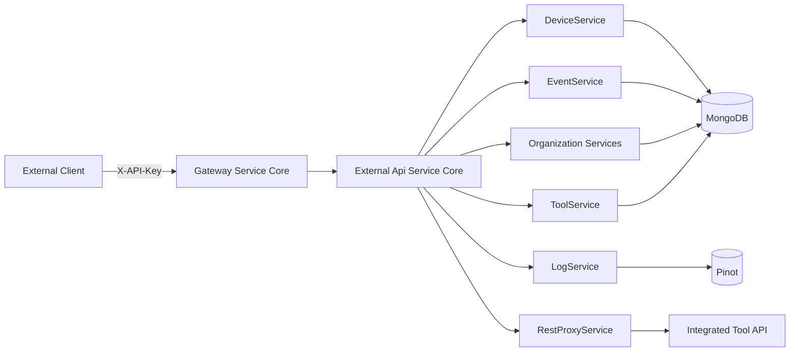
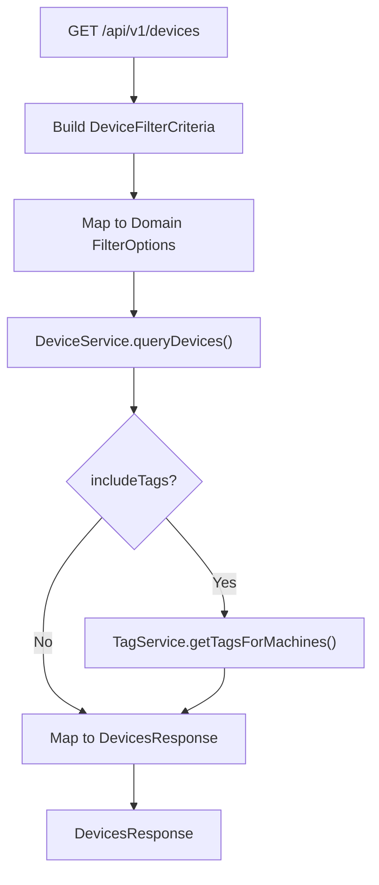
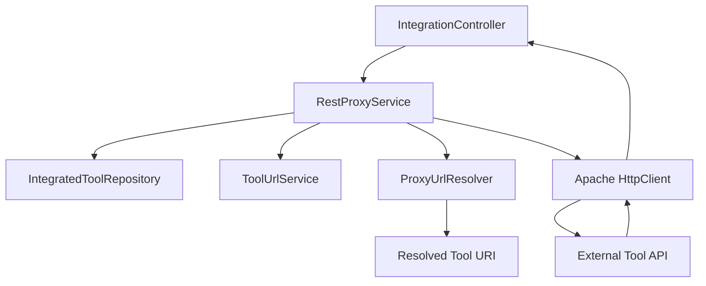
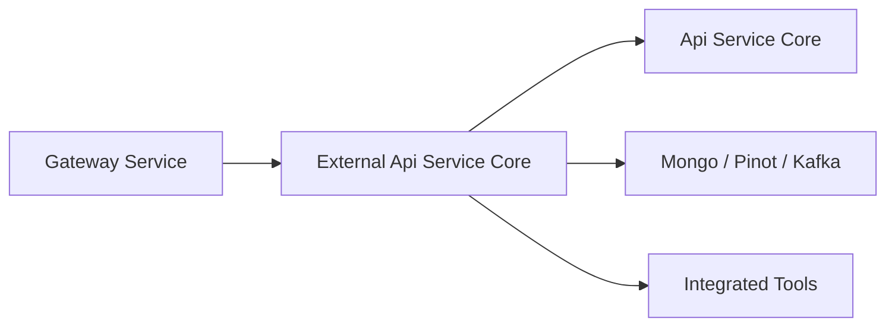

# External Api Service Core

## Overview

The **External Api Service Core** module exposes a secure, API key–based REST interface for third-party systems, integrations, and automation workflows to interact with the OpenFrame platform.

It acts as:

- A **public-facing REST layer** for devices, events, logs, organizations, and tools.
- A **controlled integration gateway** for proxied tool APIs.
- A **DTO translation layer** between internal domain services and external REST consumers.
- An **OpenAPI-documented contract** for external developers.

Unlike the internal REST/GraphQL services, this module is purpose-built for **external integrations** and API key authentication.

---

## High-Level Responsibilities

1. Expose versioned REST endpoints under `/api/v1/**`
2. Enforce API key–based authentication (via `X-API-Key` header)
3. Provide filtering, pagination, and sorting capabilities
4. Map internal domain models to external REST DTOs
5. Proxy requests to integrated tools
6. Publish OpenAPI/Swagger documentation

---

## Authentication Model

All endpoints require an API key provided via header:

```text
X-API-Key: ak_keyId.sk_secretKey
```

Internally:

- The API key is validated upstream (Gateway/Security layer).
- The following headers are injected downstream:
  - `X-User-Id`
  - `X-API-Key-Id`
- Controllers log and propagate these values for auditing.

---

## Architecture Overview



### Key Observations

- The module does **not** implement core business logic.
- It delegates to internal domain services.
- It translates domain models into external-facing DTOs.
- It optionally proxies outbound requests to integrated tools.

---

## OpenAPI Configuration

### `OpenApiConfig`

Responsibilities:

- Defines OpenAPI metadata (title, version, contact, license)
- Documents authentication via `ApiKeyAuth`
- Configures grouped API paths:
  - Included: `/tools/**`, `/api/v1/**`
  - Excluded: `/actuator/**`, `/api/core/**`

This ensures:

- Clear API documentation
- External consumer discoverability
- Consistent contract management

---

# REST Controllers

All controllers:

- Are versioned under `/api/v1`
- Support filtering, pagination, and sorting
- Use dedicated `*FilterCriteria`, `PaginationCriteria`, and `SortCriteria` DTOs
- Return structured response wrappers

---

## DeviceController

**Base Path:** `/api/v1/devices`

### Capabilities

- List devices (filtered + paginated)
- Retrieve device by machine ID
- Retrieve filter metadata
- Update device status (DELETED / ARCHIVED)

### Advanced Features

- Cursor-based pagination
- Dynamic sorting
- Optional tag enrichment (`includeTags=true`)
- Filter by:
  - Status
  - Device type
  - OS type
  - Organization
  - Tags

### Flow



---

## EventController

**Base Path:** `/api/v1/events`

### Capabilities

- Query events with date range filters
- Retrieve event by ID
- Create event
- Update event
- Retrieve filter metadata

### Supported Filters

- `userIds`
- `eventTypes`
- `startDate` / `endDate`
- Search
- Sorting

Events are backed by the internal event domain and persisted via Mongo and/or streaming ingestion.

---

## LogController

**Base Path:** `/api/v1/logs`

### Capabilities

- Query logs with advanced filtering
- Retrieve filter options
- Retrieve detailed log entry

### Filtering Dimensions

- Date range
- Tool type
- Event type
- Severity
- Organization
- Device ID
- Search

Logs are typically backed by analytics storage (e.g., Pinot) for scalable querying.

---

## OrganizationController

**Base Path:** `/api/v1/organizations`

### Capabilities

- List organizations (filtered + paginated)
- Retrieve by database ID
- Retrieve by business identifier (`organizationId`)
- Create organization
- Update organization
- Delete organization

### Business Safeguards

- Prevent deletion if machines are associated
- Conflict handling for duplicate organization IDs

This controller bridges external REST clients with:

- `OrganizationQueryService`
- `OrganizationCommandService`
- `OrganizationService`

---

## ToolController

**Base Path:** `/api/v1/tools`

### Capabilities

- List integrated tools
- Filter by:
  - Enabled
  - Type
  - Category
  - Platform category
- Retrieve filter metadata

Tools represent integrations such as RMMs, EDR systems, and other platform extensions.

---

## IntegrationController

**Base Path:** `/tools/{toolId}/**`

This controller acts as a **dynamic HTTP proxy** to integrated tools.

### Responsibilities

- Resolve tool by ID
- Validate tool is enabled
- Resolve correct API endpoint via `ToolUrlService`
- Inject credentials based on `APIKeyType`
- Forward request with method + body
- Return downstream response transparently

---

# RestProxyService

The **RestProxyService** is a core integration component.

## Responsibilities

1. Retrieve `IntegratedTool` from repository
2. Resolve target URL via `ProxyUrlResolver`
3. Build authentication headers:
   - Header API key
   - Bearer token
   - None
4. Create appropriate HTTP request type:
   - GET / POST / PUT / PATCH / DELETE / OPTIONS
5. Forward request using Apache HttpClient
6. Return raw downstream response

## Proxy Flow



### Security Considerations

- Only enabled tools can be proxied
- Credentials are injected securely
- Timeouts are configured
- Errors are mapped to HTTP responses

---

# DTO Layer

The module defines external-facing DTOs grouped by domain:

- `device.*`
- `event.*`
- `audit.*`
- `organization.*`
- `tool.*`
- `shared.*`

Common patterns:

- `*FilterCriteria` → Incoming filter models
- `PaginationCriteria` → Cursor-based pagination
- `SortCriteria` → Sorting configuration
- `*Response` → Outbound REST models
- `*sResponse` → Collection wrappers with pagination

This cleanly decouples:

- Internal domain models
- External REST contracts

---

# Pagination & Sorting Model

The module uses **cursor-based pagination**:

```text
GET /api/v1/devices?limit=20&cursor=eyJpZCI6MTIzNDU2fQ==
```

Response includes:

- `pageInfo`
- `hasNextPage`
- `startCursor`
- `endCursor`

Sorting is dynamic via:

```text
sortField=lastSeen&sortDirection=DESC
```

---

# Error Handling Strategy

The API consistently uses:

- `400` – Validation errors
- `401` – Missing/invalid API key
- `403` – Permission issues
- `404` – Resource not found
- `409` – Conflict
- `429` – Rate limit exceeded
- `500` – Internal errors

Domain-specific exceptions are translated into structured `ErrorResponse` objects.

---

# How This Module Fits the Platform



### Positioning

- **Gateway** handles routing, rate limiting, and security filters.
- **External Api Service Core** provides external REST contract.
- **Api Service Core** provides internal GraphQL/REST.
- **Data modules** provide persistence.
- **Stream processing** handles ingestion and analytics.

The module is therefore the **public REST boundary** of the OpenFrame backend.

---

# Summary

The **External Api Service Core** module is a structured, API key–secured REST interface that:

- Exposes core OpenFrame resources
- Provides advanced filtering, pagination, and sorting
- Enables secure proxy integration with third-party tools
- Maintains a clean separation between domain services and external contracts
- Is fully documented through OpenAPI

It is the primary integration surface for external systems interacting with the OpenFrame platform.
