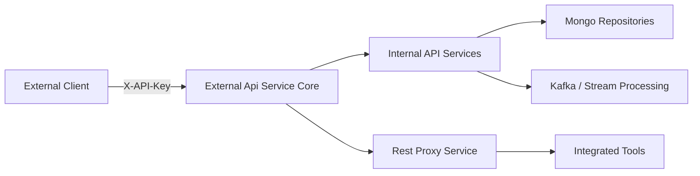
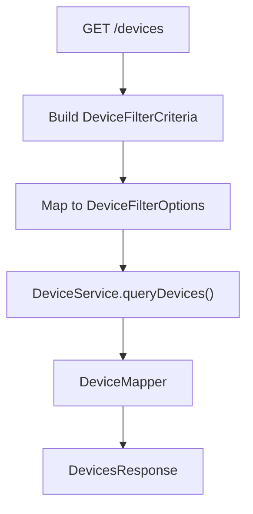
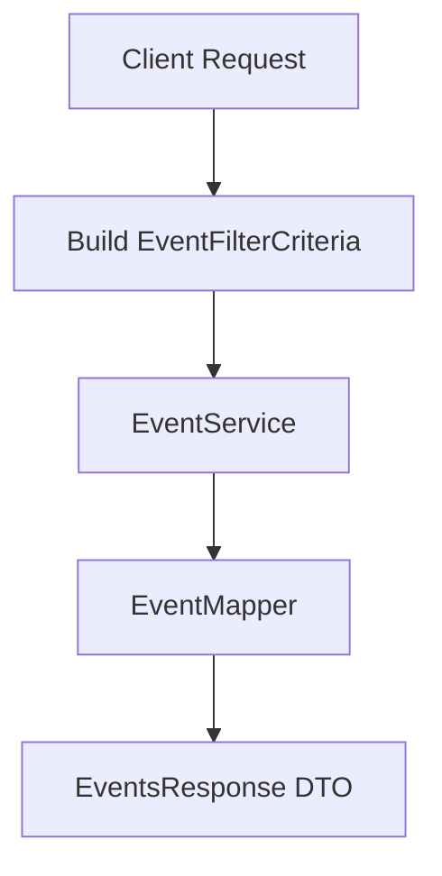
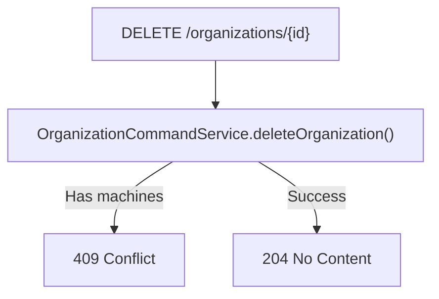
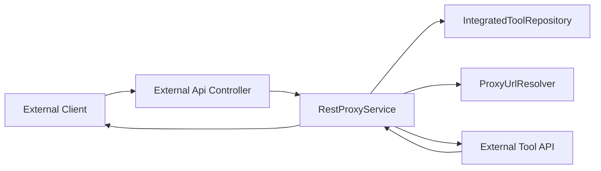

# External Api Service Core

## Overview

The **External Api Service Core** module exposes a secure, API key–protected REST interface for third-party integrations and external systems to interact with the OpenFrame platform.

It acts as a façade over the internal application services, providing:

- Device management APIs
- Event ingestion and querying
- Log exploration and filtering
- Organization CRUD operations
- Integrated tool discovery
- Secure REST proxying to external tools
- OpenAPI/Swagger documentation for external consumers

Unlike the internal API service, this module is explicitly designed for **external access via API keys**, with rate limiting, structured error handling, and stable versioned endpoints under `/api/v1/**`.

---

## Architectural Role in the Platform

The External Api Service Core sits at the edge of the backend domain layer and depends on internal services for business logic.



### Responsibilities

- Validate API key–based authentication (via platform security layer)
- Translate REST query parameters into domain filter objects
- Delegate business logic to internal services
- Map domain models to stable external DTOs
- Provide cursor-based pagination and sorting
- Proxy outbound requests to integrated third-party tools

---

## OpenAPI and API Documentation

### OpenApiConfig

The `OpenApiConfig` class configures Swagger/OpenAPI metadata for the external interface.

Key features:

- API title: **OpenFrame External API**
- API key authentication via `X-API-Key` header
- Rate limit documentation
- Error response documentation
- Grouped endpoints under:
  - `/tools/**`
  - `/test/**`
  - `/api/v1/**`

Security scheme definition:

```text
Header: X-API-Key
Format: ak_<keyId>.sk_<secretKey>
Example: ak_12345.sk_abcdef
```

All endpoints require API key authentication.

---

# REST Controllers

All controllers are versioned under:

```text
/api/v1/**
```

They follow a consistent structure:

1. Accept filter parameters
2. Build filter criteria objects
3. Convert to internal filter options
4. Delegate to domain services
5. Map results to response DTOs

---

## DeviceController

Base path:

```text
/api/v1/devices
```

### Capabilities

- List devices with filtering
- Get device by machine ID
- Retrieve filter metadata
- Update device status (ARCHIVED / DELETED)

### Filtering & Pagination

Supports:

- `statuses`
- `deviceTypes`
- `osTypes`
- `organizationIds`
- `tagNames`
- `search`
- `limit` (max 100)
- `cursor`
- `sortField`
- `sortDirection`



### Tag Enrichment

When `includeTags=true`:

- Device IDs are collected
- Tags are loaded via `TagService`
- Results are enriched before response mapping

Fallback behavior ensures response still succeeds if tag loading fails.

---

## EventController

Base path:

```text
/api/v1/events
```

### Capabilities

- Query events with cursor pagination
- Get event by ID
- Create event
- Update event
- Retrieve filter metadata

Supports:

- `userIds`
- `eventTypes`
- `startDate`
- `endDate`
- `search`
- `limit`
- `cursor`
- `sortField`
- `sortDirection`



Create and update operations delegate directly to the domain `EventService`.

---

## LogController

Base path:

```text
/api/v1/logs
```

### Capabilities

- Query logs with advanced filtering
- Retrieve log filter metadata
- Get detailed log entry by composite identifiers

Filtering includes:

- Date range
- Tool types
- Event types
- Severity
- Organization IDs
- Device ID
- Search
- Pagination & sorting

Log details retrieval uses composite keys:

```text
ingestDay
toolType
eventType
timestamp
toolEventId
```

This ensures precise lookup in high-volume log datasets.

---

## OrganizationController

Base path:

```text
/api/v1/organizations
```

### Capabilities

- List organizations
- Get by database ID
- Get by business organizationId
- Create organization
- Update organization
- Delete organization

Deletion protection:

- Cannot delete organization with associated machines
- Returns HTTP 409 in that case



---

## ToolController

Base path:

```text
/api/v1/tools
```

### Capabilities

- Query integrated tools
- Retrieve filter metadata

Supports filtering by:

- `enabled`
- `type`
- `category`
- `search`
- Sorting

Delegates to `ToolService` and maps responses via `ToolMapper`.

---

# RestProxyService

The **RestProxyService** enables controlled outbound API proxying to integrated third-party tools.

This is a critical integration component that:

1. Resolves target tool configuration
2. Injects credentials (API key or bearer token)
3. Forwards request to tool
4. Returns tool response transparently

## Proxy Flow



## Credential Injection

Based on `APIKeyType`:

- `HEADER` → Custom header key/value
- `BEARER_TOKEN` → `Authorization: Bearer <token>`
- `NONE` → No credentials added

## HTTP Client Configuration

- Connection request timeout: 10 seconds
- Response timeout: 60 seconds
- Supports: GET, POST, PUT, PATCH, DELETE, OPTIONS

Error handling ensures:

- 404 if tool not found
- 400 if tool disabled
- 500 on proxy execution failures

---

# Cross-Cutting Concerns

## Authentication

All endpoints require:

```text
X-API-Key: ak_keyId.sk_secretKey
```

API key validation is handled by the platform security layer.

## Rate Limiting

Default limits (configurable per API key):

- 100 requests per minute
- 1,000 requests per hour
- 10,000 requests per day

Rate limit headers are included in responses.

## Pagination Strategy

The module uses **cursor-based pagination** for scalability:


This avoids deep offset queries and improves performance for large datasets.

---

# Error Handling Strategy

Standard HTTP status codes:

```text
200  Success
201  Created
204  No Content
400  Bad Request
401  Unauthorized
403  Forbidden
404  Not Found
409  Conflict
429  Too Many Requests
500  Internal Server Error
```

All error responses are structured using a consistent `ErrorResponse` DTO.

---

# Summary

The **External Api Service Core** module is the secure integration gateway for third-party systems interacting with OpenFrame.

It provides:

- Stable, versioned REST endpoints
- API key authentication
- Filtering, sorting, and cursor-based pagination
- Clean separation between external DTOs and internal domain models
- Controlled proxying to integrated tools
- OpenAPI documentation for developer experience

Architecturally, it serves as a controlled façade over internal services while enforcing security, stability, and integration standards required for external consumers.